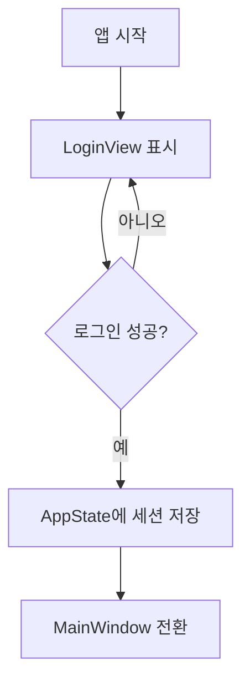

# 🔐 Avalonia MVVM 로그인 및 인증 구조 설계 (Login & Authentication)

---

## 🎯 목표

| 항목 | 설명 |
|------|------|
| 로그인 화면 분리 | `LoginView` / `LoginViewModel`로 완전히 분리 |
| 인증 처리 | 사용자 정보 검증, 토큰 관리 등 |
| 상태 관리 | 로그인 성공 시 전역 상태 반영 및 화면 전환 |
| 보안 고려 | 토큰, 비밀번호 입력 마스킹, 예외 처리 등

---

## 🧱 전체 구조 요약

```
MyApp/
├── App.xaml / App.xaml.cs
├── ViewModels/
│   ├── LoginViewModel.cs
│   └── MainViewModel.cs
├── Views/
│   ├── LoginView.axaml
│   └── MainView.axaml
├── Services/
│   ├── IAuthService.cs
│   └── AuthService.cs
├── Models/
│   └── UserSession.cs
├── State/
│   └── AppState.cs (전역 상태)
```

---

## 1️⃣ 로그인 모델 정의

### 📄 Models/UserSession.cs

```csharp
public class UserSession
{
    public string Username { get; set; } = "";
    public string Token { get; set; } = "";
    public DateTime LoginTime { get; set; }
}
```

---

## 2️⃣ 인증 서비스 정의

### 📄 Services/IAuthService.cs

```csharp
public interface IAuthService
{
    Task<UserSession?> LoginAsync(string username, string password);
    Task LogoutAsync();
}
```

### 📄 Services/AuthService.cs

```csharp
public class AuthService : IAuthService
{
    public async Task<UserSession?> LoginAsync(string username, string password)
    {
        // 실제 인증 요청 (API 등)
        await Task.Delay(500); // 시뮬레이션

        if (username == "admin" && password == "1234")
        {
            return new UserSession
            {
                Username = username,
                Token = Guid.NewGuid().ToString(),
                LoginTime = DateTime.Now
            };
        }

        return null;
    }

    public Task LogoutAsync()
    {
        return Task.CompletedTask;
    }
}
```

---

## 3️⃣ 전역 상태 클래스

### 📄 State/AppState.cs

```csharp
public class AppState : ReactiveObject
{
    private UserSession? _currentUser;
    public UserSession? CurrentUser
    {
        get => _currentUser;
        set => this.RaiseAndSetIfChanged(ref _currentUser, value);
    }

    public bool IsLoggedIn => CurrentUser != null;
}
```

> 전역 AppState는 DI로 주입하고, 로그인 성공 시 사용자 정보와 상태를 공유합니다.

---

## 4️⃣ LoginViewModel 및 화면 전환

### 📄 ViewModels/LoginViewModel.cs

```csharp
public class LoginViewModel : ReactiveObject
{
    private readonly IAuthService _authService;
    private readonly AppState _appState;
    private readonly Action _onLoginSuccess;

    public LoginViewModel(IAuthService authService, AppState appState, Action onLoginSuccess)
    {
        _authService = authService;
        _appState = appState;
        _onLoginSuccess = onLoginSuccess;

        LoginCommand = ReactiveCommand.CreateFromTask(LoginAsync);
    }

    public string Username { get; set; } = "";
    public string Password { get; set; } = "";
    public ReactiveCommand<Unit, Unit> LoginCommand { get; }

    public string ErrorMessage { get; private set; } = "";

    private async Task LoginAsync()
    {
        var session = await _authService.LoginAsync(Username, Password);
        if (session != null)
        {
            _appState.CurrentUser = session;
            _onLoginSuccess(); // 메인 화면 전환
        }
        else
        {
            ErrorMessage = "아이디 또는 비밀번호가 잘못되었습니다.";
            this.RaisePropertyChanged(nameof(ErrorMessage));
        }
    }
}
```

---

## 5️⃣ LoginView.axaml

```xml
<StackPanel Margin="30">
  <TextBlock Text="로그인" FontSize="24" Margin="0 0 0 20"/>
  <TextBox Watermark="아이디" Text="{Binding Username}" Margin="0 0 0 10"/>
  <TextBox Watermark="비밀번호" Text="{Binding Password}" PasswordChar="*" Margin="0 0 0 20"/>
  <Button Content="로그인" Command="{Binding LoginCommand}"/>
  <TextBlock Text="{Binding ErrorMessage}" Foreground="Red" Margin="0 10 0 0"/>
</StackPanel>
```

---

## 6️⃣ App.xaml.cs에서 화면 전환 처리

```csharp
public class App : Application
{
    public static IServiceProvider Services { get; private set; } = default!;

    public override void OnFrameworkInitializationCompleted()
    {
        var serviceCollection = new ServiceCollection();
        ConfigureServices(serviceCollection);
        Services = serviceCollection.BuildServiceProvider();

        ShowLoginWindow();

        base.OnFrameworkInitializationCompleted();
    }

    private void ConfigureServices(IServiceCollection services)
    {
        services.AddSingleton<IAuthService, AuthService>();
        services.AddSingleton<AppState>();
        services.AddSingleton<MainViewModel>();
    }

    private void ShowLoginWindow()
    {
        var loginWindow = new Window();
        var vm = new LoginViewModel(
            Services.GetRequiredService<IAuthService>(),
            Services.GetRequiredService<AppState>(),
            onLoginSuccess: ShowMainWindow);

        loginWindow.DataContext = vm;
        loginWindow.Content = new Views.LoginView();
        loginWindow.Show();
    }

    private void ShowMainWindow()
    {
        var mainWindow = new MainWindow
        {
            DataContext = Services.GetRequiredService<MainViewModel>()
        };

        ApplicationLifetime!.MainWindow = mainWindow;
        mainWindow.Show();

        // 이전 로그인 창 닫기
        foreach (var w in Application.Current.Windows.ToList())
        {
            if (w is Window win && win.DataContext is LoginViewModel)
                win.Close();
        }
    }
}
```

---

## ✅ 전체 흐름 요약



---

## 🔒 보안 팁

| 항목 | 설명 |
|------|------|
| 비밀번호 마스킹 | `PasswordChar="*"` |
| 토큰 저장 | 메모리 또는 암호화된 로컬 저장소 |
| 로그인 시도 제한 | 실패 횟수 제한 또는 잠금 |
| 토큰 만료 처리 | AppState에서 시간 확인 및 자동 로그아웃

---

## 🧪 테스트 포인트

| 테스트 대상 | 방법 |
|-------------|------|
| 로그인 성공 | `LoginCommand` 실행 → AppState 변경 |
| 로그인 실패 | `ErrorMessage` 확인 |
| MainWindow 전환 | `onLoginSuccess()` 호출 여부 확인 |

---

## 📘 확장 아이디어

- 🔁 자동 로그인 (로컬 저장된 세션 복구)
- ⏳ 로그인 진행 표시 (IsBusy, Spinner)
- 🔐 역할 기반 권한 처리 (`IsAdmin` 등)
- 🔐 JWT 토큰 저장 및 API Authorization 연동
