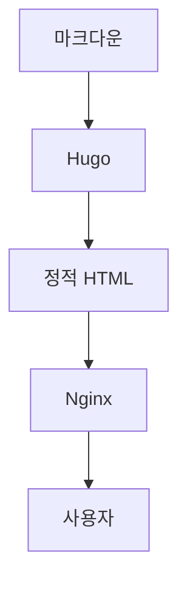

# Docker 정적 사이트 배포 가이드: Hugo + Nginx 완벽 구현

이 가이드는 정적 사이트 생성기(Hugo)와 Nginx를 Docker 환경에서 배포하는 전 과정을 설명합니다. 마크다운 문서를 정적 HTML로 변환하고, Docker Compose를 활용해 개발과 운영 환경을 효율적으로 관리하는 방법을 다룹니다.

## 아키텍처 개요

정적 사이트 배포의 기본 아키텍처는 다음과 같습니다:

```
[마크다운/에셋] → [정적 사이트 생성기(Hugo)] → [정적 파일] → [Nginx 웹 서버]
```

이 구조의 장점:
- **빌드와 서빙 분리**: 빌드 프로세스와 웹 서빙을 독립적으로 관리
- **환경 일관성**: Docker를 통해 개발, 테스트, 운영 환경을 일관되게 유지
- **확장성**: 정적 파일을 CDN에 쉽게 배포 가능

---

## 프로젝트 구조

```plaintext
my-static-site/
├── content/                 # 마크다운 콘텐츠
│   ├── posts/
│   │   └── hello-world.md
│   └── _index.md
├── static/                  # 정적 자산 (이미지, CSS, JS)
├── themes/                  # Hugo 테마
├── layouts/                 # 레이아웃 오버라이드 (선택 사항)
├── config.toml             # Hugo 설정 파일
├── public/                  # 빌드 결과물 (자동 생성)
├── nginx/
│   └── default.conf        # Nginx 설정
├── Dockerfile              # 빌드 이미지 정의
├── docker-compose.yml      # 기본 Compose 설정
├── docker-compose.prod.yml # 프로덕션 오버레이
└── .dockerignore           # Docker 빌드 컨텍스트 제외 항목
```

---

## Hugo 설정 파일

`config.toml`은 Hugo 사이트의 핵심 설정 파일입니다:

```toml
baseURL = "https://yourdomain.com/"
languageCode = "ko-kr"
title = "내 정적 블로그"
theme = "PaperMod"
paginate = 10
enableRobotsTXT = true

[params]
  defaultTheme = "auto"
  ShowReadingTime = true
  ShowBreadCrumbs = true
  ShowPostNavLinks = true

[markup]
  [markup.highlight]
    style = "dracula"
  [markup.goldmark.renderer]
    unsafe = true     # MathJax, Mermaid 등의 raw HTML 허용

[outputs]
  home = ["HTML", "RSS", "JSON"]

[permalinks]
  posts = "/posts/:slug/"

[services]
  [services.disqus]
    shortname = "your-disqus-id"
  [services.googleAnalytics]
    id = "G-XXXXXXXXXX"
```

**중요**: `baseURL`은 배포 환경에 맞게 반드시 설정해야 합니다.

---

## Dockerfile 구성

### 옵션 1: 단일 스테이지 Dockerfile (간단한 구현)

```dockerfile
FROM klakegg/hugo:0.126.1-ext-alpine

WORKDIR /src
COPY . .

# 프로덕션 빌드 실행
RUN hugo --minify
```

이 방식은 컨테이너 내부에 빌드 결과를 생성합니다. 결과물을 호스트와 공유하려면 볼륨 마운트가 필요합니다.

### 옵션 2: 멀티스테이지 Dockerfile (운영 환경 권장)

```dockerfile
# 빌드 스테이지
FROM klakegg/hugo:0.126.1-ext-alpine AS builder

WORKDIR /src
COPY . .
RUN hugo --minify

# 런타임 스테이지
FROM nginx:1.27-alpine

# Nginx 설정 복사
COPY nginx/default.conf /etc/nginx/conf.d/default.conf

# 빌드 결과물 복사
COPY --from=builder /src/public /usr/share/nginx/html

# 포트 노출
EXPOSE 80

# 헬스체크 설정
HEALTHCHECK --interval=30s --timeout=3s --retries=3 \
  CMD wget -qO- http://127.0.0.1/ > /dev/null || exit 1
```

멀티스테이지 빌드의 장점:
- 최종 이미지 크기 감소
- 빌드 도구가 런타임 이미지에 포함되지 않음
- 보안성 향상

---

## Nginx 설정 최적화

`nginx/default.conf` 파일에 다음과 같은 최적화된 설정을 적용할 수 있습니다:

```nginx
server {
    listen 80;
    server_name _;
    root /usr/share/nginx/html;
    index index.html;

    # Gzip 압축 활성화
    gzip on;
    gzip_vary on;
    gzip_min_length 1024;
    gzip_types
        text/plain
        text/css
        text/xml
        text/javascript
        application/javascript
        application/json
        application/xml+rss
        image/svg+xml;

    # 보안 헤더
    add_header X-Frame-Options "SAMEORIGIN" always;
    add_header X-Content-Type-Options "nosniff" always;
    add_header X-XSS-Protection "1; mode=block" always;
    add_header Referrer-Policy "strict-origin-when-cross-origin" always;
    add_header Permissions-Policy "geolocation=(), camera=(), microphone=()" always;

    # 정적 파일 캐싱
    location ~* \.(css|js|jpg|jpeg|png|gif|ico|svg|woff|woff2|ttf|eot)$ {
        expires 1y;
        add_header Cache-Control "public, immutable";
        access_log off;
    }

    # HTML 파일 캐싱 (짧은 유효기간)
    location ~* \.html$ {
        expires 1h;
        add_header Cache-Control "public, must-revalidate";
    }

    # 기본 요청 처리
    location / {
        try_files $uri $uri/ =404;
    }

    # 404 오류 페이지
    error_page 404 /404.html;
    location = /404.html {
        internal;
    }
}
```

### SPA (Single Page Application) 라우팅 지원
React, Vue 등의 SPA를 사용하는 경우:
```nginx
location / {
    try_files $uri $uri/ /index.html;
}
```

---

## Docker Compose 설정

### 개발 환경 구성

`docker-compose.yml` (개발용):

```yaml
version: "3.9"

services:
  # Hugo 개발 서버 (실시간 미리보기)
  hugo-dev:
    image: klakegg/hugo:0.126.1-ext-alpine
    command: server --bind=0.0.0.0 --port=1313 --disableFastRender --buildDrafts
    ports:
      - "1313:1313"
    volumes:
      - ./:/src
    working_dir: /src

  # 빌드 서비스
  builder:
    build: .
    volumes:
      - ./public:/src/public
      - ./:/src
    environment:
      HUGO_ENV: "development"

  # Nginx 서비스
  web:
    image: nginx:alpine
    ports:
      - "8080:80"
    volumes:
      - ./public:/usr/share/nginx/html:ro
      - ./nginx/default.conf:/etc/nginx/conf.d/default.conf:ro
    depends_on:
      - builder
```

개발 환경 사용법:
```bash
# 실시간 미리보기 (Hugo 개발 서버)
docker compose up hugo-dev

# 정적 파일 빌드 및 Nginx 서빙
docker compose up builder web
```

### 프로덕션 환경 구성

`docker-compose.prod.yml` (프로덕션 오버레이):

```yaml
version: "3.9"

services:
  builder:
    build:
      context: .
      target: builder
    environment:
      HUGO_ENV: "production"
    volumes:
      - ./public:/src/public
    command: ["hugo", "--minify"]

  web:
    image: nginx:1.27-alpine
    ports:
      - "80:80"
      - "443:443"  # HTTPS용
    volumes:
      - ./public:/usr/share/nginx/html:ro
      - ./nginx/default.conf:/etc/nginx/conf.d/default.conf:ro
      - ./ssl:/etc/nginx/ssl:ro  # SSL 인증서
    depends_on:
      builder:
        condition: service_completed_successfully
    healthcheck:
      test: ["CMD-SHELL", "wget -qO- http://127.0.0.1/ > /dev/null || exit 1"]
      interval: 30s
      timeout: 3s
      retries: 3
    restart: unless-stopped
```

프로덕션 환경 실행:
```bash
docker compose -f docker-compose.yml -f docker-compose.prod.yml up -d --build
```

---

## 보안 강화 설정

### 읽기 전용 파일시스템 및 권한 제한
```yaml
services:
  web:
    image: nginx:alpine
    read_only: true  # 루트 파일시스템 읽기 전용
    tmpfs:
      - /tmp
      - /var/cache/nginx
    user: "nginx"  # 비루트 사용자로 실행
    cap_drop:
      - ALL  # 모든 특권 제거
    security_opt:
      - no-new-privileges:true
```

### SSL/TLS 설정 (Let's Encrypt)
```nginx
server {
    listen 80;
    server_name yourdomain.com www.yourdomain.com;
    
    # HTTP에서 HTTPS로 리다이렉트
    location / {
        return 301 https://$server_name$request_uri;
    }
    
    # Let's Encrypt 인증 갱신용
    location /.well-known/acme-challenge/ {
        root /var/www/certbot;
    }
}

server {
    listen 443 ssl http2;
    server_name yourdomain.com www.yourdomain.com;
    
    # SSL 인증서 경로
    ssl_certificate /etc/letsencrypt/live/yourdomain.com/fullchain.pem;
    ssl_certificate_key /etc/letsencrypt/live/yourdomain.com/privkey.pem;
    
    # SSL 설정
    ssl_protocols TLSv1.2 TLSv1.3;
    ssl_ciphers HIGH:!aNULL:!MD5;
    ssl_prefer_server_ciphers on;
    ssl_session_cache shared:SSL:10m;
    ssl_session_timeout 10m;
    
    # 나머지 설정은 기본 설정과 동일
    root /usr/share/nginx/html;
    # ...
}
```

---

## 고급 기능 통합

### MathJax 지원 (수학 공식 표시)
레이아웃 파일에 MathJax 스크립트 추가:

```html
<!-- layouts/partials/head-end.html -->
{{ if or .Params.math .Site.Params.math }}
<script>
  MathJax = {
    tex: {
      inlineMath: [['$', '$'], ['\\(', '\\)']],
      displayMath: [['$$', '$$'], ['\\[', '\\]']]
    },
    svg: {
      fontCache: 'global'
    }
  };
</script>
<script src="https://cdn.jsdelivr.net/npm/mathjax@3/es5/tex-mml-chtml.js"></script>
{{ end }}
```

마크다운에서 사용:
```markdown
인라인 수식: $E = mc^2$

블록 수식:
$$
\int_{-\infty}^{\infty} e^{-x^2} dx = \sqrt{\pi}
$$
```

### Mermaid 다이어그램 지원
```html
<!-- layouts/partials/head-end.html -->
{{ if .Params.mermaid }}
<script src="https://cdn.jsdelivr.net/npm/mermaid/dist/mermaid.min.js"></script>
<script>
  mermaid.initialize({ 
    startOnLoad: true,
    theme: 'default'
  });
</script>
{{ end }}
```

마크다운에서 사용:
````markdown

````

---

## CI/CD 파이프라인 (GitHub Actions 예제)

`.github/workflows/deploy.yml`:

```yaml
name: Deploy Static Site

on:
  push:
    branches: [ main ]
  pull_request:
    branches: [ main ]

jobs:
  build-and-deploy:
    runs-on: ubuntu-latest
    
    steps:
    - name: Checkout code
      uses: actions/checkout@v4
      with:
        submodules: recursive

    - name: Build with Hugo
      uses: peaceiris/actions-hugo@v3
      with:
        hugo-version: '0.126.1'
        extended: true

    - name: Build Docker image
      run: |
        docker build -t mysite:latest .

    - name: Run tests
      run: |
        docker run --rm mysite:latest hugo --config=config.toml

    - name: Deploy to server
      if: github.ref == 'refs/heads/main'
      env:
        SSH_PRIVATE_KEY: ${{ secrets.SSH_PRIVATE_KEY }}
        SERVER_IP: ${{ secrets.SERVER_IP }}
        SERVER_USER: ${{ secrets.SERVER_USER }}
      run: |
        # SSH 키 설정
        mkdir -p ~/.ssh
        echo "$SSH_PRIVATE_KEY" > ~/.ssh/id_rsa
        chmod 600 ~/.ssh/id_rsa
        
        # 서버에 Docker Compose 파일 복사
        scp docker-compose.yml docker-compose.prod.yml $SERVER_USER@$SERVER_IP:/srv/mysite/
        
        # 서버에서 배포 실행
        ssh $SERVER_USER@$SERVER_IP "cd /srv/mysite && docker compose -f docker-compose.yml -f docker-compose.prod.yml pull && docker compose -f docker-compose.yml -f docker-compose.prod.yml up -d"
```

---

## 성능 최적화 팁

### 1. 이미지 최적화
- WebP 형식 사용 (JPEG/PNG 대비 약 30% 더 작음)
- 이미지 크기 조정 (실제 표시 크기만큼만)
- Lazy loading 적용

```html

```

### 2. 정적 파일 최적화
- CSS/JS 압축 및 병합
- 폰트 서브셋 사용 (불필요한 글리프 제거)
- SVG 최적화

### 3. CDN 활용
- Cloudflare, CloudFront 등의 CDN 사용
- 에지 캐싱으로 지연 시간 감소
- DDoS 보호 기능 활용

---

## 모니터링과 로깅

### 로그 설정
```yaml
services:
  web:
    image: nginx:alpine
    logging:
      driver: "json-file"
      options:
        max-size: "10m"
        max-file: "3"
        tag: "{{.Name}}"
```

### 헬스체크 모니터링
```bash
# 컨테이너 상태 확인
docker compose ps

# 로그 확인
docker compose logs -f web

# 헬스체크 상태 확인
docker inspect --format='{{.State.Health.Status}}' $(docker compose ps -q web)
```

---

## 문제 해결 가이드

### 일반적인 문제와 해결 방법

#### 문제: 404 에러 발생
**원인**: 
- 정적 파일이 `public/` 디렉토리에 없음
- Nginx 라우팅 설정 오류
- 파일 권한 문제

**해결**:
```bash
# 빌드 확인
docker compose exec builder ls -la /src/public

# Nginx 로그 확인
docker compose logs web

# 파일 권한 확인 및 수정
chmod -R 755 ./public
```

#### 문제: CSS/JS 파일이 로드되지 않음
**원인**:
- 상대 경로 문제
- 캐시 문제
- MIME 타입 설정 오류

**해결**:
```bash
# Nginx MIME 타입 확인
docker compose exec web nginx -t

# 브라우저 개발자 도구에서 네트워크 탭 확인
# 캐시 비우기 (개발 중)
curl -H "Cache-Control: no-cache" http://localhost:8080
```

#### 문제: Docker 이미지가 너무 큼
**원인**:
- 불필요한 파일이 빌드 컨텍스트에 포함
- 레이어 캐시 미활용

**해결**:
```dockerfile
# .dockerignore 파일 최적화
# 멀티스테이지 빌드 사용
# Alpine 베이스 이미지 사용
```

---

## 대안 정적 사이트 생성기

### MkDocs (문서 사이트용)
```dockerfile
FROM python:3.11-alpine
RUN pip install mkdocs mkdocs-material
WORKDIR /docs
COPY . .
RUN mkdocs build --clean
```

### Jekyll (Ruby 기반)
```dockerfile
FROM jekyll/jekyll:latest
WORKDIR /site
COPY . .
RUN jekyll build
```

### Zola (Rust 기반, 빠른 빌드)
```dockerfile
FROM ghcr.io/getzola/zola:latest
WORKDIR /site
COPY . .
RUN zola build
```

---

## 결론

Docker를 사용한 정적 사이트 배포는 현대적인 웹 개발 워크플로우의 핵심 요소입니다. 이 가이드에서 제시한 아키텍처와 패턴을 통해 다음과 같은 이점을 얻을 수 있습니다:

### 핵심 장점
1. **환경 일관성**: 개발, 테스트, 운영 환경이 동일한 도커 이미지로 실행되어 "내 컴퓨터에서는 됐는데" 문제를 근본적으로 해결합니다.
2. **재현성**: 어디서나 동일한 빌드 결과를 보장합니다.
3. **확장성**: 정적 파일은 CDN에 쉽게 배포할 수 있어 글로벌 확장이 용이합니다.
4. **보안성**: 컨테이너 격리와 최소 권한 원칙을 통해 보안성을 높일 수 있습니다.

### 운영 권장사항
1. **자동화된 배포 파이프라인 구축**: CI/CD를 활용하여 배포 과정을 자동화하세요.
2. **모니터링과 알림 설정**: 헬스체크와 로그 모니터링을 통해 문제를 조기에 발견하세요.
3. **정기적인 보안 업데이트**: 베이스 이미지와 의존성을 정기적으로 업데이트하세요.
4. **백업 전략 수립**: 콘텐츠와 설정 파일의 정기적인 백업을 계획하세요.

### 시작점 제안
처음 시작할 때는 단순하게 시작하세요:

1. 단일 스테이지 Dockerfile로 기본 기능 구현
2. 개발 환경에서 Hugo 개발 서버 사용
3. 점차적으로 멀티스테이지 빌드, 보안 설정, CI/CD 추가

정적 사이트 생성은 지속적으로 발전하는 분야입니다. 새로운 도구와 패턴이 등장할 때마다 학습하고, 자신의 프로젝트에 적합한 기술을 선택하세요. 가장 중요한 것은 콘텐츠의 가치를 전달하는 것이며, 기술은 그 수단일 뿐임을 기억하시기 바랍니다.