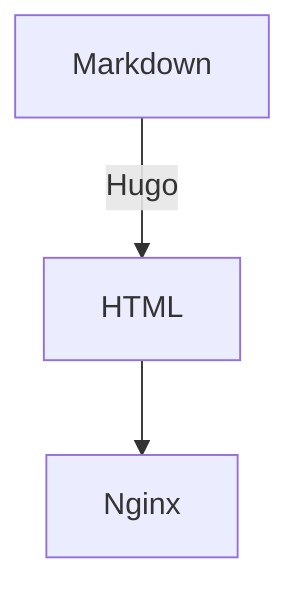
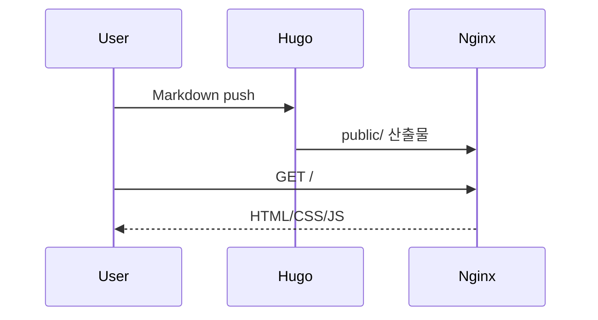

# Docker 배포 가이드

## 목표와 아키텍처

- Markdown 문서를 정적으로 HTML/CSS/JS로 변환
- Nginx가 정적 결과물만 제공 (무상태)
- Docker/Compose로 **빌드(Generator)**와 **서빙(Nginx)** 분리
- 운영에서 **캐시·보안 헤더·압축**을 적용하고 **헬스체크/로그/백업** 관점 포함

```
[Markdown/Assets] → [Static Site Generator(Hugo 등)] → [/public 정적 결과물] → [Nginx]
```

---

## 폴더 레이아웃(확장형 Hugo 기준)

```plaintext
my-blog/
├── content/                 # Markdown 원문
│   ├── posts/
│   │   └── hello-world.md
│   └── _index.md
├── static/                  # 정적 자산(이미지, JS, CSS 원본)
├── layouts/                 # 테마 오버라이드(선택)
├── themes/                  # Hugo 테마(예: PaperMod 등)
├── public/                  # 빌드 결과(자동 생성/서빙 루트)
├── config.toml              # Hugo 설정 (baseURL, permalinks, 메뉴 등)
├── nginx/
│   └── default.conf         # Nginx 서버 블록
├── Dockerfile               # 정적 빌드 이미지
├── docker-compose.yml       # dev/prod 공용 혹은 dev용
├── docker-compose.prod.yml  # prod 오버레이(운영 설정)
├── .dockerignore
└── Makefile                 # 자주 쓰는 명령 모음(선택)
```

> `public/`는 빌드 산출물이므로 배포 산출물로 커밋하지 않는 것을 권장(자동 생성). 필요하면 GitHub Pages 목적 등으로 예외.

---

## Hugo 설정 파일 예시(`config.toml`)

```toml
baseURL = "https://example.com/"
languageCode = "ko-kr"
title = "My Dockerized Static Blog"
theme = "PaperMod"
paginate = 10
enableRobotsTXT = true

[params]
  defaultTheme = "auto"
  ShowReadingTime = true
  ShowBreadCrumbs = true
  ShowPostNavLinks = true

[markup]
  [markup.highlight]
    style = "dracula"
  [markup.goldmark.renderer]
    unsafe = true     # MathJax/iframe 등 raw HTML 허용 시

[outputs]
  home = ["HTML","RSS","JSON"]

[permalinks]
  posts = "/posts/:slug/"

[services]
  [services.disqus]
    shortname = "your-disqus-shortname"
  [services.googleAnalytics]
    id = "G-XXXXXXX"
```

- `baseURL`은 운영 URL에 맞춰 반드시 설정.
- `unsafe = true`는 MathJax/mermaid 삽입 시 필요할 수 있음.

---

## Dockerfile — Hugo 빌더(멀티스테이지 가능)

### 단일 스테이지(단순/빠른 시작)

```Dockerfile
# 이미지

FROM klakegg/hugo:0.126.1-ext-alpine

WORKDIR /src
COPY . .
# 프로덕션 빌드: baseURL/환경 변수에 따라 변경 가능

RUN hugo --minify
```

- 빌드 결과물은 컨테이너 내부 `/src/public`에 생성.
- Compose에서 `./public:/src/public`로 마운트해 결과를 호스트에 떨군다.

### 멀티스테이지(빌드 → 산출물만 복사하여 Nginx에 내장)

```Dockerfile
# Builder

FROM klakegg/hugo:0.126.1-ext-alpine AS builder
WORKDIR /src
COPY . .
RUN hugo --minify

# Runtime(Nginx에 결과물 bake-in)

FROM nginx:1.27-alpine AS runtime
COPY nginx/default.conf /etc/nginx/conf.d/default.conf
COPY --from=builder /src/public /usr/share/nginx/html
EXPOSE 80
HEALTHCHECK --interval=30s --timeout=3s --retries=3 CMD wget -qO- http://127.0.0.1/ > /dev/null || exit 1
```

- 이 방식은 단독 Nginx 이미지로 배포 가능(Compose 생략 가능).
- 단점: 빌드시마다 이미지를 새로 만들어야 한다(배포 파이프라인에 적합).

---

## Nginx 설정(캐시·압축·보안 헤더 포함 예시)

`nginx/default.conf`:

```nginx
server {
  listen 80;
  server_name _;

  root /usr/share/nginx/html;
  index index.html;

  # 기본 캐시/압축(알파인 Nginx는 gzip 내장, brotli는 별도 모듈 필요)
  gzip on;
  gzip_types text/plain text/css application/javascript application/json image/svg+xml;
  gzip_min_length 1024;

  # 보안/최적화 헤더(필요에 맞게 조정)
  add_header X-Content-Type-Options "nosniff";
  add_header X-Frame-Options "SAMEORIGIN";
  add_header X-XSS-Protection "1; mode=block";
  add_header Referrer-Policy "strict-origin-when-cross-origin";
  add_header Permissions-Policy "geolocation=(), camera=(), microphone=()";

  # 정적 자산 캐시 정책(파일명 해시 사용 시 더욱 공격적 가능)
  location ~* \.(css|js|mjs|png|jpg|jpeg|gif|svg|ico|webp|woff2?)$ {
    expires 7d;
    access_log off;
    try_files $uri =404;
  }

  # HTML은 짧은 캐시(또는 no-cache)로 배포해 변경 반영 빠르게
  location ~* \.(html)$ {
    expires -1;
    add_header Cache-Control "no-cache";
    try_files $uri =404;
  }

  # 기본 라우팅: 정적 사이트(폴더 인덱스 지원)
  location / {
    try_files $uri $uri/ =404;
  }

  # 에러 페이지(커스텀)
  error_page 404 /404.html;
  location = /404.html { internal; }
}
```

> SPA 라우팅이 필요한 경우 `try_files $uri /index.html;`로 변경.

---

## Compose — 개발용(빌드 분리 + Live server 선택지)

### 개발용 `docker-compose.yml`

```yaml
version: "3.9"

services:
  # 정적 빌더: 호스트의 public 폴더에 산출물 생성
  builder:
    build: .
    volumes:
      - ./public:/src/public
      - ./:/src
    environment:
      HUGO_ENV: "development"

  # Nginx 서빙
  web:
    image: nginx:alpine
    ports:
      - "8080:80"
    volumes:
      - ./public:/usr/share/nginx/html:ro
      - ./nginx/default.conf:/etc/nginx/conf.d/default.conf:ro
    depends_on:
      - builder
```

- 개발 중엔 `content/` 수정 후 `docker compose up --build` 혹은 **Hugo 개발 서버** 사용 권장.

### — Hugo 개발 서버

정적 파일 재생성 없이 바로 미리보기.

```yaml
services:
  hugo:
    image: klakegg/hugo:0.126.1-ext-alpine
    command: server --bind=0.0.0.0 --port=1313 --disableFastRender
    working_dir: /src
    volumes:
      - ./:/src
    ports:
      - "1313:1313"

  # 운영 Nginx는 별개. 개발 뷰만 필요하면 web는 생략 가능.
```

- 브라우저에서 `http://localhost:1313` 접속.
- 초안(draft)까지 보고 싶으면 `--buildDrafts --buildFuture` 플래그.

---

## Compose — 운영용 오버레이(`docker-compose.prod.yml`)

- 빌더/서버를 분리한 2컨테이너 방식(산출물은 볼륨/바인드로 전달).
- 혹은 멀티스테이지 runtime 이미지만 띄우는 단일컨테이너 배포.

```yaml
version: "3.9"

services:
  builder:
    build:
      context: .
    environment:
      HUGO_ENV: "production"
    volumes:
      - ./public:/src/public
      - ./:/src
    command: ["sh", "-lc", "hugo --minify"]

  web:
    image: nginx:1.27-alpine
    depends_on:
      - builder
    ports:
      - "80:80"
    volumes:
      - ./public:/usr/share/nginx/html:ro
      - ./nginx/default.conf:/etc/nginx/conf.d/default.conf:ro
    healthcheck:
      test: ["CMD-SHELL", "wget -qO- http://127.0.0.1/ > /dev/null || exit 1"]
      interval: 30s
      timeout: 3s
      retries: 3
```

실행:

```bash
docker compose -f docker-compose.yml -f docker-compose.prod.yml up -d --build
```

---

## .dockerignore

빌드 컨텍스트 축소와 캐시 효율을 위해 반드시 포함:

```
.git
.gitignore
public
node_modules
*.log
.DS_Store
```

---

## 포함

### MathJax

Hugo 레이아웃(head partial)에 MathJax 스크립트를 삽입:

```html
<!-- layouts/partials/head-end.html 혹은 테마의 head override -->
<script>
  window.MathJax = { tex: { inlineMath: [['$', '$$'], ['\\(', '\\)']] } };
</script>
<script defer src="https://cdn.jsdelivr.net/npm/mathjax@3/es5/tex-mml-chtml.js"></script>
```

Markdown 문서에서 수식은 반드시 `$$...$$`로 감싼다:

```
$$
\int_{0}^{\infty} e^{-x^2} dx = \frac{\sqrt{\pi}}{2}
$$
```

### Mermaid

```html
<script defer src="https://cdn.jsdelivr.net/npm/mermaid/dist/mermaid.min.js"></script>
<script>mermaid.initialize({ startOnLoad: true });</script>
```

Markdown:

````markdown

````

---

## 이미지·자산 최적화

- 이미지 포맷: **WebP** 우선, 필요 시 PNG/JPEG 폴백
- 파일명에 해시를 붙이는 빌드 파이프라인(테마/파이프) 사용 → **Immutable 캐시** 가능
- Nginx에서 `expires 1y; add_header Cache-Control "public, immutable";` 적용(해시 파일만)

---

## SEO/메타/리다이렉트

- `robots.txt`/`sitemap.xml` 자동 생성(Hugo 기본 또는 테마 지원)
- OpenGraph/Twitter Card 메타 추가(테마 또는 `layouts/partials`)
- URL 변경 시 `static/_redirects`(Netlify 스타일) 또는 Nginx `return 301` 규칙으로 리다이렉트 관리

Nginx 리다이렉트 예:
```nginx
location = /old-path {
  return 301 /new-path;
}
```

---

## — Nginx + Certbot 컨테이너

간단히 dockerized certbot을 붙이는 패턴(운영 서버에서 DNS/방화벽 개방 필요).
프로덕션에서는 Nginx-proxy/Traefik 또는 Cloudflare의 TLS 종단도 고려.

```yaml
services:
  web:
    image: nginx:alpine
    # 80/443 오픈, conf에 SSL 설정이 있어야 함
    ports: ["80:80", "443:443"]
    volumes:
      - ./public:/usr/share/nginx/html:ro
      - ./nginx/default.conf:/etc/nginx/conf.d/default.conf:ro
      - ./certbot/conf:/etc/letsencrypt
      - ./certbot/www:/var/www/certbot

  certbot:
    image: certbot/certbot
    volumes:
      - ./certbot/conf:/etc/letsencrypt
      - ./certbot/www:/var/www/certbot
    command: certonly --webroot --webroot-path=/var/www/certbot \
             --email you@example.com --agree-tos --no-eff-email \
             -d example.com -d www.example.com
```

Nginx conf에 `.well-known/acme-challenge` 경로 프록시/루트 지정 필요.

---

## CI/CD(예: GitHub Actions)

새로 푸시 시 자동으로 빌드 후 서버에 배포(SSH/Registry 방식).

```yaml
name: deploy
on:
  push:
    branches: [ main ]

jobs:
  build-and-deploy:
    runs-on: ubuntu-latest
    steps:
      - uses: actions/checkout@v4

      - name: Build static site
        run: |
          docker build -t myblog/builder .
          docker run --rm -v ${{ github.workspace }}/public:/src/public myblog/builder

      - name: Rsync public to server
        run: |
          rsync -avz --delete public/ user@server:/srv/my-blog/public/

      - name: Reload Nginx (optional)
        run: |
          ssh user@server "docker compose -f /srv/my-blog/docker-compose.prod.yml up -d"
```

> 혹은 멀티스테이지로 만든 Nginx 이미지를 **Registry**에 푸시 후 서버에서 `docker compose pull && up -d`.

---

## MkDocs/Jekyll/Zola/Pandoc 대체

### MkDocs(Material 테마 예)

`mkdocs.yml`:

```yaml
site_name: "My Docs"
theme:
  name: material
  features:
    - content.code.copy
markdown_extensions:
  - admonition
  - pymdownx.superfences
```

Docker 빌드:

```Dockerfile
FROM python:3.11-slim
RUN pip install --no-cache-dir mkdocs mkdocs-material
WORKDIR /site
COPY . .
RUN mkdocs build --clean
```

그 외 Nginx는 동일.

### Pandoc 단발 변환

```bash
docker run --rm -v "$PWD":/work pandoc/core:latest \
  -f markdown -t html5 -s content/post1.md -o public/post1.html
```

---

## Makefile(반복작업 단축)

```makefile
build:
	docker compose up --build builder

serve:
	docker compose up -d web

dev:
	docker compose up hugo

prod:
	docker compose -f docker-compose.yml -f docker-compose.prod.yml up -d --build

clean:
	rm -rf public/*
```

---

## 트러블슈팅 체크리스트

| 증상 | 점검 항목 | 빠른 확인 |
|---|---|---|
| 404 다발 | `try_files` 라우팅, `public/` 내용 유무 | `docker compose logs web`, `ls public/` |
| CSS/JS 캐시 미반영 | `Cache-Control`, 파일명 해시, 브라우저 캐시 | 개발선 `no-cache`, 운영선 해시/긴 캐시 |
| 수식 안 보임 | MathJax 스크립트 로딩, `unsafe=true` | 개발자 콘솔 에러/네트워크 탭 |
| 한글 경로 깨짐 | 파일명/링크 인코딩, OS별 대소문자 | Hugo permalinks/slug 설정 |
| 403/SELinux | 바인드 마운트 컨텍스트 | `:Z` 옵션(RHEL/CentOS/SELinux) |
| 80 포트 충돌 | 이미 점유 중인 서비스(Nginx/Apache) | `sudo lsof -i :80` |

SELinux 환경 예:
`- ./public:/usr/share/nginx/html:ro,Z`

---

## 성능 팁 요약

- Generator 단계: **이미지/폰트 최적화**, 불필요 자산 제외
- Nginx 단계: **gzip**, (가능하면) **Brotli 모듈** 추가
- 장기 캐시: **해시 파일명 + immutable**, HTML은 no-cache
- 작은 이미지/아이콘: **SVG** 선호
- 글로벌 분산: **CDN** 앞단 배치(Cloudflare/CloudFront)

---

## 실행 순서 요약

개발:

```bash
# Live 프리뷰(빠른 확인)

docker compose up hugo
# 혹은 빌더 + Nginx

docker compose up --build
```

운영:

```bash
docker compose -f docker-compose.yml -f docker-compose.prod.yml up -d --build
# 헬스체크 확인

docker compose ps
docker compose logs -f web
```

브라우저 접속: `http://localhost:8080` 혹은 운영 도메인.

---

## 결론

- 정적 사이트는 **무상태·경량**이며 컨테이너와 궁합이 좋다.
- **빌드(Generator)와 서빙(Nginx)**을 분리하면, 로컬/CI/운영 어디서나 재현 가능.
- 운영에서는 **캐시·헤더·압축·헬스체크**와 **CI/CD**를 더해 품질과 민첩성을 확보하라.
- Hugo 외에도 MkDocs/Jekyll/Zola/Pandoc 등 도구를 교체해도 **Nginx 서빙·Compose 배포** 패턴은 동일하게 유지된다.

---

## 부록 A. 예시 컨텐츠(`content/posts/hello-world.md`)

```markdown
---
title: "Hello World"
date: 2025-11-06
draft: false
description: "Dockerized Hugo + Nginx 정적 블로그 첫 글"
---

여기에 블로그 본문을 작성합니다.

수식 예시:

$$
\nabla \cdot \vec{E} = \frac{\rho}{\varepsilon_0}
$$

Mermaid 예시:


```

---

## 부록 B. PaperMod 테마 빠른 적용

```bash
git submodule add https://github.com/adityatelange/hugo-PaperMod.git themes/PaperMod
echo 'theme = "PaperMod"' >> config.toml
```

---

## 부록 C. SPA 라우팅용 Nginx 스니펫

```nginx
location / {
  try_files $uri /index.html;
}
```

---

## 참고 링크

- Hugo: https://gohugo.io/
- Hugo Docker 이미지: https://hub.docker.com/r/klakegg/hugo
- Nginx 공식 이미지: https://hub.docker.com/_/nginx
- PaperMod 테마: https://github.com/adityatelange/hugo-PaperMod
- MkDocs: https://www.mkdocs.org/
- Jekyll: https://jekyllrb.com/
- Zola: https://www.getzola.org/
- MathJax: https://www.mathjax.org/
- Mermaid: https://mermaid.js.org/
