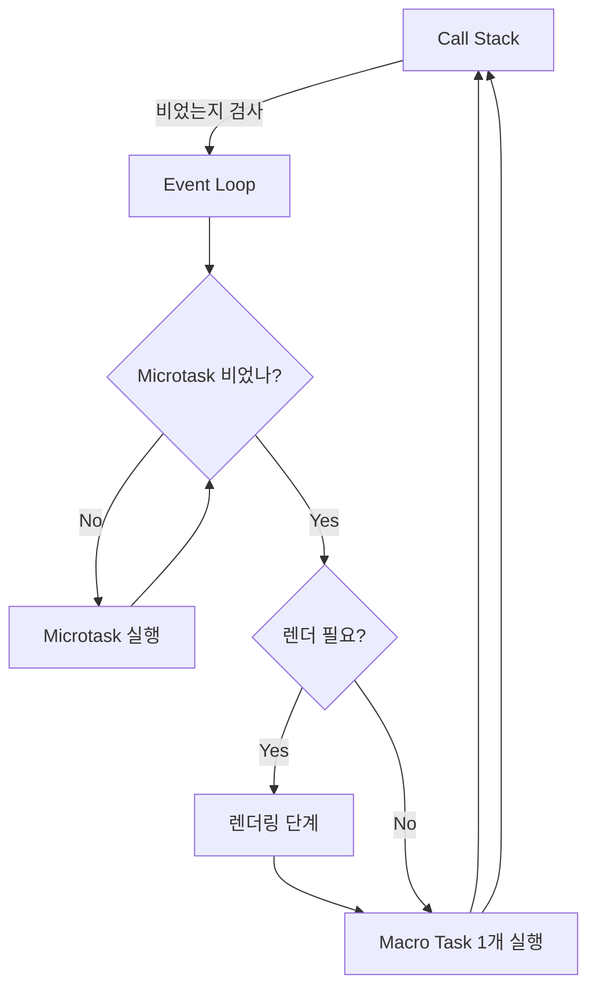

# 이벤트 루프(Event Loop)와 태스크 큐(Task Queue)

## 0. 한눈에 보는 규칙

- **콜 스택(Call Stack)** 이 비면, 이벤트 루프가 **마이크로태스크(Microtask) 큐**를 **먼저** 비우고, 그 다음 **매크로태스크(Macro task)** 를 1개 실행합니다.
- **Microtask**: `Promise.then/catch/finally`, `queueMicrotask`, `MutationObserver`, **(Node)** `process.nextTick(특수)`.
- **Macro task**: `setTimeout`, `setInterval`, `MessageChannel`, `postMessage`, `I/O`, **(Node)** `setImmediate` 등.
- **렌더링 프레임**(브라우저): 한 턴이 끝나고 마이크로태스크가 모두 비워진 뒤, 필요하면 **렌더**(layout/paint). `requestAnimationFrame`(rAF)은 렌더 직전 호출.
- **Node.js**: libuv 루프 **phases**(timers → pending → idle/prepare → poll → check → close callbacks) + **nextTick queue**(마이크로태스크보다 더 높은 특수 우선순위) + **Promise microtask queue**.

---

## 1. 실행 모델과 구성요소

### 1.1 콜 스택(Call Stack)
- 현재 실행 중인 프레임(함수 호출)이 쌓이는 스택.
- **동기 코드**는 스택이 빌 때까지 계속 실행.

```js
console.log("A");
console.log("B"); // A → B 순서로 즉시 실행
```

### 1.2 호스트(브라우저/Node)의 백그라운드
- 타이머, 네트워크, 파일 I/O, DOM 이벤트 대기 등은 **호스트 스레드/스레드풀**이 처리.

### 1.3 큐(Queues)
- **Microtask Queue**: 우선순위가 높음. 스택이 빌 때마다 **전부** 비우려 시도.
- **Macro Task Queue**: 한 번에 **하나**씩 꺼내 실행.

### 1.4 이벤트 루프(Event Loop)
- “스택이 비었는가?”를 감시. 비면 **Microtask → Macro task(1개)** 순서로 실행을 스케줄.

---

## 2. 큐의 종류와 대표 작업

### 2.1 마이크로태스크(Microtask)
- **브라우저**: `Promise.then/catch/finally`, `queueMicrotask`, `MutationObserver`.
- **Node**: 위 + `process.nextTick`(특수 큐: 일반 마이크로태스크보다 **먼저** 실행).

```js
Promise.resolve().then(() => console.log("microtask A"));
queueMicrotask(() => console.log("microtask B"));
// A → B (등록 순서 보장, FIFO)
```

### 2.2 매크로태스크(Macro task)
- **브라우저**: `setTimeout`, `setInterval`, `MessageChannel`, `postMessage`, 일부 I/O 콜백.
- **Node**: `setTimeout`/`setInterval`(timers phase), I/O callbacks(pending), `setImmediate`(check phase), close callbacks 등.

```js
setTimeout(() => console.log("macro (timeout)"), 0);
```

### 2.3 렌더링 관련(브라우저 고유)
- **requestAnimationFrame(rAF)**: 렌더 직전에 호출.
- **requestIdleCallback**: 브라우저가 한가할 때 호출(마감시간 제공). 중요한 UI에 선호 X, 보조 작업에 유용.

```js
requestAnimationFrame(() => {
  // 레이아웃 계산 직전 수행 (애니메이션 업데이트 등에 적합)
});
```

---

## 3. 브라우저 이벤트 루프(개략 알고리즘)

### 3.1 한 턴의 흐름
1) **콜 스택**이 비면  
2) **Microtask Queue**가 빌 때까지 계속 실행 (무한 생성 주의)  
3) 필요 시 **렌더 단계** 진입 (스타일/레이아웃/페인트)  
4) 그 다음 **Macro task**를 1개 꺼내 실행  
5) 반복



### 3.2 대표 예제: `Promise` vs `setTimeout`
```js
console.log("1");
setTimeout(() => console.log("2"), 0);
Promise.resolve().then(() => console.log("3"));
console.log("4");
// 1 → 4 → 3 → 2
```
- 동기 1,4 후 스택이 비면 **Microtask(3)** 가 먼저,
- 다음 턴에 **Macro task(2)**.

---

## 4. Node.js 이벤트 루프(libuv) 개요

### 4.1 phases 순서(간단화)
1) **timers**: `setTimeout`/`setInterval` 만기 콜백  
2) **pending callbacks**: 일부 I/O 콜백  
3) **idle/prepare**  
4) **poll**: I/O 이벤트 수집/실행(대기/즉시 실행)  
5) **check**: `setImmediate` 콜백  
6) **close callbacks**

- 각 phase 사이사이마다 **microtasks**가 비워짐.
- **`process.nextTick`** 큐는 각 마이크로태스크보다 **더 먼저** 비워진다는 점이 핵심.

```js
setTimeout(() => console.log("timer"), 0);
setImmediate(() => console.log("immediate"));
process.nextTick(() => console.log("nextTick"));
Promise.resolve().then(() => console.log("promise"));
// nextTick → promise → timer|immediate (상황에 따라 timer vs immediate 순서는 실행 맥락에 의존)
```

> 파일 I/O 콜백 이후라면 `setImmediate`가 `setTimeout(..,0)`보다 먼저 실행되는 경우가 흔함(phase 배치 차이).

---

## 5. 실험 예제 모음(브라우저)

### 5.1 Microtask 여러 개와 순서
```js
Promise.resolve().then(() => console.log("A"));
Promise.resolve().then(() => console.log("B"));
queueMicrotask(() => console.log("C"));
// A → B → C
```

### 5.2 Microtask가 Macro task를 ‘가로막는’ 효과
```js
setTimeout(() => console.log("macro timeout"), 0);

let i = 0;
function flood() {
  if (i++ < 3) {
    queueMicrotask(flood);
  }
  console.log("micro", i);
}
queueMicrotask(flood);
// micro 1 → micro 2 → micro 3 → micro 4 ... → macro timeout
```
> Microtask는 **스택이 빌 때마다 전부** 비우려 시도. 과도하면 **굶주림(starvation)** 발생.

### 5.3 rAF vs Promise vs Timeout
```js
requestAnimationFrame(() => console.log("rAF"));
Promise.resolve().then(() => console.log("micro"));
setTimeout(() => console.log("macro"), 0);
console.log("sync");
// sync → micro → rAF → macro (일반적 시나리오)
```

### 5.4 MessageChannel은 Macro task
```js
const ch = new MessageChannel();
ch.port1.onmessage = () => console.log("messagechannel (macro)");
ch.port2.postMessage(null);
Promise.resolve().then(() => console.log("micro"));
console.log("sync");
// sync → micro → messagechannel
```

---

## 6. 실험 예제 모음(Node.js)

### 6.1 nextTick의 초고우선
```js
setTimeout(() => console.log("timer"), 0);
setImmediate(() => console.log("immediate"));

process.nextTick(() => console.log("nextTick 1"));
Promise.resolve().then(() => console.log("promise 1"));
process.nextTick(() => console.log("nextTick 2"));
Promise.resolve().then(() => console.log("promise 2"));
// nextTick 1 → nextTick 2 → promise 1 → promise 2 → (timer|immediate)
```

### 6.2 poll 이후 check phase
```js
const fs = require("fs");
fs.readFile(__filename, () => {
  setTimeout(() => console.log("timer"), 0);
  setImmediate(() => console.log("immediate"));
  // 보통: immediate → timer
});
```

---

## 7. 렌더링 타이밍과 프레임(브라우저)

### 7.1 렌더링 파이프라인
- **스타일 계산 → 레이아웃 → 페인트 → 합성**.
- 한 이벤트 루프 턴이 끝나고 **마이크로태스크가 비어야** 렌더 기회.
- **장시간 동기 작업(Long Task)** 이 있으면 프레임 드롭.

### 7.2 적절한 훅
- **rAF**: 다음 프레임 직전(애니메이션 스텝 업데이트).
- **requestIdleCallback**: 한가한 시간(우선순위 낮은 작업, 마감시간 확인).

```js
function step(ts) {
  // 애니메이션 업데이트
  requestAnimationFrame(step);
}
requestAnimationFrame(step);
```

---

## 8. 실전 패턴: 순차 vs 병렬, 백오프, 타임슬라이스

### 8.1 순차 vs 배치 처리
```js
// 순차(응답성이 중요할 때)
for (const id of ids) {
  await fetchDetail(id);
}

// 병렬(빠르게 끝내야 할 때)
await Promise.all(ids.map(id => fetchDetail(id)));
```

### 8.2 타임슬라이스로 UI 멈춤 방지
```js
async function chunkedWork(items, chunk = 100) {
  for (let i = 0; i < items.length; i += chunk) {
    const slice = items.slice(i, i + chunk);
    slice.forEach(doHeavy); // 동기 처리
    await new Promise(r => setTimeout(r)); // 다음 매크로태스크로 양보 → 렌더 기회 제공
  }
}
```

### 8.3 Microtask 굶주림 방지
- 긴 루프에서는 간헐적으로 **매크로태스크로 양보**: `await new Promise(r => setTimeout(r, 0))` 또는 `await new Promise(r => queueMicrotask(r))`(전자는 매크로, 후자는 마이크로).

---

## 9. 디버깅/관찰 도구

### 9.1 브라우저
- **DevTools Performance**: Main/Task/Microtask/rAF 타이밍, Long Task 확인.
- **PerformanceObserver**: longtask 관찰.

```js
const po = new PerformanceObserver((list) => {
  for (const e of list.getEntries()) {
    console.log("Long task:", e.duration);
  }
});
po.observe({ entryTypes: ["longtask"] });
```

### 9.2 Node.js
- `--trace-turbo --trace-gc` 등 저수준은 과하지만, 보통은 **프로파일러/inspector** 사용.
- 이벤트 루프 지연 측정: `perf_hooks.monitorEventLoopDelay()`.

```js
const { monitorEventLoopDelay } = require('perf_hooks');
const h = monitorEventLoopDelay();
h.enable();
setInterval(() => console.log('EL delay p95(ms):', Math.round(h.percentiles.get(95)/1e6)), 1000);
```

---

## 10. 자주 하는 실수/함정

### 10.1 `forEach` + `async` 오해
```js
// ❌ forEach는 await를 기다려 주지 않음
arr.forEach(async v => {
  await doWork(v);
});
// 종료 시점 보장 없음
```
**해결**: 직렬 `for...of` 또는 병렬 `Promise.all(map)`.

### 10.2 Microtask 폭주로 렌더 기회 소실
- `Promise.resolve().then(재귀 등록)` 패턴은 프레임 드랍 유발 가능.  
  **해결**: 일정 단계마다 매크로태스크로 양보(`setTimeout 0`).

### 10.3 Node의 `process.nextTick` 남용
- `nextTick`은 지나치게 우선. 과도하면 I/O 굶주림.  
  **해결**: 일반 마이크로태스크(`Promise`)나 적절한 phase(`setImmediate`)로 이동.

### 10.4 `setTimeout(fn, 0)`의 “즉시 실행” 오해
- 0은 **최소 지연 보장 X**, 환경별 **최소 지연 시간(clamp)** 가 있음.

### 10.5 rAF에서 비싼 동기 작업
- rAF 콜백에서 무거운 연산 → 다음 프레임 미스.  
  **해결**: 작업 분할/워커/타임슬라이스.

---

## 11. 순서 추론 예제(해설 포함)

### 11.1 기본
```js
console.log("start");
setTimeout(() => console.log("timeout"), 0);
Promise.resolve().then(() => console.log("promise"));
console.log("end");
```
**출력**: `start → end → promise → timeout`  
**이유**: 동기 → 마이크로태스크 → 매크로태스크.

### 11.2 rAF과 Micro/Macro
```js
requestAnimationFrame(() => console.log("rAF"));
setTimeout(() => console.log("timeout"), 0);
Promise.resolve().then(() => console.log("micro"));
console.log("sync");
```
**출력(일반적)**: `sync → micro → rAF → timeout`.

### 11.3 Node: I/O 이후 setImmediate vs setTimeout
```js
const fs = require("fs");
fs.readFile(__filename, () => {
  setTimeout(() => console.log("timeout"), 0);
  setImmediate(() => console.log("immediate"));
});
// 보통: immediate → timeout
```

---

## 12. 실전 레시피

### 12.1 Microtask 안전한 배치 실행
```js
function flushMicrotasks(tasks) {
  return new Promise((resolve, reject) => {
    let i = 0;
    function run() {
      try {
        while (i < tasks.length) {
          tasks[i++]();
        }
        resolve();
      } catch (e) { reject(e); }
    }
    queueMicrotask(run);
  });
}
```

### 12.2 응답성 유지형 대량 처리
```js
async function processLarge(items, step = 500) {
  for (let i = 0; i < items.length; i += step) {
    const chunk = items.slice(i, i + step);
    for (const it of chunk) heavySyncWork(it);
    // 렌더 기회 제공: 매크로태스크로 양보
    await new Promise(r => setTimeout(r, 0));
  }
}
```

### 12.3 타임아웃 래퍼
```js
function withTimeout(promise, ms = 3000) {
  const to = new Promise((_, rej) => setTimeout(() => rej(new Error("timeout")), ms));
  return Promise.race([promise, to]);
}
```

---

## 13. 체크리스트

- [ ] **Microtask 먼저**: `Promise/queueMicrotask`가 `setTimeout`보다 앞선다.
- [ ] **렌더 타이밍**: 마이크로태스크가 다 비워져야 렌더 기회. rAF는 렌더 직전.
- [ ] **Node nextTick 남용 금지**: I/O 굶주림 유발 가능.
- [ ] **루프 패턴**: `forEach + async` 지양 → `for...of` 또는 `Promise.all`.
- [ ] **대량 작업**: 타임슬라이스/워커로 프레임 유지.
- [ ] **순서 디버깅**: DevTools Performance/PerformanceObserver, Node perf_hooks.

---

## 14. 미니 퀴즈

```js
// Q1) 출력 순서?
console.log("S");
Promise.resolve().then(() => console.log("M1"));
setTimeout(() => console.log("T1"), 0);
queueMicrotask(() => console.log("M2"));
console.log("E");

// Q2) 브라우저에서 rAF, micro, timeout 혼합
requestAnimationFrame(() => console.log("R"));
Promise.resolve().then(() => console.log("Pm"));
setTimeout(() => console.log("Pt"), 0);
console.log("X");

// Q3) Node: 파일 I/O 이후
const fs = require("fs");
fs.readFile(__filename, () => {
  setImmediate(() => console.log("I"));
  setTimeout(() => console.log("T"), 0);
});
```

**정답(일반적)**  
- Q1: `S → E → M1 → M2 → T1`  
- Q2: `X → Pm → R → Pt`  
- Q3: `I → T` (일반적 경향; 실행 맥락/플랫폼에 따라 달라질 수 있음)

---

## 15. 요약

- **스택이 비면** 이벤트 루프는 **Microtask 전부 → Macro task 1개** 순서로 소비합니다.  
- 브라우저는 이 사이사이에 **렌더링**이 개입하며, rAF는 **렌더 직전** 실행됩니다.  
- Node는 **libuv phases** + `process.nextTick`/Promise 마이크로태스크의 **우선순위**를 이해해야 합니다.  
- **응답성(UX) 유지**를 위해 작업 분할·타임슬라이스·워커·적절한 큐 선택을 활용하세요.