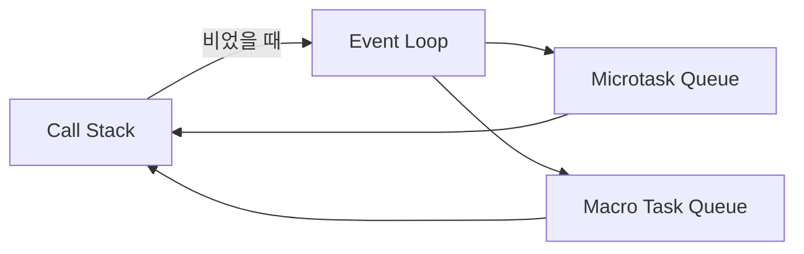

# 이벤트 루프(Event Loop)와 태스크 큐(Task Queue) 완벽 정리

자바스크립트(JavaScript)는 **싱글 스레드(Single-thread)** 언어입니다.  
하지만 동시에 여러 작업이 가능해 보이는 이유는 브라우저나 Node.js에서 제공하는 **이벤트 루프(Event Loop)** 구조 덕분입니다.

이 글에서는 이벤트 루프, 콜 스택, 태스크 큐(Macro/Micro), 그리고 실행 순서를 시각적 예제와 함께 완벽히 정리합니다.

---

## ✅ 1. 자바스크립트는 싱글 스레드?

자바스크립트는 한 번에 하나의 작업만 수행합니다.

```js
console.log("A");
console.log("B");
```

출력:  
```
A  
B
```

하지만 비동기 함수(예: `setTimeout`, `fetch`, 이벤트 리스너 등)는 어떻게 동시에 실행되는 걸까요?

---

## ✅ 2. 자바스크립트 실행 환경

자바스크립트 엔진(예: V8)은 다음과 같은 컴포넌트로 구성됩니다:

- **Call Stack (콜 스택)**: 현재 실행 중인 함수들의 호출 기록
- **Web APIs (브라우저 제공)**: `setTimeout`, `DOM 이벤트`, `AJAX`, `fetch` 등
- **Task Queue (Macro Task Queue)**: `setTimeout`, `setInterval`, `I/O` 등 완료 후 실행 대기
- **Microtask Queue**: `Promise.then`, `MutationObserver` 등 더 빠른 우선순위의 작업
- **Event Loop (이벤트 루프)**: 위 큐들을 관리하며 콜 스택이 비면 대기 중 작업을 실행

---

## ✅ 3. 이벤트 루프의 동작 방식

> 이벤트 루프는 “**콜 스택이 비었을 때**” 대기 중인 작업을 태스크 큐에서 하나 꺼내 실행합니다.



### 동작 순서:
1. 콜 스택이 비면
2. **Microtask Queue**를 먼저 비움 (Promise 등)
3. 그다음에 **Macro Task Queue**에서 하나 처리

---

## ✅ 4. 예제: setTimeout vs Promise

```js
console.log("1");

setTimeout(() => {
  console.log("2");
}, 0);

Promise.resolve().then(() => {
  console.log("3");
});

console.log("4");
```

### 출력 순서:

```
1  
4  
3  
2
```

### 설명:
- `console.log("1")` → 바로 실행
- `setTimeout`은 Web API에서 등록되고 Macro Task로 분류됨
- `Promise.then()`은 Microtask로 분류됨 → 우선 처리됨
- 마지막으로 `setTimeout` 실행

---

## ✅ 5. Microtask vs Macro Task 차이

| 구분              | 예시                                      | 큐 종류     | 우선순위      |
|-------------------|-------------------------------------------|-------------|----------------|
| **Microtask**     | `Promise.then`, `queueMicrotask()`, `MutationObserver` | Microtask Queue | ✅ 더 빠름 |
| **Macro Task**    | `setTimeout`, `setInterval`, `setImmediate`, `I/O` | Task Queue | ⏳ 나중 처리 |

> ✔️ Microtask는 **콜 스택이 비는 즉시 바로 처리**,  
> ⏳ Macro Task는 **이벤트 루프가 한 턴을 돈 후** 처리됨

---

## ✅ 6. 예제: Microtask 여러 개

```js
Promise.resolve().then(() => console.log("A"));
Promise.resolve().then(() => console.log("B"));
```

출력 순서:  
```
A  
B
```

> 마이크로태스크는 **등록된 순서대로** 실행됨 (FIFO)

---

## ✅ 7. 실전 예제: 순서 추론하기

```js
console.log("start");

setTimeout(() => {
  console.log("timeout");
}, 0);

Promise.resolve().then(() => {
  console.log("promise");
});

console.log("end");
```

### 출력 순서:
```
start  
end  
promise  
timeout
```

---

## ✅ 8. 이벤트 루프 흐름 요약

```text
[1] 실행 시작 → Call Stack에 코드 쌓임  
[2] 비동기 함수 → Web APIs에 등록  
[3] 완료된 작업 → Task Queue or Microtask Queue로 이동  
[4] Call Stack이 비면 → Event Loop가 큐에서 작업 꺼냄  
[5] Microtask → Macro Task 순으로 실행  
```

---

## ✅ 9. 태스크 큐 시각화 예제 (Node.js 기준)

```js
setTimeout(() => console.log("macro 1"), 0);
setImmediate(() => console.log("macro 2"));
process.nextTick(() => console.log("micro 1"));
Promise.resolve().then(() => console.log("micro 2"));
```

출력 순서:
```
micro 1  
micro 2  
macro 1  
macro 2
```

> `process.nextTick()`은 Node.js에서 가장 높은 우선순위를 가짐  
> 이후는 Microtask → Macro 순서

---

## ✅ 10. 마무리 정리

- 자바스크립트는 싱글 스레드지만 **비동기 처리를 이벤트 루프**로 해결
- `setTimeout`, `fetch` 등은 Web API에서 처리 후 Task Queue로 이동
- **Microtask Queue (`Promise.then`)가 항상 먼저 실행**
- 이벤트 루프는 **콜 스택이 비면 큐에서 작업을 하나씩 가져와 실행**

---

## 🧠 참고 용어 정리

| 용어              | 의미 |
|-------------------|------|
| Call Stack        | 실행 중인 함수들의 기록 |
| Web API           | 브라우저/Node.js가 제공하는 비동기 처리 기능 |
| Event Loop        | 콜 스택 상태를 감시하고 큐에서 작업을 실행 |
| Task Queue        | setTimeout 등 완료된 작업이 대기하는 큐 |
| Microtask Queue   | Promise, nextTick 등이 대기하는 큐 (우선순위 높음) |