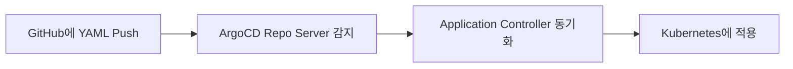

# ArgoCD를 통한 GitOps 방식 Kubernetes 배포

클라우드 네이티브 시대에서 "GitOps"는 **인프라 및 앱 상태를 Git에서 관리**하며 자동으로 클러스터에 적용하는 배포 패러다임입니다.

ArgoCD는 GitOps를 구현하기 위한 **강력한 오픈소스 툴**로, **Kubernetes 상태를 Git과 동기화**합니다.

---

## ✅ GitOps란?

**Git = 단일 진실의 원천(Single Source of Truth)**  
Git에 선언형 YAML 파일을 저장하면, **ArgoCD가 이를 기준으로 클러스터 상태를 자동 관리**합니다.

### 🔹 특징

| 항목 | 설명 |
|------|------|
| 선언형 배포 | 모든 인프라/앱 설정을 Git에 정의 |
| 자동화 | Git 변경 감지 → K8s 자동 동기화 |
| 추적 가능성 | Git 히스토리로 상태 변경 추적 |
| 재현성 | Git만 있으면 동일 환경 재구성 가능 |

---

## ✅ ArgoCD 개요

- CNCF Incubating 프로젝트
- Argo 프로젝트 중 하나 (Argo Workflows, Rollouts 등과 함께)
- Kubernetes 기반 배포 자동화 GitOps 툴

---

## ✅ 설치 방법 (minikube 기준 예시)

```bash
kubectl create namespace argocd

kubectl apply -n argocd -f https://raw.githubusercontent.com/argoproj/argo-cd/stable/manifests/install.yaml
```

### 🔹 포트 포워딩 (웹 UI 접속용)

```bash
kubectl port-forward svc/argocd-server -n argocd 8080:443
```

- 웹 UI: `https://localhost:8080`
- 기본 사용자: `admin`
- 기본 비밀번호: 설치 후

```bash
kubectl get secret argocd-initial-admin-secret -n argocd \
  -o jsonpath="{.data.password}" | base64 -d
```

---

## ✅ 핵심 구성 요소

| 컴포넌트 | 설명 |
|----------|------|
| `argocd-server` | Web UI, API 제공 |
| `argocd-repo-server` | Git 저장소와 연결 |
| `argocd-application-controller` | K8s 상태 vs Git 상태 비교 |
| `argocd-dex-server` | 인증 연동 (LDAP, OAuth 등)

---

## ✅ 애플리케이션 등록 방식

1. **Web UI**
2. **CLI (`argocd`)**
3. **YAML로 선언 (권장)**

### 🔹 Application 예제 YAML

```yaml
apiVersion: argoproj.io/v1alpha1
kind: Application
metadata:
  name: nginx-app
  namespace: argocd
spec:
  project: default
  source:
    repoURL: https://github.com/your-repo/k8s-manifests
    targetRevision: main
    path: nginx
  destination:
    server: https://kubernetes.default.svc
    namespace: default
  syncPolicy:
    automated:
      prune: true
      selfHeal: true
```

> 이 설정은 `your-repo/k8s-manifests/nginx/`에 정의된 YAML 파일을  
> 자동으로 동기화하고, 드리프트(불일치)가 생기면 복구합니다.

---

## ✅ 자동 동기화 전략

```yaml
syncPolicy:
  automated:
    prune: true        # 불필요한 리소스 자동 삭제
    selfHeal: true     # 드리프트 발생 시 자동 복구
```

- Git 상태와 클러스터 상태가 다르면 자동으로 동기화
- Git에 없는 리소스는 자동 제거 (prune)

---

## ✅ 실제 GitOps 배포 흐름



> 코드 변경이 Git에 푸시되면, ArgoCD가 자동으로 K8s 클러스터에 배포합니다.

---

## ✅ ArgoCD CLI 사용 예

```bash
brew install argocd         # macOS 기준 설치
argocd login localhost:8080 # 로그인
argocd app list             # 앱 목록 확인
argocd app sync nginx-app   # 수동 동기화
argocd app diff nginx-app   # Git vs 클러스터 상태 비교
```

---

## ✅ Helm, Kustomize도 지원

```yaml
source:
  repoURL: https://github.com/your-repo
  path: charts/nginx
  helm:
    valueFiles:
      - values-prod.yaml
```

> Helm, Kustomize, Ksonnet, Jsonnet, Plain YAML 모두 지원

---

## ✅ RBAC 및 SSO 연동

ArgoCD는 조직 내 권한 관리를 위해 다음을 지원합니다:

- LDAP / GitHub OAuth / SAML 연동
- Role-based Access Control (RBAC)
- Namespace 격리된 ArgoCD 인스턴스도 구성 가능

---

## ✅ 배포 안전장치: Manual Approval

```yaml
syncPolicy:
  automated: {}
  syncOptions:
    - CreateNamespace=true
    - ApplyOutOfSyncOnly=true
    - Validate=false
```

또는 **Webhook/Slack 알림**으로 승인 후 수동 sync도 가능

---

## ✅ 운영 시 꿀팁

| 항목 | 팁 |
|------|-----|
| Webhook 설정 | GitHub Webhook으로 빠른 동기화 |
| `argocd-notifications` 연동 | 슬랙/이메일로 알림 전송 |
| `Resource Health` 관리 | 앱 상태에 대한 커스터마이징 가능 |
| 다중 클러스터 지원 | 하나의 ArgoCD에서 여러 K8s 클러스터 동기화 가능 |
| 앱 템플릿화 | `ApplicationSet`을 사용하면 여러 앱 동적 생성 가능

---

## ✅ ArgoCD vs GitHub Actions 차이

| 항목 | ArgoCD (GitOps) | GitHub Actions (Push 기반) |
|------|-----------------|-----------------------------|
| 트리거 | Git 변경 감지 | Push 이벤트 |
| 배포 기준 | Git 상태를 기준으로 유지 | CI 파이프라인 실행 |
| 상태 복구 | 드리프트 복구 가능 | 수동 처리 필요 |
| 시각화 | Web UI 제공 | 없음 |
| 권한 | 클러스터 내부에 위치 | 외부에서 접근 필요 |

→ GitOps는 **"상태 기반 배포"**, CI는 **"이벤트 기반 배포"**

---

## ✅ 결론

| 항목 | 요약 |
|------|------|
| GitOps 철학 | Git = 상태의 진실, 클러스터는 이를 반영 |
| ArgoCD 장점 | 자동 동기화, 시각화, 드리프트 복구, Helm/Kustomize 지원 |
| 실전 팁 | Webhook 연동, RBAC 관리, Notification, ApplicationSet 활용

---

## ✅ 참고 링크

- [ArgoCD 공식 문서](https://argo-cd.readthedocs.io/)
- [GitOps 개념 소개](https://www.weave.works/technologies/gitops/)
- [Application CRD 예제](https://argo-cd.readthedocs.io/en/stable/operator-manual/application/)
