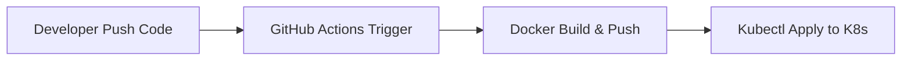

# GitHub Actions로 Kubernetes 자동 배포하기

CI/CD는 클라우드 네이티브 시대의 핵심입니다.  
GitHub Actions를 사용하면 Kubernetes 클러스터에 **코드 푸시만으로 자동 배포**하는 파이프라인을 쉽게 구성할 수 있습니다.

이 글에서는 다음을 중심으로 설명합니다:

- GitHub Actions 개요
- K8s 배포를 위한 인증 및 설정
- 실전 워크플로우 작성
- Secret 관리
- 배포 전략 및 꿀팁

---

## ✅ 1. GitHub Actions란?

GitHub에서 제공하는 **CI/CD 워크플로우 자동화 도구**입니다.  
`YAML` 기반으로 `.github/workflows/` 경로에 정의된 작업이 자동으로 실행됩니다.

```yaml
name: CI/CD

on:
  push:
    branches:
      - main
```

---

## ✅ 2. 전체 구조 요약



→ 코드가 푸시되면, GitHub Actions가 도커 이미지를 빌드하고,  
K8s 클러스터에 자동으로 배포합니다.

---

## ✅ 3. 사전 준비

### 🔹 클러스터 접근 인증 방법

| 방식 | 설명 |
|------|------|
| `kubeconfig` 직접 사용 | 클러스터 설정 파일을 Secrets에 저장 |
| 서비스 계정 + RBAC | 보안 권장 방식 (클라우드 환경 추천) |
| `kubelogin`, `oidc` | 기업 환경 SSO 연동 (고급)

> 여기서는 **`kubeconfig` 방식**으로 설명합니다.

---

## ✅ 4. GitHub Secrets 설정

Settings → Secrets and variables → Actions

| 이름 | 설명 |
|------|------|
| `KUBECONFIG_DATA` | base64 인코딩된 kubeconfig 내용 |
| `DOCKER_USERNAME` | 도커허브 계정 |
| `DOCKER_PASSWORD` | 도커허브 패스워드 |

```bash
cat ~/.kube/config | base64 -w0
```

---

## ✅ 5. 워크플로우 예제: 자동 배포

`.github/workflows/deploy.yml`

```yaml
name: Deploy to Kubernetes

on:
  push:
    branches:
      - main

jobs:
  deploy:
    runs-on: ubuntu-latest

    steps:
    - name: Checkout code
      uses: actions/checkout@v3

    - name: Set up Docker Buildx
      uses: docker/setup-buildx-action@v2

    - name: Log in to DockerHub
      uses: docker/login-action@v2
      with:
        username: ${{ secrets.DOCKER_USERNAME }}
        password: ${{ secrets.DOCKER_PASSWORD }}

    - name: Build and Push Docker Image
      run: |
        docker build -t ${{ secrets.DOCKER_USERNAME }}/myapp:latest .
        docker push ${{ secrets.DOCKER_USERNAME }}/myapp:latest

    - name: Set up Kubeconfig
      run: |
        echo "${{ secrets.KUBECONFIG_DATA }}" | base64 -d > kubeconfig
        export KUBECONFIG=$PWD/kubeconfig

    - name: Deploy to Kubernetes
      run: |
        kubectl apply -f k8s/deployment.yaml
        kubectl apply -f k8s/service.yaml
```

---

## ✅ 6. 배포 예제 파일 (k8s/deployment.yaml)

```yaml
apiVersion: apps/v1
kind: Deployment
metadata:
  name: myapp
spec:
  replicas: 2
  selector:
    matchLabels:
      app: myapp
  template:
    metadata:
      labels:
        app: myapp
    spec:
      containers:
      - name: myapp
        image: your-docker-id/myapp:latest
        ports:
        - containerPort: 3000
```

---

## ✅ 7. Helm을 사용하는 경우

```yaml
    - name: Deploy with Helm
      run: |
        helm upgrade --install myapp ./helm-chart \
          --namespace default \
          --set image.repository=${{ secrets.DOCKER_USERNAME }}/myapp \
          --set image.tag=latest
```

---

## ✅ 8. 보안 권장사항

| 항목 | 설명 |
|------|------|
| Secrets 암호화 | GitHub Secrets 사용 필수 |
| kubeconfig 최소 권한 | `kubectl apply`만 가능한 ServiceAccount 권장 |
| 이미지 태그 관리 | `latest` 대신 Git SHA 사용 권장 (`image: myapp:${{ github.sha }}`)

---

## ✅ 9. 운영 꿀팁

| 팁 | 설명 |
|-----|------|
| `kubectl rollout status` 추가 | 배포 상태 확인 |
| `slack-notify` 액션 연동 | 배포 완료 알림 |
| `matrix` 전략 | 여러 클러스터/환경에 동시 배포 |
| `deployment.yaml` 템플릿화 | Kustomize/Helm 활용

---

## ✅ 10. 결론

| 항목 | 설명 |
|------|------|
| GitHub Actions | Kubernetes와 연동 가능한 강력한 CI/CD 도구 |
| 핵심 포인트 | Docker Build → Secret 인증 → K8s 배포 자동화 |
| 추천 방식 | kubeconfig 대신 서비스 계정 + OIDC 연동 (보안 강화)

---

## ✅ 참고 링크

- [GitHub Actions 공식 문서](https://docs.github.com/en/actions)
- [kubectl GitHub Action](https://github.com/marketplace/actions/kubectl-tool-installer)
- [Kubernetes 인증 공식 가이드](https://kubernetes.io/docs/concepts/configuration/organize-cluster-access-kubeconfig/)
- [Helm + GitHub Actions 예제](https://artifacthub.io/packages/helm/bitnami/nginx)
