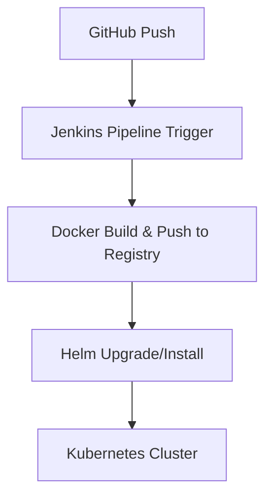

# Jenkins + Helm + Kubernetes 파이프라인 구성하기

Jenkins는 오랜 기간 신뢰받아 온 오픈소스 CI/CD 도구로, Helm과 Kubernetes를 결합하면 강력한 **엔터프라이즈 수준의 배포 자동화**를 구성할 수 있습니다.

이 글에서는 Jenkins + Helm + K8s로 다음을 구성하는 방법을 다룹니다:

- CI 빌드
- Docker 이미지 생성 및 푸시
- Helm 차트를 통한 K8s 배포
- 파이프라인 자동화

---

## ✅ 아키텍처 개요



---

## ✅ 사전 준비 사항

| 항목 | 설명 |
|------|------|
| Jenkins 설치 | 로컬 또는 Kubernetes 내 설치 가능 |
| Docker 실행 환경 | Docker CLI, 권한 필요 |
| Helm 설치 | Jenkins에서 Helm 명령 사용 가능해야 함 |
| kubeconfig 설정 | Jenkins가 K8s에 접근 가능해야 함 |
| Git 저장소 | 앱 코드 및 Helm 차트 포함 |

---

## ✅ Jenkins 구성 요소 요약

| 구성 | 설명 |
|------|------|
| Jenkinsfile | 파이프라인 정의 |
| Docker | 이미지 빌드 및 Registry 푸시 |
| Helm | 배포 자동화 |
| Kubernetes | Helm을 통해 배포되는 대상 |

---

## ✅ Jenkinsfile 예제 (Declarative)

```groovy
pipeline {
  agent any

  environment {
    DOCKER_IMAGE = "yourname/yourapp:${env.BUILD_NUMBER}"
    REGISTRY_CREDENTIALS = 'docker-hub-credentials'
    KUBECONFIG_CREDENTIALS = 'kubeconfig-id'
  }

  stages {
    stage('Checkout') {
      steps {
        git url: 'https://github.com/your-org/your-repo.git', branch: 'main'
      }
    }

    stage('Build Docker Image') {
      steps {
        script {
          docker.build(DOCKER_IMAGE)
        }
      }
    }

    stage('Push Image') {
      steps {
        withCredentials([usernamePassword(credentialsId: "${REGISTRY_CREDENTIALS}", usernameVariable: 'DOCKER_USER', passwordVariable: 'DOCKER_PASS')]) {
          sh """
            echo $DOCKER_PASS | docker login -u $DOCKER_USER --password-stdin
            docker push $DOCKER_IMAGE
          """
        }
      }
    }

    stage('Deploy with Helm') {
      steps {
        withCredentials([file(credentialsId: "${KUBECONFIG_CREDENTIALS}", variable: 'KUBECONFIG')]) {
          sh """
            helm upgrade --install yourapp ./helm-chart \
              --set image.repository=${DOCKER_IMAGE} \
              --kubeconfig=$KUBECONFIG
          """
        }
      }
    }
  }

  post {
    always {
      echo 'Pipeline Finished.'
    }
    failure {
      echo 'Deployment Failed.'
    }
  }
}
```

---

## ✅ Helm 차트 구조 예시

```
helm-chart/
├── Chart.yaml
├── values.yaml
├── templates/
│   ├── deployment.yaml
│   └── service.yaml
```

**`values.yaml` 예시:**

```yaml
image:
  repository: yourname/yourapp
  tag: latest

replicaCount: 2
```

**`deployment.yaml` 예시 템플릿:**

```yaml
apiVersion: apps/v1
kind: Deployment
metadata:
  name: {{ .Chart.Name }}
spec:
  replicas: {{ .Values.replicaCount }}
  selector:
    matchLabels:
      app: {{ .Chart.Name }}
  template:
    metadata:
      labels:
        app: {{ .Chart.Name }}
    spec:
      containers:
      - name: {{ .Chart.Name }}
        image: {{ .Values.image.repository }}:{{ .Values.image.tag }}
        ports:
        - containerPort: 8080
```

---

## ✅ Jenkins에 필요한 플러그인

| 플러그인 이름 | 용도 |
|---------------|------|
| Docker Pipeline | Docker 명령 지원 |
| Kubernetes CLI | kubectl, Helm 등 사용 가능 |
| Credentials Binding | Secret, 인증서 관리 |
| Git Plugin | Git 연동 |
| Blue Ocean | 파이프라인 시각화 UI

---

## ✅ Jenkins 보안 설정 팁

- Docker 실행 노드는 권한 분리 필수
- Kubeconfig는 최소 권한 계정 사용 (RBAC 제한)
- Registry/Cluster 접근은 Jenkins Credential Store 사용

---

## ✅ 운영 시 유용한 기능

| 기능 | 설명 |
|------|------|
| Multi-branch Pipeline | 브랜치별 자동 배포 파이프라인 가능 |
| Slack 알림 | 실패 시 Slack Webhook으로 통보 |
| 재시도 전략 | `retry(n)` 블록으로 불안정한 단계 보완 |
| Helm Diff | 실 배포 전에 차이점 미리보기 (`helm diff plugin`)

---

## ✅ Jenkins vs GitHub Actions vs ArgoCD

| 항목 | Jenkins | GitHub Actions | ArgoCD |
|------|---------|----------------|--------|
| 배포방식 | 직접 배포 | CI 이벤트 기반 | GitOps (상태 기반) |
| 유연성 | 매우 높음 | 중간 | Git 기준 유지 |
| 보안 | 자체 관리 | GitHub 관리 | 클러스터 내부 관리 |
| 시각화 | 제한적 (Blue Ocean) | 없음 | 강력한 Web UI |
| 적합 환경 | 엔터프라이즈, 고도화 커스터마이징 | 간단한 CI/CD | GitOps 기반 CD 중심 |

---

## ✅ 결론

| 항목 | 요약 |
|------|------|
| Jenkins | 유연성과 확장성 높은 전통적인 CI/CD 도구 |
| Helm | 템플릿 기반 K8s 배포 자동화 |
| Kubernetes | Jenkins + Helm을 통해 안전하고 반복 가능한 배포 가능 |
| 추천 방식 | Git → Jenkins → Docker → Helm → K8s 자동화 구성

---

## ✅ 참고 자료

- [Jenkins Pipeline 문서](https://www.jenkins.io/doc/book/pipeline/syntax/)
- [Helm 공식 문서](https://helm.sh/docs/)
- [kubectl + Helm CLI 설치](https://kubernetes.io/docs/tasks/tools/)
- [Kubernetes RBAC 가이드](https://kubernetes.io/docs/reference/access-authn-authz/rbac/)
