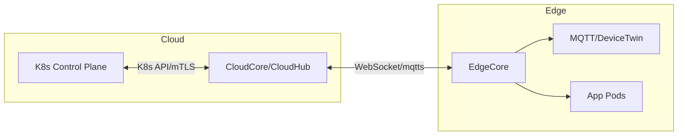

# K8s 이후의 기술 트렌드: K3s, MicroK8s, Edge K8s 등

표준 Kubernetes(K8s)는 범용 클러스터 오케스트레이션의 정답에 가깝지만, **저사양 디바이스, 엣지, 개발용 로컬, 소형 서버**에선 과한 복잡성과 자원 소모가 발목을 잡습니다.

---

## 0) 한눈에 보는 선택 가이드

| 상황 | 추천 | 핵심 근거 | 즉시 시작 커맨드 |
|---|---|---|---|
| 라즈베리파이·저사양 싱글/스몰 클러스터 | **K3s** | 단일 바이너리·경량·ARM 최적화 | `curl -sfL https://get.k3s.io | sh -` |
| 우분투 로컬 개발·AI/ML PoC | **MicroK8s** | Snap 설치·애드온·GPU 친화 | `sudo snap install microk8s --classic` |
| 수천 엣지 노드, 간헐적 네트워크 | **KubeEdge/OpenYurt** | 클라우드–엣지 분산 제어/데이터 | (아래 Edge 섹션) |
| 오프라인/에어갭 | **K3s** | 이미지 번들·내장 런타임 | k3s airgap 설치 |
| All-in-one Dev Desktop | **MicroK8s** | `enable`로 Ingress/Registry/Observability | `microk8s enable ...` |

---

## 1) 왜 경량 Kubernetes인가?

### 리소스·운영·네트워크 현실
- **컨트롤 플레인 다중 컴포넌트**(apiserver, controller, scheduler, etcd, CNI, CSI, Ingress…)가 **RAM/CPU**를 상시 점유
- **kubeadm** 기반 설치는 구성요소·인증서·CNI·스토리지까지 **학습 곡선↑**
- 엣지는 **간헐적 연결·낮은 스펙·물리 제약** → **로컬 자율 운영 + 중앙 정책 동기화** 필요

**용량 직감 공식(개념)**
$$
\text{NodeRAM}_{free} \ge \text{OS} + \text{K8sOverhead} + \sum \text{PodRequests}
$$
- 경량 배포판은 **K8sOverhead**를 작게 만들어 **애플리케이션 용량**을 최대화한다.

---

## 2) K3s — Rancher가 만든 초경량 CNCF 호환 K8s

### 2.1 핵심 특성
- **단일 바이너리**(`k3s`)에 핵심 컴포넌트 내장, **ARM(aarch64)** 우수
- **containerd** 기본, **SQLite(기본)/etcd(선택)** 백엔드
- 기본 CNI(Flannel)·Ingress(traefik)·유틸 묶음, **자동 인증서 로테이션**
- systemd 비의존 동작 가능, **Air-gapped** 설치 지원

### 2.2 단일 노드 설치 (가장 빠른 시작)
```bash
curl -sfL https://get.k3s.io | sh -
sudo kubectl get nodes -o wide
# kubeconfig: /etc/rancher/k3s/k3s.yaml (root 소유)
```

### 2.3 멀티 노드 (Server + Agent)
**서버 노드**
```bash
curl -sfL https://get.k3s.io | INSTALL_K3S_EXEC="server --cluster-init" sh -
sudo cat /var/lib/rancher/k3s/server/node-token
```

**에이전트 노드(조인)**
```bash
export K3S_URL=https://<SERVER_IP>:6443
export K3S_TOKEN=<SERVER_NODE_TOKEN>
curl -sfL https://get.k3s.io | K3S_URL=$K3S_URL K3S_TOKEN=$K3S_TOKEN sh -
```

### 2.4 외부 etcd(HA) 구성 요약
- 외부 etcd 3노드 구성 → `--datastore-endpoint="https://etcd1:2379,..."`  
- 인증서 지정: `--datastore-cafile/--datastore-certfile/--datastore-keyfile`

### 2.5 K3s 프로덕션 하드닝 체크리스트
- `--disable traefik` 후 **Nginx Ingress**로 교체(정교 튜닝)
- **Cilium** CNI(ebpf)로 교체 시 네트워킹/네트폴리시 강화
- `--kube-apiserver-arg`로 **인증·감사 로깅·RBAC** 세분화
- **etcd 외부화** 및 스냅샷/백업 전략
- `/var/lib/rancher/k3s/agent/containerd/` **디스크 모니터링**(image gc)
- **PodSecurity Admission** `restricted` 네임스페이스 라벨 적용

---

## 3) MicroK8s — Canonical의 개발·AI/ML 친화 경량 K8s

### 3.1 설치부터 애드온까지 5분
```bash
sudo snap install microk8s --classic
microk8s status --wait-ready
microk8s enable dns ingress dashboard registry
microk8s kubectl get all -A
```
- `microk8s enable prometheus jaeger gpu hostpath-storage`
- `microk8s config`로 kubeconfig 추출 가능

### 3.2 멀티 노드 조인
```bash
microk8s add-node          # 토큰 생성
microk8s join <IP>:<PORT>/<TOKEN>
```

### 3.3 개발자 생산성
- **내장 레지스트리**로 로컬 이미지 푸시/풀
- **Kubeflow** on MicroK8s: `microk8s enable kubeflow`
- GPU 워크로드: `microk8s enable gpu` (NVIDIA 드라이버 연동)

### 3.4 운영 팁
- Snap 채널로 **버전 트래킹**(stable/candidate) → **롤백** 용이
- 애드온으로 **Observability**(Prometheus/Grafana) 즉시 가동
- 단, **Snap 업데이트 정책**과 **호스트 커널 의존성** 점검

---

## 4) Edge K8s — 클라우드–엣지 하이브리드의 핵심

### 4.1 공통 요구사항
- **간헐적/불안정 네트워크**: 로컬 자율 운영 + 연결 시 **상태 동기화**
- **저사양 하드웨어**: 런타임/네트워크/스토리지 경량화
- **보안**: mTLS, Zero Trust, 디바이스 신원(SPIFFE/SPIRE)
- **데이터 중력**: 영상/센서 등 **로컬 처리 + 요약 업링크**

### 4.2 대표 플랫폼 한눈에

| 플랫폼 | 포지션 | 강점 | 유의 |
|---|---|---|---|
| **KubeEdge** | 엣지 디바이스–K8s 원격 연동 | MQTT/EdgeCore/디바이스 SDK, 오프라인 운영 | 초기 구성 복잡도 |
| **OpenYurt** | 클라우드 네이티브 엣지 확장 | YurtHub로 엣지 캐시, YurtAppSet | 알리바바 생태계 친화 |
| **SuperEdge** | 대규모 엣지 노드 | 멀티 클러스터/하이브리드 제어 | 운영 툴링 학습 필요 |

### 4.3 KubeEdge 구성(개념)

- **CloudCore**: K8s와 엣지 메시지 허브  
- **EdgeCore**: 엣지에서 Pod 관리·장치 제어(오프라인 상태에서도 지속)  
- **DeviceTwin**: 장치 상태 디지털 트윈화

### 4.4 간단 설치 단서(요약)
- 클라우드: K8s에 **CloudCore** 설치(Helm 차트 제공)  
- 엣지: 바이너리/컨테이너로 **EdgeCore** 설치 후 CloudCore에 등록  
- **mTLS** 인증서, 터널링 포트(웹소켓)·방화벽 규칙 확인

---

## 5) 네트워킹·스토리지·보안·관측 — 경량/엣지 특화 설계

### 5.1 네트워킹(CNI)
- K3s 기본 **Flannel** → 간단/경량  
- 성능·정책 필요 시 **Cilium(eBPF)**, **Calico** 교체
- 엣지 환경: NAT/방화벽·이중 NIC·Cellular 대역 고려, **L4 LB**(MetalLB) 채택 빈번

**K3s에 Cilium 적용 예(개요)**  
`INSTALL_K3S_EXEC="--flannel-backend=none --disable-network-policy"`로 설치 후 Cilium Helm 설치.

### 5.2 스토리지(CSI)
- 로컬·단일 노드: **hostPath**, **OpenEBS LocalPV**  
- 엣지 디스크 분산: **Longhorn** (경량, UI, 복구 용이)
- 오브젝트 스토리지: **MinIO** 로 컬렉션/버퍼링 후 업링크

**Longhorn 간단 설치**
```bash
kubectl apply -f https://raw.githubusercontent.com/longhorn/longhorn/master/deploy/longhorn.yaml
```

### 5.3 보안
- **PSA restricted** 네임스페이스 라벨:
```bash
kubectl label ns prod pod-security.kubernetes.io/enforce=restricted
```
- Ingress→서비스까지 **mTLS**(서비스 메시 or cert-manager),  
- 엣지 인증·신원: **SPIFFE/SPIRE**로 워크로드 ID 공급
- **Falco** 런타임 보안, **Trivy** 이미지 스캔

### 5.4 관측(Observability)
- MicroK8s: `microk8s enable prometheus`  
- K3s: kube-prometheus-stack Helm, **Loki+Promtail** 로그, **Tempo/Jaeger** 트레이싱
- 엣지: **로컬 저장→요약 업링크**(데이터 요금/불안정 링크 대비)

---

## 6) GitOps / CI·CD in 경량·엣지

### 6.1 ArgoCD로 K3s 동기화
```yaml
apiVersion: argoproj.io/v1alpha1
kind: Application
metadata:
  name: edge-web
  namespace: argocd
spec:
  project: default
  destination:
    server: https://kubernetes.default.svc
    namespace: default
  source:
    repoURL: https://github.com/your/repo
    path: k8s/overlays/edge
    targetRevision: main
  syncPolicy:
    automated:
      prune: true
      selfHeal: true
```

### 6.2 GitHub Actions로 이미지 빌드→K3s 배포(요약)

```yaml
name: build-and-deploy
on: { push: { branches: [main] } }
jobs:
  cd:
    runs-on: ubuntu-latest
    steps:
    - uses: actions/checkout@v4
    - uses: docker/login-action@v3
      with:
        username: ${{ secrets.DOCKER_USER }}
        password: ${{ secrets.DOCKER_PASS }}
    - run: |
        docker build -t ${{ secrets.DOCKER_USER }}/edge-app:${{ github.sha }} .
        docker push ${{ secrets.DOCKER_USER }}/edge-app:${{ github.sha }}
    - run: |
        echo "${{ secrets.KUBECONFIG_B64 }}" | base64 -d > kubeconfig
        KUBECONFIG=$PWD/kubeconfig kubectl -n default set image deploy/edge-app app=${{ secrets.DOCKER_USER }}/edge-app:${{ github.sha }}
        KUBECONFIG=$PWD/kubeconfig kubectl rollout status deploy/edge-app -n default
```


---

## 7) 실전 예제 모음

### 7.1 K3s + Nginx Ingress + Longhorn + HPA

**Deployment + Service**
```yaml
apiVersion: apps/v1
kind: Deployment
metadata: { name: web }
spec:
  replicas: 2
  selector: { matchLabels: { app: web } }
  template:
    metadata: { labels: { app: web } }
    spec:
      containers:
      - name: app
        image: ghcr.io/you/web:1.0.0
        ports: [{containerPort: 8080}]
        resources:
          requests: { cpu: "150m", memory: "128Mi" }
          limits:   { cpu: "500m", memory: "256Mi" }
---
apiVersion: v1
kind: Service
metadata: { name: web }
spec:
  selector: { app: web }
  ports: [{ port: 80, targetPort: 8080 }]
```

**Ingress**
```yaml
apiVersion: networking.k8s.io/v1
kind: Ingress
metadata:
  name: web
  annotations:
    nginx.ingress.kubernetes.io/ssl-redirect: "true"
spec:
  tls:
  - hosts: [ "web.edge.local" ]
    secretName: web-tls
  rules:
  - host: web.edge.local
    http:
      paths:
      - path: /
        pathType: Prefix
        backend:
          service: { name: web, port: { number: 80 } }
```

**HPA**
```yaml
apiVersion: autoscaling/v2
kind: HorizontalPodAutoscaler
metadata: { name: web-hpa }
spec:
  scaleTargetRef:
    apiVersion: apps/v1
    kind: Deployment
    name: web
  minReplicas: 2
  maxReplicas: 10
  metrics:
  - type: Resource
    resource:
      name: cpu
      target: { type: Utilization, averageUtilization: 60 }
```

**PVC(Longhorn SC)**
```yaml
apiVersion: v1
kind: PersistentVolumeClaim
metadata: { name: web-data }
spec:
  accessModes: [ "ReadWriteOnce" ]
  storageClassName: longhorn
  resources: { requests: { storage: 2Gi } }
```

### 7.2 MicroK8s에서 Kubeflow(한줄)
```bash
microk8s enable kubeflow    # 설치 시간 다소 소요, 대용량 디스크 권장
```

### 7.3 KubeEdge 장치 제어(개념 YAML 스니펫)
```yaml
apiVersion: devices.kubeedge.io/v1alpha2
kind: DeviceModel
metadata: { name: temp-sensor-model }
spec:
  properties:
  - name: temperature
    type: { int: { accessMode: ReadOnly } }
---
apiVersion: devices.kubeedge.io/v1alpha2
kind: Device
metadata: { name: temp-sensor-01 }
spec:
  deviceModelRef: { name: temp-sensor-model }
  nodeSelector: { nodeSelectorTerms: [ { matchExpressions: [ { key: node-role, operator: In, values: ["edge"] } ] } ] }
```

---

## 8) 에어갭(오프라인)·불안정 네트워크 전략

- **사전 이미지 패킹**: 레지스트리 미러(Registry in-a-box) 또는 tar 번들
- **K3s airgap**: `/var/lib/rancher/k3s/agent/images/`에 이미지 tar 배치 후 설치
- OTA 정책: **버전 링**(canary/stable)과 **롤백**(Helm history/Argo Rollout)
- **관측 데이터 요약/버퍼**: Loki boltdb-shipper + 간헐 업로드

---

## 9) eBPF · WASM · AI@Edge — 확장 트렌드

- **eBPF(Cilium)**: 커널 레벨 빠른 네트워킹/정책/가시성
- **WASM(WasmEdge/Spin+k8s)**: 경량 함수 실행(콜드 스타트↓/격리↑)
- **AI/ML@Edge**: ONNX/TensorRT/TF Lite로 **엣지 추론**, 결과만 클라우드 업링크
- **SPIFFE/SPIRE**: 엣지–클라우드 신원 기반 mTLS(ZTNA)

---

## 10) 성능·용량 감각 잡기(실무 휴리스틱)

- **싱글 보드(4GB RAM)**: K3s + 1~3개 경량 워크로드  
- **로컬 데스크톱(16GB)**: MicroK8s + Ingress + Prom/Grafana + 소규모 ML  
- **엣지 게이트웨이(8~32GB)**: K3s + Longhorn + Loki + inference 1~3개  
- Pod 리소스 산정(개념):
$$
\text{NodeRAM}_{usable} \approx \text{Total} - (\text{OS}+ \text{K8sOverhead} + \text{Buffer})
$$
여기서 Buffer는 페이지캐시/스파이크 대비(10~25%)

---

## 11) 트러블슈팅·운영 체크리스트

- 설치 직후:
```bash
kubectl get nodes -o wide
kubectl -n kube-system get pods
```
- 네트워크:
```bash
kubectl -n kube-system logs ds/cilium -c cilium-agent --tail=100
```
- 디스크 압력:
```bash
kubectl describe node <n> | egrep -i 'Pressure|Allocatable|Capacity'
```
- 컨테이너 런타임(containerd):
```bash
sudo journalctl -u containerd -f
sudo crictl ps -a
```
- 업그레이드 전:
  - `Helm release` 백업, `etcd/SQLite` 스냅샷  
  - `PodDisruptionBudget` 완화  
  - 순차/블루그린 전략

---

## 12) 보안 운영 요약

- **PSA restricted**, 네임스페이스 라벨 강제
- Ingress mTLS, 내부 서비스 mTLS(메시/사이드카 없이 cert-manager+SPIFFE도 가능)
- 이미지 서명/검증(COSIGN, Kyverno 정책)
- 런타임 공격 탐지(Falco) + CVE 스캔(Trivy)
- 엣지 디바이스 원격 키 회전, 시계 동기화(chrony/ntp)

---

## 13) 결론

| 포인트 | 정리 |
|---|---|
| 경량 K8s의 가치 | **리소스 절감 + 운영 단순화**로 더 넓은 환경에 K8s 적용 |
| K3s | 단일 바이너리·Airgap·ARM·현장 배치 최적 |
| MicroK8s | Snap/애드온으로 **Dev/AI PoC** 최적 |
| Edge | KubeEdge/OpenYurt로 **오프라인 자율 + 중앙정책** |
| 운영 | CNI/CSI 선택, PSA/mTLS, 관측·GitOps, 업그레이드·롤백 표준화 |

---

## 부록 A. 빠른 PoC 스크립트(라즈베리파이 K3s + MetalLB + Nginx)

```bash
# 1) K3s 설치
curl -sfL https://get.k3s.io | sh -
export KUBECONFIG=/etc/rancher/k3s/k3s.yaml

# 2) MetalLB
kubectl apply -f https://raw.githubusercontent.com/metallb/metallb/v0.13.12/config/manifests/metallb-native.yaml
cat <<EOF | kubectl apply -f -
apiVersion: metallb.io/v1beta1
kind: IPAddressPool
metadata: { name: pool, namespace: metallb-system }
spec: { addresses: ["192.168.0.240-192.168.0.250"] }
---
apiVersion: metallb.io/v1beta1
kind: L2Advertisement
metadata: { name: l2, namespace: metallb-system }
spec: {}
EOF

# 3) Nginx 배포 + LoadBalancer
kubectl create deploy web --image=nginx
kubectl expose deploy web --port=80 --type=LoadBalancer
kubectl get svc web -w
```

---

## 참고 링크

- K3s: <https://k3s.io/>
- MicroK8s: <https://microk8s.io/>
- KubeEdge: <https://kubeedge.io/>
- OpenYurt: <https://openyurt.io/>
- Cilium: <https://cilium.io/>
- Longhorn: <https://longhorn.io/>
- SPIFFE/SPIRE: <https://spiffe.io/>