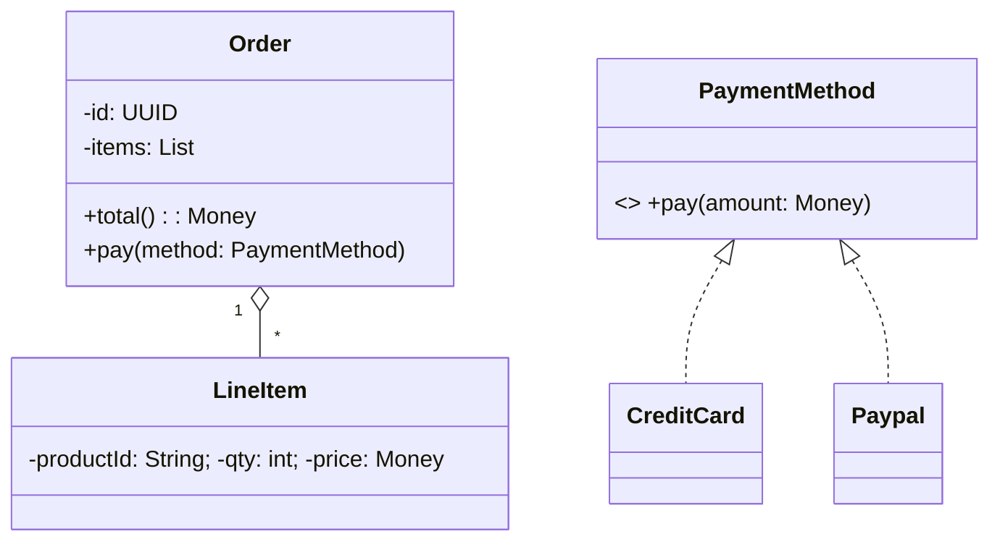
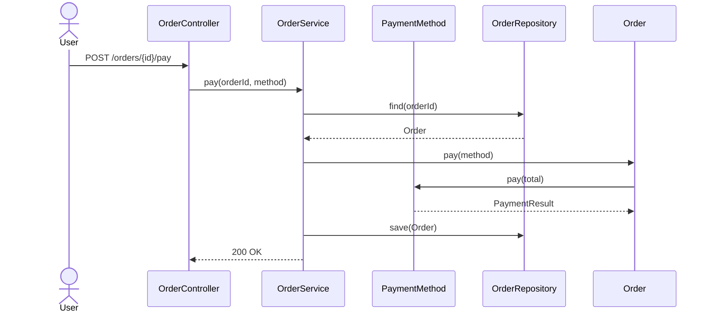
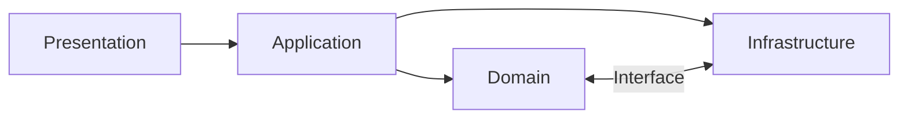

# 객체 지향 설계: 개념과 기초 이해

## 1. 객체 지향 프로그래밍(OOP)과 객체 지향 설계(OOD)의 차이

객체 지향 프로그래밍(OOP)과 객체 지향 설계(OOD)는 비슷한 용어처럼 보이지만, 서로 다른 **관점과 역할**을 갖습니다.

| 항목 | 객체 지향 프로그래밍 (OOP) | 객체 지향 설계 (OOD) |
|------|-----------------------------|------------------------|
| 목적 | 실제 프로그래밍 구현 | 구조적이고 논리적인 설계 |
| 초점 | 클래스, 메서드, 인스턴스의 구체적 구현 | 역할, 책임, 상호작용의 설계 |
| 관점 | **How**: 어떻게 구현할 것인가 | **What**: 무엇을 어떻게 설계할 것인가 |
| 산출물 | 코드 (Java, C#, C++, Python 등) | 설계 문서, 클래스/시퀀스 다이어그램, CRC 카드 |
| 예시 | `class UserService` 구현 | `UserService`는 `UserRepository`에 의존(관계/경계 정의) |

**요약**  
- **OOD**는 **설계 단계**에서 시스템을 구성할 **역할(Role)**, **책임(Responsibility)**, **협력(Collaboration)**을 정한다.  
- **OOP**는 **설계된 구조를 코드로 구현**하는 행위다.

---

## 2. 객체 지향 설계의 목적과 중요성

### 2.1 목적
1. **복잡도 관리**: 도메인을 작은 협력 단위로 분해해 인지 부하 감소  
2. **변경 내성**: 요구 변화 시 파급효과(impact)를 국소화  
3. **재사용성**: 응집도 높은 컴포넌트를 여러 컨텍스트에서 재사용  
4. **테스트 용이성**: 책임이 명확해 단위 테스트 자동화가 수월

### 2.2 왜 중요한가
- **비즈니스 변화 대응력**: 신기능 추가/수정 시 안전망(컴파일/테스트/계약) 확보  
- **협업 최적화**: 경계/계층/의존의 명시로 충돌과 중복을 줄임  
- **기술 부채 절감**: 초기 비용보다 **장기 유지보수 비용**을 크게 절감

**실무 예시**  
로그인을 `LoginController` 한 곳에 몰아넣는 대신 `AuthService`, `UserRepository`, `TokenProvider` 등으로 역할을 나누면, 인증 방식 교체(예: 세션→JWT)나 저장소 변경(예: RDB→NoSQL)의 파급 범위를 최소화할 수 있다.

---

## 3. 절차적 설계 vs 객체 지향 설계

### 3.1 절차적 설계 (Procedural Design)
- **데이터와 함수 분리**, 순차 흐름 중심
- 전역 데이터/구조체를 여러 함수가 공유하는 경향

```c
// 절차적 예시
void processOrder() {
    fetchOrder();
    calculateDiscount();
    printInvoice();
}
```

### 3.2 객체 지향 설계 (Object-Oriented Design)
- **데이터 + 동작을 함께 가진 객체**들의 협력
- **책임과 메시지** 중심, 캡슐화로 내부 정보 은닉

```java
// 객체 지향 예시
order.process(); // Order가 자신의 책임을 수행
```

| 비교 항목 | 절차적 설계 | 객체 지향 설계 |
|-----------|-------------|----------------|
| 구조 | 함수/절차 중심 | 객체/역할/책임 중심 |
| 재사용성 | 낮음 | 높음 |
| 유지보수 | 변경 파급이 큼 | 변경 영향이 국소적 |
| 상태 관리 | 전역/공유 상태 증가 | 캡슐화된 객체 상태 |
| 확장성 | 조건문/분기 증가 | 다형성/확장 포인트 명시 |

**핵심**: 절차적은 **무엇을 먼저 실행**에 집중, 객체 지향은 **누가 무엇을 책임**에 집중한다.

---

## 4. 객체 지향 설계의 4대 핵심 요소

### 4.1 캡슐화 (Encapsulation)
- 데이터와 연산을 묶고 내부를 숨겨 **불변식(invariant)**을 지킨다.

```java
public class BankAccount {
    private int balance;

    public void deposit(int amount) {
        if (amount <= 0) throw new IllegalArgumentException();
        balance += amount;
    }

    public int balance() { return balance; }
}
```

### 4.2 상속 (Inheritance)와 합성 (Composition)
- 상속은 재사용/확장에 유용하지만 **강결합/취약 기반 클래스 문제**를 유발할 수 있다.  
- **조합(Composition over Inheritance)**: 상속보다 **위임/합성**을 우선 고려한다.

```csharp
// 상속 대신 합성: 전략을 주입
public interface IDiscountPolicy { decimal Apply(decimal price); }

public sealed class Order
{
    private readonly IDiscountPolicy _discount;
    public Order(IDiscountPolicy discount) { _discount = discount; }
    public decimal FinalPrice(decimal price) => _discount.Apply(price);
}
```

### 4.3 다형성 (Polymorphism)
- 동일 메시지에 대해 객체 타입에 따라 다른 동작(동적 바인딩)

```java
List<Shape> shapes = List.of(new Circle(), new Square());
for (Shape s : shapes) s.draw(); // 각자 다른 방식으로 그린다
```

### 4.4 추상화 (Abstraction)
- 본질만 노출, 세부는 숨김(인터페이스/추상 클래스)

```java
interface PaymentMethod { void pay(int amount); }
class CreditCard implements PaymentMethod { public void pay(int amount){/*...*/} }
```

---

## 5. 설계 원칙 확장: SOLID, GRASP, LoD, TDA

### 5.1 SOLID

1) **SRP** (단일 책임 원칙)  
- 클래스는 **하나의 변경 이유**만 가져야 한다.

```typescript
// 나쁜 예: 출력 포맷/저장/검증을 모두 담당
class Invoice { /* data + render + save + validate ... */ }

// 좋은 예: 책임 분리
class Invoice { /* data + domain rules */ }
class InvoiceRenderer { /* rendering */ }
class InvoiceRepository { /* persistence */ }
```

2) **OCP** (개방-폐쇄 원칙)  
- 확장에는 열려, 수정에는 닫혀.

```java
// 새 결제수단 추가 시 기존 코드를 if/else 수정 없이 확장
interface PaymentMethod { void pay(int amount); }
class Paypal implements PaymentMethod { /*...*/ }
```

3) **LSP** (리스코프 치환 원칙)  
- 하위 타입은 상위 타입을 대체할 수 있어야 한다(계약 준수).

4) **ISP** (인터페이스 분리 원칙)  
- 클라이언트가 사용하지 않는 메서드에 의존하지 않게 **작은 인터페이스**로 분리.

5) **DIP** (의존 역전 원칙)  
- **추상에 의존**하고, 구체에 의존하지 말 것. DI 컨테이너로 구현체 주입.

```csharp
public interface IMessageBus { void Publish<T>(T evt); }
public class OrderService {
    private readonly IMessageBus _bus;
    public OrderService(IMessageBus bus) { _bus = bus; }
    public void Place(Order order){ /*...*/ _bus.Publish(new OrderPlaced(order.Id)); }
}
```

### 5.2 GRASP (General Responsibility Assignment Software Patterns)
- **정보 전문가**, **창조자**, **저장소**, **컨트롤러**, **낮은 결합도**, **높은 응집도**, **다형성**, **순응성(Protected Variations)** 등  
- 예: `Order` 금액 계산 책임은 **라인아이템을 알고 있는 Order(정보 전문가)**가 맡는다.

### 5.3 Law of Demeter (LoD, 디미터 법칙)
- “**오직 내 이웃에게만 말하라**(Tell only to your immediate friends)”: 체이닝으로 내부 구조 누출 금지.

```java
// 나쁜 예: 체이닝으로 내부 구조 유출
cart.getItems().get(0).getProduct().getPrice();

// 개선: 필요한 질의를 캡슐화
cart.firstItemPrice();
```

### 5.4 Tell, Don’t Ask (TDA)
- 데이터를 꺼내 계산하지 말고, **객체에 시켜라**(메시지 전송).

---

## 6. 요구사항 → 모델링 → 설계 절차

### 6.1 유스케이스와 시나리오
- **유스케이스**로 외부 행위/시나리오 정의 → **수행자(Actor)와 시스템** 간 상호작용 서술  
- 성공/실패 플로우, 전제조건/사후조건(계약) 명시

### 6.2 CRC 카드 (Class-Responsibility-Collaboration)
- 카드에 **클래스 이름**, **책임**, **협력자**를 적어 팀 토론에 활용

### 6.3 UML(필수 다이어그램)

**클래스 다이어그램(요약)**



**시퀀스 다이어그램(결제 흐름)**



### 6.4 계약에 의한 설계(Design by Contract)
- 전제조건, 사후조건, 불변식을 명시해 협력 **계약을 코드/테스트로 고정**

---

## 7. 대표 설계 패턴(요약 + 실전 코드)

> 각 패턴은 “**언제, 왜, 어떻게**”를 분명히 하되, **과용(오버엔지니어링)**을 경계한다.

### 7.1 생성(Creational)
- **Factory Method/Abstract Factory**: 생성 로직 캡슐화, 구현체 교체 용이  
- **Builder**: 복잡한 생성 과정 단계화/가독성  
- **Prototype**: 복제 기반 생성

```java
// Builder 예시
var order = OrderBuilder.newBuilder()
  .withItem("P001", 2)
  .withItem("P002", 1)
  .withDiscount(new SeasonalDiscount())
  .build();
```

### 7.2 구조(Structural)
- **Adapter**: 외부 API/레거시 인터페이스 적응
- **Facade**: 복잡 서브시스템에 대한 단순 인터페이스
- **Composite**: 계층 구조(파트-전체) 표현
- **Decorator**: 기능을 동적으로 덧입히기

```csharp
// Decorator: 결제에 감사(로깅) 기능을 합성
public class LoggingPayment : IPaymentMethod {
    private readonly IPaymentMethod _inner;
    public LoggingPayment(IPaymentMethod inner) => _inner = inner;
    public void Pay(decimal amount) { Console.WriteLine($"Pay {amount}"); _inner.Pay(amount); }
}
```

### 7.3 행위(Behavioral)
- **Strategy**: 알고리즘 교체(할인/요금 계산)
- **Template Method**: 공통골격 + 훅메서드로 변동지점 정의
- **Observer**: 이벤트 통지(도메인 이벤트)
- **Command**: 요청 캡슐화/재시도/큐잉
- **State**: 상태에 따른 행위 변경
- **Mediator**: 다대다 상호작용 조정
- **Visitor**: 구조는 고정, 연산을 추가

```typescript
// Strategy: 할인 정책 교체
interface Discount { apply(price: number): number; }
class NoDiscount implements Discount { apply(p: number){ return p; } }
class RateDiscount implements Discount { constructor(private rate: number){} apply(p: number){ return p*(1-this.rate);} }

class Cart {
  constructor(private discount: Discount) {}
  finalPrice(base: number){ return this.discount.apply(base); }
}
```

---

## 8. 예제 설계: “주문/결제/배송” 작은 도메인

### 8.1 요구 요약
- 고객은 장바구니로 주문을 생성한다.  
- 결제 수단(카드/페이팔/포인트)은 **교체 가능**해야 한다.  
- 결제 성공 시 배송 준비로 상태 전이.

### 8.2 핵심 설계 포인트
- **DIP**: `OrderService`는 `PaymentMethod` 추상에 의존  
- **TDA/LoD**: `Order.total()`은 내부가 계산, 외부는 묻지 말고 시킨다  
- **도메인 이벤트**: `OrderPaid` 발행 → 배송 준비/이메일 발송 decouple

```csharp
// C# 도메인 스케치
public readonly record struct Money(decimal Amount);

public interface IPaymentMethod {
    PaymentResult Pay(Money amount);
}

public sealed class Order {
    private readonly List<LineItem> _items = new();
    public Guid Id { get; } = Guid.NewGuid();
    public Money Total() => new(_items.Sum(i => i.Subtotal().Amount));

    public PaymentResult Pay(IPaymentMethod method) {
        var result = method.Pay(Total());
        if (result.Success) Apply(new OrderPaid(Id, Total()));
        return result;
    }
    private void Apply(object @event) { /* raise domain event */ }
}

public sealed class OrderService {
    private readonly IOrderRepository _repo;
    private readonly IPaymentMethod _method;
    public OrderService(IOrderRepository repo, IPaymentMethod method){ _repo = repo; _method = method; }
    public void Pay(Guid orderId){
        var order = _repo.Find(orderId) ?? throw new InvalidOperationException();
        var result = order.Pay(_method);
        if (result.Success) _repo.Save(order);
    }
}
```

```java
// Java: 결제 수단 구현 교체
class CreditCard implements PaymentMethod {
    public void pay(int amount){ /* PG 연동 */ }
}
class Paypal implements PaymentMethod {
    public void pay(int amount){ /* REST API 호출 */ }
}
```

**시퀀스(요약)**: Controller → Service → Repository(Load) → Order.pay(메시지) → PaymentMethod.pay → Repository(Save)

---

## 9. 테스트 전략과 예시

### 9.1 테스트 피라미드
- **단위(Unit)** > **서비스(통합)** > **엔드투엔드(E2E)** 비중  
- 도메인 규칙은 **순수 단위 테스트**로 빠르게 보호

### 9.2 TDD 사이클
- **Red → Green → Refactor**, 실패하는 테스트부터

```csharp
// xUnit: Order 총액 계산
[Fact]
public void total_is_sum_of_line_items() {
    var order = new Order();
    order.Add("P001", 2, new Money(100));
    order.Add("P002", 1, new Money(50));
    Assert.Equal(new Money(250), order.Total());
}
```

### 9.3 Test Double
- Stub/Fake/Mock 구분, 외부 자원(PG, Mail, MQ)은 **포트/어댑터**로 격리

---

## 10. 설계 품질 지표(개념과 계산)

- **결합도(Coupling)**: 모듈 간 의존 정도(낮을수록 좋음)  
- **응집도(Cohesion)**: 모듈 내부 책임의 관련성(높을수록 좋음)  
- **복잡도(Complexity)**: 분기 수(순환 복잡도) 등

대표 수식(개념적 이해를 위한 표기):

- **불안정성(Instability)**:  
  $$ I = \frac{C_e}{C_a + C_e} $$
  - \(C_a\): Afferent Coupling(타 모듈이 **나를** 의존)  
  - \(C_e\): Efferent Coupling(내가 **타 모듈을** 의존)  
  - \(I \in [0,1]\); 1에 가까울수록 변동에 취약(불안정)

- **추상화도(Abstractness)**:  
  $$ A = \frac{\text{추상 타입 수}}{\text{전체 타입 수}} $$

- **거리(Distance from Main Sequence)**:  
  $$ D = \lvert A + I - 1 \rvert $$

지표는 **절대치가 아니라 경향/비교**로 활용한다.

---

## 11. 동시성, 불변성, 사이드이펙트 제어

- **불변(Immutable) Value Object**: 동시 접근에서 안전  
- **순수 함수(부작용 최소)**와 **명령/이벤트 분리**  
- **액터/메시지 큐**: 공유 상태 대신 메시지로 협력

```csharp
public readonly record struct Money(decimal Amount); // 불변 값 객체
```

---

## 12. 리팩토링 가이드: 냄새 → 수술

| 코드 스멜 | 증상 | 리팩토링 |
|-----------|------|----------|
| 거대 클래스(God) | 책임 과다, 수백/천 라인 | 클래스 추출, 모듈 경계 재설정 |
| 긴 메서드 | 가독성/재사용 저하 | 메서드 추출, 단계 쪼개기 |
| 분기 과다 | if/else/switch 폭증 | 다형성(Strategy/State/Visitor) |
| 데이터 뭉치 | 파라미터/필드 묶음 반복 | Value Object 도입 |
| 외부 질의(Feature Envy) | 다른 객체 데이터 집착 | 책임 이동, Tell-Don’t-Ask |

**예: 조건문 → 다형성**

```java
// Before
int fee(Ticket t){
  if(t.type()==VIP) return 100;
  if(t.type()==REGULAR) return 50;
  if(t.type()==STUDENT) return 30;
  throw new IllegalArgumentException();
}

// After: 전략
interface FeePolicy { int fee(Ticket t); }
class VipFee implements FeePolicy { public int fee(Ticket t){ return 100; } }
class RegularFee implements FeePolicy { public int fee(Ticket t){ return 50; } }
class StudentFee implements FeePolicy { public int fee(Ticket t){ return 30; } }
```

---

## 13. 아키텍처 맥락: 설계가 놓일 자리

### 13.1 계층형(Layered)
- Presentation / Application / Domain / Infrastructure  
- **DIP**: 상위(도메인/애플리케이션)는 인터페이스에 의존, 구현은 Infra



### 13.2 헥사고날(포트/어댑터), 클린 아키텍처
- **핵심 도메인**을 외부로부터 격리(포트로 의사소통)
- 테스트가 쉬운 경계, 구현 교체 용이

---

## 14. 안티패턴과 흔한 실수

- **상속 남용**: 합성으로 충분한데 상속부터 적용  
- **빈약한 도메인 모델(Anemic)**: 도메인 규칙이 서비스에만 존재 → **객체에 행위를 담아라**  
- **싱글톤 전염**: 전역 상태/숨은 의존 증가 → DI/라이프사이클로 대체  
- **과설계/금도금(YAGNI 위반)**: 필요 이상 추상화/레이어 남발  
- **마이크로서비스 조기 분리**: 팀/도메인 성숙 전 분리는 복잡성 폭증 → **모듈/컨텍스트부터**

---

## 15. 실무 체크리스트 (요약)

- **클래스/모듈**
  - 하나의 책임인가? 변경 이유가 둘 이상은 아닌가(SRP)?
  - 외부로 노출하는 것은 **역할(인터페이스)**인가, **구현**인가?
  - 다른 모듈에 대한 지식이 과도하지 않은가(LoD)?
- **협력**
  - 메시지 중심인가(TDA)? 내부 상태를 노출하지 않는가?
  - 다형성 확장 포인트가 준비돼 있는가(OCP)?
- **품질**
  - 단위 테스트가 빠르고 결정적인가?
  - 결합도/응집도/복잡도 지표가 악화되지 않는가?
- **아키텍처**
  - DIP 준수? 경계(포트/어댑터)로 외부를 격리했는가?
  - 운영/배포/관측(로그/트레이싱)까지 설계에 반영했는가?

---

## 16. 마무리

객체 지향 설계는 **클래스 개수**나 **다이어그램 화려함**이 아니다.  
핵심은 **역할·책임·협력**을 명확히 하고, **변경에 안전**하며, **테스트 가능한 구조**를 세우는 일이다.  
이 글의 원칙(SOLID/GRASP/LoD/TDA), 절차(유스케이스→CRC→UML), 패턴·아키텍처, 품질 지표, 리팩토링 레시피를 **필요할 때 적절히** 적용하라. 그러면 시스템은 **명확하고, 단단하며, 유연해**진다.

---

## 부록 A. 간단 코드 모음

### A.1 의존 역전과 DI 컨테이너(.NET)

```csharp
builder.Services.AddScoped<IMessageBus, KafkaBus>();
builder.Services.AddScoped<IPaymentMethod, CreditCardPayment>();
builder.Services.AddScoped<OrderService>();
```

### A.2 도메인 이벤트 퍼블리시(간략)

```csharp
public interface IEventPublisher { void Publish(object evt); }
public class Order {
  private readonly IEventPublisher _pub;
  public Order(IEventPublisher pub){ _pub = pub; }
  public void Pay(IPaymentMethod method){
     var result = method.Pay(Total());
     if(result.Success) _pub.Publish(new OrderPaid(Id, Total()));
  }
}
```

### A.3 계약에 의한 설계(사전/사후/불변식)

```java
class Quantity {
  private final int value;
  public Quantity(int v){
    if(v <= 0) throw new IllegalArgumentException("positive only"); // 전제
    this.value = v;
  }
  public Quantity add(Quantity other){
    int sum = this.value + other.value;
    if(sum <= 0) throw new IllegalStateException(); // 사후/불변 위반 방지
    return new Quantity(sum);
  }
}
```