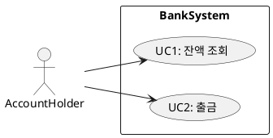
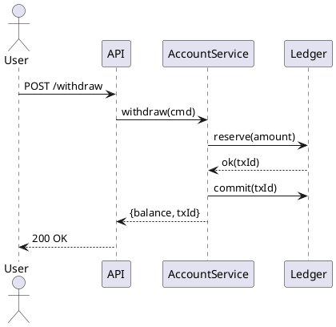
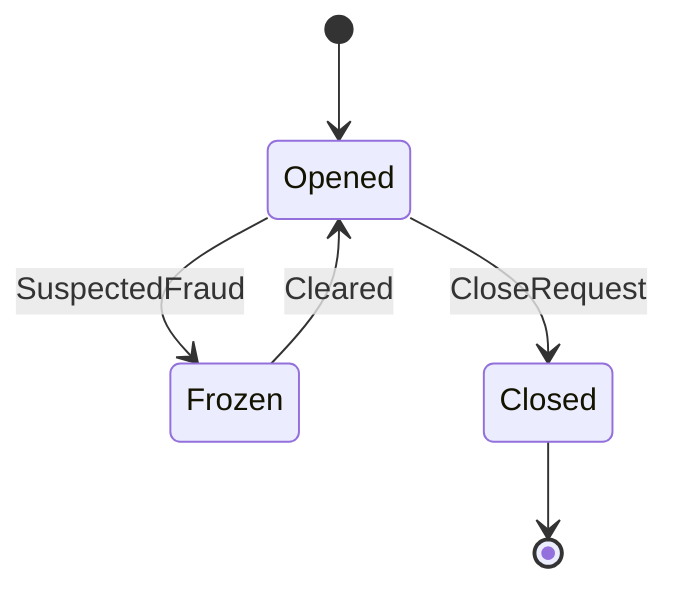

# 요구사항 분석(Requirements Analysis)

## 0. 빠른 길잡이 (What / Why / How)

- **What**: 요구사항 분석은 이해관계자의 **필요/기대**를 **검증 가능하고 추적 가능한 사양**으로 바꾸는 일련의 활동.
- **Why**: 설계·구현·테스트 비용 급등과 실패를 **초기에** 방지. 변경을 예측 가능한 범위로 통제.
- **How**: **수집→분석/모델링→명세→검증→관리**의 사이클을 반복하며, **정량화된 수용 기준**, **추적성(RTM)**, **우선순위(WSJF/RICE/MoSCoW)**, **프로토타입/BDD**로 품질을 담보.

---

## 1. 정의와 범위

**요구사항 분석**은 이해관계자(Stakeholders)로부터 **요구 수집(Elicitation)** → **분석/모델링** → **명세(Specification)** → **검증(Validation)** → **변경관리/추적성(Management)**의 라이프사이클을 통해 **무엇이 성공인지**를 분명하게 만든다.
단순한 기능 나열이 아닌, **불명확한 기대를 검증 가능한 문장/모델**로 **구조화**하는 활동이다.

---

## 2. 요구사항 분류(정교화)

| 분류 | 설명 | 예시 |
|---|---|---|
| 기능적 요구(Functional) | 시스템이 **무엇을 한다** | “사용자는 계좌에서 출금할 수 있어야 한다.” |
| 비기능적 요구(NFR/품질속성) | **어떻게 잘한다**(성능/보안/가용성/확장성/유지보수성 등) | “출금 응답 p95 ≤ 2초.” |
| 비즈니스 요구(Business) | 성과/KPI/규정/정책 | “월간 활성사용자 20%↑” |
| 제약/도메인 규칙(Constraints/BR) | 규제/스택/상호운용/용어 | “결제는 PCI DSS 준수.” |
| 이해관계자 요구(Stakeholder) | 각 역할별 필요 | 고객·운영·보안·감사·규제기관 등 |

**보강 항목**: 가정(Assumptions), 범위 내/외(Scopes), 위험(Risks), 개방 이슈(Open Questions).

---

## 3. 라이프사이클 요약(활동 단계)

1. **요구 수집(Elicitation)**: 인터뷰/워크숍/JAD/관찰/로그/벤치마킹/프로토타이핑/스토리 맵핑/이벤트 스토밍.
2. **분석 & 모델링**: 모호성 제거, 충돌/중복 해소, 용어사전, 우선순위, **UML·BPMN·시퀀스·상태·ERD** 작성.
3. **명세(Specification)**: SRS·유스케이스·유저스토리+AC·API 스펙·도메인 규칙 문서화.
4. **검증(Validation)**: 리뷰/워크스루, **프로토타입 검증**, **BDD(Gherkin)**, 수용 테스트.
5. **관리(Management)**: 변경요청/승인, **RTM**, 버전/이력, 영향분석, 베이스라인.

---

## 4. 요구 수집 기법 — 절차와 산출물

### 4.1 인터뷰(1:1 심층)
- **준비**: 페르소나, 문제/목표, 과거 사용 패턴, 금기(보안/규제) 체크리스트.
- **질문 프레임**: 현재 흐름→문제→이상적 흐름→성공 기준→제약→데이터/로그 위치.
- **산출**: 요약 메모, 인용구, **As-Is/To-Be** 개요, 열린 이슈 목록.

```text
Interview Script (요약)
- 현재 업무 흐름(시작/끝/핸드오프/예외)은?
- 가장 느린 지점과 실패 사례는?
- 성공을 수치로 정의한다면?(p95, 오류율, 처리량 등)
- 보안/규제상 하면 안 되는 것은?
```

### 4.2 워크숍/JAD
- 다부서(기획/개발/보안/운영/법무) 동시 참여로 **용어/정책 합의**.
- **룰**: 화이트보드에 **행위자-행위** 매핑, 분쟁은 **의사결정 기록(ADR)** 남김.

### 4.3 관찰(Shadowing)
- 실제 업무 현장을 그림처럼 기록(클릭/입력/대기/복수 시스템 전환).
- **숨겨진 요구**(단축키·비공식 엑셀) 발견에 유용.

### 4.4 프로토타이핑
- Lo-fi(와이어프레임) → Hi-fi(인터랙티브) 단계적.
- **목표**: **용어/흐름/데이터** 일치와 **수용 기준** 합의. (구현 방향 강박 금지)

### 4.5 스토리 맵핑 / 이벤트 스토밍
- **스토리 맵핑**: Backbone(그림, 결제, 배송)→세로 슬라이스(MVP) 결정.
- **이벤트 스토밍**: 도메인 이벤트 탐색→명령/리드모델/정책/애그리거트 식별.

---

## 5. 모델링과 산출물 — 예시 중심

### 5.1 유스케이스(Use Case)


**UC2: 출금**(요약)
- 기본 흐름: 인증→금액 입력→검증(잔액/한도)→원자적 차감→영수증 발급
- 대체 흐름: 잔액 부족→거부(사유 코드), 네트워크 오류→재시도/보류

### 5.2 시퀀스 다이어그램


### 5.3 상태도(State)


### 5.4 데이터 모델(ERD 개요)
```sql
-- 핵심 테이블
CREATE TABLE account (
  id BIGINT PRIMARY KEY,
  owner_id BIGINT NOT NULL,
  currency CHAR(3) NOT NULL,
  status VARCHAR(16) NOT NULL, -- Opened/Frozen/Closed
  balance_cents BIGINT NOT NULL DEFAULT 0,
  version BIGINT NOT NULL DEFAULT 0  -- 낙관적 동시성
);

CREATE TABLE ledger_entry (
  id BIGINT PRIMARY KEY,
  account_id BIGINT NOT NULL,
  type VARCHAR(16) NOT NULL,   -- DEBIT/CREDIT
  amount_cents BIGINT NOT NULL,
  tx_id VARCHAR(64) NOT NULL UNIQUE,
  created_at TIMESTAMP NOT NULL
);
```

---

## 6. 명세 품질(작성 원칙) — SMART/Atomic/검증 가능성

### 6.1 좋은 요구 문장 — 변환 규칙
- **모호어 금지**: “빠르게” → “p95 ≤ 2초”
- **원자화**: “로그인하고 잔액 조회” → **각각 분리**
- **검증가능**: 수용 기준(AC) 필수
- **비설계화**: “버튼 A가 ServiceX 호출” → **UI/구현 언급 금지**

### 6.2 나쁜 → 좋은 예
```text
[나쁜] “사용자가 빠르게 출금할 수 있어야 한다.”
[좋은] “정상 조건에서 출금 API의 p95 응답시간은 2초 이내여야 한다.”
```

### 6.3 BDD(Gherkin)로 AC 구체화
```gherkin
Feature: Withdrawal
  Scenario: Sufficient balance
    Given account "A-1" with balance 100_000 KRW
    When the owner withdraws 30_000 KRW
    Then the response code is 200
    And the remaining balance is 70_000 KRW
    And a transaction id is returned

  Scenario: Insufficient funds
    Given account "A-1" with balance 10_000 KRW
    When the owner withdraws 30_000 KRW
    Then the response code is 400
    And the error code is "INSUFFICIENT_FUNDS"
```

---

## 7. 우선순위 기법 — MoSCoW / Kano / RICE / WSJF

### 7.1 MoSCoW
- **Must/Should/Could/Won’t**. MVP 선정에 적합.
- **가이드**: Must는 **법/안전/핵심 가치 흐름**만.

### 7.2 Kano(기본/성능/매력)
- 기본 결함은 불만 급등, 성능요소는 만족 선형 증가, 매력요소는 차별화.

### 7.3 RICE(정량 우선순위)
$$
\text{RICE} = \frac{\text{Reach} \times \text{Impact} \times \text{Confidence}}{\text{Effort}}
$$
- 예: Reach(월 5만)·Impact(3)·Conf(0.7)·Effort(10MD) → RICE = \( \frac{50000 \times 3 \times 0.7}{10} \)

### 7.4 WSJF(가중 최단작업 우선)
$$
\text{WSJF} = \frac{\text{Cost of Delay}}{\text{Job Size}}
$$
- Cost of Delay = 사용자/비즈니스 가치 + 시간 민감도 + 리스크 감소/기회 증대

---

## 8. 검증(Validation)·확인(Verification)

- **리뷰/워크스루**: 역할별 검토 체크리스트.
- **프로토타입 평가**: 태스크 성공률/시간/오류율.
- **AC ↔ 테스트 케이스**: 자동화 가능성 최대화.
- **계약 테스트(경계)**: 외부 API 스펙 준수여부를 제공자/소비자 양측에서 검증.

```yaml
# 간단한 테스트 케이스 매핑 예(요구 ID → TC)
REQ-F-002:
  - TC-WITHDRAW-001: 정상 출금
  - TC-WITHDRAW-002: 잔액 부족
  - TC-WITHDRAW-003: 동시성 충돌(낙관적 잠금)
```

---

## 9. 변경관리와 추적성(RTM)

### 9.1 요구사항 추적성 매트릭스(샘플)
| 요구 ID | 설계/모델 | 구현 아티팩트 | 테스트 케이스 | 상태 |
|---|---|---|---|---|
| REQ-F-001 | UC1, API-GET /balance | `AccountController#get` | TC-BAL-001/002 | Passed |
| REQ-F-002 | UC2, Seq#withdraw | `AccountService#withdraw` | TC-WITHDRAW-001~003 | Passed |
| REQ-NF-001 | NFR Profile | k6/perf test script | PERF-P95-001 | In Prog |

### 9.2 변경요청/영향분석(간략 폼)
```text
CR-2025-11-001
- Title: 출금 한도 상향(일 100만원→150만원)
- Why: 고객 불만/경쟁사 대비
- Impact: API 요청 검증, 한도 정책, 문서/테스트
- Risk: 사기 위험 소폭↑ → AML 룰 조정 필요
- Decision: 승인(보안 조건 하) / 릴리즈 25.11.W47
```

---

## 10. 도구 활용 전략(일반 가이드)

- **이슈/요구 관리**: Jira/Azure Boards(필드: Type, Priority, AC, Links)
- **문서**: Confluence/Docs(버전/개방이슈/ADR)
- **모델링**: PlantUML/Draw.io/Lucidchart
- **테스트**: Cucumber/SpecFlow/REST-Assured/k6/JMeter
- **추적성**: 요구-ID를 **브랜치/커밋/PR/테스트 리포트**에 삽입

---

## 11. 실전 예제 — 은행 계좌(확장판)

### 11.1 사용자 스토리 & AC(확장)
```
US-001 잔액 조회
AC:
- 권한: 계좌 소유자만 가능(401/403 처리).
- 응답: {accountId, ownerName, currency, availableBalance, lastUpdatedAt}.
- 성능: p95 ≤ 1초(평상시), p99 ≤ 2초(피크 30분/일).
```

```
US-002 출금
AC:
- 금액 > 0 정수(통화 최소단위).
- 부족액이면 400 + code=INSUFFICIENT_FUNDS.
- 동시성: 동일 계좌에 대해 **낙관적 잠금(version)**으로 원자적 처리.
- 감사: ledger_entry 기록, tx_id 유일.
- 성능: p95 ≤ 2초, 오류율 ≤ 0.1%/일.
```

### 11.2 API 스펙 초안
```http
GET /api/accounts/{id}/balance
200 OK
{
  "accountId": "A-1",
  "ownerName": "홍길동",
  "currency": "KRW",
  "availableBalance": 120000,
  "lastUpdatedAt": "2025-11-11T06:00:00Z"
}
```

```http
POST /api/accounts/{id}/withdraw
Content-Type: application/json
{
  "amount": 30000,
  "currency": "KRW",
  "requestId": "UUID"  // 멱등 처리
}
```

```http
409 Conflict
{
  "error": "VERSION_CONFLICT",
  "message": "Concurrent update detected"
}
```

### 11.3 도메인 규칙(발췌)
- R1: **잔액 ≥ 0** 불변식. 결과가 음수면 트랜잭션 전체 롤백.
- R2: 상태 Closed/Frozen 시 모든 거래 거부.
- R3: 통화는 계좌 통화와 일치(교차통화 미지원).

### 11.4 동시성/멱등(설계 스니펫)
```java
// 낙관적 동시성: version 체크
public Balance withdraw(AccountId id, Money amt, long expectedVersion){
  Account a = repo.find(id);
  if (a.version() != expectedVersion) throw new VersionConflict();
  a.debit(amt); // 불변식 내부 검증
  repo.save(a.withVersion(expectedVersion+1));
  ledger.append(Debit.of(id, amt));
  return a.balance();
}
```

### 11.5 성능 NFR 검증(예시 k6)
```javascript
import http from 'k6/http';
import { sleep, check } from 'k6';

export let options = { vus: 50, duration: '2m', thresholds: {
  http_req_duration: ['p(95)<2000']
}};

export default function () {
  let res = http.post('https://bank/api/accounts/A-1/withdraw',
    JSON.stringify({ amount: 1000, currency: 'KRW', requestId: __ITER.toString() }),
    { headers: { 'Content-Type': 'application/json' }});
  check(res, { 'status 200 or 400': r => r.status===200 || r.status===400 });
  sleep(0.2);
}
```

---

## 12. 위험/안티패턴 — 방지하기

| 유형 | 증상 | 결과 | 처방 |
|---|---|---|---|
| 스코프 크리프 | “이왕이면 이것도” 누적 | 일정/품질 붕괴 | **우선순위 체계**·변경승인 필수 |
| 모호 문구 | 빠르게/쉽게/안정적으로 | 테스트 불가 | 수치화, AC/BDD |
| 설계 침투 | 요구서에 기술/구현 강제 | 아키텍처 고착 | “무엇”만 기술, ADR로 “어떻게” 분리 |
| 모든 것 Must | 현실 불가 | 갈등·지연 | MoSCoW·WSJF로 재조정 |
| 이해관계자 누락 | 운영/보안/감사 빠짐 | 재작업 | RACI로 책임 명확화 |

---

## 13. 거버넌스 — ADR·RACI·개방 이슈

### 13.1 ADR(Architecture Decision Record) 예
```text
ADR-0007: 동시성 전략으로 '낙관적 잠금' 채택
Context: 동시 출금 빈도 낮음, 수평 확장 필요
Decision: version 필드 기반 OCC + 멱등 requestId
Consequences: 충돌시 409, 클라이언트 재시도 필요
```

### 13.2 RACI(책임 구분)
- **Responsible**: BA/PO(요구), Dev(모델/스펙), QA(AC→TC)
- **Accountable**: PO
- **Consulted**: 보안/법무/운영
- **Informed**: 마케팅/CS

---

## 14. 체크리스트(실무 리뷰용)

- [ ] 각 요구는 **ID/우선순위/AC**를 갖는가?
- [ ] **원자적**이며 모호어가 없는가?
- [ ] **테스트/측정** 가능 수치가 있는가?
- [ ] **NFR**이 시나리오로 정의되었는가?(자극/환경/응답/측정)
- [ ] **RTM** 연결(요구→설계→코드→테스트)이 있는가?
- [ ] **변경관리/영향분석/승인** 흐름이 동작하는가?
- [ ] **오픈 이슈/가정/위험**이 기록되고 만료되는가?

---

## 15. 템플릿 모음(복사-붙여넣기용)

### 15.1 SRS 스켈레톤
```text
1. 서론(목적/범위/용어)
2. 전반적 설명(컨텍스트/사용자/제약)
3. 기능 요구(REQ-F-xxx: 설명/우선순위/AC)
4. 비기능 요구(REQ-NF-xxx: 시나리오/측정)
5. 외부 인터페이스(API/DB/UI)
6. 추적성 매트릭스(RTM)
7. 변경이력/승인
```

### 15.2 NFR 시나리오 템플릿
```text
[성능] 자극: 동시 200 rps, 데이터: 평균 1KB
환경: 정상 피크 30분/일
응답: p95 ≤ 2초, 오류율 ≤ 0.1%
검증: k6 시나리오 PERF-P95-001
```

### 15.3 유저 스토리 + AC
```text
US-XXX: <역할>로서, <가치>를 위해 <행위>를 하고 싶다.
AC:
- 조건/행위/결과의 Given-When-Then
- 오류/예외/경계 케이스 포함
```

### 15.4 RTM CSV 스켈레톤
```csv
ReqId,Title,DesignRefs,CodeRefs,TestRefs,Status
REQ-F-001,Balance API,UC1;SEQ#BAL,AccountController#get,TC-BAL-001;002,Passed
```

### 15.5 변경요청(CR) 폼
```text
CR Id/Date/Requester/Title/Why
Scope/Impact(모듈·테스트·일정)/Risk/Decision/Release
```

---

## 16. 수식/지표 요약

$$
\text{RICE}=\frac{R \cdot I \cdot C}{E},\quad
\text{WSJF}=\frac{\text{Cost of Delay}}{\text{Job Size}}
$$

- 정량화로 **우선순위 논쟁**을 **데이터 기반**으로 전환.

---

## 17. 마무리

- 요구사항 분석은 **프로젝트 성공의 기초 체력**이다.
- **명확·검증·추적** 가능한 요구만이 설계/구현/테스트 비용을 줄이고, 변경을 통제한다.
- 실무에서는 **프로토타입과 BDD**, **우선순위 프레임워크(WSJF/RICE/MoSCoW)**, **RTM**을 일상화해 **지속적 합의**를 유지하라.
- 최종 목표는 “**올바른 것을 올바르게**” 만드는 것이다. 이 문서의 템플릿·다이어그램·코드 스니펫을 복제하여 **팀 표준**으로 즉시 적용하라.
