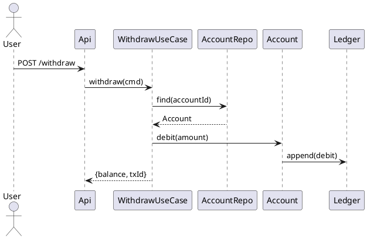

# 책임 분배(Responsibility Assignment)

## 책임 분배란 무엇인가?

**책임 분배(Responsibility Assignment)**는 요구사항(기능/비기능)을 **역할(Role)과 책임(Responsibility)**으로 쪼개어 **가장 적합한 클래스/객체**에 배정하고, 그들이 **메시지/인터페이스**로 협력하게 설계하는 활동이다.

- **책임**:
  - *행동적 책임(Doing)* — 연산 수행, 의사결정, 다른 객체에 메시지 전송
  - *정보적 책임(Knowing)* — 데이터/상태 보유, 규칙/파생 값 계산
- **목표**: 높은 **응집도**, 낮은 **결합도**, 뚜렷한 **경계/협력**, **변경 용이성**.

---

## 책임의 두 가지 유형과 매핑 요령

| 책임 유형 | 설명 | 흔한 사례 | 배정 힌트 |
|---|---|---|---|
| 행동(Doing) | 계산, 명령 처리, 워크플로 제어 | 결제 승인, 주문 상태 전이, 알림 발송 | **Controller/Service/Entity** 중 어디가 규칙을 가장 **잘 안다**? |
| 정보(Knowing) | 상태 보유, 도메인 규칙, 파생 값 | 잔액, 재고, 할인율, 유효기간 | **Information Expert**에게 부여(가장 많은 정보 보유자) |

> **원칙**: 가능한 한 **정보에 가장 가까운 곳**(엔티티/밸류)에 규칙을 둔다. 오케스트레이션은 상위 계층이 맡되, **도메인 규칙은 도메인으로**.

---

## GRASP 9원칙으로 책임을 기계적으로 배분하기

| GRASP | 핵심 질문 | 적용 힌트 |
|---|---|---|
| Information Expert | 누가 이 일을 **가장 잘 아는가?** | 데이터/규칙을 보유한 객체에 책임 부여 |
| Creator | 누가 무엇을 **생성**해야 하나? | A가 B를 포함/기록/자주 사용하면 A가 B 생성 |
| Controller | 누가 **시스템 이벤트**를 받는가? | UI 뒤의 애플리케이션 **조정자**(UseCase/App Service) |
| Low Coupling | **의존 최소화**? | 인터페이스 의존, DI, 팩토리/어댑터 |
| High Cohesion | **한 가지 일**에 집중? | 클래스는 작고 선명한 목적 |
| Polymorphism | **타입별 변이**는? | 전략/상태/가상 메서드 |
| Pure Fabrication | 규칙을 어디 둘지 애매? | 인위적 서비스/리포지터리로 분리 |
| Indirection | **중재자**가 필요한가? | 포트/어댑터, 파사드, 이벤트 버스 |
| Protected Variations | **변하는 축**은? | 인터페이스/추상화로 감싸기 |

---

## 절차: 요구 → 책임 → 협력으로 구체화

1. **시스템 이벤트 도출**: 유스케이스 기본/대체 흐름의 외부 입력(클릭, API 호출).
2. **Controller 할당**: 화면이 아닌 **UseCase/Application Service**에 이벤트 위임.
3. **정보 전문가에게 규칙 배분**: 금액 검증/잔액 계산은 **Account/Order** 등 엔티티에.
4. **Creator 적용**: `Order`가 `OrderLine`을 만든다(포함·기록 관계).
5. **변이 처리는 폴리모피즘**: `PaymentMethod`(카드/간편결제) 전략으로 캡슐화.
6. **저수준 외부 연동은 Indirection**: `PaymentGateway` 포트 + 어댑터.
7. **Low Coupling/High Cohesion 점검**: 책임이 새고 있으면 Pure Fabrication 도입.
8. **계약 정의(Pre/Post/불변식)**: 검증 가능하게 AC/테스트 연결.

---

## CRC 카드와 책임 목록화(간단 예시)

**도서 주문** 시나리오 일부:

```
+-------------------+
| Order             |
+-------------------+
| - addLine(item,q) |
| - total()         |
| - place()         |
| - applyDiscount() |
+-------------------+
| C: OrderLine,     |
|    PricingPolicy, |
|    PaymentMethod  |
+-------------------+
```

```
+---------------------+
| PaymentProcessor    |
+---------------------+
| - authorize(order)  |
| - capture(order)    |
+---------------------+
| C: PaymentGateway   |
+---------------------+
```

- **책임**은 동사구로, **협력자**는 명시적 클래스명으로 적는다.
- 카드 수준에서 이미 **누가 누구에게 메시지**를 보내는지 그림이 보인다.

---

## 유스케이스·시퀀스로 협력 확인

### 유스케이스 개요(‘출금’ 예)

- 기본 흐름: 인증 → 금액 입력 → **Account.debit(…)** → Ledger 기록 → 영수증
- 대체 흐름: 잔액 부족, 동시성 충돌, 네트워크 오류

### 시퀀스 다이어그램(PlantUML)



**포인트**: 비즈니스 규칙은 `Account.debit` 내부로 **캡슐화**, 유스케이스는 **오케스트레이션**만.

---

## 도메인 코드 스켈레톤(자바)

### 엔티티와 규칙(Information Expert)

```java
public final class Money {
    private final String currency;
    private final long cents;
    // equals/hashCode/plus/minus/compare...
}

public class Account {
    private final String id;
    private final String ownerId;
    private String status; // Opened/Frozen/Closed
    private Money balance;
    private long version; // OCC

    public void debit(Money amount) {
        requireOpened();
        require(amount);
        if (balance.compareTo(amount) < 0)
            throw new InsufficientFunds();
        this.balance = balance.minus(amount);
    }

    private void requireOpened() {
        if (!"Opened".equals(status)) throw new IllegalStateException("Not opened");
    }
    private static void require(Money m) { if (m == null || m.getCents() <= 0) throw new IllegalArgumentException(); }
}
```

### 유스케이스(Controller)와 Indirection

```java
public interface PaymentGateway {
    AuthResult authorize(String orderId, Money amount, PaymentToken token);
    void capture(String authId);
}

public class WithdrawUseCase {
    private final AccountRepository accounts;
    private final Ledger ledger;

    public WithdrawUseCase(AccountRepository accounts, Ledger ledger) {
        this.accounts = accounts; this.ledger = ledger;
    }

    public WithdrawResult handle(WithdrawCommand cmd) {
        var a = accounts.find(cmd.accountId());
        var before = a.getVersion();
        a.debit(cmd.amount());
        accounts.save(a, before); // OCC -> 409 on conflict
        var txId = ledger.appendDebit(a.getId(), cmd.amount());
        return new WithdrawResult(a.getBalance(), txId);
    }
}
```

### 변이 보호(Protected Variations) — 결제 전략

```java
public interface PaymentMethod {
    Receipt pay(Order order);
}

public final class CardPayment implements PaymentMethod {
    private final PaymentGateway gateway;
    public CardPayment(PaymentGateway gateway){ this.gateway=gateway; }
    public Receipt pay(Order order){
        var auth = gateway.authorize(order.id(), order.total(), order.token());
        gateway.capture(auth.id());
        return Receipt.success(order.id(), auth.id());
    }
}
```

---

## 책임 경계: 레이어드·DDD 관점

| 레이어 | 책임 | 안티패턴 | 교정 |
|---|---|---|---|
| Presentation/API | 입력 검증, 인증·인가 위임, 유스케이스 호출 | 화면 객체에 비즈니스 규칙 | 규칙은 **도메인**으로 이동 |
| Application/UseCase | 워크플로, 트랜잭션 경계, 이벤트 발행 | 거대한 서비스(God Service) | 규칙은 **엔티티/도메인 서비스**로 |
| Domain | 규칙/불변식, 계산, 정책 | **빈약한 도메인 모델** | 규칙을 엔티티 메서드로 승격 |
| Infrastructure | 영속/메시지/외부 연동 | 도메인 의존 누수 | **포트/어댑터**로 간접화 |

---

## 비기능 책임의 분배(보안·멱등·트랜잭션)

- **보안**: 인증/인가 미들웨어(필터) + 도메인 수준의 권한 확인(중요 규칙 중복 방지).
- **멱등성**: `requestId`를 Application에, 중복 검출 저장소는 Infra에.
- **트랜잭션**: UseCase 단위로 경계 지정. 사가가 필요하면 **오케스트레이터**를 Pure Fabrication으로.

**사가 오케스트레이터(의사코드)**:
```java
public class OrderSaga {
  public void place(Order o){
    try {
      reserveInventory(o);  // local TX
      var auth = authorizePayment(o);
      confirmOrder(o);
      capturePayment(auth);
    } catch(Exception ex){
      compensate(o); // release inventory, reverse states
      throw ex;
    }
  }
}
```

---

## 변이 관리: 전략/상태/템플릿으로 ‘달라지는 부분’ 고립

- **가격 정책**: `PricingPolicy` 전략
- **배송비 계산**: `ShippingCostPolicy` 전략
- **주문 상태 전이**: 상태 패턴(`OrderState`)

```java
public interface PricingPolicy { Money priceOf(Order o); }
public final class SeasonalDiscount implements PricingPolicy {
  public Money priceOf(Order o){ return o.subtotal().minus(o.subtotal().times(0.1)); }
}
```

---

## 책임 품질을 재보는 정량 지표(마틴 메트릭스/LCOM)

- **Afferent Coupling (Ca)**: **들어오는 의존** 수
- **Efferent Coupling (Ce)**: **나가는 의존** 수
- **불안정도(Instability)**
  $$
  I = \frac{Ce}{Ca + Ce} \quad (0:\text{안정},\ 1:\text{불안정})
  $$
- **추상도(Abstractness)**
  $$
  A = \frac{\#\text{추상 타입}}{\#\text{전체 타입}}
  $$
- **Main Sequence 거리**
  $$
  D = \left| A + I - 1 \right| \quad (\text{작을수록 이상적})
  $$
- **응집도(LCOM, 개념적)**: 메서드 쌍이 공유하는 필드가 적을수록 ↑LCOM → **응집 낮음**. 응집 저하면 책임 쪼개기 신호.

> **실무 팁**: “책임 재배치” 전후로 I·D·LCOM 변화를 기록하면 설계 개선 근거가 된다.

---

## 테스트로 책임을 고정(AC→TC)

### BDD로 책임 계약

```gherkin
Feature: Withdraw
  Scenario: Sufficient balance
    Given account "A-1" with balance 100000 KRW
    When withdraw 30000 KRW
    Then remaining balance is 70000 KRW
    And ledger has a debit entry

  Scenario: Insufficient funds
    Given account "A-1" with balance 10000 KRW
    When withdraw 30000 KRW
    Then error "INSUFFICIENT_FUNDS"
```

### 단위 테스트(도메인 규칙은 엔티티에서)

```java
class AccountTest {
  @Test
  void debit_reduces_balance_when_sufficient() {
    var a = Fixtures.opened(100_000);
    a.debit(new Money("KRW", 30_000));
    assertEquals(70_000, a.getBalance().getCents());
  }
}
```

---

## 안티패턴과 교정(책임 관점)

| 냄새 | 증상 | 원인 | 교정(책임 재배치) |
|---|---|---|---|
| God Object/Service | 거대 클래스 | 모든 책임 흡수 | 규칙을 엔티티/도메인서비스로 이동 |
| Feature Envy | 다른 객체 필드만 탐닉 | 정보 전문가 위반 | **정보 가진 쪽**으로 메서드 옮기기 |
| Shotgun Surgery | 작은 변경에 다수 수정 | 응집 부족 | 모듈 경계 강화, 정책 객체화 |
| Refused Bequest | 상속했으나 책임 불일치 | 잘못된 is-a | 합성/역할 인터페이스로 교체 |
| Interface Bloat | 사용치 않는 메서드 강제 | ISP 위반 | 인터페이스 쪼개기 |

---

## 체크리스트(현장 점검용)

- [ ] 각 책임은 **동사구**로, 한 줄 요약 가능하다.
- [ ] 책임은 **정보 전문가**에게 배정되었다.
- [ ] 유스케이스는 **오케스트레이션**만, 규칙은 **도메인**에 있다.
- [ ] 변하는 축은 **인터페이스/전략** 뒤로 숨었다(Protected Variations).
- [ ] 외부 연동은 **포트/어댑터**로 간접화했다(Indirection).
- [ ] 클래스는 **높은 응집/낮은 결합**을 보인다(지표/리뷰로 확인).
- [ ] AC→테스트가 **책임을 고정**하고 있다.

---

## 템플릿 모음

### CRC 카드

```text
Class: ______________________
Responsibilities:
 - _________________________
 - _________________________
Collaborators:
 - _________________________
 - _________________________
Notes/Rules:
 - Pre: ____________________
 - Post: ___________________
```

### 책임 할당 기록(RAR: Responsibility Assignment Record)

```text
Feature: ____________________   Use Case: ______________
System Events: ______________   Controller: ____________
Responsibilities & Owners:
 - R1 ____________________  -> Class _________ (Why: Info Expert)
 - R2 ____________________  -> Class _________ (Why: Low Coupling)
Variations & Interfaces:
 - V1: ____________________ -> Interface ______ (Pattern: Strategy)
External Interactions (Ports):
 - P1: ____________________ -> Port ________ (Adapters: ____ )
Tests/AC: __________________ -> TC: ___________
```

### 유스케이스→클래스 매핑 표

| UC Step | 책임 | 소유 클래스 | 근거(GRASP) |
|---|---|---|---|
| 금액 검증 | 입력 유효성 | UseCase | Controller(경계) |
| 잔액 검증 | 비즈 규칙 | Account | Information Expert |
| 원자적 차감 | 상태 변경 | Account | High Cohesion |
| 원장 기록 | 영속/감사 | Ledger | Pure Fabrication |

---

## 미니 사례: 온라인 쇼핑몰 주문·결제

### 책임 테이블

| 클래스 | 핵심 책임 | 협력자 |
|---|---|---|
| `Cart` | 담기/빼기/합계 | `PricingPolicy` |
| `Order` | 라인 고정·합계·상태 전이 | `OrderLine`, `PaymentMethod` |
| `Inventory` | 재고 확인/예약/차감 | `Order` |
| `PaymentProcessor` | 승인/매입/환불 | `PaymentGateway`(Port) |
| `PlaceOrderUseCase` | 워크플로/트랜잭션 | `Order`, `Inventory`, `PaymentProcessor` |

### 코어 흐름(시퀀스 요약)

1) `PlaceOrderUseCase.place(cmd)`
2) `Order.from(cart)`(Creator) → `Order.total()`(Expert)
3) `Inventory.reserve(order)` → 실패 시 보상 종료
4) `PaymentMethod.pay(order)`(Polymorphism)
5) 성공 시 `Order.markPaid()` → 영수증 발행

---

## 결론

책임 분배는 **설계 품질의 절반**이다.
- **정보 전문가**에게 규칙을, **컨트롤러**에는 워크플로를, **변이**는 **인터페이스/전략** 뒤로, **외부 연동**은 **포트/어댑터**로.
- **GRASP**으로 기계적으로 판단하고, **CRC/시퀀스/AC/지표**로 검증하라.
- 이렇게 분배된 책임은 **코드 변화의 충격을 줄이고**, 팀이 **같은 언어**(모델)로 협력하게 만든다.
