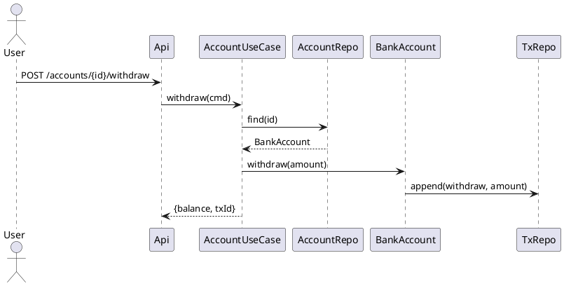

# 클래스 도출 및 역할 분석

## 목표 요약 — 왜 중요한가?

- 요구사항(무엇)을 **구조(누가/무엇이/어떻게)**로 변환한다.
- 각 클래스는 **명확한 역할/책임**을 갖고 **협력**으로 시스템 행위를 실현해야 한다.
- 잘 도출된 클래스는 **유지보수성·테스트 용이성·확장성**을 결정한다.

---

## 단계별 프로세스 (8단계 심화)

### 입력 자료 수집

- **기능/비기능 요구**(SRS), 유스케이스·스토리(AC 포함), 화면/API 명세, 도메인 용어집/정책, 로그/레거시 분석.

### 기법**

- **명사 → 후보 클래스/속성**, **동사 → 후보 책임(메서드)** 로 초안 생성.
- 정규화 팁: 동의어/중복 용어 통합(“계정”=“사용자 계정”), UI 전용 명사는 분리.

```text
Story: "사용자는 상품을 장바구니에 추가/삭제하고, 주문을 결제한다."
명사: 사용자(User), 상품(Product), 장바구니(Cart), 주문(Order), 결제(Payment)
동사: 추가(add), 삭제(remove), 결제(pay)
→ Cart.addItem(Product), Cart.removeItem(Product), Payment.pay(Order)
```

### 도메인 분류 — **엔티티/값 객체/도메인 서비스**

- **Entity**(ID·생명주기): Account, Order
- **Value Object**(불변·식별성 없음): Money, Address
- **Domain Service**(단일 객체에 귀속되지 않는 규칙): 환율계산, 배송료정책
- **Repository**: 영속성 추상화
- **Application Service/Controller**: 워크플로·트랜잭션 경계

### 할당 — **CRC 카드**

- 한 장당 **Class / Responsibilities / Collaborators**를 간결히.
- 책임은 **동사구**로, 협력자는 **정확한 타입명**으로.

### 관계와 제약 정의

- 연관/집합/합성/상속, 다중성(1..*, 0..1), 방향성, 불변식 정의.
- **합성 우선**, 상속은 LSP 충족 시에만.

### 속성/메서드 확정

- 공개 인터페이스(사용자/타 모듈이 호출) vs 비공개 구현(내부 유효성·파생 계산).
- 비기능 요구(성능/보안/감사)를 **책임**으로 배치(예: AuditAppender).

### 정제·리팩토링(히ュー리스틱)

- SRP/LSP/ISP 점검, **Low Coupling / High Cohesion**, **Feature Envy** 탐지.
- 변이(정책, 외부 연동)는 **전략/포트-어댑터** 뒤로 감싸기(Protected Variations).

### 시각화·검증

- UML 클래스/시퀀스, CRC 리뷰, **요구↔클래스** 추적(Traceability).
- AC→테스트 자동화로 설계 고정.

---

## 도출 기법 & 체크리스트

### 명사/동사 분석 팁

- **추상 명사 정리**(“정보”, “데이터”) → 구체화(“거래내역”, “잔액”).
- **UI 명사 분리**(“팝업”, “버튼”)—도메인이면 남기고, 단순 뷰면 제거.
- **규칙어휘 수집**: “최대/최소/만료/구간/비율/과세”—정책 클래스로 승격 후보.

### CRC 카드 템플릿

```text
Class: ______________________
Responsibilities:
 - _________________________
 - _________________________
Collaborators:
 - _________________________
 - _________________________
Notes/Rules:
 - Pre: ____________________
 - Post: ___________________
```

### 클래스 품질 체크

- **SRP**: 한 문장으로 역할 설명 가능한가?
- **응집도**: 메서드가 공용 상태를 공유/협력하는가?
- **결합도**: 인터페이스 의존/DI 가능한가?
- **테스트성**: 순수 도메인 테스트가 쉬운가?
- **명명**: 명사형, 역할이 분명한가?

---

## 상속 vs 합성, 경계(DDD Aggregate)

- **상속**: `is-a` + **LSP** 충족 시(행동 계약 불변).
- **합성**: 역할 조립이 가능한 경우 **기본 선택**(변이 격리/테스트 용이).
- **Aggregate Root**: 일관성 경계(한 트랜잭션에서 불변식 보장).
  - 예) `Order` 루트, 내부에 `OrderLine` 합성.

---

## 사례 A — 은행 계좌 (도출 → 역할 → 코드)

### 요구 요약

- 계좌: 잔액 조회/입금/출금/이체. 출금은 잔액 부족 시 거부, 동시성 보장.

### 후보 도출(명사/동사)

- 명사: User, **BankAccount**, **Transaction**, **Money**, TransactionRepository, NotificationService
- 동사: deposit, withdraw, transfer, notify

### CRC

```
Class: BankAccount
Responsibilities:
 - 잔액 유지·검증
 - 입금/출금(원자성)
 - 이체 시 전·후 조건 유지
Collaborators:
 - TransactionRepository, NotificationService
```

### 시퀀스(PlantUML)



### Java 스켈레톤 — **규칙은 엔티티 내부로**

```java
public final class Money {
    private final String currency;
    private final long cents;
    public Money(String c, long v){ if (v < 0) throw new IllegalArgumentException(); currency=c; cents=v; }
    public Money plus(Money o){ requireSame(o); return new Money(currency, cents + o.cents); }
    public Money minus(Money o){ requireSame(o); if (cents < o.cents) throw new IllegalStateException("negative"); return new Money(currency, cents - o.cents); }
    public int compareTo(Money o){ requireSame(o); return Long.compare(cents, o.cents); }
    private void requireSame(Money o){ if(!currency.equals(o.currency)) throw new IllegalArgumentException("currency mismatch"); }
    public long getCents(){ return cents; }
}

public class BankAccount {
    private final String id;
    private Money balance;
    private long version; // Optimistic Lock

    public BankAccount(String id, Money init){ this.id = id; this.balance = init; }

    public void deposit(Money m){
        ensurePositive(m);
        this.balance = this.balance.plus(m);
    }

    public void withdraw(Money m){
        ensurePositive(m);
        if (balance.compareTo(m) < 0) throw new InsufficientFunds();
        this.balance = this.balance.minus(m);
    }

    public Money balance(){ return balance; }

    private static void ensurePositive(Money m){ if (m.getCents() <= 0) throw new IllegalArgumentException(); }
}

public class AccountUseCase {
    private final AccountRepository repo;
    private final TransactionRepository tx;
    public AccountUseCase(AccountRepository r, TransactionRepository t){ this.repo=r; this.tx=t; }

    public WithdrawResult withdraw(WithdrawCommand cmd){
        var acc = repo.find(cmd.accountId());
        var before = repo.versionOf(acc.getId());
        acc.withdraw(cmd.amount());
        repo.save(acc, before); // OCC
        var txId = tx.appendDebit(acc.getId(), cmd.amount());
        return new WithdrawResult(acc.balance(), txId);
    }
}
```

---

## 사례 B — 전자상거래(주문·결제·정책)

### 변이 보호(가격/배송 정책은 **전략**으로)

```java
public interface PricingPolicy { Money priceOf(Order order); }
public final class SeasonalPolicy implements PricingPolicy {
    public Money priceOf(Order o){ var base=o.subtotal(); return new Money(base.currency(), Math.round(base.getCents()*0.9)); }
}

public final class Order {
    private final List<OrderLine> lines = new ArrayList<>();
    public Money subtotal(){ return lines.stream().map(OrderLine::amount).reduce((a,b)->a.plus(b)).orElse(new Money("KRW",0)); }
    public Money total(PricingPolicy policy){ return policy.priceOf(this); }
}
```

### 결제 포트/어댑터(Indirection)

```java
public interface PaymentGateway {
    AuthResult authorize(String orderId, Money amount, PaymentToken token);
    void capture(String authId);
}

public interface PaymentMethod { Receipt pay(Order order); }

public final class CardPayment implements PaymentMethod {
    private final PaymentGateway gw;
    public CardPayment(PaymentGateway gw){ this.gw=gw; }
    public Receipt pay(Order order){
        var auth = gw.authorize(order.id(), order.total(), order.token());
        gw.capture(auth.id());
        return Receipt.success(order.id(), auth.id());
    }
}
```

### C# 예시 — 값객체/불변 패턴

```csharp
public readonly record struct Money(string Currency, long Cents)
{
    public Money Plus(Money o) => Currency == o.Currency ? new(Currency, Cents + o.Cents) : throw new ArgumentException();
    public Money Minus(Money o) => Currency == o.Currency && Cents >= o.Cents ? new(Currency, Cents - o.Cents) : throw new InvalidOperationException();
}
```

---

## & 리뷰 프로세스

### 요구 ↔ 클래스 추적(간단 RTM)

| 요구 ID | 설명 | 클래스/메서드 | 테스트 |
|---|---|---|---|
| REQ-F-001 | 출금 잔액 검증 | `BankAccount.withdraw` | `AccountTest.debit_sufficient` |
| REQ-F-002 | 거래 기록 | `TransactionRepository.appendDebit` | `TxRepoTest.append` |

### BDD(AC→TC)

```gherkin
Feature: Withdraw
  Scenario: Sufficient balance
    Given account "A-1" has 100000 KRW
    When withdraw 30000 KRW
    Then balance is 70000 KRW
    And ledger records a debit entry
```

### 테스트 코드

```java
class AccountTest {
  @Test void withdraw_reduces_balance(){
    var acc = new BankAccount("A1", new Money("KRW", 100_000));
    acc.withdraw(new Money("KRW", 30_000));
    assertEquals(70_000, acc.balance().getCents());
  }
  @Test void withdraw_fails_on_insufficient(){
    var acc = new BankAccount("A1", new Money("KRW", 10_000));
    assertThrows(InsufficientFunds.class, () -> acc.withdraw(new Money("KRW", 30_000)));
  }
}
```

---

## 품질 지표로 책임 배치가 좋은지 “수치화”

- **Afferent/Efferent Coupling**: 들어오는/나가는 의존 수
- **불안정도 Instability**
  $$
  I = \frac{Ce}{Ca + Ce}\quad(0:\text{안정},\ 1:\text{불안정})
  $$
- **추상도 Abstractness**
  $$
  A = \frac{\#\text{추상 타입}}{\#\text{전체 타입}}
  $$
- **Main Sequence 거리**
  $$
  D = |A + I - 1|\quad(\text{작을수록 이상})
  $$
- **개념적 응집(LCOM) 신호**: 메서드 간 공유 필드 적을수록 ↑LCOM → 분리 고려.

> **활용**: 리팩토링 전/후 I·D·LCOM 비교를 변경 근거로 기록.

---

## 안티패턴 → 교정

| 냄새 | 증상 | 원인 | 교정 |
|---|---|---|---|
| God Object/Service | 모든 규칙 집중 | 경계 부재 | 규칙을 **엔티티/정책**으로 이동 |
| Feature Envy | 타 객체 필드 탐닉 | 정보 전문가 위반 | 메서드 이동(해당 객체로) |
| Data Class | 게터/세터만 | 캡슐화 위반 | **행위**를 객체 내부로 |
| Refused Bequest | 상속했으나 계약 불일치 | 잘못된 is-a | **합성**/역할 인터페이스 |
| Interface Bloat | 쓰지 않는 메서드 강제 | ISP 위반 | 인터페이스 분리 |

---

## 결정 로그(ADR)와 팀 합의 포인트

- **경계(루트)와 트랜잭션 범위**: 일관성/사가 여부.
- **변이 축 정의**: 가격/결제/배송/환율—전략화.
- **외부 연동 표준**: 포트/어댑터 이름·예외·타임아웃·멱등키.
- **테스트 전략**: 순수 도메인 우선, 어댑터는 계약 테스트.

---

## 빠른 의사결정 기준(실무 팁)

- 클래스명은 **명사**, 공개 API는 **업무 언어**로.
- **작게 시작**(필요 이상 추상화 금지), 이후 수요 기반 리팩토링(YAGNI).
- 규칙은 **도메인**으로, I/O는 **인프라**로.
- 변이/외부 의존은 **인터페이스** 뒤로.
- 테스트가 어렵다면 **책임 경계**가 틀린 것.

---

## 최종 체크리스트

- [ ] 모든 요구는 하나 이상의 클래스/메서드로 **추적 가능**한가?
- [ ] 각 클래스는 **SRP**를 만족하는가?
- [ ] Entity/Value/Service/Repository **역할 구분**이 명확한가?
- [ ] **High Cohesion / Low Coupling**이 보장되는가?
- [ ] 상속 대신 **합성**이 더 적합하지 않은가?
- [ ] **AC→TC**가 준비되어 설계를 고정하는가?
- [ ] 지표(I, D, LCOM)로 리팩토링 효과를 **수치화**했는가?

---

## 부록 — 템플릿 모음

### Responsibility Assignment Record (RAR)

```text
Feature: ___________________   Use Case: _______________
System Events: ______________  Controller: _____________
Responsibilities & Owners:
 - R1 ____________________ -> Class ________ (Info Expert)
 - R2 ____________________ -> Class ________ (Low Coupling)
Variations:
 - V1: ___________________ -> Interface ____ (Strategy)
Ports/Adapters:
 - P1: ___________________ -> Port ______ / Adapter(s) _____
Tests/AC:
 - AC: ___________________ -> TestCase: ________________
```

### 간단 클래스 다이어그램(텍스트)

```text
[Order] *-- [OrderLine]
[Order] o-- [PaymentMethod] <|.. [CardPayment]
[Order] o-- [PricingPolicy] <|.. [SeasonalPolicy]
[UseCase] --> [Order]
[UseCase] --> [PaymentGateway] ..> (Port)
```

---

## 요약

- **명사/동사 분석 → 역할 분류 → CRC → 관계·제약 → 인터페이스 확정 → 정제 → 시각화·검증**의 8단계를 반복하라.
- **도메인 규칙은 엔티티/정책 내부**로, **워크플로는 유스케이스**, **외부 연동은 포트/어댑터**로.
- **변이(정책/외부)는 전략/추상**으로 감싸고, 품질 지표로 **설계 개선을 수치화**하라.
