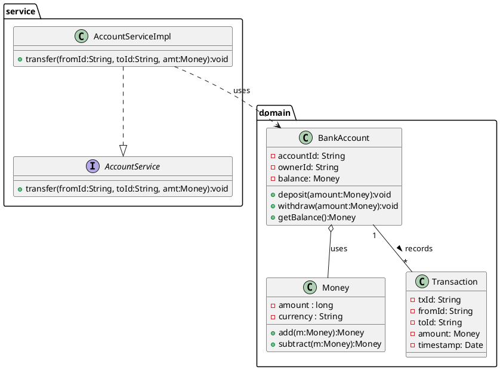

# UML 다이어그램과 클래스 모델링 (상세 가이드)

UML 클래스 다이어그램은 도메인(또는 시스템)을 **정적 구조**로 표현하는 가장 대표적인 수단입니다.  
클래스 모델링은 요구사항을 실체(클래스, 값 객체, 서비스 등)와 그들 간의 관계로 변환하는 과정입니다. 이 문서는 개념·기호·절차·예제(PlantUML + Java 스켈레톤)·모범사례·검증 방법을 한데 모아 실무에 바로 적용할 수 있게 정리했습니다.

---

## 1. UML(클래스 다이어그램) 개요 — 무엇을 표현하나
- **클래스(Class)**: 속성(attributes)과 연산(operations)을 갖는 타입.  
- **관계(Relationships)**: 상속(Inheritance), 연관(Association), 집합(Aggregation), 합성(Composition), 의존(Dependency), 실체화(Realization) 등.  
- **패키지/네임스페이스**: 시스템을 모듈 단위로 그룹화.  
- **제약(Constraint)**: 불변조건(예: saldo ≥ 0), OCL(Optional).  

클래스 다이어그램은 시스템의 **데이터 구조(상태)**와 **객체 간 구조적 관계**를 표현합니다. 동작(시나리오) 검증엔 시퀀스/커뮤니케이션 다이어그램을 병행하세요.

---

## 2. 클래스 다이어그램의 기본 구성요소(기호와 의미)

### 클래스 표기
```
+---------------------------+
| ClassName                 |    // 클래스명 (가운데 또는 상단)
+---------------------------+
| - attr: Type              |    // 속성 (visibility name: Type [multiplicity] {constraints})
| # protectedAttr: Type     |
| + publicAttr: Type        |
+---------------------------+
| + operation(arg:Type):Ret |
| - helper(): void          |
+---------------------------+
```

- **가시성(Visibility)**: `+` public, `-` private, `#` protected, `~` package
- **정적 요소**: 밑줄(underlined) — static 속성/메서드
- **추상**: 클래스명이나 메서드를 *이탤릭* 또는 `{abstract}` 표기
- **인터페이스**: `<<interface>> InterfaceName` 또는 구체화 관계(realization) 사용

### 관계 표기 (요약)
- **상속 (Generalization)**: 실선 + 빈 삼각형 화살표 (구현/확장)
- **실체화 (Realization)**: 점선 + 빈 삼각형 (클래스 implements 인터페이스)
- **연관 (Association)**: 실선 (양방향/단방향), 역할(role)과 다중성 표시
- **집합(Aggregation)**: 빈 마름모 (전체-부분, 약한 소유)
- **합성(Composition)**: 채운 마름모 (강한 소유, 수명 주기 종속)
- **의존(Dependency)**: 점선 화살표 (일시적, 사용 관계)
- **다중성 (Multiplicity)**: `1`, `0..1`, `*` (또는 `0..*`), `1..*`, `n..m`

예: `Order 1 --- * OrderLine` (Order는 여러 OrderLine을 가짐)

---

## 3. 클래스 모델링 절차 (실무 단계별)

1. **요구사항 분석 → 명사/동사 추출**  
   - 명사 → 후보 클래스/값 객체/엔터티  
   - 동사 → 책임(메서드) 또는 도메인 서비스

2. **역할 구분**  
   - 엔터티(Entity): ID 보유, 생명주기 추적  
   - 값 객체(Value Object): 불변, 식별자 없음 (ex. Money, Address)  
   - 도메인 서비스(Domain Service): 특정 엔티티에 적절치 않은 연산  
   - 애플리케이션 서비스: 워크플로우/트랜잭션 조정  
   - 레포지토리(Repository): 영속성 책임  

3. **CRC 카드**로 책임/협력 정리 → 클래스 책임을 명확히

4. **관계 결정**  
   - `is-a` 인가? → 상속(주의: LSP 준수)  
   - `has-a` 인가? → 합성/집합/연관  
   - 복합성(Composition) vs 단순 참조(Association) 판단

5. **속성/메서드 설계**  
   - 속성 타입, 기본값, 가시성 결정  
   - 공개 인터페이스(서비스 메서드) 정의 — 구현 세부는 감춤

6. **다중성·제약·비즈니스 규칙 표기**  
   - 예: `balance >= 0`, `transfer atomic`, `p95 < 500ms` 등

7. **검증**  
   - 시나리오(유스케이스)로 시퀀스 다이어그램 작성  
   - 이해관계자 리뷰(도메인 전문가), 단위 테스트 케이스로 추적

8. **리팩토링**  
   - 응집도/결합도 점검, 필요시 클래스 분할/통합 또는 합성으로 변경

---

## 4. 모델링의 상세 팁 (속성·메서드 표기법 외)
- **속성 표기**: `- balance: Money {readOnly}` 또는 `- createdAt: LocalDateTime = now()`  
- **메서드 표기**: `+ withdraw(amount: Money): void throws InsufficientFunds`  
- **연관 역할(Role)**: `account --{ownedBy}--> User` 또는 `owner: User`  
- **역할명과 다중성 함께 표기**: `1 owner: User` and `0..* transactions: Transaction`  
- **상태 전이**는 상태 다이어그램으로 보조 표현  
- **비즈니스 규칙**은 제약(Constraints)으로 `{constraint: ...}` 표기  
- **패키징**: 큰 시스템은 패키지로 모듈화(계층: domain / application / infra)

---

## 5. 예제 — 은행 계좌 도메인 (PlantUML + Java 스켈레톤)

### PlantUML 코드 (붙여넣어 렌더링 가능)


### Java 스켈레톤 (클래스 매핑)
```java
// Value Object
public final class Money {
    private final long cents;
    private final String currency;
    // constructor, add, subtract, equals/hashCode
}

// Entity
public class BankAccount {
    private final String accountId;
    private final String ownerId;
    private Money balance;

    public synchronized void deposit(Money amt) { /* validation + update */ }
    public synchronized void withdraw(Money amt) { /* validation + update */ }
    public Money getBalance() { return balance; }
}

// Domain Service / Application Service
public interface AccountService {
    void transfer(String fromId, String toId, Money amount);
}

public class AccountServiceImpl implements AccountService {
    private final AccountRepository repo;
    public void transfer(String fromId, String toId, Money amount) {
        // transaction boundary, concurrency handling
    }
}
```

---

## 6. 설계 패턴과 UML 연계
- **팩토리(Factory)**: 생성 책임을 캡슐화 → 클래스 다이어그램에 Factory 클래스를 추가  
- **전략(Strategy)**: 알고리즘 변경 가능 → `Context`와 `Strategy` 인터페이스로 모델링  
- **레포지토리(Repository)**: Persistence 책임 분리 → 도메인과 인프라 사이에 인터페이스 삽입  
- **DTO**: 계층 간 전송 객체로 별도 패키지에 표기

---

## 7. 검증 방법 (모델이 올바른지 확인)
1. **유스케이스 시나리오로 시퀀스 다이어그램 작성** — 협력 흐름이 일관적인지 확인  
2. **테스트 케이스 매핑** — 각 공개 메서드에 단위 테스트가 매핑되는지 확인  
3. **도메인 전문가 리뷰** — 네이밍과 경계가 도메인과 일치하는지 검토  
4. **추적성(Traceability)** — 요구사항 ↔ 클래스/메서드 매핑(REQ-ID 연결)  
5. **안티패턴 탐지** — God Object, Data Class, Feature Envy 등

---

## 8. 모범 사례 & 주의사항

### 모범 사례
- **명확한 이름**: 클래스는 명사, 메서드는 동사로 네이밍  
- **응집도 우선**: 관련 데이터와 행위는 같은 클래스에 포함  
- **결합도 낮추기**: 인터페이스·DI 활용  
- **합성 우선**: 상속 남용 자제(특히 다형성 위배 시)  
- **비즈니스 규칙은 도메인에**: 도메인 로직은 도메인 객체에 둠

### 주의사항
- **명사/동사 기법만으로 완성되지 않음** — 도메인 전문가 검증 필요  
- **다중성(0..*, 1..*)을 명확히**: 구현 시 collection vs optional 결정에 영향  
- **구현 세부(예: DB PK 타입 등)는 모델과 분리**: 모델은 개념적 수준 우선  
- **너무 많은 속성/메서드 금지**: 단일 책임 위반인지 검토

---

## 9. 도구 추천 (빠른 목록)
- 텍스트→다이어그램: **PlantUML** (코드로 버전관리 가능)  
- 드래그형: **draw.io**, **Lucidchart**, **StarUML**, **Visual Paradigm**  
- 통합: **Enterprise Architect**, **IntelliJ UML 플러그인**  
- 협업/문서: **Confluence + PlantUML**, **Mermaid**(간단 문서용)

---

## 10. 체크리스트(요약)
- [ ] 클래스 이름이 도메인을 명확히 설명하는가?  
- [ ] 클래스의 책임이 SRP를 만족하는가?  
- [ ] 응집도는 높은가, 결합도는 낮은가?  
- [ ] 상속 대신 합성이 더 적합하지 않은가?  
- [ ] 다중성·역할·네비게이션이 정확히 표기되었는가?  
- [ ] 비즈니스 제약(제약조건)이 모델에 반영되었는가?  
- [ ] 시퀀스 다이어그램으로 행위 검증을 했는가?  
- [ ] 요구사항 ↔ 클래스 매핑(추적성)이 확보되었는가?
