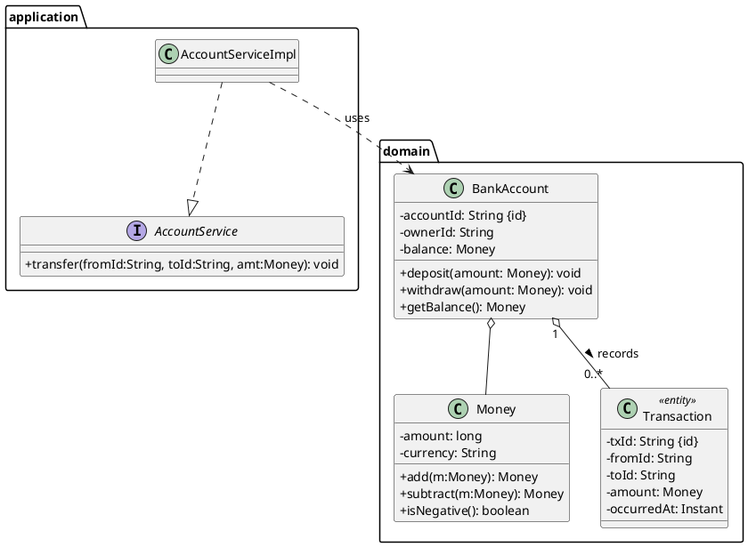
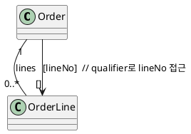
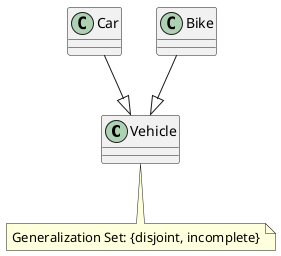
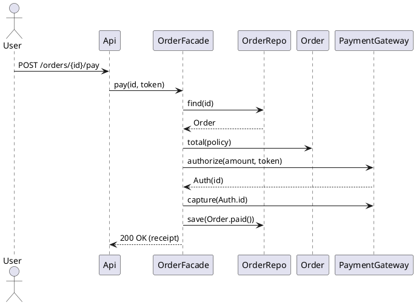
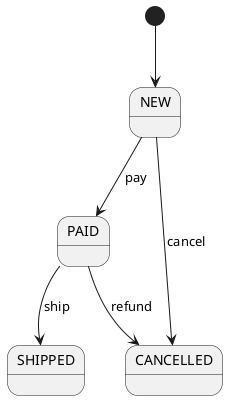

# UML 다이어그램과 클래스 모델링

## 클래스 다이어그램 개요 — 무엇을 표현하는가

- **클래스(Class)**: 속성(attributes)과 연산(operations)을 가지는 타입
- **관계(Relationships)**: 상속(Generalization), 실체화(Realization), 연관(Association), 집합(Aggregation), 합성(Composition), 의존(Dependency), 연관 클래스(Association Class), 한정(Qualified Association), n-항 연관 등
- **패키지/네임스페이스**: 모듈 단위 그룹화(레이어/바운디드 컨텍스트)
- **제약(Constraints/OCL)**: 불변식, 전/후조건, 다중성·순서·고유성 등
- **정적 구조**를 잡고, **동작 검증**은 시퀀스/상태/활동 다이어그램으로 보조

---

## 빠른 참조

### 클래스 박스

```
+---------------------------+
| ClassName                 |   // *이탤릭* = abstract, <<interface>> = 인터페이스
+---------------------------+
| - attr: Type [mult] {…}   |   // visibility: + public, - private, # protected, ~ package
| + staticUnderlined: int   |   // 정적 멤버는 밑줄
| /derived: Money           |   // 파생(derived) 속성은 접두 '/' 사용
+---------------------------+
| + op(arg:Type): Ret       |   // throws/예외, {query}, {idempotent} 등 속성 가능
| - helper(): void          |
+---------------------------+
```

**속성 부가표기**: `{readOnly}`, `{ordered}`, `{unique}`, `{subsetOf x}`, `{redefines y}`, `{id}`
**연산 부가표기**: `{query}`, `{sideEffectFree}`, `<<constructor>>`

### 관계(요약)

- **상속**: 실선 + 빈 삼각형 (자식 → 부모)
- **실체화**: 점선 + 빈 삼각형 (구현 클래스 → 인터페이스)
- **연관**: 실선, 끝점에 역할(role)/다중성 표시, 탐색성 화살표 선택
- **집합**: 빈 마름모(약한 소유)
- **합성**: 채운 마름모(강한 소유·수명 종속)
- **의존**: 점선 화살표(일시적 사용)
- **연관 클래스**: 연관 선에 박스 연결
- **한정 연관**: 관계 끝점 근처에 `[..qualifier..]` 박스

### 다중성(Multiplicity)

`1`, `0..1`, `*`(또는 `0..*`), `1..*`, `n..m`
**순서/고유**: `{ordered}`, `{unordered}`, `{unique}`, `{nonunique}`

---

## 클래스 모델링 절차 — 실무 단계별

1. **요구/스토리에서 명사·동사 추출**
   - 명사 → 후보 클래스/엔터티/값 객체
   - 동사 → 책임/연산/도메인 서비스
2. **역할 구분**
   - **Entity**(ID·생명주기), **Value Object**(불변·식별 없음), **Domain Service**, **Repository**, **Application Service**
3. **CRC 카드로 책임·협력 정리**
   - Class / Responsibilities / Collaborators
4. **관계 결정**
   - `is-a` → 상속(단, LSP 검증) / `has-a` → 합성·집합·연관
5. **속성/연산 구체화**
   - 가시성, 기본값, 예외, 전/후조건, 파생 속성
6. **다중성·제약·규칙 명시**
   - OCL 또는 `{constraint: ...}` 주석
7. **검증**
   - 시퀀스/상태 다이어그램으로 시나리오 추적
8. **리팩토링**
   - High Cohesion / Low Coupling, 합성 우선, 냄새 제거

---

## 표기·설계 심화: 놓치기 쉬운 포인트

- **합성 vs 집합**: 합성은 수명 종속(부품 객체는 전체와 함께 소멸), 집합은 약한 소유
- **연관 클래스**: “관계 자체”가 속성/행위를 가질 때 사용(예: 고용관계의 계약정보)
- **한정 연관(Qualified)**: 다중 키/검색 키를 모델링(예: `Order[orderNo] → OrderLine`)
- **일반화 집합(Generalization Set)**: `disjoint/overlapping`, `complete/incomplete`
- **제약 표현**: OCL로 불변식/전후조건 표기 가능
- **패키지 의존**: 상위 레이어가 하위 레이어에만 의존(의존 역전은 인터페이스로)

---

## 예제 1 — 은행 계좌 도메인(PlantUML + OCL + Java)

### 클래스 다이어그램 (PlantUML)



### 핵심 제약 (OCL 예)

```ocl
context BankAccount
inv BalanceNonNegative: self.balance.amount >= 0

context BankAccount::withdraw(amount: Money)
pre PositiveAmount: amount.amount > 0
pre Sufficient: self.balance.amount >= amount.amount
post Decreased: self.balance.amount = self.balance@pre.amount - amount.amount
```

### Java 스켈레톤 — 불변·검증을 **도메인 내부로**

```java
// Value Object
public final class Money {
    private final String currency;
    private final long cents;

    public Money(String currency, long cents) {
        if (currency == null || currency.isBlank()) throw new IllegalArgumentException();
        if (cents < 0) throw new IllegalArgumentException("negative not allowed for Money literal");
        this.currency = currency; this.cents = cents;
    }
    public Money add(Money o){ requireSame(o); return new Money(currency, cents + o.cents); }
    public Money subtract(Money o){
        requireSame(o);
        if (cents < o.cents) throw new IllegalStateException("result would be negative");
        return new Money(currency, cents - o.cents);
    }
    private void requireSame(Money o){
        if (!currency.equals(o.currency)) throw new IllegalArgumentException("currency mismatch");
    }
    public long cents(){ return cents; }
    public String currency(){ return currency; }
}

// Entity
public class BankAccount {
    private final String accountId;
    private final String ownerId;
    private Money balance;

    public BankAccount(String id, String ownerId, Money initial){
        this.accountId = id; this.ownerId = ownerId; this.balance = initial;
    }
    public synchronized void deposit(Money amt){
        ensurePositive(amt); this.balance = this.balance.add(amt);
    }
    public synchronized void withdraw(Money amt){
        ensurePositive(amt); this.balance = this.balance.subtract(amt);
    }
    private static void ensurePositive(Money m){ if (m.cents() <= 0) throw new IllegalArgumentException(); }
    public Money getBalance(){ return balance; }
}
```

---

## 확장 모델

### 클래스/관계 (PlantUML)

```plantuml
@startuml
package "order-context" {
  class Order {
    - orderNo: String {id}
    - createdAt: Instant
    - status: OrderStatus
    - lines: List<OrderLine> {ordered}
    + addLine(p:Product, qty:int): void
    + subtotal(): Money
    + total(policy: PricingPolicy): Money
  }

  class OrderLine {
    - productId: String
    - unitPrice: Money
    - quantity: int
    / amount: Money
  }

  enum OrderStatus { NEW; PAID; SHIPPED; CANCELLED }

  class Product {
    - productId: String {id}
    - name: String
    - listPrice: Money
  }

  interface PricingPolicy {
    + priceOf(o: Order): Money
  }
  class SeasonalPolicy
  class MembershipPolicy

  class Payment <<service>> {
    + pay(o:Order, method:PaymentMethod): Receipt
  }

  interface PaymentMethod { + charge(amount: Money): Receipt }
  class CardPayment
  class VirtualAccountPayment

  class Shipment {
    - trackingNo: String {id}
    - carrier: String
    - shippedAt: Instant
  }

  Order "1" *-- "1..*" OrderLine : composition
  OrderLine o-- Product
  Order o-- Shipment : "0..1"
  SeasonalPolicy ..|> PricingPolicy
  MembershipPolicy ..|> PricingPolicy
  CardPayment ..|> PaymentMethod
  VirtualAccountPayment ..|> PaymentMethod
}
@enduml
```

**포인트**
- `Order *-- OrderLine` 합성: 라인의 수명이 주문에 종속
- 가격 정책은 **전략(Strategy)** 로 분리(변이 보호)
- 결제 수단은 인터페이스로 추상화(의존 역전)

### 파생 속성/제약

- `OrderLine./amount = unitPrice × quantity`
- `Order.total(policy) = policy.priceOf(this)`
- OCL (개념적):
```ocl
context OrderLine inv PositiveQty: self.quantity > 0
context Order inv NonEmpty: self.lines->size() > 0
```

### Java 스켈레톤(일부)

```java
public final class Order {
    private final String orderNo;
    private final List<OrderLine> lines = new ArrayList<>();
    private OrderStatus status = OrderStatus.NEW;

    public void addLine(Product p, int qty){
        if (qty <= 0) throw new IllegalArgumentException();
        lines.add(new OrderLine(p.getId(), p.getListPrice(), qty));
    }
    public Money subtotal(){
        return lines.stream().map(OrderLine::amount)
            .reduce((a,b) -> a.add(b)).orElse(new Money("KRW", 0));
    }
    public Money total(PricingPolicy policy){ return policy.priceOf(this); }
}

public record OrderLine(String productId, Money unitPrice, int quantity){
    public Money amount(){ return unitPrice.add(new Money(unitPrice.currency(), 0))
                             .subtract(new Money(unitPrice.currency(), unitPrice.cents() - unitPrice.cents()*quantity)); }
    // 위는 단순화 예시; 실제로는 unitPrice * quantity 구현
}

public final class SeasonalPolicy implements PricingPolicy {
    public Money priceOf(Order o){
        var sub = o.subtotal();
        var discounted = Math.round(sub.cents() * 0.9); // 10% 할인
        return new Money(sub.currency(), discounted);
    }
}
```

---

## 관계 심화: 연관 클래스·한정·n-항 연관

### 연관 클래스(Association Class)

“관계” 자체의 데이터/행위가 필요할 때:
```plantuml
@startuml
class Employee { - empNo: String }
class Department { - deptNo: String }
class Assignment {
  - role: String
  - startDate: Date
  - endDate: Date
}
Employee "1" -- "0..*" Department : assigned >
(Employee, Department) .. Assignment
@enduml
```

### 한정 연관(Qualified)



### n-항 연관

결제 **수단-고객-상점** 3자 관계 같이, 연관 점이 3개 이상일 때 n-항 연관 사용(가급적 **연관 클래스**로 재설계하면 구현 용이).

---

## 일반화 집합(Disjoint/Overlapping, Complete/Incomplete)



- **disjoint**: 한 객체는 하나의 하위타입만
- **overlapping**: 다중 하위타입 가능
- **complete**: 상위 타입 인스턴스는 반드시 하위 타입 중 하나
- **incomplete**: 상위 타입 독립 인스턴스 허용

---

## 패키징/레이어링(계층·컨텍스트)

```plantuml
@startuml
package "sales (bounded context)" {
  package "domain" { class Order; class Product; interface PricingPolicy }
  package "app"    { class OrderFacade }
  package "infra"  { class JpaOrderRepository }
}
app.OrderFacade ..> domain.Order
infra.JpaOrderRepository ..> domain.Order
@enduml
```

- **의존 방향**: `app/infra → domain`
- 외부 시스템 연동은 **포트/어댑터**로 분리

---

## 모델 → 코드 매핑 규칙(ORM/컬렉션/옵셔널)

| UML 개념 | Java/C# 매핑 가이드 |
|---|---|
| 합성(1..*) | `List<T>` + 생명주기 함께 관리(cascade), 불변 리스트 노출 |
| 집합(0..*) | `List<T>`/`Set<T>`(고유성 필요 시) |
| 0..1 | `Optional<T>`/nullable |
| 파생 속성 | `get` 계산 메서드(엔티티 불변식 보장) |
| 한정 | 맵/키 기반 접근(`Map<Key,Value>`) |
| 일반화 | 상속/인터페이스 + LSP 테스트 |
| 연관 클래스 | 별도 엔티티/값 객체로 구현(복합키 가능) |

---

## 모델 검증 — 시퀀스/상태/Bdd

### 시퀀스 다이어그램(주문 결제)



### 상태 다이어그램(간략)



### BDD(Gherkin)

```gherkin
Feature: Order Payment
  Scenario: Successful card payment
    Given order "O-1" has subtotal 100000 KRW
    And policy "Seasonal 10%" is active
    When user pays by card
    Then order status is "PAID"
    And receipt is issued
```

---

## — 패키지 레벨 메트릭

- **Afferent Coupling (Ca)**: 들어오는 의존 수
- **Efferent Coupling (Ce)**: 나가는 의존 수
- **불안정도 Instability**
  $$ I = \frac{Ce}{Ca + Ce} \quad (0 \rightarrow\text{안정},\ 1 \rightarrow\text{불안정}) $$
- **추상도 Abstractness**
  $$ A = \frac{\#\text{추상 타입}}{\#\text{전체 타입}} $$
- **Main Sequence 거리**
  $$ D = |A + I - 1| \quad (\text{0에 가까울수록 이상}) $$

> 리팩토링 전/후 **I, D** 비교로 구조 개선 효과를 수치화하라.

---

## 안티패턴 → 리팩토링 가이드

| 냄새 | 증상 | 원인 | 개선 |
|---|---|---|---|
| God Class | 모든 규칙 집중 | 경계 미정 | 규칙을 **엔티티/정책**으로 이관 |
| Anemic Model | 게터/세터만 | 도메인 규칙 외부화 | **행위**를 엔티티/VO에 귀속 |
| Feature Envy | 타 객체 필드 집착 | 정보 전문가 위반 | 메서드 이동/역할 재배치 |
| Refused Bequest | 상속했지만 계약 불일치 | 잘못된 is-a | **합성/역할 인터페이스** |
| Interface Bloat | 쓰지 않는 메서드 강제 | ISP 위반 | 인터페이스 분리 |

---

## 체크리스트(요약)

- [ ] 클래스 이름이 **도메인 용어**와 일치하는가?
- [ ] 각 클래스의 책임이 **SRP**를 만족하는가?
- [ ] 연관/합성/집합 구분이 타당한가(수명·소유 기준)?
- [ ] **다중성·역할·탐색성**이 정확히 표기되었는가?
- [ ] 변이 축(정책/외부연동)을 **전략·포트/어댑터**로 분리했는가?
- [ ] 핵심 불변식이 **OCL/제약** 또는 코드로 수호되는가?
- [ ] 시퀀스/상태로 **행위 검증**을 수행했는가?
- [ ] 요구↔모델↔코드 **추적성**(RTM)이 확보되었는가?
- [ ] 메트릭(I, D)으로 구조 품질을 **수치화**했는가?

---

## 부록 — 실무 템플릿 모음

### CRC 카드

```
Class: __________________
Responsibilities:
 - _____________________
 - _____________________
Collaborators:
 - _____________________
Notes:
 - Invariants: _______________________
 - Variation Points: _________________
```

### ADR(Architecture Decision Record)

```
Title: 주문-라인 합성 결정
Context: 라인의 수명이 주문에 종속, 일관성 요구 높음
Decision: Order *-- OrderLine (composition), 컬렉션 {ordered}
Consequences: 라인 독립 저장 금지, 삭제 cascade, 총액 파생 속성
```

### PlantUML 스니펫(패키지·레이어)

```plantuml
@startuml
package "sales" {
  package "domain" { class Order; class OrderLine; interface PricingPolicy }
  package "app" { class OrderFacade }
  package "infra" { class JpaOrderRepository }
}
app.OrderFacade ..> domain.Order
infra.JpaOrderRepository ..> domain.Order
@enduml
```

---

## 결론

- **UML 클래스 다이어그램**은 개념 모델을 **정확히 공유**하고, 구현으로 **일관되게 전파**하는 언어다.
- **합성 우선**, 변이는 **전략/포트-어댑터** 뒤로 감싸고, **불변식/제약**을 모델과 코드 모두에 새겨라.
- 시퀀스/상태/BDD로 행위를 **검증**하고, 메트릭으로 구조를 **수치화**하라.
- 이 가이드를 워크숍/리뷰/리팩토링의 **체크리스트**로 사용하면, 요구→모델→코드 전환이 한층 견고해진다.
