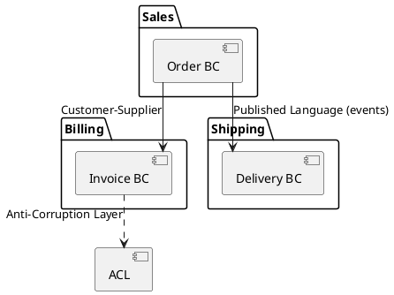
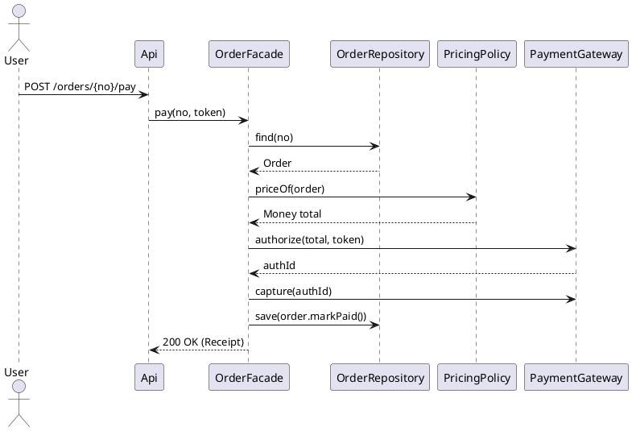
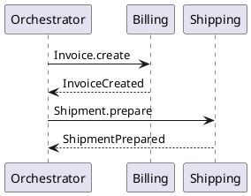
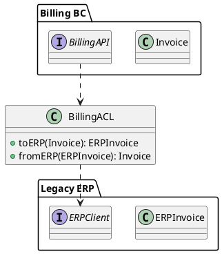

# 도메인 주도 설계(DDD, Domain-Driven Design)

## 1. 왜 DDD인가 — 문제와 해법

| 과제 | 전형적 증상 | DDD가 제안하는 해법 |
|---|---|---|
| 복잡한 비즈니스 규칙 | CRUD 테이블 중심, 규칙이 서비스/컨트롤러에 흩어짐 | **도메인 모델**을 중심에 놓고 규칙을 **엔티티/값 객체/애그리게이트**로 귀속 |
| 커뮤니케이션 단절 | 현업/개발 용어 불일치, 요구 해석 오해 | **유비쿼터스 언어**로 공동 모델을 만들고 코드에 동일 용어 사용 |
| 경계 없는 시스템 | 한 모델이 전사에 확산, 변경 충돌 잦음 | **바운디드 컨텍스트**로 모델의 **유효 범위**를 명시하고 컨텍스트 간 번역 |
| 변경 취약 설계 | 신규 규칙 추가 때 광범위 수정 | 변이 축을 **정책/전략/도메인 서비스**로 격리, **OCP**에 가까운 확장 |

핵심은 **코드가 비즈니스를 ‘정확한 말’로 표현**하도록 만드는 것, 즉 **모델과 언어의 정합성**이다.

---

## 2. 핵심 용어 요약(개념 강화)

| 용어 | 요지 | 실무 포인트 |
|---|---|---|
| **도메인** | 문제 영역(은행, 커머스 등) | 도메인 목표/KPI가 모델의 품질 기준 |
| **서브도메인** | 도메인의 하위 역할(결제, 배송, 정산 등) | 핵심/지원/일반 서브도메인 구분으로 투자 강약 조절 |
| **유비쿼터스 언어** | 모두가 쓰는 공통 용어 | 코드/테스트/문서/다이어그램에 동일 용어 사용 |
| **바운디드 컨텍스트** | 모델이 유효한 경계 | 컨텍스트 간 통신은 **번역**(ACL/PL)과 계약으로 관리 |

---

## 3. Tactical DDD — 전술 설계 블록

### 3.1 엔티티(Entity)
- **식별자**와 **생명주기**를 갖는 객체. 동등성은 ID 기준.
- 규칙은 가능한 **엔티티 내부**로(Anemic Model 방지).

```java
public class Account {
    private final String accountNumber; // ID
    private Money balance;

    public Account(String accountNumber, Money initial) {
        this.accountNumber = accountNumber;
        this.balance = initial;
    }
    public void deposit(Money amount) { this.balance = this.balance.add(amount); }
    public void withdraw(Money amount) {
        if (this.balance.isLessThan(amount)) throw new InsufficientFunds();
        this.balance = this.balance.subtract(amount);
    }
    public Money balance() { return balance; }
}
```

### 3.2 값 객체(Value Object)
- **불변**이며 속성으로 동등성 판단. 행위를 함께 가진다(단순 DTO 아님).

```java
public record Money(long cents, String currency) {
    public Money add(Money o) { requireSame(o); return new Money(cents + o.cents, currency); }
    public Money subtract(Money o){ requireSame(o); if (cents < o.cents) throw new IllegalArgumentException(); return new Money(cents - o.cents, currency); }
    public boolean isLessThan(Money o){ requireSame(o); return cents < o.cents; }
    private void requireSame(Money o){ if(!currency.equals(o.currency)) throw new IllegalArgumentException("currency mismatch"); }
}
```

### 3.3 애그리게이트(Aggregate) & 루트
- **불변식(Invariant)**을 **트랜잭션 경계** 내에서 지키는 **일관성 집합**.
- 외부는 **루트**를 통해서만 내부 엔티티에 접근.

```java
public class Order { // Aggregate Root
    private final String orderNo;
    private final List<OrderLine> lines = new ArrayList<>();
    private OrderStatus status = OrderStatus.NEW;

    public void addLine(ProductId pid, Money unitPrice, int qty) {
        if (qty <= 0) throw new IllegalArgumentException();
        lines.add(new OrderLine(pid, unitPrice, qty));
    }
    public Money subtotal() {
        return lines.stream().map(OrderLine::amount)
               .reduce(new Money(0, "KRW"), (a,b) -> a.add(b));
    }
    public void markPaid() { if (lines.isEmpty()) throw new IllegalStateException(); this.status = OrderStatus.PAID; }
}
```

**불변식 예**  
$$
\texttt{Order.lines.size() > 0} \quad \land \quad \texttt{subtotal} = \sum_i \texttt{unitPrice}_i \times \texttt{qty}_i
$$

### 3.4 도메인 이벤트(Domain Event)
- “무엇이 발생했다”라는 사실. **과거 시제** 명명, **불변**.

```java
public record OrderPaid(String orderNo, Instant occurredAt, Money total) implements DomainEvent {}
```

### 3.5 리포지토리(Repository)
- 애그리게이트의 **컬렉션 같은 인터페이스**. 영속성 세부는 숨긴다.

```java
public interface OrderRepository {
    Optional<Order> findById(String orderNo);
    void save(Order order); // 트랜잭션/락은 인프라 책임
}
```

### 3.6 도메인 서비스 vs 애플리케이션 서비스
- **도메인 서비스**: 어느 한 애그리게이트에도 넣기 애매한 순수 도메인 계산/정책.
- **애플리케이션 서비스**: **유스케이스 오케스트레이션**(트랜잭션, 권한, 외부 연동).

```java
public interface PricingPolicy { Money priceOf(Order o); } // 도메인 서비스(정책)
public final class SeasonalPolicy implements PricingPolicy { /* … */ }

public class OrderFacade { // 애플리케이션 서비스
    @Transactional
    public Receipt pay(String orderNo, PaymentMethod method) { /* find -> policy -> pay -> publish event */ }
}
```

---

## 4. Strategic DDD — 경계와 팀 협업

### 4.1 컨텍스트 맵(Context Map) 패턴 요약

| 패턴 | 설명 | 사용 시점 |
|---|---|---|
| **Customer–Supplier** | 공급 컨텍스트가 고객 요구를 고려 | 상류/하류 관계가 명확 |
| **Conformist** | 하류가 상류 모델을 그대로 수용 | 협상력 부족·속도 최우선 |
| **Shared Kernel** | 일부 모델 공유, 강한 팀 협업 필요 | 작은 공통 핵심 모델 |
| **Anti-Corruption Layer(ACL)** | 번역 계층으로 모델 오염 방지 | 레거시/외부 시스템 연동 |
| **Open Host Service / Published Language** | 공용 API·스키마 공개 | 다수 소비자와 계약 기반 통합 |

### 4.2 컨텍스트 맵(PlantUML)


---

## 5. 모델링 워크플로 — 유비쿼터스 언어·이벤트 스토밍·CRC

1) **이벤트 스토밍**: 도메인 이벤트(주황 스티키) → 커맨드(파란색) → 애그리게이트(분홍)로 흐름 파악  
2) **용어 합의**: 정의 리스트/용어집을 코드와 테스트에 동기화  
3) **CRC 카드**: 책임/협력 빠르게 검증  
4) **다이어그램/예제 코드**: PlantUML과 스켈레톤으로 팀 공유

CRC 예시:
```
Class: Order
Responsibilities:
 - 라인 추가/제거, 합계 계산
 - 결제 완료 상태 전이
Collaborators:
 - PricingPolicy, PaymentGateway
```

---

## 6. 애그리게이트 설계 원칙(핵심)

- **트랜잭션은 애그리게이트 단위**로(크기를 적정하게)  
- 외부 참조는 **ID 참조**로 느슨하게  
- **컬렉션 불변 노출**(Add/Remove 메서드 제공)  
- 경쟁 조건 방지: **낙관적 잠금**(버전 필드) + **멱등성** 이벤트 처리  
- 불변식은 **도메인 메서드**로 강제(게터/세터 노출 지양)

---

## 7. 결제 예제 — 모델, 흐름, 코드

### 7.1 클래스(PlantUML)
```plantuml
@startuml
class Order {
  - orderNo: String {id}
  - status: OrderStatus
  - lines: List<OrderLine> {ordered}
  + addLine(p:ProductId, price:Money, qty:int)
  + markPaid()
  + subtotal(): Money
}
class OrderLine { - productId: String; - unitPrice: Money; - qty: int; + amount(): Money }
enum OrderStatus { NEW; PAID; CANCELLED }

interface PricingPolicy { + priceOf(o:Order): Money }
class SeasonalPolicy ..|> PricingPolicy

interface PaymentMethod { + charge(amount:Money): Receipt }
class CardPayment ..|> PaymentMethod

interface OrderRepository
class OrderFacade

Order *-- "1..*" OrderLine
OrderFacade ..> OrderRepository
OrderFacade ..> PricingPolicy
OrderFacade ..> PaymentMethod
@enduml
```

### 7.2 시퀀스(PlantUML)


### 7.3 BDD(요구→테스트)
```gherkin
Feature: Pay for Order
  Scenario: Card payment success
    Given order "O-1" has 2 lines (KRW 60,000 total)
    And seasonal discount 10% applies
    When I pay by card with valid token
    Then order status is "PAID"
    And a receipt is issued
```

### 7.4 애플리케이션 서비스(의사코드)
```java
public class OrderFacade {
    private final OrderRepository orders;
    private final PricingPolicy policy;
    private final PaymentGateway pg;
    private final DomainEvents events;

    @Transactional
    public Receipt pay(String orderNo, CardToken token) {
        var order = orders.findById(orderNo).orElseThrow();
        var total = policy.priceOf(order);
        var auth = pg.authorize(total, token);
        pg.capture(auth.id());
        order.markPaid();
        orders.save(order);
        events.publish(new OrderPaid(orderNo, Instant.now(), total));
        return new Receipt(orderNo, total);
    }
}
```

---

## 8. 통합·일관성 — 이벤트/사가/아웃박스

### 8.1 사가(Saga)
- **오케스트레이션**: 중앙 오케스트레이터가 단계 호출/보상  
- **코레오그래피**: 이벤트 기반으로 로컬 트랜잭션 연결



### 8.2 아웃박스(Outbox) & 멱등성
- 트랜잭션 커밋 시 **이벤트를 같은 DB에 기록**, 별도 프로세스가 브로커로 전달
- **이벤트 ID**로 **중복 처리 방지(멱등)**

---

## 9. 저장소/ORM/동시성

- **낙관적 잠금**: `@Version` 필드로 동시 갱신 충돌 탐지  
- **ID 참조**: 다른 애그리게이트는 ID로만, 필요 시 리포지토리 조회  
- **스냅샷/이벤트 소싱**: 이벤트 소싱 채택 시 스냅샷으로 재생 비용 절감

```java
@Entity
public class OrderJpa {
    @Id private String orderNo;
    @Version private long version; // Optimistic Lock
    // …
}
```

---

## 10. ACL/Published Language로 레거시 보호



ACL은 **번역 책임**을 별도 계층에 둬 **모델 오염**을 막는다.

---

## 11. 테스트 전략

| 레벨 | 목적 | 예 |
|---|---|---|
| 단위(Unit) | 엔티티/값객체/정책의 불변식 | `Order.addLine`, `Money` 연산 |
| 도메인 시나리오 | 애그리게이트 상태 전이 | `Order.markPaid()` |
| 계약/컨슈머(Contract) | 컨텍스트 간 API 계약 | Billing API 스키마/샘플 |
| 통합(Integration) | 리포지토리/브로커/게이트웨이 | Testcontainers/Kafka |
| E2E/수용(AC/BDD) | 요구-행위 검증 | Gherkin + automation |

---

## 12. 안티패턴과 개선

| 안티패턴 | 증상 | 개선 |
|---|---|---|
| **Anemic Domain Model** | 도메인 로직이 서비스로 유출 | 규칙을 엔티티/VO 메서드로 이동 |
| **Transaction Script 남용** | 서비스 메서드가 if/else로 가득 | 정책/전략/도메인 서비스로 분해 |
| **거대 애그리게이트** | 잠금 충돌·확장 어려움 | 경계를 쪼개고 이벤트로 협력 |
| **Conformist 남발** | 외부 모델 종속 | 필요 시 ACL/PL로 분리 |

---

## 13. 도입 전략 — 점진적 전환

1) **핵심 서브도메인**부터 DDD 적용  
2) **스트랭글러 패턴**: 새 BC를 옆에 세우고 트래픽 점진 전환  
3) 레거시 연동은 **ACL**로 시작, 계약을 명문화  
4) 파이프라인에 **계약/스키마 테스트** 포함  
5) **용어집/다이어그램/예제 코드**를 CI와 함께 버전 관리

---

## 14. 품질 메트릭(구조 수치화)

- 애그리게이트 크기(명령 수, 엔티티 수)  
- 이벤트 중복률/멱등 처리율  
- 패키지 결합도/추상도(Instability/Abstractness)  
  $$ I=\frac{Ce}{Ca+Ce},\quad A=\frac{\#\text{abstract}}{\#\text{total}},\quad D=|A+I-1| $$

---

## 15. 종합 체크리스트

- [ ] **유비쿼터스 언어**가 코드/테스트/문서에 동일하게 쓰였는가?  
- [ ] **바운디드 컨텍스트**와 **컨텍스트 맵**이 명시되어 있는가?  
- [ ] 규칙이 **엔티티/값 객체/애그리게이트** 내부로 귀속되었는가?  
- [ ] 애그리게이트 경계가 작고 **불변식**을 트랜잭션 내에 보장하는가?  
- [ ] 컨텍스트 간 통합에 **ACL/Published Language**를 사용했는가?  
- [ ] **리포지토리**가 애그리게이트 단위로 설계되었는가?  
- [ ] 동시성은 **낙관적 잠금/멱등성**으로 제어되는가?  
- [ ] **사건 흐름**(이벤트/사가)이 설계·테스트로 검증되었는가?  
- [ ] **반패턴**(Anemic, God Service, 과도 상속)이 제거되었는가?

---

## 16. 결론

DDD의 가치는 **언어·모델·코드**를 하나로 묶어 복잡성을 다루는 데 있다.  
핵심은 **애그리게이트에 불변식을 새기고**, **경계를 명시**하며, **컨텍스트 간 통합을 계약과 번역으로 관리**하는 것이다. 본 문서의 예제(PlantUML/Java/BDD)와 체크리스트를 팀 워크숍/리뷰의 표준으로 삼아, “간단 소개”를 실제 **설계·구현·운영**의 일관된 실천으로 연결하라.