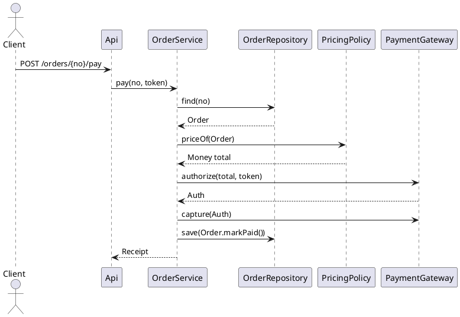

# 계층형 아키텍처와 객체 지향 설계

## 계층형 아키텍처 개요

### 정의

**계층형(Layered) 아키텍처**는 시스템을 **관심사별 수평 계층**으로 분할하고, **상위 → 하위 단방향 의존** 규칙을 통해 결합도를 낮추는 구조다. 대표 4계층은 다음과 같다.

```
Presentation (UI/API)
  └─ Application (Use Case / Service)
        └─ Domain (Entities, Value Objects, Domain Services)
              └─ Infrastructure (DB, Message Broker, External API, Framework)
```

### 목표

- **책임 분리(Separation of Concerns)**: UI, 유스케이스, 핵심 비즈니스, 기술 세부 구현을 분리
- **유지보수성/확장성**: 변경 파급 최소화, 교체 가능성↑
- **테스트 용이성**: 핵심 로직을 외부 의존 없이 단위 테스트 가능

---

## 계층별 역할과 경계

| 계층 | 주 역할 | 금기 사항(경계 침범) |
|---|---|---|
| Presentation | 요청 파싱, 인증 토큰 추출, 응답 포맷, 입력 검증 | 도메인/DB 세부를 직접 다룸 |
| Application | 유스케이스 오케스트레이션, 트랜잭션 경계, 권한·감사, 이벤트 발행 | 비즈니스 규칙을 직접 계산 |
| Domain | 엔티티/값객체/도메인서비스로 **규칙과 상태** 캡슐화 | 외부 프레임워크 의존 |
| Infrastructure | 영속성, 외부 API/브로커, 프레임워크 접착 | 도메인 규칙 내재화 |

핵심은 **도메인 순수성** 유지다. 도메인이 프레임워크·ORM 타입에 의존하기 시작하면 교체 가능성과 테스트성이 급격히 떨어진다.

---

## 객체지향 설계 원칙과 계층의 정렬

### SOLID와 계층

| 원칙 | 계층 적용 포인트 |
|---|---|
| SRP | 각 계층·클래스의 책임 최소화(유스케이스/엔티티/어댑터 분리) |
| OCP | 정책/전략을 인터페이스로 추상화하여 확장 시 기존 코드 변경 최소화 |
| LSP | `Repository` 대체, `PricingPolicy` 교체 등 다형성 보장 |
| ISP | 포트 인터페이스를 **작고 명확하게** 분리(입력/출력 포트) |
| DIP | **도메인/애플리케이션이 추상(포트)에 의존**, 인프라가 구현(어댑터) |

### GRASP 힌트

- **Information Expert**: 규칙은 가능한 해당 엔티티/VO 내부로
- **Controller**: 시스템 이벤트는 Application 서비스에서 오케스트레이션
- **Low Coupling / High Cohesion**: 합성 우선, 응집도 높은 도메인 모델
- **Indirection/Protected Variations**: 포트/어댑터로 변화를 격리

---

## 구현

### 의존 방향

- 바깥 → 안쪽: `Presentation → Application → Domain`
- 인프라(어댑터)는 **안쪽 계층의 포트(인터페이스)** 를 구현하며, **의존 역전**을 이룬다.

### 포트/어댑터(헥사고날)와 계층형의 통합

- **입력 포트(In Port)**: 유스케이스 인터페이스(애플리케이션 계층에 선언)
- **출력 포트(Out Port)**: 리포지토리, 외부 API 인터페이스(애플리케이션/도메인 측에 선언)
- **어댑터(Adapter)**: 인프라 계층 구현체(JPA, Kafka, REST client 등)

---

## 모델링 절차(실무 단계)

1) **요구 수집**: 유스케이스/스토리/비기능 정리
2) **명사/동사 분석**: 명사→후보 클래스(엔티티/VO/서비스), 동사→책임
3) **DDD 전술 패턴 적용**: 엔티티/VO/애그리게이트/도메인 서비스/리포지토리
4) **포트 정의**: 레포지토리·외부 API 등 출력 포트, 유스케이스 입력 포트
5) **계층 배치**: 인터페이스는 안쪽, 구현은 바깥(인프라)
6) **시퀀스 다이어그램**: 유스케이스 흐름 검증
7) **테스트 설계**: 단위/계약/통합/E2E 계획
8) **리팩토링**: 응집/결합, 불변식, 트랜잭션 경계 점검

---

## 예제: 주문/결제 유스케이스

### 클래스 다이어그램(PlantUML)

```plantuml
@startuml
package "domain" {
  class Money { +add(m:Money):Money +subtract(m:Money):Money }
  class Order {
    +addLine(p:ProductId, price:Money, qty:int)
    +subtotal(): Money
    +markPaid()
  }
  class OrderLine { +amount():Money }
  enum OrderStatus { NEW, PAID, CANCELLED }
  interface PricingPolicy { +priceOf(o:Order): Money }
  class SeasonalPolicy implements PricingPolicy
}

package "application" {
  interface PlaceOrderUseCase { +place(cmd:PlaceOrderCmd): String }
  interface PayOrderUseCase { +pay(no:String, token:String): Receipt }
  class OrderService implements PlaceOrderUseCase, PayOrderUseCase
  interface OrderRepository { +find(no:String): Optional<Order>; +save(o:Order):void }
  interface PaymentGateway { +authorize(m:Money,t:String):Auth +capture(a:Auth):void }
}

package "infrastructure" {
  class JpaOrderRepository implements OrderRepository
  class HttpPaymentGateway implements PaymentGateway
}

domain.Order o-- "1..*" domain.OrderLine
application.OrderService ..> application.OrderRepository
application.OrderService ..> domain.PricingPolicy
application.OrderService ..> application.PaymentGateway
infrastructure.JpaOrderRepository ..|> application.OrderRepository
infrastructure.HttpPaymentGateway ..|> application.PaymentGateway
domain.SeasonalPolicy ..|> domain.PricingPolicy
@enduml
```

### 시퀀스 다이어그램(PlantUML)



---

## Java 스켈레톤

```java
// domain/model/Money.java
public record Money(long cents, String currency) {
    public Money add(Money o){ requireSame(o); return new Money(cents + o.cents, currency); }
    public Money subtract(Money o){ requireSame(o); if(cents < o.cents) throw new IllegalArgumentException(); return new Money(cents - o.cents, currency); }
    private void requireSame(Money o){ if(!currency.equals(o.currency)) throw new IllegalArgumentException("currency mismatch"); }
}

// domain/model/Order.java
public class Order {
    private final String orderNo;
    private OrderStatus status = OrderStatus.NEW;
    private final List<OrderLine> lines = new ArrayList<>();
    public void addLine(String productId, Money unitPrice, int qty) {
        if (qty <= 0) throw new IllegalArgumentException();
        lines.add(new OrderLine(productId, unitPrice, qty));
    }
    public Money subtotal() {
        return lines.stream().map(OrderLine::amount)
          .reduce(new Money(0, "KRW"), (a,b) -> a.add(b));
    }
    public void markPaid() {
        if (lines.isEmpty()) throw new IllegalStateException("No lines");
        status = OrderStatus.PAID;
    }
}

// application/port/in/PayOrderUseCase.java
public interface PayOrderUseCase { Receipt pay(String orderNo, String token); }

// application/port/out/OrderRepository.java
public interface OrderRepository {
    Optional<Order> find(String orderNo);
    void save(Order order);
}

// application/port/out/PaymentGateway.java
public interface PaymentGateway {
    Auth authorize(Money amount, String token);
    void capture(Auth auth);
}

// application/service/OrderService.java
public class OrderService implements PayOrderUseCase {
    private final OrderRepository orders;
    private final PricingPolicy pricing;
    private final PaymentGateway gateway;
    private final DomainEvents events;

    public OrderService(OrderRepository o, PricingPolicy p, PaymentGateway g, DomainEvents e) {
        this.orders = o; this.pricing = p; this.gateway = g; this.events = e;
    }

    @Transactional
    public Receipt pay(String orderNo, String token) {
        var order = orders.find(orderNo).orElseThrow();
        var total = pricing.priceOf(order);
        var auth = gateway.authorize(total, token);
        gateway.capture(auth);
        order.markPaid();
        orders.save(order);
        events.publish(new OrderPaid(orderNo, Instant.now(), total));
        return new Receipt(orderNo, total);
    }
}
```

---

## 스켈레톤

```csharp
// Domain/ValueObjects/Money.cs
public sealed record Money(long Cents, string Currency) {
    public Money Add(Money o){ RequireSame(o); return this with { Cents = Cents + o.Cents }; }
    public Money Subtract(Money o){ RequireSame(o); if(Cents < o.Cents) throw new ArgumentException(); return this with { Cents = Cents - o.Cents }; }
    private void RequireSame(Money o){ if(Currency != o.Currency) throw new ArgumentException("currency mismatch"); }
}

// Domain/Entities/Order.cs
public class Order {
    public string OrderNo { get; }
    public OrderStatus Status { get; private set; } = OrderStatus.New;
    private readonly List<OrderLine> _lines = new();

    public Order(string orderNo) => OrderNo = orderNo;

    public void AddLine(string productId, Money unitPrice, int qty) {
        if (qty <= 0) throw new ArgumentException();
        _lines.Add(new OrderLine(productId, unitPrice, qty));
    }

    public Money Subtotal() => _lines.Select(l => l.Amount())
        .Aggregate(new Money(0, "KRW"), (a, b) => a.Add(b));

    public void MarkPaid() {
        if (_lines.Count == 0) throw new InvalidOperationException("No lines");
        Status = OrderStatus.Paid;
    }
}

// Application/Ports/PayOrderUseCase.cs
public interface IPayOrderUseCase {
    Receipt Pay(string orderNo, string token);
}
```

---

## 트랜잭션/동시성/메시지 처리

- **경계**: 보통 **애플리케이션 서비스** 단위로 트랜잭션 경계를 둔다.
- **동시성**: 낙관적 잠금(버전 필드), 멱등 키로 재시도 안전화.
- **사가(Saga)**: 분산 트랜잭션은 **오케스트레이션/코레오그래피**로 보상 처리.
- **아웃박스 패턴**: DB 트랜잭션과 이벤트 발행 일관성 확보.

---

## DTO·매핑·검증

- **UI DTO**: 요청/응답을 `presentation`에서 정의, 도메인 모델과 분리.
- **매핑 위치**: 보통 `application`에서 DTO↔도메인 변환(혹은 Mapper 사용).
- **검증**: UI 수준의 형식 검증 + 도메인 수준의 규칙 검증(불변식 위반 금지).

---

## 분리

- 로깅/트레이싱/보안/감사/리트라이/써킷브레이커는 AOP/데코레이터/미들웨어로 처리.
- 도메인 계층에 침투시키지 않도록 주의.

---

## 테스트 전략

| 레벨 | 대상 | 목적 | 예 |
|---|---|---|---|
| 단위(Unit) | 엔티티/VO/정책 | 규칙·불변식 검증 | `Order.MarkPaid()` |
| 도메인 시나리오 | 애그리게이트 상태 전이 | 유스케이스 독립 검증 | 결제 전/후 상태 |
| 계약(Contract) | 포트/어댑터 | API 스키마/행동 계약 | PaymentGateway stub |
| 통합(Integration) | 인프라 어댑터 | DB/브로커/외부 API | Testcontainers |
| E2E/수용(BDD) | 전체 흐름 | 요구-행동 검증 | Gherkin 시나리오 |

BDD 예시:
```gherkin
Feature: Pay for order
  Scenario: Card payment success
    Given order "O-1" has 2 lines with subtotal KRW 60000
    When I pay by card token "t-123"
    Then the order is marked "PAID"
    And a receipt is returned
```

---

## 성능/구조 메트릭(정량화)

- 계층 경계를 지키면서도 지나친 분해는 비용. 다음 지표로 균형을 본다.
  - **패키지 불안정도/추상도**
    $$ I=\frac{Ce}{Ca+Ce},\quad A=\frac{\#abstract}{\#total},\quad D=\left|A+I-1\right| $$
    - `I`(불안정도)가 높고 `A`(추상도)가 낮은 모듈은 변경 취약. `D`가 0에 가까울수록 균형.
  - **사이클 복잡도(CC)**: 유스케이스 메서드의 분기 복잡도 관리.

---

## 안티패턴과 개선 가이드

| 안티패턴 | 증상 | 개선 |
|---|---|---|
| Anemic Domain Model | 규칙이 서비스로 유출 | 규칙을 엔티티/VO 메서드로 이동 |
| God Service | 한 서비스가 모든 유스케이스 담당 | 유스케이스 단위로 분해 |
| Leaky Layers | UI가 JPA 엔티티 직접 사용 | DTO/매퍼로 계층 절연 |
| Infra-Driven Domain | 도메인이 프레임워크 타입 의존 | 포트/어댑터로 캡슐화 |
| Big Aggregate | 동시성 충돌·락 경합 | 경계 축소, 이벤트 협력 |

---

## 패키지 레이아웃(권장 예)

```
com.example.shop
 ├─ presentation        // Controllers, DTO in/out
 ├─ application
 │   ├─ usecase         // PlaceOrderUseCase, PayOrderUseCase
 │   ├─ service         // OrderService
 │   └─ port            // in, out (OrderRepository, PaymentGateway)
 ├─ domain
 │   ├─ model           // Order, OrderLine, Money
 │   └─ policy          // PricingPolicy
 └─ infrastructure
     ├─ persistence     // JpaOrderRepository
     └─ external        // HttpPaymentGateway
```

의존 규칙: `presentation → application → domain`, `infrastructure → (ports)` 구현.

---

## 운영/배포 관점

- **모놀리식**: 계층형이 자연스럽다. 내부 모듈화와 계층 규칙으로 건강한 큰 단일 서비스 유지.
- **마이크로서비스**: 바운디드 컨텍스트를 서비스 경계로, 각 서비스 내부는 **자체 계층형**을 유지.
- **계약 테스트/스키마 레지스트리**: 서비스 간 결합 관리.

---

## 템플릿(요약)

```
# ADR-001: 포트/어댑터로 계층화

- Context: 도메인 순수성, 테스트성, 프레임워크 교체 요구
- Decision: 애플리케이션/도메인에 포트 정의, 인프라에서 어댑터 구현
- Consequences: 초기 추상화 비용↑, 그러나 교체/테스트/분리 용이
```

---

## 빠른 점검 체크리스트

- [ ] 도메인 규칙이 **엔티티/VO/도메인 서비스**에 존재하는가?
- [ ] 애플리케이션 서비스가 **트랜잭션 경계/오케스트레이션**만 담당하는가?
- [ ] 포트(인터페이스)는 **안쪽**, 어댑터(구현)는 **바깥**에 있는가?
- [ ] UI가 도메인/인프라 세부를 **직접 접근하지 않는가**?
- [ ] 테스트(단위/계약/통합/E2E) 전략이 계층별로 설계되었는가?
- [ ] 변경 축(결제수단/가격정책 등)이 **전략/정책 객체**로 분리되었는가?
- [ ] 성능·구조 메트릭(I, A, D, CC)을 **주기적으로 관찰**하는가?

---

## 마무리

계층형 아키텍처는 **객체지향 설계 원칙**을 시스템 구조에 투영하여, **도메인 순수성**을 지키고 **변화에 강한 코드베이스**를 만든다.
포트/어댑터로 **의존 역전**을 구현하고, **테스트 가능성**을 확보하라.
예제(PlantUML + Java/C#)와 체크리스트를 팀 표준으로 채택하면, 설계 리뷰·리팩토링·운영 전 과정이 일관성 있게 정렬된다.
