# UML 다이어그램의 종류와 특징

## 0. 큰 그림 — 정적 vs 동적, 그리고 추적성

| 범주 | 다이어그램 | 핵심 질문 | 산출물의 용도 |
|---|---|---|---|
| **정적(Structural)** | 클래스, 객체, 컴포넌트, 배포, 패키지, 프로파일 | “무엇으로 구성되나?”, “경계와 책임은?” | 모듈/엔터티/인터페이스/배치의 **정적 구조** 문서화 |
| **동적(Behavioral)** | 유스케이스, 시퀀스, 커뮤니케이션, 상태, 활동, 상호작용 개요, 타이밍 | “어떻게 상호작용하나?”, “어떤 순서로 흐르나?” | 유스케이스·시나리오·프로세스의 **동적 흐름** 검증 |

**추적성(예)**
유스케이스 → 시퀀스(상호작용) → 클래스(책임/연산) → 컴포넌트(모듈 경계) → 배포(런타임 배치)

---

## 1. 클래스 다이어그램 (Class Diagram)

### 1.1 목적
- **정적 구조의 중심**: 클래스/인터페이스, 속성/연산, 관계(연관·집합·합성·일반화·의존)를 모델링.
- DDD의 **엔티티/값 객체/도메인 서비스**를 시각화.

### 1.2 언제 쓰나
- 개념/논리 설계 단계: **책임 할당·결합도/응집도 점검**.
- 코드 생성·리팩토링 기준으로 활용.

### 1.3 작성 절차
1) 명사/동사 추출 → 후보 클래스/연산 선정
2) 관계 결정(연관/합성/상속) + 다중성 표기
3) 제약(불변식)·가시성·예외 명시

### 1.4 실전 팁/안티패턴
- **합성(Composition)**은 생명주기 종속 시 사용, 남용 금지.
- “**신**(God) 클래스” 방지: SRP로 분해.
- 다중성·네비게이션 누락 금지(구현 난이도 ↑).

### 1.5 PlantUML 예제
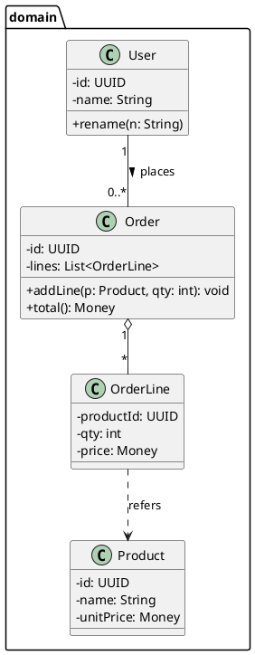

---

## 2. 객체 다이어그램 (Object Diagram)

### 2.1 목적
- **특정 시점의 인스턴스 상태** 스냅샷(런타임 디버깅·테스트 케이스 설명에 유용).

### 2.2 언제 쓰나
- 재현 어려운 버그 시나리오 공유, 예제 기반 문서화.

### 2.3 PlantUML 예제
```plantuml
@startuml
object user1 as "User(id=U1, name=Alice)"
object order1 as "Order(id=O1)"
object line1 as "OrderLine(product=P100, qty=2, price=1000)"
user1 -- order1
order1 -- line1
@enduml
```

---

## 3. 유스케이스 다이어그램 (Use Case Diagram)

### 3.1 목적
- **사용자 관점 요구**를 액터/유스케이스/관계(include/extend)로 표현.

### 3.2 작성 포인트
- 액터 경계 명확화(내부 시스템 vs 외부 역할).
- Include=공통 시나리오, Extend=선택적/예외 플로우.

### 3.3 PlantUML 예제
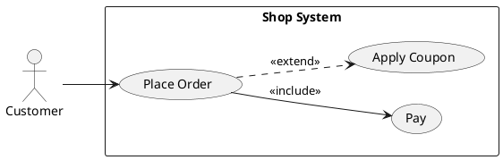

---

## 4. 시퀀스 다이어그램 (Sequence Diagram)

### 4.1 목적
- 객체/컴포넌트 간 **메시지 흐름(시간 순서)**을 표현. 병목·트랜잭션 경계 파악.

### 4.2 작성 팁
- **동기 vs 비동기** 구분(화살표/표기).
- 활성화 바(activation)로 처리 구간 표현.
- 대안/루프는 `alt/loop` 프래그먼트로.

### 4.3 PlantUML 예제
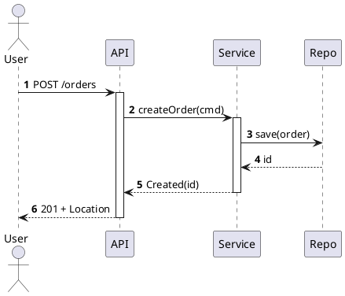

---

## 5. 커뮤니케이션 다이어그램 (Communication Diagram)

### 5.1 목적
- **구조 중심**으로 상호작용 표시(번호 순서로 메시지).
- 시퀀스와 상호보완: 구조 vs 시간.

### 5.2 PlantUML 예제
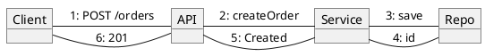

---

## 6. 상태 다이어그램 (State Machine)

### 6.1 목적
- 객체의 **상태 변화/전이 이벤트/가드(조건)** 모델링.

### 6.2 사례
- 주문: `NEW → PAID → SHIPPED → DELIVERED` (+ 취소/반품).

### 6.3 PlantUML 예제
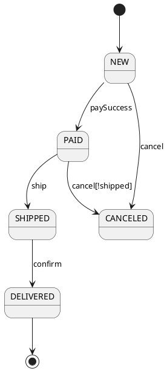

---

## 7. 활동 다이어그램 (Activity Diagram)

### 7.1 목적
- **제어/데이터 흐름**, 분기/병렬을 표현(업무 프로세스·ETL 파이프라인).

### 7.2 PlantUML 예제
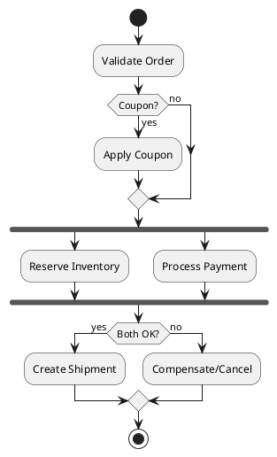

---

## 8. 컴포넌트 다이어그램 (Component Diagram)

### 8.1 목적
- **모듈 경계/포트·인터페이스/의존**. 팀 간 책임/계약 명시.

### 8.2 PlantUML 예제
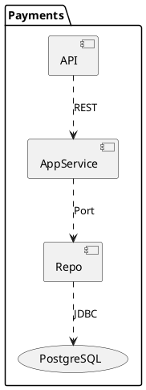

---

## 9. 배포 다이어그램 (Deployment Diagram)

### 9.1 목적
- **물리 노드/런타임 배치/네트워크/아티팩트**를 모델링. 운영/보안 검토에 필수.

### 9.2 PlantUML 예제
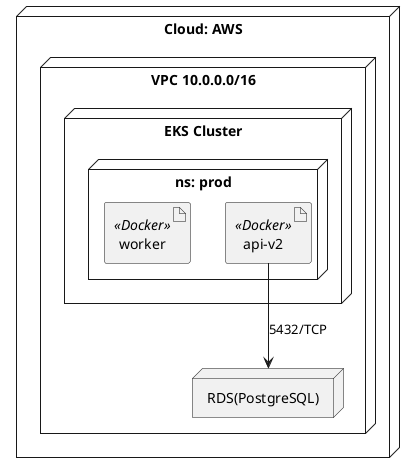

---

## 10. 패키지 다이어그램 (Package Diagram)

### 10.1 목적
- **네임스페이스·모듈 묶음**과 의존(금지/허용 규칙 시각화).

### 10.2 PlantUML 예제
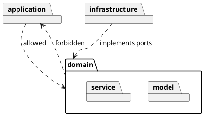

---

## 11. 프로파일 다이어그램 (Profile Diagram)

### 11.1 목적
- UML 확장: **스테레오타입/태그 값**으로 도메인 표준화(예: <<AggregateRoot>>, <<Adapter>>).

### 11.2 PlantUML 유사 표기
```plantuml
@startuml
skinparam stereotypeCBackgroundColor<<AggregateRoot>> #E6F7FF
class Order <<AggregateRoot>>
@enduml
```

---

## 12. 상호작용 개요 (Interaction Overview)

### 12.1 목적
- 여러 상호작용(시퀀스/커뮤니케이션)을 **요약 흐름**으로 묶어 표현(복합 시나리오).

> PlantUML은 전용 표기가 제한적이므로, 활동 다이어그램 + 노트/링크로 묶어 표현하는 전략을 권장.

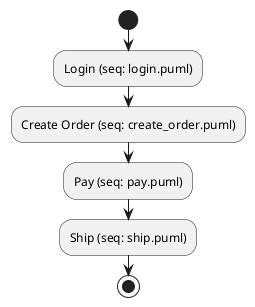

---

## 13. 타이밍 다이어그램 (Timing Diagram)

### 13.1 목적
- 시간 축에 따른 **상태 변화 시점** 모델링(실시간/임베디드/프로토콜 분석).

### 13.2 PlantUML 예제
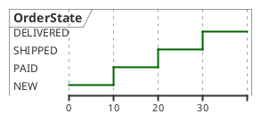

---

## 14. 단계별 활용 순서 — 실무 플로우

1) **요구**: 유스케이스(액터/경계/확장)
2) **행위 검증**: 시퀀스/커뮤니케이션(호출/트랜잭션/오류 플로우)
3) **정적 구조**: 클래스(책임·관계·제약), 패키지(모듈 경계)
4) **아키텍처**: 컴포넌트(포트/어댑터/의존 규칙)
5) **운영**: 배포(노드/네트워크/보안 영역)
6) **세부 행위**: 상태·활동·타이밍(상태기계/프로세스/시간 제약)

---

## 15. 품질 가이드 & 체크리스트

### 15.1 공통 표기 원칙
- 다중성(`1`, `0..1`, `*`, `1..*`) 반드시 표기.
- 방향성/네비게이션/의존 주석.
- “한 장 = 한 메시지” (복잡하면 분할).
- 노트로 **의사결정 근거/가정/제약** 기록(ADR 링크).

### 15.2 다이어그램별 체크
- **클래스**: SRP 위반? 합성 vs 연관 선정 타당? 제약(불변식) 표기?
- **시퀀스**: 동기/비동기 구분, 오류/보상 플로우 포함?
- **상태**: 불변 시작/종료 상태 명시, 전이 가드 정확?
- **컴포넌트**: 포트/인터페이스/계약 드러났는가? 금지 의존 표시?
- **배포**: 네트워크 경계, 포트/프로토콜, 보안 영역/비밀값은 링크로?

---

## 16. 팀 운용 팁 — 도구/자동화/리뷰

- **PlantUML 템플릿**(include)로 브랜드/색상/폰트 통일.
- CI에서 `.puml → .svg` 자동 렌더, 문서 사이트에 포함.
- PR 리뷰 시 **코드(diff) + 렌더 결과 이미지** 동시 확인.
- StarUML은 **스케치/워크샵**에, 최종물은 PlantUML로 이관.
- 보안 정보는 다이어그램에 직접 기재 금지(런북/시크릿 매니저 참조).

---

## 17. 엔드투엔드 예시 — “주문 결제” 시나리오 묶음

### 17.1 유스케이스
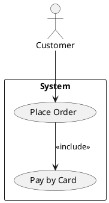

### 17.2 시퀀스
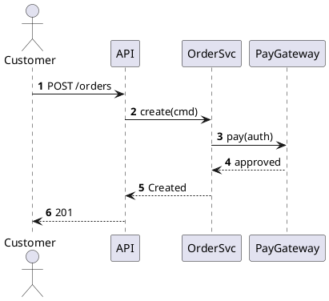

### 17.3 클래스
```plantuml
@startuml
class Order {
  - id: UUID
  - status: OrderStatus
  - lines: List<OrderLine>
  + addLine(p: Product, qty: int)
  + pay(auth: AuthInfo)
}
enum OrderStatus { NEW; PAID; SHIPPED; DELIVERED; CANCELED }
Order o-- OrderLine
@enduml
```

### 17.4 상태
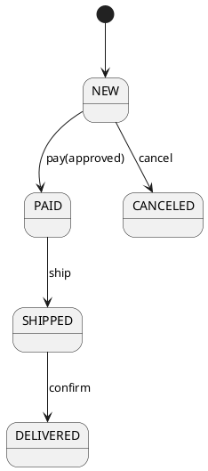

### 17.5 컴포넌트/배포
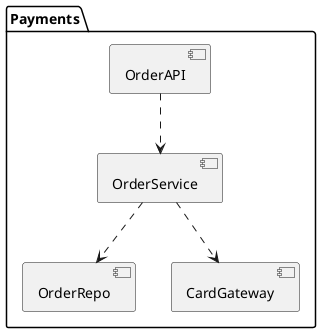

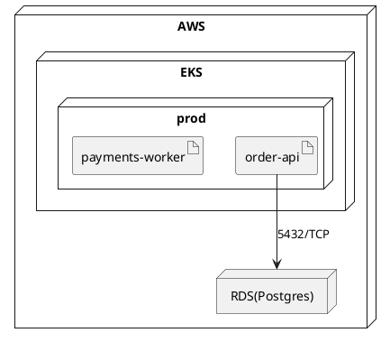

---

## 18. 흔한 안티패턴과 회피법

- **모든 걸 한 장에**: 읽을 수 없으면 문서가 아니다 → 세분화.
- **연관 과다**: 결합도 상승 → 인터페이스·도메인 서비스로 중개.
- **다중성/제약 누락**: 구현 오해 유발 → 필수 표기.
- **코드와 다이어그램 불일치**: CI 렌더·리뷰로 동기화, 릴리즈 태그와 함께 버전 관리.

---

## 19. 결론

UML은 단순 그림이 아니라 **의사결정·책임·경계**를 공유하는 **공통 언어**다.
정적/동적 다이어그램을 목적에 맞게 선택하고, **템플릿·자동화·리뷰** 체계를 갖추면
설계 문서는 “한 번 그리고 잊히는 아트”가 아니라 **지속적으로 개선되는 지식 베이스**가 된다.

> 실천 한 가지: 오늘 사용하는 대표 플로우(예: 주문 생성)를 **유스케이스·시퀀스·클래스** 3종으로 묶어 저장소에 추가하고, CI로 자동 렌더를 돌려보자.
> 다음 릴리즈부터 **추적성(UC→Seq→Class→Comp→Deploy)**을 릴리즈 노트에 링크한다.
