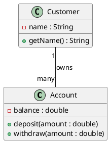

# UML 툴 소개 (PlantUML, StarUML 등)

## 1. UML 툴의 필요성

**UML(Unified Modeling Language)**은 소프트웨어 시스템의 구조와 동작을 시각적으로 표현하기 위한 표준화된 언어입니다.  
UML 다이어그램을 작성하면 시스템 설계를 직관적으로 공유할 수 있어 **팀 협업, 문서화, 아키텍처 분석**에 큰 도움이 됩니다.

하지만 UML을 손으로 그리면:
- 변경 사항이 있을 때 수정이 번거로움
- 다이어그램 버전 관리가 어려움
- 여러 사람이 동시에 작업하기 힘듦

이 문제를 해결하기 위해 **UML 전용 도구**가 등장했습니다.  
대표적인 예로 **PlantUML**과 **StarUML**이 있습니다.

---

## 2. PlantUML

### 2.1 개요
- **텍스트 기반** UML 다이어그램 생성 도구
- 단순한 스크립트 언어를 이용해 다이어그램을 코드로 정의
- **Git** 등 버전 관리와 잘 어울림
- CLI, IDE 플러그인, 웹 서비스 등 다양한 방식으로 사용 가능

### 2.2 장점
1. **코드 기반 관리 가능**
   - `.puml` 파일로 저장 가능 → Git 버전 관리 용이
2. **자동화에 강함**
   - CI/CD 파이프라인에서 다이어그램 자동 생성 가능
3. **가벼운 의존성**
   - 별도 무거운 설치 없이도 웹 환경에서 실행 가능
4. **다양한 다이어그램 지원**
   - 클래스 다이어그램, 시퀀스 다이어그램, 유스케이스, 컴포넌트 등

### 2.3 단점
- 실시간 드래그 앤 드롭 편집 기능이 없음
- 학습을 위해 문법 익혀야 함

### 2.4 예시 코드

---

## 3. StarUML

### 3.1 개요
- **GUI 기반** UML 설계 도구
- 드래그 앤 드롭으로 다이어그램 작성
- 다양한 다이어그램 템플릿 제공
- Windows, macOS, Linux 지원

### 3.2 장점
1. **시각적 편집 용이**
   - 초보자도 빠르게 다이어그램 작성 가능
2. **다양한 확장 기능**
   - Java, C++, Python 코드 생성
   - 플러그인 마켓 제공
3. **다양한 파일 포맷 내보내기**
   - PNG, SVG, PDF 등

### 3.3 단점
- 유료 라이선스(무료 체험판 제공)
- Git과 직접적으로 연동되는 텍스트 기반 저장 방식이 아님

---

## 4. PlantUML vs StarUML 비교

| 항목               | PlantUML                                | StarUML                            |
|--------------------|----------------------------------------|-------------------------------------|
| **편집 방식**      | 텍스트 기반 코드 작성                   | GUI 드래그 앤 드롭                  |
| **버전 관리**      | Git 친화적                              | 외부 파일 관리 필요                 |
| **학습 곡선**      | 문법 학습 필요                          | 직관적이지만 기능 숙지 필요         |
| **자동화**         | CI/CD, 스크립트 자동 생성에 강함        | 자동화 기능은 제한적                |
| **라이선스**       | 무료 (오픈소스)                         | 유료 (체험판 있음)                  |
| **주요 사용 사례** | 대규모 프로젝트, 문서화 자동화          | 설계 초기 단계, 시각적 아이디어 공유 |

---

## 5. 기타 UML 툴 간단 소개

- **Lucidchart**: 클라우드 기반 협업 다이어그램 툴 (UML, ERD, 플로우차트 지원)
- **Draw.io / Diagrams.net**: 무료 온라인 다이어그램 편집기
- **Visual Paradigm**: 강력한 설계·문서화 기능, 팀 협업에 최적화
- **Enterprise Architect**: 대규모 기업 환경에 적합한 UML·SysML 툴

---

## 6. 결론

- **PlantUML**은 텍스트 기반이라 **자동화·버전 관리**에 강하고,
- **StarUML**은 GUI 기반이라 **시각적 설계**와 빠른 프로토타이핑에 적합합니다.

따라서:
- **자동화와 협업 문서화**가 필요 → PlantUML
- **빠른 시각화와 프레젠테이션**이 필요 → StarUML