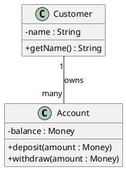
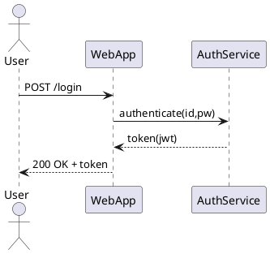
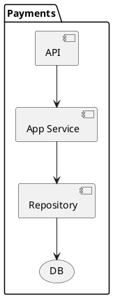
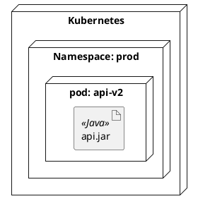
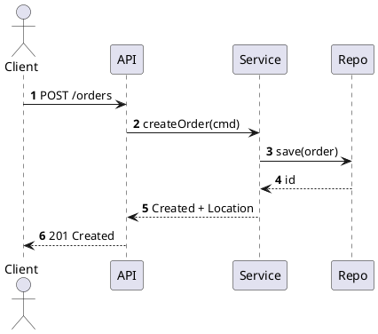

# UML 툴 소개 (PlantUML, StarUML 등)

## 한눈 요약

- **PlantUML**: 텍스트로 다이어그램을 “코드처럼” 관리. Git·리뷰·자동화에 최적. 문서-코드 동기화, CI로 대량 렌더링에 강함.
- **StarUML**: GUI 드래그 앤 드롭 기반 모델링. **빠른 시각화/워크샵**과 **라운드트립(code ↔ model) 기반 설계 탐색**에 유리.
- **선택 가이드**:
  - 문서 자동화/버전관리/리뷰 중심 → **PlantUML**
  - 워크샵/발표/실시간 도식 중심 → **StarUML**
  - 혼합 전략: 도메인·아키텍처는 PlantUML, 초기 스케치·모델 탐색은 StarUML.

---

## UML 툴의 필요성과 선정 기준

### 왜 도구가 필요한가

- 변경 추적(히스토리)·리뷰(코멘트)·재사용(템플릿)·일관성(스타일)을 지원해야 **설계 문서가 부채가 아니라 자산**이 된다.
- 수작업(이미지 편집)은 **동기화 비용**이 폭발. 툴은 재생성/자동화를 가능하게 한다.

### 선정 체크리스트

- **협업·버전관리**: Git 친화성(텍스트/JSON 포맷), PR 리뷰 난이도
- **자동화**: CLI/서버 렌더링, CI 통합 용이성
- **표현력**: 클래스/시퀀스/컴포넌트/배치/상태/활동/유스케이스/패키지 등 지원
- **확장성**: 테마/스킨/매크로/플러그인, 모델 프로파일/스테레오타입
- **라이선스/비용**: 개인/팀/기업 라이선스, 오프라인 사용
- **학습곡선**: 텍스트 문법 vs GUI 조작 난이도
- **자산화**: 재사용 가능한 템플릿, 표준 스타일 가이드

---

## PlantUML — 텍스트 기반 다이어그램

### 개요

- `.puml` 스크립트로 UML·C4·ERD·마인드맵 등 다양한 다이어그램을 **코드처럼** 정의.
- **Graphviz(dot)** 기반 레이아웃(일부 유형) 사용. 로컬 JAR, Docker, 서버(예: Kroki) 등 다채로운 실행 방식 지원.

### 설치/실행 옵션

#### 단일 JAR(로컬)

```bash
java -jar plantuml.jar -version
java -jar plantuml.jar -tpng docs/diagrams/*.puml   # PNG
java -jar plantuml.jar -tsvg docs/diagrams/*.puml   # SVG
```

#### Docker

```bash
docker run --rm -v $PWD:/work plantuml/plantuml -tsvg /work/docs/diagrams/*.puml
```

#### VS Code 플러그인

- “PlantUML” 확장 설치 → 미리보기/렌더/스니펫.
- 워크스페이스 설정에서 Java/Graphviz 경로 지정 가능.

#### 서버/HTTP 렌더(예: Kroki) — 문서 툴과 연계

- 사내 **Kroki** 배포 후 Markdown 내 PlantUML를 즉시 렌더(보안상 내부망 권장).

### 대표 다이어그램 예제

#### 클래스 다이어그램



#### 시퀀스 다이어그램



#### 컴포넌트 다이어그램



#### 배치(Deployment)



### 스타일·테마·재사용(실무 팁)

- **skinparam**: 일관된 브랜드 색/폰트 적용
```plantuml
@startuml
skinparam defaultFontName Noto Sans
skinparam ArrowColor #444444
skinparam ClassBackgroundColor #FAFAFA
skinparam ClassBorderColor #888888
' ... 다이어그램 본문 ...
@enduml
```

- **include/!define**: 공통 헤더로 DRY 유지
```plantuml
' _common.puml
!define BRAND_COLOR #003366
skinparam ArrowColor BRAND_COLOR
```
```plantuml
@startuml
!include _common.puml
' 공통 스타일이 자동 적용
@enduml
```

- **C4-PlantUML**(아키텍처 C4 모델)
```plantuml
@startuml
!include C4_Container.puml
Person(user, "User")
System_Boundary(s, "Shop") {
  Container(api, "API", "Spring", "REST")
  ContainerDb(db, "DB", "PostgreSQL", "Orders")
}
Rel(user, api, "Uses")
Rel(api, db, "JDBC")
@enduml
```

### CI/CD 자동화(문서 생성 파이프라인)

#### GitHub Actions 예

```yaml
name: build-diagrams
on: [push, pull_request]
jobs:
  plantuml:
    runs-on: ubuntu-latest
    steps:
      - uses: actions/checkout@v4
      - name: Render PlantUML
        run: |
          docker run --rm -v $PWD:/work plantuml/plantuml -tsvg /work/docs/diagrams/*.puml
      - name: Upload artifacts
        uses: actions/upload-artifact@v4
        with:
          name: diagrams
          path: docs/diagrams/*.svg
```

### 마크다운·정적 사이트 연계

- Jekyll/MkDocs/Docusaurus 등에서 **SVG 링크** 삽입 → PR 미리보기에서 바로 확인.
- “문서용 코드블록 + CI 렌더 결과”를 같이 관리하면 리뷰 문화를 정착시키기 쉽다.

### 장단점(요약)

- **장점**: 버전관리·리뷰·자동화·재사용·일관 스타일에 강함. 대규모 문서화에 적합.
- **단점**: 문법 학습 필요. 복잡한 수동 레이아웃(정교한 위치 조정)은 GUI보다 시간이 걸릴 수 있음.

---

## StarUML — GUI 기반 모델링

### 개요

- 드래그 앤 드롭으로 빠르게 **UML 2.x** 모델 작성.
- 다이어그램: 클래스/시퀀스/유스케이스/활동/상태/컴포넌트/배치 등 폭넓게 지원.
- 확장/코드생성/역공학(Reverse) 기능을 통해 **모델↔코드** 왕복 작업을 보조.

### 핵심 기능(실무 관점)

- **시각적 편집**: 워크샵/회의에서 실시간 스케치·토론에 유리.
- **모델 구조 관리**: 패키지·서브시스템·프로파일/스테레오타입으로 메타모델 확장.
- **코드 엔지니어링**: 언어별 코드 생성/역공학(지원 범위·완성도는 언어/버전에 의존).
- **다이어그램 템플릿**: 반복 구조를 빠르게 복제·커스터마이즈.

### 파일·버전 관리 팁

- 기본 **`.mdj`(JSON)** 포맷: 이진이 아니라 텍스트 기반이라 Git diff가 가능하나, GUI 툴 특성상 충돌이 잦을 수 있다.
- 팀 협업 시:
  - **다이어그램 분할**(모듈별 파일)
  - **편집 소유권(코드 오너쉽)** 지정
  - PR 시 캡처 이미지(Export PNG/SVG)도 함께 첨부해 리뷰 편의 제공

### 코드 생성·역공학(주의점)

- **도메인 모델 = 코드 1:1 매핑**이 항상 적절하지 않다.
- “설계 의사결정 문서화”가 목표라면 **코드 자동 생성을 보조 도구**로 사용(수동 편집 토대).
- 역공학은 “현재 코드 스냅샷”을 시각화하는 용도로 유용하나, 설계 의도가 잃기 쉬우므로 **주석/노트**로 맥락을 보강.

### 확장(플러그인)·템플릿

- 확장 시스템(자바스크립트 기반)으로 **메뉴/패널/코드 템플릿**을 커스터마이즈.
- 템플릿 엔진 기반(예: EJS/Handlebars 유사 방식)을 사용해 **클래스→코드**를 출력.
  - 예: `Class` 속성과 `Operation`을 순회해 언어별 보일러플레이트 생성.

> 팁: 코드 생성기를 팀 표준(헤더/라이선스/주석/어노테이션)에 맞게 커스터마이즈해 **초기발판**으로 쓰고, 세부 구현은 IDE에서.

### 장단점(요약)

- **장점**: 진입장벽 낮음, 빠른 스케치/발표/초기 설계 토론에 최적. 모델 전개/관계 탐색이 직관적.
- **단점**: 자동화/버전관리/리뷰 워크플로는 텍스트 기반 대비 불리. 팀 규모가 커질수록 **모델 품질 가이드**가 필수.

---

## PlantUML vs StarUML — 확장 비교

| 항목 | PlantUML | StarUML |
|---|---|---|
| 편집 방식 | 텍스트(코드) | GUI(마우스) |
| 버전 관리 | Git에 최적(리뷰/PR) | 가능하나 충돌 관리 필요 |
| 자동화 | CLI·Docker·서버로 CI 통합 용이 | 제한적(스크립팅/플러그인으로 보완) |
| 표준화/재사용 | include/매크로/테마로 강력 | 템플릿/프로파일로 일부 지원 |
| 학습 곡선 | 문법 학습 필요 | 조작 직관적(모델 개념 학습 필요) |
| 시연/워크샵 | 미리 정의 or 라이브 편집(제한) | 매우 유리 |
| 대규모 문서화 | 매우 유리 | 파일·충돌 관리가 관건 |
| 라이선스 | 오픈소스(무료) | 상용(체험판 있음) |

---

## 실무 워크플로(권장)

### “문서-우선(Documentation-first)”

- **PlantUML**로 모든 다이어그램을 저장소에 두고, 문서(Jekyll/MkDocs) 파이프라인에서 자동 렌더.
- **리뷰 문화**: 다이어그램 diff(코드) + 결과 이미지(아티팩트)를 함께 리뷰.

### “워크샵-우선(Workshop-first)”

- 아이디어 발산·스케치를 **StarUML**에서 빠르게 수행 → PNG/SVG로 내보내 공유.
- 합의된 결과를 **PlantUML 템플릿**으로 이관해 **지속 문서화**에 편입.

### 혼합 운용 체크리스트

- [ ] 다이어그램 명명 규칙(도메인/유스케이스/번호)
- [ ] 공통 스타일 템플릿(PlantUML include)
- [ ] 저장소 구조(`docs/diagrams/{domain}/...`)
- [ ] PR 체크: 렌더 성공/링크 유효성/표기 규칙
- [ ] StarUML 산출물은 **최종본만** 저장(중간본은 아티팩트)

---

## 추가 툴 스냅샷

- **Lucidchart**: 클라우드 협업·코멘트·버전 기록에 강함. 비개발자 협업 유리.
- **Draw.io/diagrams.net**: 무료/경량. GDrive/GitHub 연동.
- **Visual Paradigm**: 엔터프라이즈 모델링·요구/프로세스·팀 협업 도구 풍부.
- **Enterprise Architect**: 대규모 시스템/엔지니어링(요건·추적성) 강점.
- **Mermaid**: GitHub/GitLab Markdown에 내장되기 쉬운 텍스트 다이어그램.
- **Structurizr DSL**: C4 모델 특화 텍스트 DSL(코드 중심 아키텍처 문서화).

---

## 품질·표기 가이드(실무 룰)

- **다중성/방향성/의존성**을 정확히 표기(특히 클래스/컴포넌트).
- 다이어그램은 **한 메시지**만 전달(“한 장 = 한 주장”).
- **노트/제약**으로 의사결정 근거를 남김(Trade-off, 가정).
- **패키지/레이어**를 명확히 구분하고 “계층 넘나들기”를 시각화.
- 릴리즈마다 **ADR(아키텍처 결정 기록)** 링크.

---

## 템플릿 모음(붙여넣어 바로 사용)

### PlantUML 공통 헤더(`_common.puml`)

```plantuml
' 프로젝트 공통 테마/스킨
!define PRIMARY #003366
skinparam defaultFontName Noto Sans
skinparam ArrowColor PRIMARY
skinparam PackageBorderColor PRIMARY
skinparam ClassBorderColor #666666
skinparam BackgroundColor #FFFFFF
' 공통 스테레오타입 컬러
skinparam stereotypeCBackgroundColor<<Adapter>> #FFF7E6
skinparam stereotypeCBackgroundColor<<Domain>>  #E6F7FF
```

### 클래스/컴포넌트 예(일관 표기)

```plantuml
@startuml
!include _common.puml
package "Domain" {
  class Order <<Domain>> {
    - id : UUID
    - lines : List<OrderLine>
    + total() : Money
  }
  class OrderLine <<Domain>> {
    - productId : UUID
    - qty : int
    - price : Money
  }
}
package "Adapters" {
  component "OrderRepositoryJPA" <<Adapter>>
  component "PaymentGatewayHTTP" <<Adapter>>
}
Order "1" o-- "*" OrderLine
Order ..> "OrderRepository (port)"
"OrderRepositoryJPA" ..|> "OrderRepository (port)"
@enduml
```

### 시퀀스(API 플로우)



### GitHub Actions(문서 사이트 빌드 포함)

```yaml
name: docs
on: [push]
jobs:
  build-docs:
    runs-on: ubuntu-latest
    steps:
      - uses: actions/checkout@v4
      - name: Render diagrams
        run: docker run --rm -v $PWD:/work plantuml/plantuml -tsvg /work/docs/diagrams/**/*.puml
      - name: Build site
        run: mkdocs build --strict
      - name: Publish (pages)
        uses: actions/upload-pages-artifact@v3
        with: { path: site }
```

---

## 트러블슈팅

- **PlantUML 화살표/레이아웃이 꼬임**
  - 관계 수 줄이기, 패키지 분할, `left to right direction` 사용, 서브다이어그램로 쪼갬.
- **Graphviz 미설치/폰트 깨짐**
  - 시스템 폰트 설치(예: NotoSans CJK), Docker 이미지 사용으로 환경 고정.
- **StarUML Git 충돌**
  - 파일 분할, 편집 소유권, PR 단위 축소, 내보낸 PNG/SVG 함께 첨부로 리뷰 용이화.
- **코드 생성 결과와 설계 불일치**
  - 코드 생성기는 “초기 뼈대”로만 사용, 설계 변화는 **모델-문서**가 기준.

---

## 보안·준수(Enterprise Tips)

- 다이어그램에 **비밀값/키/세부 엔드포인트** 직접 기재 금지(런북·보안 저장소 참조 링크로 대체).
- 외부 테마/원격 include는 내부 저장소에 **베너링** 후 사용(서드파티 의존 제거).
- 사내 표준 **UML Profile / Color Palette / Icon Set** 운용으로 브랜드·가독성 일관.

---

## 최종 선택 가이드(의사결정 트리 요약)

- PR·리뷰·자동화·장기 문서화가 핵심? → **PlantUML**
- 워크샵/시연·초기 합의 속도가 핵심? → **StarUML**
- **둘 다** 필요? → StarUML로 스케치 → PlantUML 템플릿에 이관 → CI 문서화.

---

## 체크리스트(팀 적용 전)

- [ ] 공통 스타일 파일(PlantUML include)과 명명 규칙
- [ ] 저장소 구조/빌드 파이프라인/미리보기(프리뷰)
- [ ] StarUML 파일 분할·오너십 규칙
- [ ] ADR/런북 링크 정책(다이어그램에서 참조)
- [ ] 리뷰 기준(다중성/의존/패키징/노트 필수 여부)
- [ ] 보안·비공개 정보 취급 수칙(원격 include 금지 여부)

---

## 결론

UML 툴은 단순 그림 도구가 아니라 **조직의 설계 자산화 파이프라인**의 핵심 요소다.
**PlantUML**은 텍스트·자동화·버전관리로 설계 문서를 코드처럼 운용하게 하고, **StarUML**은 시각적 사고와 합의를 빠르게 이끈다.
두 도구의 강점을 분명히 알고 **역할을 분담**하면, 설계는 “그때그때 그린 그림”이 아니라 **지속적으로 개선·검증되는 지식 베이스**가 된다.
