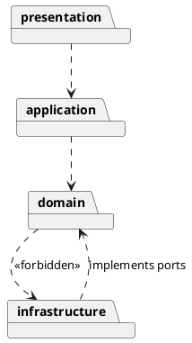
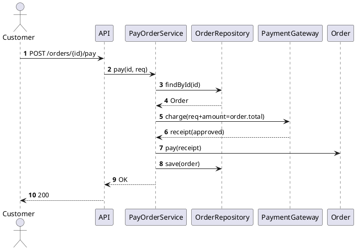
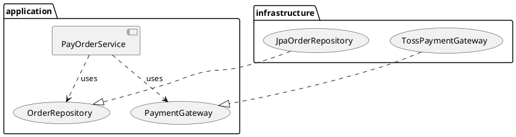
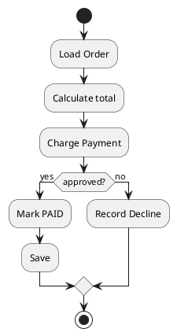
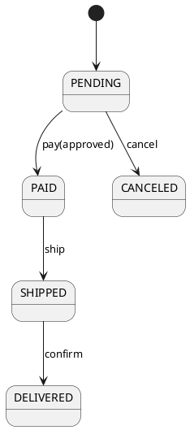

# 실전에서 객체 지향 설계

## 0. 전체 로드맵 — 요구→설계→검증의 얇은 루프

1) **유비쿼터스 언어** 정리(명사/동사 라벨링)  
2) **유스케이스 시나리오**(GWT) → **시퀀스** 대략 스케치  
3) **경계(Ports)** 우선 설계, **DTO/매퍼**로 외부 절연  
4) **엔티티/VO**의 불변 조건과 메서드 책임 확정  
5) **합성(Strategy/위임)**으로 정책 분리·교체 가능하게  
6) **단위 테스트** 먼저(도메인 순수), **Fake/계약 테스트** 병행  
7) 작게 배포 → 관찰성 지표로 피드백 → 리팩토링

---

## 1. 시작 단계 — 문제를 OO로 바라보는 습관

### 1.1 유비쿼터스 언어부터
- 요구 문장 속 **명사 → 클래스/VO 후보**, **동사 → 책임/메서드**로 표시.
- 팀 전체가 같은 단어를 쓰도록 용어집(glossary) 유지.

**미니 예시(전자상거래—주문/결제)**  
- 명사: 고객, 주문, 주문항목, 결제, 쿠폰, 재고, 송장  
- 동사: 생성하다, 결제하다, 적용하다, 출고하다, 취소하다  
- 후보: `Order`, `OrderLine`, `Payment`, `Coupon`(VO), `InventoryService`(도메인 서비스)

### 1.2 유스케이스를 시나리오로 (GWT)
- 3~5줄로 짧게, 나중에 테스트 이름으로 재사용.
```
Given 장바구니에 단가 10, 수량 3인 상품 A가 있고
And 10% 쿠폰이 적용되었고
When 결제를 요청하면
Then 결제 금액은 27이어야 한다
And 주문 상태는 PAID가 된다
```

### 1.3 CRC 카드 10분
- `Responsibility / Collaborators`만 휘갈겨 적고 토론 → 과도한 속성 목록화 금지.

---

## 2. 경계(Interfaces) 먼저, 내부는 나중에

### 2.1 포트/어댑터(Ports & Adapters)
- 도메인/애플리케이션 레이어가 **원하는 계약(Port 인터페이스)** 을 먼저 선언.  
- DB/HTTP/메시징 등은 **Adapter 구현**으로 나중에 붙인다.

```java
// application/port/out
public interface PaymentGateway {
    PaymentReceipt charge(PaymentRequest req);
}

// infrastructure/adapter (구현은 나중에)
public final class TossPaymentGateway implements PaymentGateway { ... }
```

### 2.2 DTO로 외부 표현 절연
- HTTP/DB 스키마 ↔ 도메인 모델 직접 결합 금지.  
- 컨트롤러에서는 `RequestDTO → Command/VO`, `Result → ResponseDTO` 매핑.

```java
public record PayOrderRequest(String orderId, String cardToken, int amountCents) { }
public record PayOrderResponse(String orderId, String status) { }
```

### 2.3 작은 인터페이스(ISP)
- “한 유스케이스에 필요한 메서드만” 노출. 거대한 레포지토리 금지.

---

## 3. 합성(Composition) 우선, 상속은 신중하게

### 3.1 의사결정 규칙
- **상속**은 ① is-a 엄격, ② LSP 위배 없음, ③ 공통 로직을 ‘진짜로’ 공유해야 할 때만.  
- 그 외는 **합성 + 위임(Strategy/Decorator/Policy)**.

```java
interface FeePolicy { Money fee(Money base); }
final class PercentFee implements FeePolicy {
  private final int percent; // e.g., 10 = 10%
  public Money fee(Money base) { return base.multiply(percent).divide(100); }
}
final class FixedFee implements FeePolicy {
  private final Money fixed;
  public Money fee(Money base) { return fixed; }
}
final class Checkout {
  private final FeePolicy fee;
  public Checkout(FeePolicy fee) { this.fee = fee; }
  public Money settle(Money subtotal) { return subtotal.add(fee.fee(subtotal)); }
}
```

---

## 4. 캡슐화와 불변 조건(Invariant) 강조

### 4.1 엔티티의 규칙은 엔티티가 지킨다
- 출금 가능 금액, 재고 음수 금지, 상태 전이 등 **도메인 규칙**은 엔티티 메서드에서 검증.

```java
public final class BankAccount {
  private Money balance;
  public void withdraw(Money amt) {
    if (amt.isNegativeOrZero()) throw new IllegalArgumentException("amount>0");
    if (balance.isLessThan(amt)) throw new InsufficientFunds();
    balance = balance.minus(amt);
  }
}
```

### 4.2 값 객체는 불변
- `Money`, `Percentage`, `Address`, `DateRange` 등은 **불변**으로.

```java
public record Money(long cents, String currency) {
  public Money add(Money m){
    requireSameCurrency(m);
    return new Money(cents + m.cents, currency);
  }
  public boolean isLessThan(Money m){ requireSameCurrency(m); return cents < m.cents; }
  private void requireSameCurrency(Money other){
    if(!currency.equals(other.currency)) throw new IllegalArgumentException("currency mismatch");
  }
}
```

### 4.3 수학적 불변식 표기(문서/테스트에 명시)
- 잔고 불변식:  
  $$ \forall t \in \text{Transactions} : \ \text{balance}_t \ge 0 $$
- 주문 합계:  
  $$ \text{total}=\sum_{i=1}^{n} (\text{unitPrice}_i \times \text{qty}_i) - \text{discounts} $$

---

## 5. 상태와 트랜잭션의 위치

### 5.1 트랜잭션 경계는 유스케이스(애플리케이션 서비스)
- 엔티티는 규칙만, **커밋/롤백은 서비스**가 책임.

```java
public class TransferService {
  private final AccountRepository repo;
  @Transactional
  public void transfer(AccountId from, AccountId to, Money amt) {
    var a = repo.get(from); var b = repo.get(to);
    a.withdraw(amt); b.deposit(amt);
    repo.save(a); repo.save(b);
  }
}
```

### 5.2 동시성/일관성 모델 문서화
- 낙관적 락(버전), 재시도 정책, 이벤트 기반 보상 흐름을 **시퀀스**로 남긴다.

---

## 6. 테스트는 설계의 가드레일

### 6.1 도메인 테스트는 I/O 없이
```java
@Test
void withdraw_fails_when_insufficient_balance() {
  var acc = new BankAccount(new Money(1000, "KRW"));
  assertThrows(InsufficientFunds.class, () -> acc.withdraw(new Money(2000, "KRW")));
}
```

### 6.2 포트 더블은 Fake 선호(단순 저장소)
```java
public final class InMemoryAccountRepository implements AccountRepository {
  private final Map<AccountId, BankAccount> store = new ConcurrentHashMap<>();
  public BankAccount get(AccountId id){ return Optional.ofNullable(store.get(id)).orElseThrow(); }
  public void save(BankAccount a){ store.put(a.getId(), a); }
}
```

### 6.3 행위 검증은 꼭 필요할 때만(Mock)
- 외부 게이트웨이 호출, 메시지 발행 등 **상호작용** 확인에 제한적으로 사용.

---

## 7. 리팩토링 루틴 — 냄새→전술 패턴

| 냄새 | 전술 |
|---|---|
| 긴 메서드 | Extract Method, Guard Clause |
| 거대 클래스 | Extract Class/Module |
| 반복 switch | Strategy/다형성 |
| 메시지 체인 | 중개자/디미터 법칙 |
| 데이터 클래스 | 행동 캡슐화(메서드 이동) |

- 원자적 커밋, 테스트 항상 초록.  
- 코드와 **UML(PlantUML)** 을 함께 갱신.

---

## 8. 패키지/모듈 구조 — 의존 방향 고정

```
com.example.shop
 ├─ presentation   (controllers, request/response DTO)
 ├─ application    (use cases, services, ports in/out)
 ├─ domain         (entities, value objects, domain services)
 └─ infrastructure (adapters: persistence, messaging, api)
```

- 방향: `presentation → application → domain ← infrastructure`  
- 금지: `presentation → infrastructure` 직접 의존, `domain`의 프레임워크 의존

**PlantUML(금지/허용 규칙 표기)**


---

## 9. 에러/예외, 유효성, 로깅/트레이싱

### 9.1 예외 정책
- 도메인 규칙 위반 → 도메인 예외(런타임)  
- 시스템 실패(I/O) → 재시도/회로차단, `Either/Result`로 표면화 고려

### 9.2 유효성 두 레이어
- DTO 수준(형식/필수값) + 도메인 수준(불변 조건)

### 9.3 관찰성
- 유스케이스 시작/성공/실패, 도메인 이벤트를 **구조화 로그**(traceId, orderId 등 키 포함)로 남긴다.

---

## 10. 성능과 단순성의 균형

- **측정 후 최적화**: p95/p99, 프로파일러 근거로만 변경  
- **핫스팟만 가변**: 기본은 불변/함수형, 정말 필요한 곳에만 가변 구조  
- **N+1/채터링** 방지: 일괄 조회, 캐시, 페이지네이션, 단위 경계 튜닝

---

## 11. 보안·버전·호환성

- **경계마다 인증/인가**: 도메인 서비스는 권한을 입력(Policy)으로 받거나 상위에서 체크  
- **SemVer + 계약 테스트**: 공개 API/이벤트는 후방 호환 우선  
- 민감 데이터는 모델/다이어그램에 마킹, 마스킹·암호화 전략을 ADR로 기록

---

## 12. 프런트/백/DB 매핑 팁

- 프런트 DTO는 화면 전용, **도메인 모델을 그대로 직렬화 금지**  
- 백엔드 `Assembler/Mapper` 계층으로 변환 책임 집중  
- DB는 읽기 최적화 쿼리는 **별도 리포트 모델**로(쿼리 객체, View, Projection)

---

## 13. 팀 운영 관행 — PR/ADR/회고

### 13.1 PR 템플릿 핵심 질문
- 이 변경의 도메인 규칙은?  
- 어떤 포트를 추가·수정했는가?  
- 테스트(단위/통합/계약) 범위는?

### 13.2 ADR(Architecture Decision Record) 초안
```
Context: 결제 게이트웨이 다중화 필요
Decision: Strategy + Port/Adapter로 외부 게이트웨이 교체 가능 설계
Consequences: 테스트 더블 용이, 런타임 전환 간단 / 초기 인터페이스 정의 비용
```

### 13.3 지표로 회고
- 결함 밀도, Lead Time, Change Failure Rate, MTTR

---

## 14. 함정과 회피법(요약)

| 함정 | 징후 | 회피법 |
|---|---|---|
| Anemic Domain Model | 엔티티가 getter/setter만 | 규칙을 엔티티 메서드로 이동 |
| God Service | 애플리케이션 서비스가 모든 일 | 유스케이스별 분해 |
| 상속 남용 | 조건 분기·LSP 위반 | 합성·전략으로 교체 |
| 프레임워크 누수 | 도메인에 JPA/HTTP 타입 | 포트/DTO로 절연 |
| 테스트 느림 | DB/네트워크 기본 의존 | 도메인 순수 테스트 + Fake/계약 |

---

## 15. 적용 체크리스트(출시 전 2분 점검)

- [ ] 도메인 규칙이 **엔티티/VO 내부**에서 강제되는가?  
- [ ] 외부 I/O가 **포트/어댑터**로 격리되었는가?  
- [ ] **합성 우선** 원칙을 지켰는가?  
- [ ] **유스케이스 경계**에 트랜잭션이 모였는가?  
- [ ] 도메인 테스트가 **I/O 없이 빠르게** 통과하는가?  
- [ ] API/이벤트의 **버전·문서·계약 테스트**가 있는가?  
- [ ] **로그/메트릭/트레이스**로 관찰 가능한가?

---

## 16. 미니 스켈레톤 — 주문 결제(자바)

### 16.1 도메인
```java
// domain/model
public final class Order {
  private final OrderId id;
  private OrderStatus status;
  private final List<OrderLine> lines = new ArrayList<>();
  public Money total() {
    return lines.stream().map(OrderLine::amount).reduce(Money.zero("KRW"), Money::add);
  }
  public void pay(PaymentReceipt receipt){
    if(status != OrderStatus.PENDING) throw new IllegalStateException("not payable");
    if(receipt.approved()) status = OrderStatus.PAID;
    else throw new PaymentDeclined();
  }
}
public record OrderLine(ProductId productId, int qty, Money unitPrice) {
  public Money amount(){ return unitPrice.multiply(qty); }
}
```

### 16.2 포트/서비스
```java
// application/port/out
public interface OrderRepository {
  Optional<Order> findById(OrderId id);
  void save(Order order);
}
public interface PaymentGateway {
  PaymentReceipt charge(PaymentRequest req);
}

// application/service
public final class PayOrderService {
  private final OrderRepository repo;
  private final PaymentGateway gateway;
  public PayOrderService(OrderRepository repo, PaymentGateway gateway) {
    this.repo = repo; this.gateway = gateway;
  }
  @Transactional
  public void pay(OrderId id, PaymentRequest req){
    var order = repo.findById(id).orElseThrow();
    var receipt = gateway.charge(req.withAmount(order.total()));
    order.pay(receipt);
    repo.save(order);
  }
}
```

### 16.3 단위 테스트
```java
class OrderTest {
  @Test
  void total_sums_lines(){
    var o = Fixtures.orderWithLines( // Test Data Builder 가정
      line("A", 2, 1000), line("B", 1, 500));
    assertEquals(2500, o.total().cents());
  }
}
```

---

## 17. UML로 한 방에 조망 — 시퀀스/클래스/컴포넌트

### 17.1 시퀀스(결제 흐름)


### 17.2 클래스
```plantuml
@startuml
class Order {
  - id: OrderId
  - status: OrderStatus
  - lines: List<OrderLine>
  + total(): Money
  + pay(receipt: PaymentReceipt)
}
class OrderLine { - productId: ProductId; - qty: int; - unitPrice: Money; + amount(): Money }
enum OrderStatus { PENDING; PAID; SHIPPED; DELIVERED; CANCELED }
Order o-- "*" OrderLine
@enduml
```

### 17.3 컴포넌트/포트


---

## 18. 활동·상태 — 실패/보상 흐름까지 설계

### 18.1 활동(결제 과정)


### 18.2 상태(주문 라이프사이클)


---

## 19. 확장 시나리오 — 정책/통화/세금

- 정책(수수료·할인)은 **Strategy**로 추가
- 통화는 `Money` VO로 통일(환율은 별도 도메인 서비스)
- 세금(VAT) 계산은 `TaxPolicy`로 분리(지역별 전략)

```java
interface DiscountPolicy { Money discount(Money subtotal); }
final class PercentDiscount implements DiscountPolicy { ... }
final class NoDiscount implements DiscountPolicy { ... }
```

---

## 20. 마무리 — “완벽” 대신 “진화 가능한 설계”

- **작게 시작해서 빠르게 검증**: 경계/불변부터, 정책은 합성으로 분리  
- **테스트는 문서**: 시나리오 이름=테스트 이름  
- **다이어그램은 합의의 산물**: 코드/테스트와 동기화, CI에서 자동 렌더