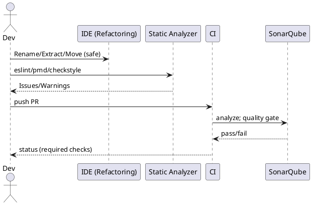

# 리팩토링 도구와 정적 분석 도구

## 1. 개념 요약과 역할 구분

### 1.1 리팩토링 도구
- **정의**: 외부 동작(기능)을 바꾸지 않고 내부 구조를 개선하도록 **IDE가 안전하게 코드 변환을 수행**.
- **주요 기능**: Rename/Extract/Inline/Move/Change Signature/Introduce Parameter Object/Safe Delete 등.
- **핵심 가치**: 설계 품질(응집도↑, 결합도↓), 테스트 용이성, 변경 비용 감소.

### 1.2 정적 분석 도구
- **정의**: 실행 없이 소스/바이트코드를 분석해 **버그·취약점·코드 스멜·복잡도**를 탐지.
- **주요 유형**: 코드 품질, 버그 탐지, 보안(SAST), 스타일, 중복.
- **핵심 가치**: 문제의 **조기 발견**, 품질 기준(Quality Gate) 통과 여부의 **객관화**.

### 1.3 상호작용
- 정적 분석이 **무엇이 문제인지**를 알려주고 → 리팩토링 도구로 **안전하게 고친다** → 테스트/CI로 **회귀 없이 검증**.

---

## 2. 리팩토링 도구 — 기능별 작동 원리와 실전 예제

| 리팩토링 | 언제 | 기대 효과 | 비고 |
|---|---|---|---|
| Rename Symbol | 이름이 의도와 불일치 | 가독성·검색성 향상 | IDE가 모든 참조 업데이트 |
| Extract Method | 긴 메서드·중복 로직 | SRP, 재사용, 테스트 단위 분리 | Guard Clause와 병행 |
| Inline | 래핑이 과도할 때 | 간결성·인라인 최적화 | 의미 상실 주의 |
| Move/Extract Class | God Class | 책임 분리·응집도 향상 | 패키지 재구성 동반 |
| Change Signature | 인자 과다/순서 문제 | 호출부 자동 업데이트 | 과감한 인터페이스 개선 |
| Introduce Parameter Object | Long Parameter List | API 명확·확장 용이 | DTO/레코드 활용 |
| Safe Delete | 미사용 코드 제거 | 소음 감소 | 삭제 범위 IDE가 검증 |

### 2.1 Java 예 — Extract Method + Rename + Introduce Parameter Object
```java
// Before
public void process(Order o, int coupon, int shipping, int tax) {
    if (o == null || o.lines().isEmpty()) throw new IllegalArgumentException();
    int subtotal = 0;
    for (OrderLine l : o.lines()) subtotal += l.price() * l.qty();
    int discounted = subtotal - coupon;
    int total = discounted + shipping + tax;
    repository.save(o.id(), total);
}

// After
public record Fees(int coupon, int shipping, int tax) { }

public void process(Order o, Fees fees) {
    validate(o);
    int total = calculateTotal(o, fees);
    repository.save(o.id(), total);
}

private void validate(Order o) {
    if (o == null || o.lines().isEmpty()) throw new IllegalArgumentException("empty order");
}

private int calculateTotal(Order o, Fees f) {
    int subtotal = o.lines().stream().mapToInt(l -> l.price() * l.qty()).sum();
    return (subtotal - f.coupon()) + f.shipping() + f.tax();
}
```

### 2.2 JS/TS 예 — Extract Function + Change Signature
```ts
// Before
function createUser(n: string, e: string, a?: string, phone?: string, subscribed?: boolean){ ... }

// After
type UserSpec = { name: string; email: string; address?: string; phone?: string; subscribed?: boolean; };

export function createUser(spec: UserSpec){
  const validated = validate(spec); // extracted
  return persist(validated);
}
```

### 2.3 Python 예 — Extract Class
```python
# Before: ReportManager가 수집/포맷/PDF/메일까지 모두
class ReportManager:
    def generate_and_send(self, spec): ...

# After
class ReportGenerator: ...
class PdfFormatter: ...
class MailSender: ...
class ReportManager:
    def __init__(self, gen, fmt, mail): ...
    def run(self, spec):
        data = self.gen.collect(spec)
        pdf = self.fmt.render(data)
        self.mail.send(pdf)
```

---

## 3. 정적 분석 — 유형·대표 도구·강점

| 유형 | 목표 | 대표 도구 |
|---|---|---|
| 코드 품질/스멜 | 중복·복잡도·규칙 위반 | SonarQube, PMD, Checkstyle, ESLint |
| 버그 탐지 | NPE, 경계 오류, 자원 누수 | SpotBugs, Infer, Coverity |
| 보안(SAST) | SQLi, XSS, 하드코딩 시크릿 | Sonar Security, Bandit(Python), Semgrep, CodeQL |
| 스타일/포맷 | 일관된 컨벤션 | Checkstyle, ESLint, Black/Prettier |
| 타입 검사 | 정적 타입 보강 | TypeScript, MyPy |
| 중복 탐지 | DRY 위반 | PMD CPD, SonarQube |

### 3.1 복잡도 지표(공식)
- **사이클로매틱 복잡도**  
  $$ M = E - N + 2P $$
  (E: 엣지 수, N: 노드 수, P: 연결 컴포넌트 수)
- **유지보수성 지수(한 형태)**  
  $$ MI = 171 - 5.2\ln(V) - 0.23 \cdot CC - 16.2\ln(LOC) $$
  (V: Halstead Volume, CC: Cyclomatic Complexity)

---

## 4. “정적 분석 → 리팩토링 → 테스트” 워크플로우

1) **TDD로 기본 동작 확보**  
2) **정적 분석 실행**—스멜·취약점 확인  
3) **IDE 리팩토링으로 구조 개선**(원자적 커밋)  
4) **테스트 전부 재실행**—회귀 방지  
5) **CI에서 자동 품질 게이트**—미통과 시 PR 차단  
6) **주간 품질 대시보드**—추세 확인, 핫스팟 선정

---

## 5. 언어/스택별 설정 레시피

### 5.1 Java/Maven(또는 Gradle) + SonarQube/PMD/Checkstyle/SpotBugs

**Maven 플러그인 예**
```xml
<!-- pom.xml -->
<build>
  <plugins>
    <plugin> <!-- Checkstyle -->
      <groupId>org.apache.maven.plugins</groupId>
      <artifactId>maven-checkstyle-plugin</artifactId>
      <version>3.3.1</version>
      <configuration>
        <configLocation>config/checkstyle/checkstyle.xml</configLocation>
        <failOnViolation>true</failOnViolation>
      </configuration>
      <executions><execution><phase>verify</phase><goals><goal>check</goal></goals></execution></executions>
    </plugin>

    <plugin> <!-- PMD -->
      <groupId>org.apache.maven.plugins</groupId>
      <artifactId>maven-pmd-plugin</artifactId>
      <version>3.22.0</version>
      <configuration>
        <rulesets>
          <ruleset>config/pmd/ruleset.xml</ruleset>
        </rulesets>
        <failOnViolation>true</failOnViolation>
      </configuration>
      <executions><execution><phase>verify</phase><goals><goal>check</goal></goals></execution></executions>
    </plugin>

    <plugin> <!-- SpotBugs -->
      <groupId>com.github.spotbugs</groupId>
      <artifactId>spotbugs-maven-plugin</artifactId>
      <version>4.8.6.2</version>
      <executions><execution><phase>verify</phase><goals><goal>check</goal></goals></execution></executions>
    </plugin>

    <plugin> <!-- JaCoCo for coverage -->
      <groupId>org.jacoco</groupId>
      <artifactId>jacoco-maven-plugin</artifactId>
      <version>0.8.12</version>
      <executions>
        <execution><goals><goal>prepare-agent</goal></goals></execution>
        <execution><id>report</id><phase>verify</phase><goals><goal>report</goal></goals></execution>
      </executions>
    </plugin>
  </plugins>
</build>
```

**SonarQube 프로젝트 설정**
```
# sonar-project.properties
sonar.projectKey=shop-service
sonar.sources=src/main/java
sonar.tests=src/test/java
sonar.java.binaries=target/classes
sonar.coverage.jacoco.xmlReportPaths=target/site/jacoco/jacoco.xml
sonar.qualitygate.wait=true
```

**Gradle(요약)**
```groovy
plugins {
  id 'java'
  id 'checkstyle'
  id 'pmd'
  id 'jacoco'
  id 'com.github.spotbugs' version '6.0.18'
}
checkstyle { configFile = file('config/checkstyle/checkstyle.xml') }
pmd { ruleSets = []; ruleSetFiles = files('config/pmd/ruleset.xml') }
spotbugs { effort = 'max'; reportLevel = 'low' }
jacocoTestReport { reports { xml.required = true } }
```

### 5.2 Node.js/TypeScript + ESLint/Prettier/Jest

**패키지와 스크립트**
```json
{
  "devDependencies": {
    "typescript": "^5.6.0",
    "eslint": "^9.0.0",
    "@typescript-eslint/parser": "^8.0.0",
    "@typescript-eslint/eslint-plugin": "^8.0.0",
    "prettier": "^3.3.0",
    "eslint-config-prettier": "^9.1.0",
    "jest": "^29.7.0",
    "ts-jest": "^29.1.2"
  },
  "scripts": {
    "lint": "eslint 'src/**/*.{ts,tsx}'",
    "format": "prettier -w 'src/**/*.{ts,tsx,js,json,md}'",
    "test": "jest --coverage",
    "ci": "npm run lint && npm run test"
  }
}
```

**ESLint 최소 규칙(소음 줄인 베이스)**
```js
// .eslintrc.cjs
module.exports = {
  parser: "@typescript-eslint/parser",
  plugins: ["@typescript-eslint"],
  extends: ["eslint:recommended", "plugin:@typescript-eslint/recommended", "prettier"],
  rules: {
    "@typescript-eslint/no-explicit-any": "warn",
    "no-console": "off"
  }
};
```

### 5.3 Python + Flake8/Black/isort/MyPy/Bandit + pytest

**requirements**
```
flake8==7.1.0
black==24.8.0
isort==5.13.2
mypy==1.11.1
bandit==1.7.9
pytest==8.3.2
pytest-cov==5.0.0
```

**tox 또는 단순 스크립트**
```bash
flake8 src tests
black --check src tests
isort --check-only src tests
mypy src
bandit -r src
pytest --cov=src --cov-report=xml
```

**pre-commit 훅(권장)**
```yaml
# .pre-commit-config.yaml
repos:
- repo: https://github.com/psf/black
  rev: 24.8.0
  hooks: [{id: black}]
- repo: https://github.com/PyCQA/isort
  rev: 5.13.2
  hooks: [{id: isort}]
- repo: https://github.com/pycqa/flake8
  rev: 7.1.0
  hooks: [{id: flake8}]
- repo: https://github.com/PyCQA/bandit
  rev: 1.7.9
  hooks: [{id: bandit}]
```

### 5.4 C/C++ + clang-tidy/cppcheck + CMake

**CMake 통합**
```cmake
set(CMAKE_EXPORT_COMPILE_COMMANDS ON)

add_custom_target(run-clang-tidy
  COMMAND clang-tidy -p ${CMAKE_BINARY_DIR} $(git ls-files '*.cpp')
  WORKING_DIRECTORY ${CMAKE_SOURCE_DIR})

add_custom_target(run-cppcheck
  COMMAND cppcheck --enable=warning,style,performance,portability --error-exitcode=1 src
  WORKING_DIRECTORY ${CMAKE_SOURCE_DIR})
```

---

## 6. CI/CD 파이프라인 예시 — GitHub Actions(Matrix)

```yaml
# .github/workflows/ci.yml
name: CI
on:
  pull_request:
  push: { branches: [ main ] }

jobs:
  build-test:
    runs-on: ubuntu-latest
    strategy:
      matrix:
        language: [ "java", "node", "python" ]
    steps:
    - uses: actions/checkout@v4

    - name: Java CI
      if: matrix.language == 'java'
      uses: actions/setup-java@v4
      with: { distribution: 'temurin', java-version: '21' }
    - if: matrix.language == 'java'
      run: mvn -B -q verify
    - if: matrix.language == 'java'
      run: mvn -B -q sonar:sonar -Dsonar.host.url=${{ secrets.SONAR_HOST_URL }} -Dsonar.login=${{ secrets.SONAR_TOKEN }}

    - name: Node CI
      if: matrix.language == 'node'
      uses: actions/setup-node@v4
      with: { node-version: 22 }
    - if: matrix.language == 'node'
      run: npm ci && npm run ci

    - name: Python CI
      if: matrix.language == 'python'
      uses: actions/setup-python@v5
      with: { python-version: '3.12' }
    - if: matrix.language == 'python'
      run: |
        pip install -r requirements.txt
        flake8 src tests
        black --check src tests
        isort --check-only src tests
        mypy src
        bandit -r src
        pytest --cov=src --cov-report=xml
```

> 기업 환경이라면 SonarQube/SonarCloud, SARIF 업로드(Code Scanning)도 병행한다.

---

## 7. 품질 게이트(예시)와 수학적 기준

**권장 초기 게이트**
- 테스트 커버리지: **라인 70% 이상**, 신규 코드 **80% 이상**
- 복잡도(CC): 함수당 **10 이하** 권고(핫스팟 예외 승인 절차)
- 코드 스멜: **Blocker/Critical 0**, Major는 승인 필요
- 중복: **3% 이하**
- 보안 규칙(High/Critical): **0**

**복잡도 상한 근거(예)**
- 함수의 **사이클로매틱 복잡도**가 10을 넘으면, 분기 수가 많아 테스트 케이스 개수가 선형 이상으로 증가.  
  $$ \text{테스트 케이스 하한} \ \ge M = E - N + 2P $$

---

## 8. 경보(알람) 소음 관리 — 베이스라인·억제·승인 절차

1) **베이스라인 생성**: 기존 위반은 “알고 있는 부채”로 기록, **신규 코드**만 게이트 적용.  
2) **억제(Suppress)**: 꼭 필요한 경우에만, **근거 주석**을 남긴다.
```java
@SuppressWarnings("PMD.AvoidLiteralsInIfCondition") // API 계약상 허용(ADR-42)
```
3) **승인 워크플로우**: Blocker/Critical은 즉시 수정, Major는 이슈 티켓화 + 기한 설정.

---

## 9. 보안·시크릿·SAST 추가

- **시크릿 탐지**: Gitleaks/TruffleHog(커밋 훅 + CI)  
- **SAST**: Semgrep/CodeQL/Bandit(파이썬) — PR마다 실행  
- **정책**: 하드코딩 시크릿 **금지**, KMS/Secrets Manager 사용

**예: Semgrep 간단 설정**
```yaml
# semgrep.yml
rules:
- id: js-no-eval
  languages: [javascript, typescript]
  message: "Avoid eval()"
  severity: ERROR
  pattern: eval(...)
```

---

## 10. 리팩토링 시나리오(엔드 투 엔드)

### 10.1 냄새: 긴 메서드 + 조건 분기
```java
// Before
int fee(String type, int base){
  if ("CARD".equals(type)) return (int)(base * 0.03);
  if ("CASH".equals(type)) return 0;
  if ("OVERSEAS".equals(type)) return (int)(base * 0.05);
  throw new IllegalArgumentException();
}
```

**분석 결과**
- PMD: LongMethod / RepeatedIfElse  
- Sonar: Cognitive Complexity ↑

**리팩토링(Strategy)**
```java
interface FeePolicy { int fee(int base); }
final class CardFee implements FeePolicy { public int fee(int base){ return (int)(base * 0.03); } }
final class OverseasFee implements FeePolicy { public int fee(int base){ return (int)(base * 0.05); } }
final class CashFee implements FeePolicy { public int fee(int base){ return 0; } }

final class FeeCalculator {
  private final Map<String, FeePolicy> policies = Map.of(
    "CARD", new CardFee(),
    "OVERSEAS", new OverseasFee(),
    "CASH", new CashFee()
  );
  int fee(String type, int base){ return policies.getOrDefault(type, b -> { throw new IllegalArgumentException(); }).fee(base); }
}
```

**테스트(시나리오 이름 = 요구사항)**
```java
@ParameterizedTest
@CsvSource({ "CARD,1000,30", "CASH,1000,0", "OVERSEAS,1000,50" })
void fee_policy_applies(String type, int base, int expected){
  assertEquals(expected, new FeeCalculator().fee(type, base));
}
```

---

## 11. 규칙 셋 스타터(소음 줄인 최소 규칙)

### 11.1 ESLint(Typescript)
- `eslint:recommended`, `@typescript-eslint/recommended`, `prettier`  
- 고신뢰: `no-undef`, `no-unreachable`, `no-unsafe-finally`  
- 점진: `no-explicit-any` = warn

### 11.2 Checkstyle(Java)
- Google Style 베이스 + 팀 예외  
- 금지: 와일드카드 임포트, 150라인 초과 메서드, 20개 초과 파라미터

### 11.3 PMD
- design: `ExcessiveMethodLength`, `GodClass`  
- errorprone: `NullAssignment`, `EmptyIfStmt`  
- performance: `AvoidInstantiatingObjectsInLoops`

### 11.4 Bandit(Python)
- 기본 프로파일 + `B101 assert` 협의  
- 외부 입력 `subprocess` 호출 금지 규칙 강화

---

## 12. 팀 운영·거버넌스

- **PR 템플릿**: “정적 분석 경고 해결 여부 / 테스트 보강 / 리팩토링 의도” 체크박스  
- **ADR**: 규칙 완화·억제 사유 기록(번호로 코드 주석 연결)  
- **대시보드**: DORA + 품질(스멜·복잡도·커버리지) 주간 리뷰  
- **릴리즈 게이트**: 품질 게이트 미통과 시 배포 차단(예외 승인 절차 문서화)

---

## 13. PlantUML — 품질 파이프라인 개요(문서화)



---

## 14. 체크리스트(도입/운영)

- [ ] IDE 리팩토링 단축키 숙지·사용(Rename/Extract/Move/Change Signature)  
- [ ] 언어별 정적 분석·포맷터·타입체커 구성(로컬=CI 일치)  
- [ ] 신규 코드 기준 품질 게이트 적용(베이스라인 분리)  
- [ ] 억제 시 주석·ADR 근거 의무화  
- [ ] 테스트 커버리지 리포트 CI 업로드(JaCoCo/nyc/pytest-cov)  
- [ ] SAST·시크릿 스캐너 PR 차단  
- [ ] 주간 대시보드/회고: 핫스팟 선정→리팩토링 스프린트 배정

---

## 15. 마무리

- **정적 분석**은 **센서**, **리팩토링**은 **정비 도구**, **테스트/CI**는 **안전망**이다.  
- 목표는 “경보 0”이 아니라 **“신뢰 가능한 신호만 남기는 시스템”**.  
- 소음 줄인 규칙 셋으로 시작해, **신규 코드부터** 품질 게이트를 엄격히 적용하라.  
- 도구는 수단이다. **개념(캡슐화·SRP·DIP)과 습관(작게·자주·원자적)** 이 본질이다.