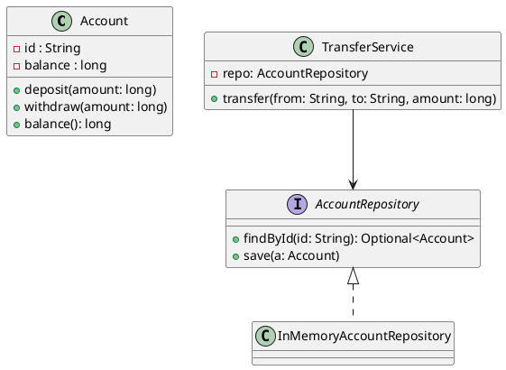
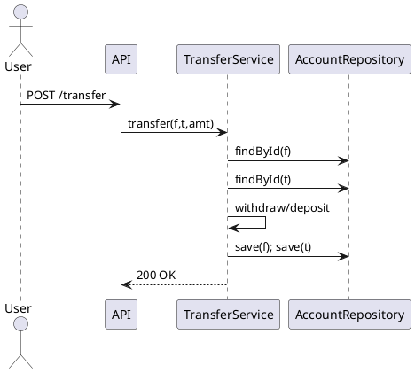

# 절차적 설계(Procedural Design)와 객체지향 설계(OOP)의 차이

## 0. 개요 — 왜 지금 이 비교가 중요한가

- 팀·제품 규모가 커질수록 **변경 비용**과 **의사소통 비용**이 폭증한다.
- 절차적/객체지향은 **문제를 바라보는 관점**과 **복잡성 관리 전략**이 다르다.
- 올바른 선택은 **도메인 복잡도**, **성능 요구**, **팀 숙련도**, **변경 빈도**에 달려 있다.

이 글은 다음을 제공한다.

- 핵심 개념·구조 차이, 장단점, 실무 영향(테스트/동시성/성능/협업)
- 은행 계좌 예제로 **절차적 ↔ OOP** 코드 비교
- **절차적 → OOP** 마이그레이션 플레이북(테스트·포트/어댑터·Strangler Fig)
- 하이브리드(절차적 알고리즘 + OOP 경계) 패턴, 의사결정 매트릭스·체크리스트

---

## 1. 개념 비교(한눈에)

| 관점 | 절차적 설계 | 객체지향 설계 |
|---|---|---|
| 기본 단위 | 함수/프로시저 | 객체(상태+행위), 클래스 |
| 추상화 | 모듈/서브루틴 | 클래스/인터페이스/다형성 |
| 데이터 취급 | 함수 입력/출력, 전역/구조체 | 캡슐화(정보 은닉) |
| 변경 격리 | 데이터 구조 바뀌면 함수 대거 수정 | 경계가 견고하면 내부 변경의 외부 파급 ↓ |
| 재사용 | 함수 재사용 | 합성/상속/전략 교체 |
| 학습/속도 | 작고 단순한 문제에 빠름 | 도메인 모델링에 강함 |

---

## 2. 구조적 차이(세부)

### 2.1 책임 배분
- **절차적**: 기능 중심. “무엇을 할지”를 함수가 담당.
- **OOP**: 책임을 객체가 가진다. “누가 할지”가 명확.

### 2.2 데이터–함수 결합
- **절차적**: 분리(구조체/레코드 + 처리 함수).
- **OOP**: 결합(캡슐화) — 불변조건을 내부에서 강제 가능.

### 2.3 추상화와 확장
- **절차적**: 상위 함수가 하위 함수를 조합.
- **OOP**: 인터페이스/다형성으로 **런타임 교체**가 쉬움.

### 2.4 변경 파급
- **절차적**: 데이터 레이아웃이 바뀌면 관련 함수 다수 수정.
- **OOP**: 퍼블릭 인터페이스 고정 시 내부 교체/리팩토링 용이.

### 2.5 상태·동시성
- **절차적**: 전역 가변 상태가 섞이면 경쟁 조건 증가.
- **OOP**: 캡슐화 + 동기화 정책(락/버전) 적용 지점 명시 가능.

---

## 3. 장단점 상세

### 3.1 절차적 설계
**장점**
- 개념적으로 단순, 작은 유틸·스크립트에 최적
- 알고리즘 중심 로직에서 **성능 예측**이 쉬움
- 런타임 오버헤드가 적은 경우가 많음

**단점**
- 규모 커지면 전역 상태·산만한 함수 난립
- 데이터 변경 파급이 큼, **응집도↓ 결합도↑**
- 도메인 규칙을 **분산**시켜 테스트/이해 어려움

### 3.2 객체지향 설계
**장점**
- 도메인 규칙을 **엔티티/VO**에 응집 → 유지보수성↑
- **다형성**으로 새로운 변형/정책의 런타임 교체 가능
- 테스트(목/Fake)와 경계 분리가 자연스럽다

**단점**
- 과잉 추상화 위험, 작은 문제에 복잡성 유발
- 특정 언어/프레임워크에서 오버헤드 가능
- 나쁜 OOP(Anemic Model, God Service)로 타락할 수 있음

---

## 4. 실무 영향(테스트·동시성·성능·협업)

| 주제 | 절차적 | OOP |
|---|---|---|
| 테스트 | 전역 상태 없고 순수 함수면 이상적 | 포트/인터페이스로 더블 주입 용이 |
| 동시성 | 전역 가변 상태는 위험 | 상태 경계에서 락/버전 관리 가능 |
| 성능 | 루틴/데이터 지역성 최적화 용이 | 메시지 디스패치/할당 비용이 있을 수 있음 |
| 협업 | 기능 단위 분업, 경계 불명확 시 충돌↑ | 도메인/모듈 경계로 역할 분담 명확 |

---

## 5. 코드 예시 — 은행 계좌(Procedural vs OOP)

### 5.1 절차적(C 스타일)
```c
// 절차적: 데이터 구조 + 처리 함수
typedef struct {
    char accountId[32];
    long balanceCents;
} BankAccount;

void deposit(BankAccount *acc, long cents) {
    if (cents <= 0) return;
    acc->balanceCents += cents;
}

int withdraw(BankAccount *acc, long cents) {
    if (cents <= 0) return -1;
    if (acc->balanceCents < cents) return -1;
    acc->balanceCents -= cents;
    return 0;
}
```

### 5.2 객체지향(Java)
```java
public class BankAccount {
    private final String id;
    private long balanceCents;

    public BankAccount(String id, long initialCents) {
        this.id = id;
        this.balanceCents = initialCents;
    }

    public synchronized void deposit(long cents) {
        if (cents <= 0) throw new IllegalArgumentException("amount>0");
        balanceCents += cents;
    }

    public synchronized void withdraw(long cents) {
        if (cents <= 0) throw new IllegalArgumentException("amount>0");
        if (balanceCents < cents) throw new IllegalStateException("insufficient");
        balanceCents -= cents;
    }

    public long balance() { return balanceCents; }
}
```

**차이의 본질**
- 절차적: `withdraw(account, amount)` — 데이터가 **외부**에서 조작됨
- OOP: `account.withdraw(amount)` — 규칙과 상태가 **내부**에서 강제됨(불변조건 캡슐화)

---

## 6. 확장 예시 — 수수료 정책 교체(조건문 → 다형성)

### 6.1 절차적(조건 분기)
```java
int fee(String type, int base){
  if ("CARD".equals(type)) return (int)(base * 0.03);
  if ("CASH".equals(type)) return 0;
  if ("OVERSEAS".equals(type)) return (int)(base * 0.05);
  throw new IllegalArgumentException();
}
```

### 6.2 OOP(전략)
```java
interface FeePolicy { int fee(int base); }
final class CardFee implements FeePolicy { public int fee(int base){ return (int)(base * 0.03); } }
final class OverseasFee implements FeePolicy { public int fee(int base){ return (int)(base * 0.05); } }
final class CashFee implements FeePolicy { public int fee(int base){ return 0; } }

final class FeeCalculator {
  private final Map<String, FeePolicy> map;
  FeeCalculator(Map<String, FeePolicy> map){ this.map = map; }
  int fee(String type, int base){ return map.get(type).fee(base); }
}
```

- **변형 추가**(예: “프로모션 수수료”)가 **조건 추가**가 아닌 **클래스 추가**로 끝난다(개방-폐쇄 성).

---

## 7. 동시성·불변조건 모델링(OOP에서 강점)

```java
public final class Money {
  private final long cents;
  private final String currency;
  public Money(long cents, String currency) { this.cents = cents; this.currency = currency; }
  public Money add(Money m) {
    if(!currency.equals(m.currency)) throw new IllegalArgumentException();
    return new Money(cents + m.cents, currency); // 불변
  }
}
```

- 값 객체(Value Object)를 **불변**으로 두면 멀티스레드에서도 안전하며, 테스트가 단순하다.

---

## 8. 절차적 → OOP 마이그레이션 플레이북(실전)

### 8.1 원칙
1. **테스트 먼저**: 기존 동작을 캡처하는 단위/통합 테스트부터.
2. **Branch by Abstraction**: 인터페이스(포트)를 먼저 세우고 구현 교체.
3. **Strangler Fig**: 기능 단위로 신구 공존 → 점진적 전환.
4. **작게, 자주, 원자적 커밋**: 되돌리기 쉽게.

### 8.2 단계별 리팩토링

1) **데이터 + 관련 함수 묶기(Extract Class)**
   - 구조체 + 처리 함수 → 클래스로 이동, 불변조건을 내부로.
2) **전역 상태 절연**
   - 전역 싱글톤/유틸에 숨어있는 IO를 포트 인터페이스로 뽑고 어댑터를 붙인다.
3) **조건문 다형성화(Strategy/State)**
   - 반복 switch/if → 정책 객체 주입.
4) **DTO–도메인 분리**
   - 외부 스키마와 도메인 모델 사이에 매퍼/어셈블러.
5) **트랜잭션 경계 애플리케이션 서비스로 이동**
   - 엔티티는 규칙만, 커밋/롤백·외부 호출은 서비스.

### 8.3 미니 코드 시나리오

```java
// 1) 포트 정의
public interface AccountRepository { Optional<Account> findById(String id); void save(Account a); }

// 2) 도메인(규칙 응집)
public class Account {
  private final String id;
  private long cents;
  public void withdraw(long v){ if(v<=0) throw...; if(cents<v) throw...; cents -= v; }
  public void deposit(long v){ if(v<=0) throw...; cents += v; }
}

// 3) 애플리케이션 서비스(경계 + 트랜잭션)
public class TransferService {
  private final AccountRepository repo;
  private final EventPublisher events;
  public void transfer(String from, String to, long amount){
    var a = repo.findById(from).orElseThrow(); var b = repo.findById(to).orElseThrow();
    a.withdraw(amount); b.deposit(amount);
    repo.save(a); repo.save(b);
    events.publish(new MoneyTransferred(from, to, amount));
  }
}
```

- 기존 절차적 호출부는 `TransferService`를 통해 새 경계를 사용하게 점진 교체.

---

## 9. 하이브리드 전략 — “경계는 OOP, 내부는 절차적/함수형”

- **권장 패턴**:
  - 애플리케이션 경계(Controller/Use Case/Port)는 **OOP**
  - 성능·연산이 중요한 내부 알고리즘은 **순수 함수(절차적/함수형)**
- 예: 결제 승인 흐름(도메인)은 OOP, 암·복호화/정렬/이미지 처리/통계는 함수형 라이브러리로.

### 9.1 Data-Oriented Design(DOD) 콤보
- CPU 캐시 친화적 구조(SoA/배열) + OOP 경계
- ECS(Entity-Component-System) 같은 접근은 게임/실시간 시스템에서 유효.

---

## 10. 의사결정 매트릭스(정량 가이드)

### 10.1 점수화 예(0~5점, 가중합)

| 기준 | 가중치 \(w_i\) | 평가(절차적) | 평가(OOP) |
|---|---:|---:|---:|
| 도메인 복잡도 | 0.30 | 2 | 5 |
| 변경 빈도 | 0.25 | 2 | 5 |
| 성능 제약 | 0.20 | 5 | 3 |
| 팀 숙련도(OOP) | 0.15 | 2 | 4 |
| 초기 개발 속도 | 0.10 | 5 | 3 |

**의사결정 점수**
$$
\text{Score} = \sum_i w_i \cdot s_i
$$

- 점수가 큰 쪽을 기본 선택, 단 **하이브리드** 가능성을 항상 열어둔다.

---

## 11. 테스트 전략 비교

| 층 | 절차적 | OOP |
|---|---|---|
| 단위 | 순수 함수 테스트가 이상적 | 엔티티/VO는 IO 없이 빠르게 |
| 통합 | IO·전역 상태로 난이도↑ | 포트/Fake/계약 테스트 분리 용이 |
| E2E | 동일 | 동일 |

테스트 이름은 **요구조건**을 드러내야 한다.
예: `withdraw_fails_when_balance_insufficient`

```java
@Test
void withdraw_fails_when_balance_insufficient(){
    var acc = new Account("A", 1000);
    assertThrows(IllegalStateException.class, () -> acc.withdraw(2000));
}
```

---

## 12. 성능 관점(간단 지침)

- 먼저 **측정**: p95, p99 레이턴시, 할당률, GC, 캐시미스
- 절차적/함수형 루틴으로 **핫스팟**만 최적화
- OOP 경계는 **안정성·가독성** 유지에 집중

---

## 13. UML로 보는 차이(요약 다이어그램)

### 13.1 클래스 다이어그램(간단)


### 13.2 시퀀스(transfer)


---

## 14. 흔한 함정과 회피법

| 함정 | 증상 | 대안 |
|---|---|---|
| Anemic Domain Model | getter/setter만 존재 | 규칙을 엔티티 메서드로 이동 |
| God Service | 거대 유스케이스 서비스 | 기능별 분할, 도메인 이벤트 |
| 전역 상태 남발 | 플라키 테스트/경쟁 조건 | 의존성 주입, 포트/어댑터 도입 |
| 조건문 폭발 | 수수료/정책 if/else 반복 | Strategy/State 패턴 |
| DTO–도메인 혼용 | 프레임워크 누수 | 매퍼/어셈블러 계층 유지 |

---

## 15. 체크리스트(출시 전 2분 자가 점검)

- [ ] 도메인 규칙이 **엔티티/VO 내부**에서 강제되는가
- [ ] 외부 IO(DB/HTTP/시간)는 **포트/어댑터**로 격리되었는가
- [ ] 반복 switch/if를 **다형성**으로 치환했는가
- [ ] **트랜잭션 경계**가 유스케이스에 모였는가
- [ ] 도메인 테스트가 **IO 없이** 빠르게 도는가
- [ ] 전역 상태/정적 의존을 제거·초기화했는가

---

## 16. FAQ(현업 질문)

**Q. 작은 툴도 OOP가 좋나요?**
A. 아니요. 작은 스크립트/단순 데이터 변환은 절차적이 단순·효율적.

**Q. 성능 때문에 OOP를 버려야 하나요?**
A. 대부분은 **핫스팟만 절차적/함수형**으로 최적화하면 충분. 경계는 OOP로.

**Q. 팀이 OOP에 익숙지 않아요.**
A. 먼저 **DTO–도메인 분리**, **값 객체 불변화**, **전략 패턴** 등 체감 좋은 개선부터.

---

## 17. 결론

- 절차적과 OOP는 대립이 아니라 **상호 보완**이다.
- **도메인 경계·불변조건·포트/어댑터·테스트**에 먼저 투자하라.
- 설계는 한 번에 완벽해지지 않는다. **작게, 자주, 원자적으로** 개선하라.
- 결국 좋은 설계는 **변경이 쉬운 설계**다. 당신의 다음 변경 하나가 이를 증명한다.
