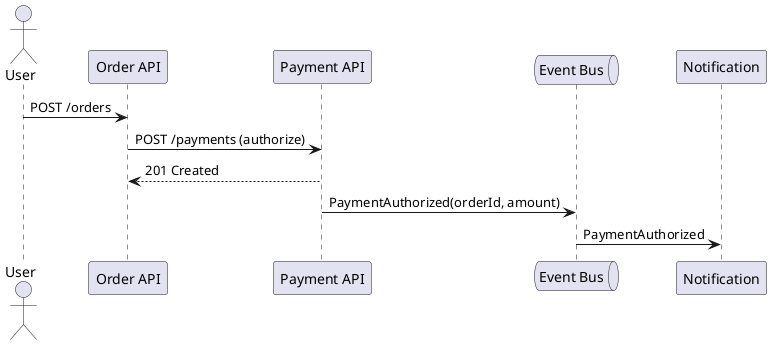
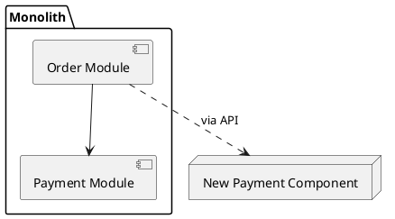
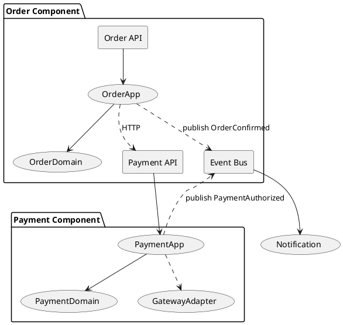

# 컴포넌트 기반 설계(Component-based Design)과 객체 지향 설계의 조화

## 0. 개요 — 왜 “조화”가 중요한가

- **OOP**는 코드 레벨(클래스·객체)에서 복잡성을 제어한다.
- **컴포넌트 설계**는 시스템 레벨(배포·운영·버전)에서 경계와 책임을 고정한다.
- 대규모 시스템에서 두 관점을 **동시에** 적용해야 변경 비용·운영 복잡도를 줄일 수 있다.

---

## 1. 개념 정렬(OOP ↔ Component)

| 관점 | 객체 지향 설계(OOP) | 컴포넌트 기반 설계 |
|---|---|---|
| 단위 | 클래스/객체 | 컴포넌트(모듈·서비스·패키지) |
| 캡슐화 | private/protected, 인터페이스 | 외부 API(REST/gRPC/JS API), 이벤트 스키마 |
| 책임(SRP) | 한 클래스 = 한 책임 | 한 컴포넌트 = 한 비즈니스 역량 |
| 재사용 | 합성(우선), 상속(신중) | 컴포넌트 조합, 라이브러리/서비스 재사용 |
| 변경 격리 | 인터페이스 뒤 구현 변경 | 계약 버전 뒤 구현/배포 변경 |
| 테스트 | 단위/도메인 테스트 | 컴포넌트 통합·계약·E2E |

---

## 2. 레퍼런스 구조 — “안은 OOP, 밖은 Component”

```
com.example.shop (Mono/Poly-repo 무관)
 ├─ order-component            (컴포넌트 경계)
 │   ├─ presentation           (REST/gRPC Handlers, DTO)
 │   ├─ application            (UseCases, Ports in/out)
 │   ├─ domain                 (Entities, ValueObjects, Domain Services)  ← OOP의 중심
 │   └─ infrastructure         (Adapters: JPA/HTTP/Kafka/Clock)
 ├─ payment-component
 └─ catalog-component
```

- **의존 방향**: `presentation → application → domain ← infrastructure(ports 구현)`
- **금지**: domain이 프레임워크/네트워크 타입에 의존

---

## 3. 계약(Contract) 우선 설계 — 외부는 안정, 내부는 자유

### 3.1 REST/gRPC 계약(예: 결제)

```yaml
# openapi.yaml (요지)
paths:
  /payments:
    post:
      requestBody: { $ref: '#/components/schemas/CreatePaymentRequest' }
      responses:
        '201': { $ref: '#/components/schemas/CreatePaymentResponse' }
components:
  schemas:
    CreatePaymentRequest:
      type: object
      required: [orderId, amount, currency]
      properties:
        orderId: { type: string }
        amount: { type: integer, minimum: 1 }
        currency: { type: string, enum: [KRW, USD] }
```

### 3.2 이벤트 계약(도메인 이벤트)

```json
{
  "eventType": "PaymentAuthorized",
  "version": 1,
  "id": "evt-8a1f...",
  "occurredAt": "2025-11-11T06:00:00Z",
  "data": {
    "paymentId": "pay-123",
    "orderId": "ord-456",
    "amount": 150000,
    "currency": "KRW"
  }
}
```

- **버전 관리**: `eventType + version` 조합으로 후방 호환.
- **가드레일**: 스키마 레지스트리(Avro/JSON Schema) + 소비자 계약 테스트.

---

## 4. 내부 구현 — OOP로 작게·응집되게

### 4.1 도메인(값 객체·엔티티) 예시(Java)

```java
// domain/Money.java
public record Money(long cents, String currency) {
  public Money add(Money other) {
    if (!currency.equals(other.currency)) throw new IllegalArgumentException("currency mismatch");
    return new Money(cents + other.cents, currency);
  }
  public boolean gte(Money other) {
    if (!currency.equals(other.currency)) throw new IllegalArgumentException("currency mismatch");
    return cents >= other.cents;
  }
}
```

```java
// domain/Payment.java
public final class Payment {
  private final String id;
  private final String orderId;
  private Money authorized; // null if not authorized

  public Payment(String id, String orderId) {
    this.id = id;
    this.orderId = orderId;
  }

  public void authorize(Money amount) {
    if (authorized != null) throw new IllegalStateException("already authorized");
    if (amount.cents() <= 0) throw new IllegalArgumentException("amount>0");
    authorized = amount;
  }

  public Money authorized() {
    if (authorized == null) throw new IllegalStateException("not authorized yet");
    return authorized;
  }
}
```

### 4.2 포트/어댑터(Ports & Adapters)

```java
// application/ports/PaymentRepository.java
public interface PaymentRepository {
  Optional<Payment> findById(String id);
  void save(Payment payment);
}

// application/ports/PaymentGateway.java
public interface PaymentGateway {
  String requestAuthorization(String orderId, Money money);
}
```

```java
// application/AuthorizePaymentUseCase.java
public final class AuthorizePaymentUseCase {
  private final PaymentRepository repo;
  private final PaymentGateway gateway;

  public AuthorizePaymentUseCase(PaymentRepository repo, PaymentGateway gateway) {
    this.repo = repo; this.gateway = gateway;
  }

  public String authorize(String paymentId, Money amount) {
    var payment = repo.findById(paymentId).orElseThrow();
    payment.authorize(amount);
    var externalId = gateway.requestAuthorization(paymentId, amount);
    repo.save(payment);
    return externalId;
  }
}
```

- **OOP 핵심**: 규칙은 엔티티/VO 내부에서 강제, I/O는 포트로 격리.

---

## 5. 컴포넌트 경계에서의 통신 선택

| 조건 | 동기(HTTP/gRPC) | 비동기(Event/Kafka) |
|---|---|---|
| 응답 즉시 필요 | 유리 | 부적합 |
| 확장성/격리 | 결합↑ | 결합↓ |
| 트랜잭션 | 경계 내 관리 용이 | SAGA/보상 필요 |
| 권장 용도 | 조회·인증 | 상태 변경 후 알림/동기화 |

### 5.1 혼합 예: 동기 승인 → 비동기 방송



---

## 6. 상태 소유권·일관성 전략

- **SSOT(Single Source of Truth)**: 컴포넌트별 상태 소유권을 명확히.
- **공유 DB 금지**: 필요한 데이터는 **API/이벤트**로 전달.
- **강한 일관성**은 컴포넌트 내부 트랜잭션으로 처리.
- **최종 일관성**은 이벤트 + 보상 트랜잭션(SAGA) 사용.

### 6.1 간단 SAGA(오케스트레이션) 예

```typescript
// application/saga/OrderPaymentSaga.ts
export class OrderPaymentSaga {
  constructor(private orders: OrdersAPI, private payments: PaymentsAPI) {}

  async place(orderId: string, amount: number) {
    try {
      await this.orders.reserve(orderId);
      const payId = await this.payments.authorize(orderId, amount);
      await this.orders.confirm(orderId, payId);
    } catch (e) {
      await this.orders.release(orderId); // 보상
      throw e;
    }
  }
}
```

---

## 7. 테스트 전략 — 피라미드로 유지

| 층 | 대상 | 도구/예 |
|---|---|---|
| 단위(Unit) | VO/엔티티/UseCase | JUnit/pytest — 빠르고 결정적 |
| 컴포넌트 통합 | 내부 클래스+어댑터 | InMemory DB/Fake Gateway |
| 계약(Consumer-driven) | API/이벤트 계약 | Pact(Provider/Consumer) |
| E2E | 전 체인 | Cypress/Karate — 최소한 |

### 7.1 계약 테스트(Pact, TypeScript 예)

```typescript
import { Pact } from "@pact-foundation/pact";
const provider = new Pact({ consumer: "Order", provider: "Payment" });

describe("Payment API contract", () => {
  beforeAll(() => provider.setup());
  afterAll(() => provider.finalize());

  it("creates payment", async () => {
    await provider.addInteraction({
      state: "payment can be authorized",
      uponReceiving: "a create request",
      withRequest: { method: "POST", path: "/payments", body: { orderId: "ord-1", amount: 1000, currency: "KRW" } },
      willRespondWith: { status: 201, body: { paymentId: like("pay-123") } }
    });
    // consumer call...
  });
});
```

---

## 8. 관찰성(Observability) — 메트릭·로그·트레이스

- **메트릭**: p95/p99 응답시간, 에러율, 큐 지연, 외부 의존 호출 실패율
- **로그**: 도메인 이벤트/유스케이스 성공·실패(구조화 + traceId)
- **트레이스**: OpenTelemetry로 경계 넘는 호출 추적

```yaml
# k8s/Deployment 일부(헬스·리소스·프로브)
livenessProbe:
  httpGet: { path: /health/live, port: 8080 }
readinessProbe:
  httpGet: { path: /health/ready, port: 8080 }
resources:
  requests: { cpu: "250m", memory: "256Mi" }
  limits:   { cpu: "1",    memory: "512Mi"  }
```

---

## 9. 성능·스케일링 — 그레인과 데이터 로컬리티

- **그레인(Granularity)**: 너무 잘게 쪼개면 네트워크 채터링(Over-fragmentation).
- **데이터 로컬리티**: 자주 같이 호출되는 기능은 **같은 컴포넌트**나 **동일 노드**에 배치.
- **캐시 전략**: TTL/무효화 규칙, 경계 캐시(API Gate) 정의.
- **배치/버스팅**: Bulk API, 스트리밍 처리로 Chatty 패턴 방지.

---

## 10. 수학적 의사결정 보조 — 분해 점수(예시)

컴포넌트 분해 여부를 가늠하는 간단 점수 함수:

$$
\text{SplitScore} =
w_1 \cdot \text{RemoteCalls} +
w_2 \cdot \text{TeamOwnershipOverlap} +
w_3 \cdot \text{StateSharing} -
w_4 \cdot \text{Cohesion}
$$

- `RemoteCalls`: 분리 시 예상 원격 호출 증가량
- `TeamOwnershipOverlap`: 팀 간 소유권 충돌도
- `StateSharing`: 공유 상태 의존도
- `Cohesion`: 내부 응집도(높을수록 분해 억제)
- 점수가 높으면 **분리 재검토**, 낮으면 **분해 고려**

---

## 11. 보안·버전·호환성 — 경계는 계약 + 제로 트러스트

- **인증/인가**: 각 컴포넌트 경계에 mTLS/OAuth2·OPA 정책 적용.
- **세멘틱 버전(semver)**: 불가피한 비호환 변경은 Major 업 + 마이그레이션 가이드.
- **후방 호환 우선**: API 응답 확장(필드 추가) → OK, 필드 제거/의미 변경 → 신중.
- **Contract Test in CI**: 소비자 테스트 깨지면 배포 차단.

---

## 12. 프런트엔드에서의 조화 — 컴포넌트 × 컴포넌트

- **UI 컴포넌트**는 화면 단위 경계를, **백엔드 컴포넌트**는 도메인 경계를 담당.
- **Micro-frontend**: Module Federation/single-spa로 독립 배포, **공통 계약**(이벤트 버스/SDK)으로 연결.

```tsx
// React: 외부 Payment UI 컴포넌트 계약 예
type PaymentWidgetProps = { orderId: string; amount: number; onAuthorized: (paymentId: string)=>void };
export function PaymentWidget({ orderId, amount, onAuthorized }: PaymentWidgetProps){
  // 내부: SRP 컴포넌트 구성 + API 계약 사용
  return <button onClick={async ()=>{
    const r = await fetch("/payments", { method: "POST", body: JSON.stringify({ orderId, amount, currency:"KRW" })});
    const { paymentId } = await r.json();
    onAuthorized(paymentId);
  }}>Pay {amount} KRW</button>;
}
```

---

## 13. CI/CD 파이프라인(요지)

```yaml
# .github/workflows/payment-ci.yml
name: payment-ci
on: [push, pull_request]
jobs:
  build-test:
    runs-on: ubuntu-latest
    steps:
      - uses: actions/checkout@v4
      - uses: actions/setup-java@v4
        with: { java-version: '21', distribution: 'temurin' }
      - run: ./gradlew test          # 단위/컴포넌트 통합
      - run: ./gradlew pactVerify    # 계약 테스트 검증
      - run: ./gradlew jibDockerBuild
```

- **게이트**: 단위/통합/계약 테스트 실패 시 배포 차단.
- **배포**: Canary + 자동 롤백(헬스·SLO 위반 시).

---

## 14. 마이그레이션 전략(모놀리식 → 컴포넌트)

1) **경계 후보 식별**: 유비쿼터스 언어·바운디드 컨텍스트 기준
2) **계약 우선**: API/이벤트 설계·버전 정책 수립
3) **안전망**: 회귀·계약 테스트 확보
4) **추출(Extract)**: `Branch by Abstraction` + `Strangler Fig`
5) **관찰·조정**: 호출 패턴·SLI 모니터링 → 과/소분해 조정



---

## 15. 안티패턴과 회피법

| 안티패턴 | 징후 | 대안 |
|---|---|---|
| Chatty Components | 작은 호출 다량, 지연 전파 | Bulk API, 캐시, 데이터 로컬리티 |
| God Component | “공용” 컴포넌트에 모든 책임 | 비즈니스 역량 단위로 분리 |
| Shared DB | 테이블 공유·잠금 충돌 | API/이벤트로 데이터 전달 |
| 버전 지옥 | 계약 없이 Payload 변경 | semver + Pact + Deprecation 기간 |
| 프레임워크 누수 | 도메인이 HTTP/JPA 타입 의존 | 포트/DTO 계층으로 절연 |

---

## 16. UML로 보는 전체 청사진



---

## 17. 결정 보조 체크리스트

- [ ] 컴포넌트 책임을 한두 문장으로 설명 가능한가
- [ ] 외부 계약(API/이벤트)이 문서화·버전 관리되는가
- [ ] 내부는 OOP 원칙(SRP/DIP/합성 우선)을 따르는가
- [ ] 상태 소유권·일관성 모델(강/최종)이 명확한가
- [ ] 통신 방식(동기/비동기) 선택 근거가 있는가
- [ ] 테스트 피라미드(단위·컴포넌트·계약·E2E)가 갖춰졌는가
- [ ] 관찰성(메트릭·로그·트레이스)과 SLO가 정의되었는가
- [ ] 배포/롤백/Canary·Feature Flag 전략이 있는가

---

## 18. 미니 스켈레톤 — 붙여 쓰는 템플릿

```java
// presentation/PaymentController.java
@RestController
class PaymentController {
  private final AuthorizePaymentUseCase useCase;
  @PostMapping("/payments")
  ResponseEntity<?> create(@RequestBody CreatePaymentReq req){
    var id = useCase.authorize(req.paymentId(), new Money(req.amount(), req.currency()));
    return ResponseEntity.status(201).body(Map.of("paymentId", id));
  }
}
```

```java
// infrastructure/JpaPaymentRepository.java
@Repository
class JpaPaymentRepository implements PaymentRepository {
  private final SpringDataPaymentRepo repo;
  public Optional<Payment> findById(String id){ return repo.findById(id).map(this::map); }
  public void save(Payment p){ repo.save(map(p)); }
}
```

```java
// test/AuthorizePaymentUseCaseTest.java
class AuthorizePaymentUseCaseTest {
  @Test
  void authorize_sets_amount_and_persists(){
    var fakeRepo = new InMemoryPaymentRepo();
    var fakeGateway = (PaymentGateway)(orderId, money) -> "ext-1";
    var useCase = new AuthorizePaymentUseCase(fakeRepo, fakeGateway);

    fakeRepo.put(new Payment("pay-1","ord-1"));
    var extId = useCase.authorize("pay-1", new Money(10_000,"KRW"));

    assertEquals("ext-1", extId);
    assertEquals(10_000, fakeRepo.get("pay-1").authorized().cents());
  }
}
```

---

## 19. 요약(마무리)

- **내부(OOP)**: 작고 응집된 클래스, 합성 우선, 불변 조건을 엔티티/VO에서 강제
- **외부(Component)**: 명확한 계약(REST/gRPC/Event) + 버전/배포/관찰성
- **통신**: 동기는 단순·빠른 응답, 비동기는 결합 완화·확장성 — 혼합하되 근거를 남길 것
- **운영**: 계약 테스트·Canary·SLO·트레이싱으로 “변경 안전성”을 시스템 속성으로 만들기

작게 시작하되 **계약부터** 잡고, 내부는 OOP로 정리하고, 피드백 루프(CI/계약 테스트/관찰성)로 지속 개선하라. 그러면 컴포넌트 기반 설계와 객체 지향 설계가 **서로의 약점을 보완**하며, 변화에 강한 시스템을 만들어 준다.
