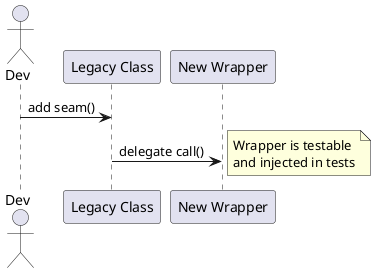

# TDD(테스트 주도 개발)와 객체 지향 설계의 관계

## 개요 — 당신이 이미 적어 둔 포인트를 토대로 확장

- TDD의 **Red → Green → Refactor**는 단순한 테스트 작성 규칙이 아니라 **설계 진화 메커니즘**이다.
- Red 단계에서 API/책임을 먼저 드러내고, Green에서 최소 구현으로 빠르게 동작을 맞춘 뒤, Refactor에서 **SRP, DIP, 추상화, 작은 메서드, 값 객체** 등을 적용해 구조를 정돈한다.
- 이 글은 **개념 → OO 설계 효과 → 실전 워크플로우 → 다중 언어 코드 예제 → 리팩토링 패턴 → 테스트 전략/관행 → 안티패턴/테스트 스멜 → CI·측정**까지 한 번에 정리한다.

---

## TDD 핵심 사이클 — Red / Green / Refactor

| 단계 | 목적 | 개발자 행동 | 산출물 |
|---|---|---|---|
| Red | 실패하는 테스트로 **행동 명세** | 최소 예로 실패 유도 | 실행 가능한 요구/명세 |
| Green | **가장 단순한 코드**로 통과 | 하드코딩/조건 최소화 허용 | 동작하는 코드 |
| Refactor | **설계 품질 개선** | 중복 제거, 이름/추상화 개선, 패턴 적용 | 더 나은 구조(불변, 합성, 인터페이스) |

피드백 루프 시간의 가이드(권장):
$$
t_{\text{unit}} \le 2\ \text{sec},\quad
t_{\text{suite}} \le 60\ \text{sec}
$$
짧은 루프일수록 설계 결정을 미세 조정하기 쉽다.

---

## 왜 TDD가 OO 설계에 유리한가 — 구체 효과

- **행동 우선(Behavior-first)**: 공개 API/메서드 시그니처가 테스트에서 먼저 결정 → 외부 계약이 선명해짐.
- **SRP(단일 책임) 유도**: 테스트하기 쉬운 클래스를 만들다 보면 책임이 작아진다.
- **DIP(의존 역전) 촉진**: 외부 I/O를 목/페이크로 바꾸려면 인터페이스가 필요 → 자연스러운 추상화.
- **LSP/다형성 검증**: 하위 타입 교체 가능성(전략 교체 등)을 테스트로 확인 가능.
- **안전한 리팩토링**: 테스트가 보호망이 되어 구조 변경을 과감히 시도할 수 있다.
- **경계(Seams) 형성**: Port/Adapter, Clock, Random, UUID 같은 **부작용 추상화**가 생김.

---

## TDD School 비교 — Outside-in vs Inside-out

| 관점 | Outside-in(London) | Inside-out(Chicago) |
|---|---|---|
| 초점 | 상위 시나리오부터 하향식 | 핵심 도메인 로직부터 상향식 |
| 테스트 더블 | 목/스텁 적극 사용 | 페이크/실구현 선호 |
| 장점 | 요구 정렬·계약 빠름 | 도메인 모델 탄탄 |
| 위험 | 목 과다 시 취약한 테스트 | UI/계약 통합 시 결합 늦을 수 있음 |
| 현실적 권장 | **혼합**: 상위는 outside-in, 핵심 로직은 inside-out |

---

## 워크플로우 — TDD로 OO 설계를 도출하기(은행 계좌 예시, Java)

### Red — 실패하는 테스트부터

```java
// JUnit 5
class BankAccountTest {
  @Test
  void withdraw_reduces_balance() {
    var acc = new BankAccount(10_000);
    acc.withdraw(3_000);
    assertEquals(7_000, acc.getBalance());
  }
}
```

### Green — 가장 단순한 구현

```java
public class BankAccount {
  private int balance;
  public BankAccount(int initial) { this.balance = initial; }
  public void withdraw(int amount) { this.balance -= amount; }
  public int getBalance() { return balance; }
}
```

### 새로운 요구를 테스트로 추가 → 리팩토링 트리거

```java
@Test
void cannot_withdraw_more_than_balance() {
  var acc = new BankAccount(1_000);
  assertThrows(IllegalStateException.class, () -> acc.withdraw(2_000));
}

@Test
void negative_amount_is_rejected() {
  var acc = new BankAccount(1_000);
  assertThrows(IllegalArgumentException.class, () -> acc.withdraw(-1));
}
```

### Refactor — 값 객체, 불변·규칙 캡슐화

```java
public record Money(int cents) {
  public Money {
    if (cents < 0) throw new IllegalArgumentException("non-negative");
  }
  public Money add(Money x) { return new Money(this.cents + x.cents); }
  public boolean gte(Money x) { return this.cents >= x.cents; }
}

public final class BankAccount {
  private Money balance;
  public BankAccount(int initial) { this.balance = new Money(initial); }

  public void withdraw(int amount) {
    var amt = new Money(amount);
    if (!balance.gte(amt)) throw new IllegalStateException("insufficient");
    this.balance = new Money(balance.cents() - amt.cents());
  }
  public int getBalance() { return balance.cents(); }
}
```

- 도메인 규칙은 **엔티티 내부**에서 강제된다(캡슐화).
- 테스트는 바뀌지 않고, 설계 품질만 향상된다.

---

## 조건문을 다형성으로 — Strategy 리팩토링(TDD로 진행)

### Red — 수수료 계산 요구

```java
@Test
void card_fee_is_2_percent() {
  var fee = FeeCalculator.forType(PaymentType.CARD).calculate(new Money(10_000));
  assertEquals(200, fee.cents());
}

@Test
void overseas_card_fee_is_3_percent() {
  var fee = FeeCalculator.forType(PaymentType.OVERSEAS_CARD).calculate(new Money(10_000));
  assertEquals(300, fee.cents());
}
```

### Green — 임시 if로 통과(빠르게)

```java
public enum PaymentType { CARD, OVERSEAS_CARD }
public final class FeeCalculator {
  public static FeePolicy forType(PaymentType t) {
    return amount -> switch (t) {
      case CARD -> new Money(amount.cents() * 2 / 100);
      case OVERSEAS_CARD -> new Money(amount.cents() * 3 / 100);
    };
  }
}
@FunctionalInterface interface FeePolicy { Money calculate(Money amount); }
```

### Refactor — 전략 클래스로 교체(확장 용이)

```java
interface FeePolicy { Money calculate(Money amount); }
final class CardFee implements FeePolicy { public Money calculate(Money a){ return new Money(a.cents()*2/100); } }
final class OverseasCardFee implements FeePolicy { public Money calculate(Money a){ return new Money(a.cents()*3/100); } }

public final class FeeCalculator {
  private static final Map<PaymentType, FeePolicy> POLICIES = Map.of(
    PaymentType.CARD, new CardFee(),
    PaymentType.OVERSEAS_CARD, new OverseasCardFee()
  );
  public static FeePolicy forType(PaymentType t) { return POLICIES.get(t); }
}
```

테스트는 그대로 **초록**이며, 설계는 **다형성으로 개방(확장)** 되었다.

---

## — 시간/랜덤/네트워크 추상화

| 부작용 | Seam(추상) | 테스트 더블 |
|---|---|---|
| 시간 | `Clock` 인터페이스 | `FixedClock(2025-11-11)` |
| 랜덤 | `RandomGenerator` | `DeterministicRandom([42])` |
| UUID | `UuidSource` | `FixedUuid("...")` |
| 네트워크 | `PaymentGateway` | `FakePaymentGateway` |

```java
public interface Clock { Instant now(); }
public final class FixedClock implements Clock { private final Instant t; public FixedClock(Instant t){ this.t=t; } public Instant now(){ return t; } }
```

- **테스트 결정성**을 확보하면 Red/Green 루프가 짧아지고, 설계도 더 모듈화된다.

---

## 테스트 더블 선택 가이드

| 더블 | 목적 | 언제 쓰나 | 위험 |
|---|---|---|---|
| Dummy | 파라미터 채우기 | 사용 안 되는 인자 | 의미 없는 남발 |
| Stub | 고정 응답 | 상태 제어 | 과도하면 brittle |
| Fake | 경량 구현 | InMemoryRepo, Local SMTP | 실제와 차이 주의 |
| Spy | 호출 기록 | 상호작용 검증 | 구현 결합 유의 |
| Mock | 행위 기대 | 계약(호출/순서) 검증 | 과도한 목 사용 주의 |

일반 원칙: **도메인 로직은 Fake/실구현**, 외부 통신은 **Mock/Contract Test**.

---

## 다언어 실전 예제

### — 값 객체 + 전략

```python
# money.py

from dataclasses import dataclass
@dataclass(frozen=True)
class Money:
    cents: int
    def __post_init__(self):
        if self.cents < 0: raise ValueError("non-negative")
    def add(self, other): return Money(self.cents + other.cents)

# fee.py

from abc import ABC, abstractmethod
class FeePolicy(ABC):
    @abstractmethod
    def calc(self, amount: Money) -> Money: ...

class CardFee(FeePolicy):
    def calc(self, amount): return Money(amount.cents * 2 // 100)

class OverseasCardFee(FeePolicy):
    def calc(self, amount): return Money(amount.cents * 3 // 100)

# test_fee.py

from money import Money
from fee import CardFee, OverseasCardFee
def test_card_fee(): assert CardFee().calc(Money(10_000)).cents == 200
def test_overseas_fee(): assert OverseasCardFee().calc(Money(10_000)).cents == 300
```

### — Port/Adapter + Clock

```csharp
public interface IClock { DateTime Now(); }
public sealed class FixedClock : IClock { private readonly DateTime _t; public FixedClock(DateTime t)=>_t=t; public DateTime Now()=>_t; }

public sealed class BankAccount {
  private int _balance;
  public BankAccount(int initial) => _balance = initial;
  public void Withdraw(int amount) {
    if (amount <= 0) throw new ArgumentException();
    if (_balance < amount) throw new InvalidOperationException("insufficient");
    _balance -= amount;
  }
  public int Balance => _balance;
}

public class BankAccountTests {
  [Fact]
  public void WithdrawReducesBalance(){
    var acc = new BankAccount(10_000);
    acc.Withdraw(3_000);
    Assert.Equal(7_000, acc.Balance);
  }
}
```

---

## 레거시 코드에 TDD 도입 — 안전한 길

- **Characterization Tests**: 현재 동작을 “고정”하는 테스트로 보호막부터 만든다.
- **Sprout Method/Class**: 기존 코드에 새 메서드/클래스를 **덧붙여** 테스트 가능한 섬을 만든다.
- **Seam 만들기**: 정적 호출/전역 상태를 래퍼로 감싸 포트로 승격.
- **Extract & Override Factory**: 생성 경로에 Test Double을 주입할 발판 마련.



---

## 속도·품질을 올리는 테스트 기법

### 속도: 피라미드 & 격리

- **Unit(다수) → Component(적당) → E2E(최소)**
- 네트워크/디스크 I/O 금지, **InMemory/Fake** 사용, 테스트 간 **상태 공유 금지**.

### Property-based Testing(성질 기반)

```python
# pytest + hypothesis

from hypothesis import given, strategies as st
from money import Money

@given(st.integers(min_value=0, max_value=1_000_000), st.integers(min_value=0, max_value=1_000_000))
def test_money_add_commutative(a, b):
    assert Money(a).add(Money(b)) == Money(b).add(Money(a))
```

### Mutation Testing(돌연변이 테스트)

변이 점수:
$$
\text{Mutation Score}=\frac{\text{Mutants Killed}}{\text{Total Mutants}}
$$
- 점수가 낮으면 테스트가 **약하다**는 신호(분기/예외/경계 미검증).

---

## CI/CD에 TDD 넣기 — 파이프라인 예시

```yaml
# .github/workflows/ci.yml

name: ci
on: [push, pull_request]
jobs:
  test:
    runs-on: ubuntu-latest
    steps:
      - uses: actions/checkout@v4
      - uses: actions/setup-java@v4
        with: { java-version: '21', distribution: 'temurin' }
      - run: ./gradlew test             # unit/component
      - run: ./gradlew jacocoTestReport # coverage(optional gate)
      - run: ./gradlew pactVerify       # contract tests
```

- **Gate**: 필수 단위 테스트 통과, 핵심 모듈 커버리지 기준, 계약 테스트 일치 시에만 머지/배포.
- 린 전략: 커버리지 목표는 **현실적**(예: 핵심 도메인 80%+, 나머지는 모듈별 목표), 수치 맹신 금지.

---

## 테스트 스멜 & 안티패턴(해결 포함)

| 스멜 | 증상 | 해결 |
|---|---|---|
| Overspecified Tests | 구현 세부에 결합, 리팩토링 시 대량 붕괴 | 행동 검증 중심으로 전환 |
| Mock Everything | 모든 의존을 목으로, brittle | Fake/Real 혼용, 계약 테스트 |
| Ice-cream Cone | E2E만 많고 Unit 부족 | 피라미드 균형 회복 |
| Sleep 기반 비동기 | flaky, 느림 | 가짜 스케줄러/가상 시간 |
| Big Fixture | 거대한 공통 픽스처 재사용 | Test Data Builder/Factory |
| Randomness/Time | 비결정/간헐 실패 | Clock/Random 추상화, 고정값 |

---

## 리팩토링 카탈로그(테스트로 보호하며 적용)

- **Extract Method / Class / Interface**
- **Replace Conditional with Polymorphism(Strategy/State)**
- **Introduce Parameter Object**
- **Move Function/Field**, **Encapsulate Collection**
- **Replace Inheritance with Delegation**
- **Encapsulate Record → Value Object**
- **Replace Magic Number with Constant**

리팩토링의 목표 함수(단순화 지표 예):
$$
\min\left(\text{Cyclomatic Complexity}+\lambda\cdot \text{Duplication}\right)
$$
- $\lambda$는 팀 합의(중복의 벌점 가중치).

---

## 도메인 중심 설계(DDD)와 TDD — 자연스러운 접합

- **Ubiquitous Language**를 테스트 이름에 반영: `withdraw_fails_when_balance_is_insufficient`.
- **도메인 이벤트**를 테스트로 검증: `assertPublished(PaymentAuthorized(orderId, amount))`.
- **Ports & Adapters**: 도메인 테스트는 I/O 없이, 경계는 계약/통합 테스트로.

---

## BDD와 TDD의 만남 — 실행 가능한 요구

```gherkin
Feature: Withdrawal
  Scenario: Balance reduced after withdrawal
    Given an account with balance 10000
    When withdrawing 3000
    Then the balance should be 7000
```

- BDD를 **상위 시나리오 레벨**에, TDD를 **클래스/메서드 레벨**에 적용하면 상호 보완된다.

---

## UML로 보는 TDD 구동 구조(간단)

```plantuml
@startuml
skinparam componentStyle rectangle
actor "Test Runner"
component "Tests" as T
component "Application (Ports)" as A
component "Domain" as D
component "Fakes/Mocks" as F
Test Runner --> T
T --> A
A --> D
A ..> F : inject doubles
@enduml
```

---

## 팀 적용 체크리스트(실전)

- [ ] Red-Green-Refactor 루프 시간을 측정·단축하고 있는가?
- [ ] 테스트가 **행동**을 설명하는가(구현 세부 X)?
- [ ] 외부 의존(시간/랜덤/네트워크)이 추상화되어 있는가?
- [ ] 도메인 규칙은 VO/엔티티 내부에서 강제되는가?
- [ ] 테스트 피라미드 균형(단위>컴포넌트>계약>E2E)이 있는가?
- [ ] 계약 테스트(Provider/Consumer)가 CI 게이트로 동작하는가?
- [ ] 리팩토링을 주기적으로 실행하고 테스트로 보호하는가?
- [ ] flaky 테스트가 자동 감지/격리되는가(재시도·태깅·리포트)?

---

## 미니 스켈레톤 — 붙여 쓰는 템플릿(Java)

```java
// domain
public record Money(long cents) {
  public Money { if (cents < 0) throw new IllegalArgumentException(); }
  public Money add(Money x) { return new Money(cents + x.cents); }
}

// ports
public interface AccountRepository {
  Optional<BankAccount> find(String id);
  void save(BankAccount a);
}

// use case
public final class TransferService {
  private final AccountRepository repo;
  public TransferService(AccountRepository repo) { this.repo = repo; }
  public void transfer(String from, String to, Money amt) {
    var a = repo.find(from).orElseThrow();
    var b = repo.find(to).orElseThrow();
    a.withdraw(amt); b.deposit(amt);
    repo.save(a); repo.save(b);
  }
}

// test (Fake repo)
final class InMemoryRepo implements AccountRepository {
  private final Map<String,BankAccount> m = new HashMap<>();
  public Optional<BankAccount> find(String id){ return Optional.ofNullable(m.get(id)); }
  public void save(BankAccount a){ m.put(a.id(), a); }
  public void put(BankAccount a){ m.put(a.id(), a); }
}
```

---

## 결론 — TDD로 “진화 가능한 OO 설계”를 만든다

- **테스트는 명세**이고 **리팩토링은 설계의 호흡**이다.
- 작은 Red/Green 루프를 유지하며 **필요해질 때만 추상화**를 도입하라(YAGNI).
- Port/Adapter, 값 객체, 전략 등 **OO 패턴**은 TDD가 요구를 확장할 때 **자연히** 등장한다.
- 빠른 단위 테스트 + 계약 테스트 + 관찰 가능한 배포 파이프라인을 묶어, **변경에 강한 시스템**을 만든다.

---

## 테스트 이름 작명 규칙(샘플)

| 형태 | 예 |
|---|---|
| `method_underTest_condition_expectedResult` | `withdraw_whenInsufficient_throwsException` |
| 도메인 문장 | `withdraw_fails_when_balance_is_insufficient` |
| BDD 스타일 | `given_balance_10000_when_withdraw_3000_then_balance_7000` |

## Test Data Builder 패턴(간단)

```java
public final class AccountBuilder {
  private String id = "A";
  private Money balance = new Money(0);
  public AccountBuilder withId(String id){ this.id = id; return this; }
  public AccountBuilder withBalance(long cents){ this.balance = new Money(cents); return this; }
  public BankAccount build(){ return new BankAccount(id, balance); }
}
```

## 커버리지 해석 주의

- 라인 커버리지는 품질 보증이 아니다. **분기/경계/예외**를 검증하라.
- 최종 목표는 수치가 아니라 **리팩토링에 대한 자신감**.
