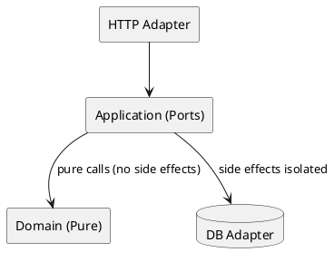

# 함수형 프로그래밍(Functional Programming)과의 비교

## 0. 개요 — 이 글의 구성과 활용법

- **개념/철학**부터 **상태·부수효과 모델링**, **추상화/다형성**, **동시성/성능**, **테스트성**, **디자인 패턴의 대응 관계**, **실무 선택 기준**, **마이그레이션/혼합 전략**, **코드 예제(다언어)**, **체크리스트**까지 한 번에 정리한다.  
- 당신이 이미 정리한 핵심(혼합, 비교 관점, 실무 팁)을 **확장**하여, 바로 문서/블로그에 붙여 넣기 좋게 작성했다.  
- 수학 표기는 반드시 `$$…$$`, 코드는 반드시 ```…``` 규칙을 따른다.

---

## 1. 철학 한 줄 요약 (재정리)

- **OOP**: **객체(상태+행위)** 간의 **메시지** 교환으로 시스템을 모델링. 정보 은닉(캡슐화)·다형성으로 복잡성 관리.  
- **FP**: **순수 함수**를 **합성**하여 프로그램을 구성. **불변성**을 기본으로 두고, 부수효과는 **경계**로 밀어낸다.

---

## 2. 핵심 개념 비교 (집약 표)

| 관점 | 객체지향(OOP) | 함수형(FP) |
|---|---|---|
| 기본 단위 | 객체(상태+행위) | 함수(입력→출력, 순수성 중시) |
| 상태 | 보통 가변(mutable) | 불변(immutable) 선호 |
| 부수효과 | 흔함(내/외부) | 최소화, 경계로 격리 |
| 추상화 | 클래스/인터페이스/상속 | 고차 함수, 합성, ADT, 모나드 |
| 다형성 | 서브타입/인터페이스 | 제네릭/형식 클래스/패턴 매칭 |
| 복잡성 제어 | 캡슐화, 계층, 디자인 패턴 | 합성, 파이프라인, 불변 데이터 |
| 동시성 | 공유 상태+락 | 불변성 덕 병렬 안전성↑ |
| 테스트성 | DI/테스트 더블 활용 | 순수 함수 중심으로 매우 우수 |
| 학습 곡선 | 모델링 직관적 | 추상 개념(모나드 등) 학습 필요 |

---

## 3. 상태와 부수효과 — 모델링의 차이

### 3.1 OOP 관점
- 객체 내부의 가변 상태를 메서드가 변경.  
- 캡슐화로 외부 결합을 낮추지만, **공유 가변 상태**는 동시성/테스트의 주요 위험.

### 3.2 FP 관점
- 상태 변경 대신 **새 값**을 만든다(불변성).  
- I/O·시간·난수 등 **부수효과**는 경계(어댑터)로 밀어낸다.

### 3.3 수학 메모 — 참조 투명성
- 참조 투명성: 모든 식 \(e\)에 대해 그 값을 \(v\)로 치환해도 의미가 변하지 않음.  
$$
\forall e,\ v.\ \ e = v \Rightarrow P[e] = P[v]
$$
- 순수 함수는 참조 투명하므로 **테스트/추론/병렬화**가 쉬워진다.

---

## 4. 추상화와 재사용 — 클래스 vs 합성

- OOP는 **클래스/인터페이스/상속/합성**으로 재사용.  
- FP는 **함수 합성**과 **고차 함수(HOF)** 로 재사용. 파이프라인(맵/필터/리듀스)이 핵심.

```javascript
// FP적 파이프라인(순수 함수 합성)
const pipe = (...fs) => x => fs.reduce((v, f) => f(v), x);
const inc = x => x + 1;
const double = x => x * 2;
const f = pipe(inc, double); // x -> (x+1)*2
```

---

## 5. 다형성 — 런타임 vs 타입 지향

- **OOP**: **서브타입 다형성**으로 런타임 디스패치.  
- **FP**: **파라메트릭 다형성(제네릭)**, **형식 클래스(typeclass)**, **ADT + 패턴 매칭**으로 **컴파일러 주도** 추상화.

```scala
// Scala: ADT + 패턴 매칭
sealed trait Payment
case class Card(amount: Int) extends Payment
case class Cash(amount: Int) extends Payment

def fee(p: Payment): Int = p match {
  case Card(a) => a * 2 / 100
  case Cash(a) => 0
}
```

---

## 6. 동시성·병렬성 — 공유 락 vs 불변 파티션

- OOP: 공유 상태를 **락/트랜잭션**으로 보호.  
- FP: 불변성+순수함수 덕분에 병렬화가 안전하고 예측 가능. Actor/Stream 등과 궁합이 좋다.

```kotlin
// Kotlin: 불변 데이터+순수 transform은 병렬 map에 적합
data class Item(val price: Int)
fun discount(i: Item) = i.copy(price = (i.price * 90) / 100)
// list.parallelStream().map(::discount)  // 자바 병렬 스트림 예
```

---

## 7. 테스트와 디버깅 — DI vs 순수 함수

- 순수 함수는 입력→출력 검증만으로 충분.  
- OOP는 Port/Adapter, DI, Fake/Mock으로 **부작용을 격리**해 테스트.

```java
// Port/Adapter: 시간 의존 격리(테스트 결정성 확보)
public interface Clock { Instant now(); }
public final class FixedClock implements Clock {
  private final Instant t;
  public FixedClock(Instant t){ this.t=t; }
  public Instant now(){ return t; }
}
```

---

## 8. 성능·메모리 — 가변 최적화 vs 구조적 공유

- OOP: 가변 구조가 **복사 비용 없음**. 락·경합 비용이 변수.  
- FP: 불변 구조는 복사처럼 보이나 **구조적 공유**(persistent DS)로 완화. GC 압력을 고려한 설계 필요.

$$
\text{총비용} \approx \text{할당/GC 비용} + \text{락/경합 비용} + \text{캐시 지역성 손실}
$$

핫스팟에서는 **국지적 가변성(local mutability)** 을 허용해 타협한다.

---

## 9. 같은 문제 다른 해법 — 은행 계좌 예제

### 9.1 OOP(Java)

```java
public class BankAccount {
  private long balanceCents;
  public BankAccount(long initial) { this.balanceCents = initial; }

  public synchronized void deposit(long cents) {
    if (cents <= 0) throw new IllegalArgumentException();
    balanceCents += cents;
  }

  public synchronized void withdraw(long cents) {
    if (cents <= 0) throw new IllegalArgumentException();
    if (balanceCents < cents) throw new IllegalStateException("insufficient");
    balanceCents -= cents;
  }

  public long getBalance() { return balanceCents; }
}
```

### 9.2 FP(JavaScript, 불변)

```javascript
const deposit = (acc, cents) => {
  if (cents <= 0) throw new Error('amount>0');
  return { ...acc, balance: acc.balance + cents };
};

const withdraw = (acc, cents) => {
  if (cents <= 0) throw new Error('amount>0');
  if (acc.balance < cents) throw new Error('insufficient');
  return { ...acc, balance: acc.balance - cents };
};

// 사용
const acc0 = { id: 'A', balance: 1000 };
const acc1 = deposit(acc0, 300); // acc0은 그대로
```

### 9.3 FP(타입 안전 TypeScript — ADT)

```ts
type Result<T> = { ok: true; value: T } | { ok: false; error: string };
type Account = Readonly<{ id: string; balance: number }>;

function deposit(a: Account, cents: number): Result<Account> {
  if (cents <= 0) return { ok: false, error: 'amount>0' };
  return { ok: true, value: { ...a, balance: a.balance + cents } };
}
```

---

## 10. 디자인 패턴 대응 관계 — OO 패턴 ↔ FP 관용구

| OO 패턴 | FP 관용구/대응 |
|---|---|
| Strategy | **고차 함수** 인자 주입 |
| Template Method | 함수 합성/콜백 |
| Visitor | **ADT + 패턴 매칭** |
| Decorator | 함수 래핑/합성 |
| Factory | 클로저/함수 |
| Observer | **리액티브 스트림(Observable/Flow)** |

OO에서 패턴으로 해결하던 문제가 FP에선 **언어 기능**으로 자연스럽게 표현된다.

---

## 11. 실무 선택 기준 — 언제 무엇을?

- **도메인 모델이 풍부**하고 “상태+행위”가 긴밀: OOP 중심 (엔티티·애그리게이트).  
- **데이터 변환/스트림/병렬 처리** 중심: FP 중심(순수 함수 파이프라인).  
- **팀/생태계**: 기존 코드베이스와 라이브러리, 언어 지원을 고려.  
- **성능 요구**: 핫스팟은 가변 최적화, 나머지는 불변/순수로 안정성 확보.

---

## 12. 혼합(Hybrid) 전략 — 가장 현실적인 길

- **핵심 로직 = 순수 함수(혹은 FP 스타일)**  
- **경계(웹/DB/메시지/시계) = OO 포트/어댑터**  
- **Hexagonal(Ports & Adapters)** 와 **CQRS/ES**는 FP·OOP 혼합에 잘 맞는다.



---

## 13. 마이그레이션 팁 — 점진적 전환

1. **경계 만들기**: I/O를 추상화(Port).  
2. **Characterization Tests**로 현행 동작 고정.  
3. **핵심 계산/규칙**을 순수 함수로 분리(Sprout).  
4. **불변 데이터 도입**: 외부엔 DTO, 내부는 VO(값 객체).  
5. **점진적 치환**: 모듈 단위로 FP 스타일 확대.  
6. **성능 핫스팟**만 국지적 가변 허용.

---

## 14. 다언어 예제 — 동일 요구의 FP/OOP 혼합

### 14.1 Kotlin — OO 경계 + FP 로직

```kotlin
// 순수 로직
data class Money(val cents: Long) {
  init { require(cents >= 0) }
  fun add(x: Money) = Money(cents + x.cents)
  fun gte(x: Money) = cents >= x.cents
}

fun withdraw(balance: Money, amt: Money): Money =
  if (!balance.gte(amt)) throw IllegalStateException("insufficient")
  else Money(balance.cents - amt.cents)

// OO 경계(포트/어댑터)
interface AccountRepo { fun load(id: String): Money; fun save(id: String, balance: Money) }

class TransferService(private val repo: AccountRepo) {
  fun transfer(from: String, to: String, cents: Long) {
    val b1 = repo.load(from)
    val b2 = repo.load(to)
    val nb1 = withdraw(b1, Money(cents))
    val nb2 = b2.add(Money(cents))
    repo.save(from, nb1); repo.save(to, nb2)
  }
}
```

### 14.2 C# — LINQ로 FP 파이프라인

```csharp
var prices = new[] { 10, 20, 30 };
var discounted = prices.Select(p => p * 0.9).Where(p => p > 15).ToArray();
```

---

## 15. 테스트 전략 — FP와 OOP 혼합 최적화

- **FP 핵심 로직**: 순수 단위 테스트 + **Property-based Testing**로 경계 검증  
- **OO 경계**: Fake/Mock으로 계약 검증 + **Contract Test**(Provider/Consumer)  
- **피라미드**: Unit(다수) → Component(중간) → E2E(최소)

```python
# pytest + hypothesis: Money 합성 법칙 예시
from hypothesis import given, strategies as st

@given(st.integers(min_value=0, max_value=1_000_000),
       st.integers(min_value=0, max_value=1_000_000))
def test_money_add_commutative(a, b):
    assert (a + b) == (b + a)
```

---

## 16. 성능 관점의 실무 원칙

- 불변 구조는 **읽기 많은 워크로드**에 강하다(캐시·샤딩·스냅샷 친화).  
- 쓰기 집중 구간은 **국지적 가변성**/버퍼링/배치로 비용을 줄인다.  
- 병렬 처리에서 FP의 이점(락 제거, 데이터 경합 감소)을 적극 활용.  
- 성능 판단은 **측정**으로: p95/CPU/할당률/GC 파형까지 본다.

---

## 17. 안티패턴 / 스멜

| 스멜 | 설명 | 대응 |
|---|---|---|
| Anemic Domain Model(OOP) | 데이터 클래스+서비스 신만 존재 | 규칙을 엔티티/VO 내부로 이동 |
| Over-Abstraction(FP) | 불필요한 모나드/범주적 장난 | 요구 복잡도에 맞춘 최소 추상화 |
| Shared Mutable State | 쓰기 경합/버그 다발 | 불변 기본, 국지적 가변만 허용 |
| Everything Monad | 단순한 것도 IO/Either 남발 | 합리적 경계에서만 효과 모델 사용 |
| Mock 지옥(OOP) | 상호작용 과검증·취약 | Fake/Contract Test 혼합 |

---

## 18. 체크리스트 — 팀 적용 전 점검

- [ ] 핵심 로직을 **순수 함수**로 분리할 수 있는가?  
- [ ] **불변 데이터**를 기본으로, 핫스팟만 가변화하는가?  
- [ ] I/O/시간/랜덤을 **포트**로 추상화했는가?  
- [ ] 테스트 피라미드 균형(단위>컴포넌트>E2E)이 있는가?  
- [ ] 성능은 **측정 기반**으로 판단하는가?  
- [ ] 팀이 이해 가능한 **최소 추상화**를 택했는가?  
- [ ] 혼합 전략(OO 경계 + FP 로직)으로 진입하는가?

---

## 19. 부록 — 수학적 배경(간단)

- **합성**:  
$$
(f \circ g)(x) = f(g(x))
$$
- **모노이드**(결합법칙 + 항등원): 예) `string` 연결  
$$
(a \cdot b)\cdot c = a \cdot (b \cdot c),\quad e \cdot a = a \cdot e = a
$$
- **펑터 법칙**(매핑 보존):  
$$
\text{map}(id) = id,\quad \text{map}(f \circ g) = \text{map}(f) \circ \text{map}(g)
$$

실무에서 이 법칙들은 “합성의 예측 가능성”과 “리팩토링 안전성”을 높인다.

---

## 20. 결론 — **둘 다** 써라, 단 **경계는 분명히**

- 도메인 모델이 풍부하고 객체 간 협력이 핵심이면 **OOP**가 직관적이다.  
- 데이터 흐름·병렬 처리·테스트 용이성이 중요하면 **FP**가 강력하다.  
- 가장 현실적인 해법은 **FP(핵심 순수 로직) + OOP(경계와 운영)** 의 **혼합 전략**이다.  
- 작은 부분부터 불변/순수/합성을 도입하고, Port/Adapter로 부수효과를 격리하라.  
- 측정과 테스트(특히 Property/Contract Testing)로, **변경에 강한 시스템**을 꾸준히 진화시키자.
