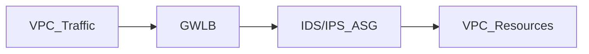

# AWS 네트워크 서비스 보안 모범 사례
(VPC Endpoint Policy · CloudFront + WAF + Shield Advanced · ALB + OIDC 인증 · GWLB + IDS/IPS)

---

## 1) VPC Endpoint Policy로 S3 접근 최소 권한 부여 예제

### 개요  
VPC Endpoint를 사용해 S3에 프라이빗하게 접근할 때, **VPC Endpoint Policy**를 활용해 접근 권한을 엄격히 제한할 수 있습니다.  
이는 보안 모범 사례 중 하나로, 권한 최소화를 구현해 잘못된 접근이나 내부 사용자 오용을 방지합니다.

### 핵심 원리  
- VPC Endpoint는 단순히 네트워크 경로만 제공하는 것이 아니라, 정책을 통해 **어떤 버킷, 어떤 작업**이 가능한지 제한 가능  
- S3 Bucket 정책과 VPC Endpoint Policy를 함께 사용해 접근 통제 강화

### 예제: 특정 VPC Endpoint에서 특정 S3 버킷 읽기 전용 접근 허용

```json
{
  "Statement": [
    {
      "Effect": "Allow",
      "Principal": "*",
      "Action": [
        "s3:GetObject",
        "s3:ListBucket"
      ],
      "Resource": [
        "arn:aws:s3:::example-bucket",
        "arn:aws:s3:::example-bucket/*"
      ],
      "Condition": {
        "StringEquals": {
          "aws:SourceVpce": "vpce-0abcd1234efgh5678"
        }
      }
    }
  ]
}
```

- `aws:SourceVpce` 조건으로 특정 VPC Endpoint에서의 접근만 허용  
- 다른 네트워크 경로나 인터넷 접근은 차단 가능  
- S3 Bucket 정책과 중복 권한을 주지 않도록 주의

### 추가 팁  
- VPC Endpoint Policy는 IAM 정책과 별도로 동작하므로, **최소 권한 원칙**에 맞게 양쪽 정책을 적절히 조합  
- S3 뿐 아니라 다른 서비스(예: DynamoDB, SNS)도 VPC Endpoint 정책으로 세밀하게 제어 가능

---

## 2) CloudFront + WAF + Shield Advanced로 DDoS 방어 설계

### 개요  
AWS는 DDoS 공격에 대비해 다양한 보안 서비스를 제공하며, 이를 조합하면 효과적인 방어 체계를 구축할 수 있습니다.

### 주요 구성 요소  
- **CloudFront**: 글로벌 엣지 네트워크에서 공격 트래픽 필터링, 캐싱으로 오리진 부하 감소  
- **AWS WAF**: HTTP(S) 계층에서 악성 요청 필터링 및 맞춤형 룰 적용  
- **AWS Shield Advanced**: 네트워크 및 전송 계층의 대규모 DDoS 공격 보호와 사고 대응 지원

### 설계 방법론  
1. **CloudFront 앞단 배치**  
   - 모든 트래픽은 CloudFront를 통해 들어오게 하여 엣지 네트워크에서 악성 요청 차단  
2. **WAF 적용**  
   - CloudFront에 AWS WAF Web ACL 연결  
   - OWASP Top 10, IP 평판, Rate-based 룰 등 다양한 관리형/사용자 정의 룰 활성화  
3. **Shield Advanced 구독 및 모니터링**  
   - 공격 탐지 시 알림 및 자동 완화 활성화  
   - 응답팀(DRT)과 연락 가능한 상태 유지

### 추가 권장 사항  
- **Rate-based rules**로 비정상 요청 급증 탐지 후 차단  
- **Geo-restriction**으로 불필요한 국가 차단  
- **Logging 및 모니터링**: CloudWatch + GuardDuty + AWS Firewall Manager 연계  

---

## 3) ALB + OIDC 인증으로 애플리케이션 레벨 접근 제어

### 개요  
Application Load Balancer(ALB)는 OIDC(OpenID Connect)를 활용한 인증 기능을 내장하여, 별도의 인증 서버 없이 애플리케이션 전 단계에서 사용자를 인증할 수 있습니다.

### 주요 기능  
- ALB 리스너 규칙에 OIDC 인증 설정 가능  
- 지원하는 IdP(Identity Provider): Amazon Cognito, Google, Facebook, Microsoft AD 등  
- 인증 실패 시 로그인 페이지로 리다이렉션, 인증 성공 시 JWT 토큰 포함하여 백엔드 전달

### 구성 방법  
1. ALB 리스너 규칙에서 `authenticate-oidc` 액션 설정  
2. IdP 정보 (Issuer URL, Client ID, Client Secret) 입력  
3. 인증 성공 시 ALB가 전달하는 JWT 토큰을 애플리케이션에서 활용하여 세션 관리 가능

### 보안 및 운영 팁  
- **HTTPS 적용** 필수 (인증 정보 안전 전송)  
- JWT 토큰 검증 로직을 백엔드에 구현하여 권한 부여 강화  
- 세션 타임아웃, 리프레시 토큰 전략 설계  
- AWS Cognito를 IdP로 사용하면 사용자 관리 및 MFA 통합 용이

---

## 4) GWLB 앞단에서 IDS/IPS 자동 확장 구성 예제

### 개요  
Gateway Load Balancer(GWLB)는 네트워크 보안 어플라이언스(IDS/IPS, 방화벽)를 VPC 내에 투명하게 연결하고, 자동 확장 및 고가용성을 지원합니다.

### 구성 흐름  
1. **GWLB 생성**  
   - 트래픽을 네트워크 보안 장비로 투명하게 라우팅  
2. **네트워크 보안 어플라이언스 배포**  
   - IDS/IPS(예: Suricata, Snort) 또는 상용 방화벽을 Auto Scaling 그룹으로 운영  
3. **GWLB Target Group에 어플라이언스 등록**  
   - GWLB는 ENI 기반으로 트래픽을 보안 어플라이언스에 분배  
4. **Auto Scaling 정책 설정**  
   - CPU, 네트워크 트래픽 기반으로 보안 장비 수 자동 확장/축소  
5. **모니터링 및 알림**  
   - CloudWatch, SNS를 이용해 보안 이벤트 및 인프라 상태 알림

### 예제 아키텍처  



### 보안 장점  
- **투명한 네트워크 경유**로 기존 애플리케이션 변경 불필요  
- 자동 확장으로 트래픽 급증 시에도 보안 성능 유지  
- 중앙 집중식 보안 정책 적용과 로깅 가능

### 구현 팁  
- Auto Scaling 최소/최대 인스턴스 수 신중 설정  
- 보안 어플라이언스 AMI 최신 유지  
- VPC Flow Logs 및 보안 이벤트 분석 시스템 연계

---

# 마무리

AWS 네트워크 서비스 보안은 **네트워크 경계부터 애플리케이션 레벨까지 다층 방어** 전략이 핵심입니다.  
- **VPC Endpoint Policy**로 최소 권한 원칙 구현  
- **CloudFront + WAF + Shield Advanced**로 공격 초기 차단  
- **ALB OIDC 인증**으로 세밀한 사용자 인증/인가  
- **GWLB + 자동 확장 IDS/IPS**로 네트워크 내부 위협 대응

이 조합을 기반으로 각 서비스 특성에 맞는 정책과 아키텍처를 수립하면, 안전하면서도 유연한 AWS 네트워크 보안 체계를 구축할 수 있습니다.  
필요하면 각 항목별 실습 예제, 정책 템플릿, 자동화 스크립트 등도 추가로 제공해 드릴 수 있습니다.  