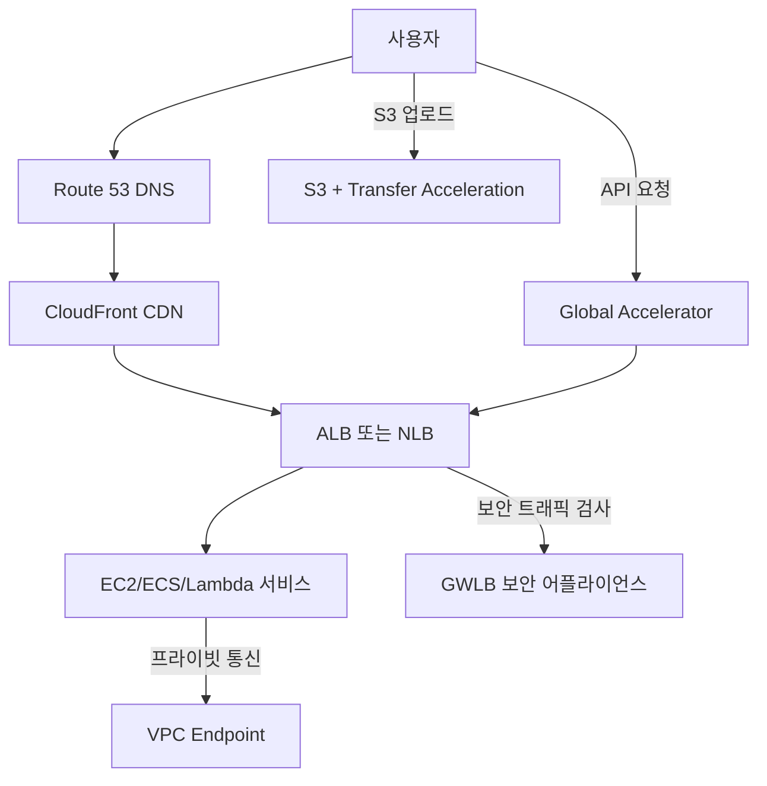

# AWS 네트워크 서비스 심층 정리  
(VPC Endpoint, Route 53, ALB, CloudFront, Content Acceleration, Global Accelerator, NLB, GWLB)

---

## 1. **VPC Endpoint**
VPC Endpoint는 **VPC 내부에서 AWS 서비스에 프라이빗 네트워크를 통해 안전하게 접근**할 수 있게 해주는 서비스입니다.  
인터넷 게이트웨이(IGW) 없이 AWS 서비스와 통신할 수 있으며, 데이터가 **퍼블릭 인터넷을 거치지 않아 보안 및 지연 시간** 면에서 유리합니다.

### 종류
1. **Interface Endpoint (AWS PrivateLink 기반)**
   - ENI(Elastic Network Interface)를 생성하여 AWS 서비스에 연결.
   - 예: S3, DynamoDB, SNS, SQS, API Gateway, KMS 등.
   - 프라이빗 IP로 접근 가능.
2. **Gateway Endpoint**
   - 라우팅 테이블에 엔드포인트를 등록하여 AWS 서비스와 연결.
   - 현재 S3, DynamoDB 전용.

### 주요 특징
- 퍼블릭 IP 불필요
- 보안 그룹/네트워크 ACL 제어 가능
- Data Transfer 비용 절감 가능(인터넷 전송 대비)
- **Interface Endpoint**는 시간당 요금 + 데이터 처리 요금 부과

---

## 2. **Route 53**
AWS Route 53은 **DNS(Domain Name System) 관리 서비스**로, 도메인 등록, DNS 레코드 관리, 트래픽 라우팅 및 헬스체크를 제공합니다.

### 주요 기능
1. **도메인 등록**
   - `.com`, `.org`, `.net` 등 TLD 도메인 직접 등록 가능
2. **DNS 레코드 관리**
   - A, AAAA, CNAME, MX, TXT, NS, SRV, PTR, SPF 등 지원
3. **라우팅 정책**
   - Simple Routing
   - Weighted Routing
   - Latency-based Routing
   - Failover Routing
   - Geolocation Routing
   - Geoproximity Routing
   - Multi-value Answer
4. **헬스 체크**
   - 엔드포인트 상태 모니터링
   - 장애 시 대체 리소스로 트래픽 자동 전환

---

## 3. **ALB (Application Load Balancer)**
**L7 계층**(HTTP/HTTPS) 로드 밸런서로, 경로 기반 라우팅, 호스트 기반 라우팅, WebSocket 지원 등 다양한 고급 기능 제공.

### 주요 특징
- **경로 기반 라우팅** (`/api/*` → 서비스 A, `/app/*` → 서비스 B)
- **호스트 기반 라우팅** (`api.example.com` → 서비스 A)
- **TLS/SSL 종료** (HTTPS 인증서 관리)
- **WebSocket, HTTP/2 지원**
- **Target Group** 단위로 ECS, EC2, Lambda 연결 가능
- ALB 수준 WAF 적용 가능

---

## 4. **CloudFront**
AWS CloudFront는 **글로벌 CDN(Content Delivery Network)** 서비스로, 정적/동적 컨텐츠를 전 세계 엣지 로케이션에 캐싱하여 지연 시간을 줄입니다.

### 주요 특징
- S3, ALB, EC2, API Gateway 등과 연동 가능
- **캐시 정책** (TTL, HTTP Header, Query String 기반 캐싱)
- **HTTPS 암호화** 및 ACM 인증서 지원
- **Signed URL / Cookie**로 접근 제어
- **오리진 페일오버** (기본 오리진 장애 시 백업 오리진 사용)
- Lambda@Edge, CloudFront Functions로 엣지 레벨 요청/응답 처리

---

## 5. **Content Acceleration**
CloudFront 외에도 AWS는 글로벌 네트워크 인프라를 활용해 **S3 Transfer Acceleration** 등 데이터 전송 속도를 높입니다.

- **S3 Transfer Acceleration**
  - S3 버킷에 업로드/다운로드 시 CloudFront Edge 로케이션을 통해 전송 최적화
  - 지리적으로 먼 위치에서 S3에 접근 시 속도 향상
- **AWS Global Accelerator** (아래 별도 설명)도 전송 최적화 가능

---

## 6. **AWS Global Accelerator**
글로벌 애플리케이션의 네트워크 경로를 최적화하는 서비스입니다.  
사용자의 요청을 가장 가까운 AWS 엣지 로케이션으로 라우팅한 뒤, **AWS 전용 네트워크 백본**을 통해 애플리케이션 리전에 전달합니다.

### 주요 특징
- **Anycast IP 주소** 제공 → 전 세계에서 동일 IP로 접근
- TCP/UDP 지원
- 여러 리전 및 여러 엔드포인트(EC2, ALB, NLB) 트래픽 분산
- 지연 시간 감소 및 가용성 향상
- 트래픽 자동 장애 조치(Failover)

---

## 7. **NLB (Network Load Balancer)**
**L4 계층**(TCP, UDP, TLS) 로드 밸런서로, 초당 수백만 요청 처리와 초저지연 연결 제공.

### 주요 특징
- **정적 IP 주소** 또는 Elastic IP 할당 가능
- 초고성능 및 저지연 처리
- TLS 오프로딩 가능
- 고정 포트 기반 로드 밸런싱
- Target Group에 EC2, IP, Lambda 연결 가능

---

## 8. **GWLB (Gateway Load Balancer)**
**L3 계층** 로드 밸런서로, 네트워크 보안 어플라이언스(방화벽, IDS/IPS 등)를 스케일 아웃 및 고가용성으로 배포하는 데 사용.

### 주요 특징
- **GENEVE 프로토콜** 기반 트래픽 터널링
- 네트워크 어플라이언스를 VPC에 투명하게 연결
- 보안 장비를 한 곳에 모아 관리 가능
- 자동 확장 및 장애 조치 지원

---

## 9. **통합 설계 예시**

---

## 10. **정리**
| 서비스 | 계층 | 주요 용도 | 특징 |
|--------|------|----------|------|
| VPC Endpoint | L3/L4 | 프라이빗 AWS 서비스 접근 | IGW 없이 접근, 보안 향상 |
| Route 53 | DNS | 도메인 및 라우팅 관리 | 헬스 체크, 다양한 라우팅 정책 |
| ALB | L7 | HTTP/HTTPS 로드 밸런싱 | 경로/호스트 기반 라우팅 |
| CloudFront | CDN | 글로벌 컨텐츠 전송 | 캐싱, 보안, Lambda@Edge |
| S3 Transfer Acceleration | - | S3 업로드/다운로드 가속 | Edge 로케이션 경유 |
| Global Accelerator | L3 | 글로벌 네트워크 최적화 | Anycast IP, 빠른 장애 조치 |
| NLB | L4 | 초고성능 TCP/UDP 로드 밸런싱 | 정적 IP, 저지연 |
| GWLB | L3 | 네트워크 보안 장비 확장 | GENEVE 터널링 |
