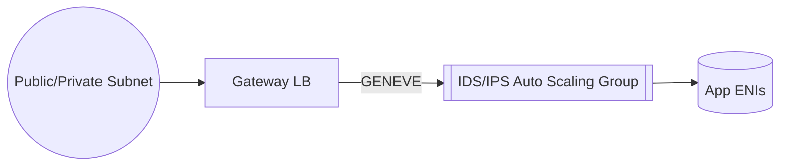

# AWS 네트워크 서비스 **심층 정리**

## 네트워크 지연을 수식으로 감 잡기

지연시간은 대략 **왕복 전송 + 처리 지연**으로 구성된다.

$$
\text{Latency} \approx \text{RTT}_{\text{Internet or AWS Backbone}} + \text{TLS} + \text{Origin Processing}
$$

- CloudFront/Global Accelerator는 $\text{RTT}$의 **대부분(인터넷 구간)**을 줄여 준다.
- ALB/NLB 선택은 **L7 처리 비용**(TLS·HTTP 파싱·루팅)과 **L4 저지연**의 트레이드오프다.

---

## **VPC Endpoint** — 프라이빗 접근과 최소 권한

### 개념·종류·언제 쓰나

- **Interface Endpoint (PrivateLink)**: VPC 내 ENI로 서비스(예: S3, SQS, KMS, API Gateway, 타사 SaaS PrivateLink) **프라이빗 접속**.
- **Gateway Endpoint**: **S3/DynamoDB 전용**. 라우팅 테이블에 엔드포인트를 연결.

**언제**
- 공용 인터넷 차단(IGW 미사용) 원칙, 사내망/프라이빗 서브넷에서 S3·DDB·KMS·SQS 등 접근.
- 감사·규제 준수(데이터가 인터넷을 통과하지 않음).

### 설계 체크리스트

- 엔드포인트 **보안그룹**(Interface) 또는 **RT 연결**(Gateway) + **엔드포인트 정책** + **리소스 정책**을 함께 설계.
- S3는 **버킷 정책에서 `aws:SourceVpce`**로 화이트리스트.

### 예제: S3 Gateway Endpoint + 버킷 정책 + EC2 IAM Role

```json
// VPC Endpoint Policy (Gateway: vpce-xxxx) - S3 특정 버킷 읽기 전용
{
  "Statement": [
    {
      "Effect": "Allow",
      "Principal": "*",
      "Action": ["s3:GetObject","s3:ListBucket"],
      "Resource": [
        "arn:aws:s3:::example-bucket",
        "arn:aws:s3:::example-bucket/*"
      ]
    }
  ]
}
```

```json
// S3 버킷 정책 - 해당 VPC Endpoint에서만 허용
{
  "Statement": [
    {
      "Sid": "AllowFromSpecificVPCE",
      "Effect": "Allow",
      "Principal": "*",
      "Action": ["s3:GetObject","s3:ListBucket"],
      "Resource": [
        "arn:aws:s3:::example-bucket",
        "arn:aws:s3:::example-bucket/*"
      ],
      "Condition": {"StringEquals":{"aws:SourceVpce":"vpce-0abc123def456"}}
    }
  ]
}
```

```bash
# 검증: 프라이빗 서브넷 EC2에서 S3 호출 (IGW 없이 OK)

aws s3 ls s3://example-bucket --region ap-northeast-2
```

**주의**
- Interface Endpoint는 **시간당 + 처리량 요금**. S3/DDB는 Gateway로 비용 절감.
- KMS/Secrets 등 **민감 서비스는 반드시 프라이빗 경로**로.

---

## **Route 53** — DNS·헬스체크·지능형 라우팅

### 라우팅 정책 요약

- **Simple**: 기본 A/AAAA/CNAME.
- **Weighted**: 배포/카나리.
- **Latency-based**: 지역 최저 지연.
- **Failover**: 헬스 체크 기반 주/대기.
- **Geolocation/Geoproximity**: 지역별 분기.
- **Multi-value Answer**: 간단 분산.

### 예: Failover + Latency 혼합 설계

- 각 리전에 ALB를 두고 **Latency 레코드**.
- 리전 장애 시 **Failover**로 DR 리전 전환.

```bash
# 헬스체크 생성(예: ALB HTTP 200 확인)

aws route53 create-health-check --caller-reference hc-$(date +%s) \
 --health-check-config '{
   "IPAddress":"",
   "Port":443,
   "Type":"HTTPS",
   "ResourcePath":"/healthz",
   "FullyQualifiedDomainName":"alb-a.example.com",
   "RequestInterval":30,
   "FailureThreshold":3
 }'
```

**팁**
- CloudFront를 앞단에 둘 때도 **원본 도메인(오리진)** 헬스체크로 빠른 장애 감지.

---

## **ALB (L7)** — HTTP 라우팅·OIDC 인증·WAF 연계

### 언제 ALB?

- 경로/호스트 기반 라우팅, WebSocket/HTTP2, **OIDC 인증**을 로드밸런서에서 오프로딩.
- ECS/EKS Ingress, 서버리스(대상: Lambda)까지 포괄.

### OIDC 인증 규칙 예 (CLI)

```bash
aws elbv2 create-rule --listener-arn arn:...:listener/app/... \
  --priority 10 \
  --conditions Field=path-pattern,Values='/app/*' \
  --actions Type=authenticate-oidc,AuthenticateOidcConfig='{
    "Issuer":"https://your-domain.auth.ap-northeast-2.amazoncognito.com",
    "AuthorizationEndpoint":"https://.../oauth2/authorize",
    "TokenEndpoint":"https://.../oauth2/token",
    "UserInfoEndpoint":"https://.../oauth2/userInfo",
    "ClientId":"yourClientId",
    "ClientSecret":"yourClientSecret",
    "SessionTimeout":3600
  }' Type=forward,TargetGroupArn=arn:...:targetgroup/your-tg/...
```

**백엔드 검증 포인트**
- ALB가 전달하는 **JWT(HTTP 헤더)** 검증(만료·서명·스코프) + **세션 만료/재인증**.

### 보안 패턴

- ALB 앞 CloudFront(WAF)로 **엣지 차단** → 오리진 보호.
- ALB SG는 **CloudFront 전용 보안그룹/프라이빗 CIDR**만 허용.

---

## **CloudFront (CDN)** — 캐싱·엣지 제어·WAF·서명 URL

### 설계 원칙

- **오리진 보호**: Origin Access Control(OAC)로 S3·ALB를 **공개 차단 + 서명 요청만 허용**.
- **관리형 WAF 규칙 + Rate-based**로 L7 공격 조기 차단.
- **캐시 정책**: Path/Query/Header의 최소 세트만 캐시 키에 포함(히트율↑).

### 배포 예 (Terraform 스니펫)

```hcl
resource "aws_cloudfront_origin_access_control" "oac" {
  name                              = "oac-s3"
  description                       = "OAC to lock S3"
  origin_access_control_origin_type = "s3"
  signing_behavior                  = "always"
  signing_protocol                  = "sigv4"
}

resource "aws_cloudfront_distribution" "dist" {
  enabled             = true
  default_root_object = "index.html"

  origin {
    domain_name              = aws_s3_bucket.site.bucket_regional_domain_name
    origin_id                = "s3-site"
    origin_access_control_id = aws_cloudfront_origin_access_control.oac.id
  }

  default_cache_behavior {
    target_origin_id = "s3-site"
    viewer_protocol_policy = "redirect-to-https"
    allowed_methods = ["GET","HEAD"]
    cached_methods  = ["GET","HEAD"]
    cache_policy_id = data.aws_cloudfront_cache_policy.caching_optimized.id
  }

  viewer_certificate {
    acm_certificate_arn = var.acm_arn
    ssl_support_method  = "sni-only"
  }
}
```

### 서명 URL/쿠키

- 유료/민감 콘텐츠 접근 제어. 키 회전(키 그룹) 주기적 적용.

---

## **Content Acceleration** — S3 Transfer Acceleration & 엣지 활용

### S3 Transfer Acceleration

- 멀리 떨어진 클라이언트 ↔ S3 간 업/다운로드를 **엣지 PoP** 경유로 가속.

```bash
aws s3api put-bucket-accelerate-configuration \
  --bucket my-bucket --accelerate-configuration Status=Enabled

# 전송

aws s3 cp bigfile.zip s3://my-bucket/ --endpoint-url https://my-bucket.s3-accelerate.amazonaws.com
```

**언제**
- 글로벌 업로더(모바일/지사)·대용량 파일·불안정 네트워크.

---

## **AWS Global Accelerator** — Anycast IP·백본 최적 경로

### 개념

- 전 세계 공용 **Anycast IP 2개** 제공 → 가장 가까운 엣지로 유입 → AWS 백본으로 오리진 리전에 전달.
- **TCP/UDP** 앱 가속 + **건강검사 기반 자동 페일오버**.

### 예: 다중 리전 ALB/NLB 엔드포인트

```bash
aws globalaccelerator create-accelerator --name ga-app
# 리스너(80/443) 생성 -> 엔드포인트 그룹(APN2, USE1) 추가 -> 각 그룹에 ALB/NLB 등록

```

**사례**
- 게임·VoIP·금융 API **지연 최소화**, 리전 장애 시 **수 초 단위 페일오버**.

---

## **NLB (L4)** — 초저지연·정적 IP·TLS 오프로딩

### 언제 NLB?

- 초당 수백만 커넥션·수 μs 수준 지연이 중요한 **L4** 트래픽.
- **정적 IP/EIP** 필요(방화벽 화이트리스트).
- TCP/UDP/TLS(프록시 모드) 지원.

### 설정 팁

- 타깃그룹 **헬스체크 타임아웃**을 워크로드 특성에 맞게 조정.
- TLS 오프로딩 시 **서버사이드 인증서 관리**(ACM)와 **보안 정책** 주기 점검.

---

## **GWLB (L3)** — IDS/IPS/방화벽의 투명 스케일아웃

### 개념

- **GENEVE 터널**로 트래픽을 **보안 어플라이언스**(EC2 AMI/ASG)로 미러링/포워딩.
- 네트워크 경로 변경 없이 **투명 삽입** + **Auto Scaling**.

### 아키텍처 (Mermaid)



### 배포 팁

- **GWLB Target Group 타입**은 `GENEVE` 지정.
- 어플라이언스 AMI는 **커널 바이패스/DPDK** 최적화 옵션 고려.
- **Flow Logs + Suricata/Zeek + SIEM** 연계로 침해 지표 관측.

---

## **통합 패턴** — 엣지 차단·프라이빗 우회·보안 삽입

### 전체 흐름 (Mermaid)


```mermaid
graph TD
  U[User] --> R53[Route 53]
  R53 --> CF[CloudFront (WAF, OAC)]
  CF --> GA[Global Accelerator]
  GA --> LB{{ALB/NLB}}
  LB --> GW[GWLB -> IDS/IPS]
  GW --> SVC[EC2/ECS/EKS/Lambda]
  SVC --> S3[(S3)]
  SVC --> KMS[(KMS)]
  SVC --> SQS[(SQS)]
  S3 --- VPCe[VPC Endpoint]
  KMS --- VPCe
  SQS --- VPCe
```


**원칙 요약**
1) **엣지(CloudFront+WAF)에서 악성 차단**, 2) **GA로 최적 경로**, 3) **ALB OIDC로 인증 오프로딩**, 4) **GWLB로 네트워크 위협 탐지/차단**, 5) **백엔드-서비스는 VPC Endpoint로 프라이빗**.

---

## 운영·보안 모범 사례 (체크리스트)

- [ ] **VPC Endpoint 정책 + 리소스 정책** 이중 장금.
- [ ] **CloudFront OAC**로 오리진 직접 공개 차단.
- [ ] **WAF**: 관리형 룰 + Rate-based + Bot Control(필요 시).
- [ ] **ALB OIDC**: 토큰 만료·스코프·역할 매핑 문서화.
- [ ] **NLB 정적 IP** 화이트리스트·보안감사 대상 등록.
- [ ] **GWLB**: 시그니처 업데이트 자동화, 성능 계측 대시보드.
- [ ] **TLS**: ACM 인증서 자동 갱신, 정책(최소 TLS1.2) 고정.
- [ ] **로깅/메트릭**: CloudFront/WAF/ALB/NLB/GWLB/Flow Logs 중앙집중 저장 + Athena/Glue/QuickSight.
- [ ] **IaC**: Terraform/CDK로 **불변 인프라**.
- [ ] **혼용 트래픽 분리**: L4(NLB)와 L7(ALB) 용도 구분.

---

## 실습 구성 레시피 — “엣지 차단 + OIDC + 프라이빗 백엔드”

### S3 정적 오리진 + CloudFront(OAC) + WAF

```hcl
# Terraform 요약 (앞 절의 배포 예와 동일 개념, WAF만 추가)

resource "aws_wafv2_web_acl" "edge_waf" {
  name  = "edge-waf"
  scope = "CLOUDFRONT"
  default_action { allow {} }
  rule {
    name     = "aws-managed-common"
    priority = 1
    statement { managed_rule_group_statement { name = "AWSManagedRulesCommonRuleSet" vendor_name = "AWS" } }
    override_action { none {} }
    visibility_config { cloudwatch_metrics_enabled = true metric_name = "common" sampled_requests_enabled = true }
  }
  visibility_config { cloudwatch_metrics_enabled = true metric_name = "edge" sampled_requests_enabled = true }
}

# CloudFront Distribution에 Web ACL ARN 연결

```

### ALB OIDC + 백엔드 (ECS 예)

```yaml
# ECS Task Definition 요약 (ALB Target Group에 등록)

containerDefinitions:
  - name: app
    image: public.ecr.aws/docker/library/nginx:latest
    portMappings: [{ containerPort: 8080 }]
```

```bash
# ALB 리스너: 443 -> OIDC 인증 -> TG로 포워드 (앞절 CLI 참고)

```

### 백엔드 프라이빗 통신 (S3/KMS/SQS)

```json
// S3 버킷 정책: CloudFront OAC + VPC Endpoint만 허용 예(요약)
{
  "Statement": [
    {
      "Sid": "AllowFromOAC",
      "Effect": "Allow",
      "Principal": {"Service":"cloudfront.amazonaws.com"},
      "Action": "s3:GetObject",
      "Resource": "arn:aws:s3:::site/*",
      "Condition": {"StringEquals":{"AWS:SourceArn":"arn:aws:cloudfront::1234:distribution/XYZ"}}
    },
    {
      "Sid": "AllowFromVPCE",
      "Effect": "Allow",
      "Principal": "*",
      "Action": ["s3:GetObject","s3:ListBucket"],
      "Resource": ["arn:aws:s3:::internal","arn:aws:s3:::internal/*"],
      "Condition": {"StringEquals":{"aws:SourceVpce":"vpce-abc"}}
    }
  ]
}
```

---

## 관측·성능 최적화

- **CloudFront**: 캐시 히트율·오리진 페일오버 알람.
- **ALB/NLB**: Target 5xx/TargetResponseTime 지표 경보.
- **GWLB**: 처리 PPS·드롭 카운트·시그니처 매칭 Top-N.
- **Global Accelerator**: 헬스체크 실패 알람 + 엔드포인트 가중치 조정.
- **Route 53**: 헬스체크 실패 시 Failover 레코드 활성화 검증.

---

## 선택 가이드 요약

| 요구 | 우선 추천 |
|---|---|
| 정적/동적 컨텐츠 글로벌 가속 & 엣지 차단 | **CloudFront + WAF + OAC** |
| 게임/실시간/TCP/UDP 전역 지연 최소화 | **Global Accelerator** |
| HTTP 마이크로서비스 라우팅/인증 | **ALB (OIDC, WAF 앞단)** |
| 초고성능 L4, 고정 IP 필요 | **NLB (TLS/UDP)** |
| 내부 서비스 프라이빗 접근 | **VPC Endpoint (S3: Gateway, 기타: Interface)** |
| 네트워크 보안 장비 스케일아웃 | **GWLB + IDS/IPS ASG** |

---

## 마무리 — 빌딩 블록을 **조합**하라

- 외부 → **Route 53 → CloudFront(WAF) → GA → ALB/NLB → GWLB → 서비스**
- 내부 → **VPC Endpoint**로 S3/KMS/SQS 등 **프라이빗 경로**만 허용
- 모든 경로에 **관측(로그/메트릭/트레이스)**을 박아두고, IaC로 **재현성**을 확보하라.
