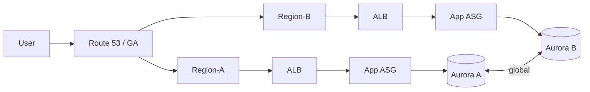

# 실제 아키텍처 패턴

## 0. 전체 개요 & 설계 목표 정리

- 최우선 목표: **중단 최소화(HA)** + **일관된 레이턴시(성능)** + **운영 자동화(가드레일)**.
- 핵심 원리: **중복성**(다중 AZ/리전), **무상태화**(Stateless), **결합도 낮추기**(SQS·EventBridge), **관측성**(Metrics/Logs/Trace), **점진적 배포**(Blue-Green/Canary).

### 용어/지표
- **RTO**: 복구까지 허용 가능한 시간
- **RPO**: 허용 가능한 데이터 손실 시점
- **가용성 합성**
  병렬 구성(둘 중 하나만 살아도 됨)의 전체 가용성:
  $$
  A_{\text{parallel}} = 1 - \prod_{i=1}^{n}(1 - A_i)
  $$
  직렬 구성(전부 살아야 됨)의 전체 가용성:
  $$
  A_{\text{series}} = \prod_{i=1}^{n} A_i
  $$

---

## 1. 멀티 리전 고가용성 (Active-Active / Active-Passive)

### 1.1 개념 & 선택 기준
- **Active-Active**: 모든 리전이 **동시에** 트래픽 처리.
  - 장점: 낮은 레이턴시, 리전 장애에도 무정지.
  - 단점: 데이터 **충돌 해결**과 비용(이중 인프라) 증가.
- **Active-Passive**: 1개 리전 운영 + 1개 리전 대기(스탠바이/부분 프로비저닝).
  - 장점: 비용 낮음, 일관성 단순.
  - 단점: 페일오버 동안 RTO↑.

### 1.2 데이터 계층 패턴
- **관계형**: Aurora Global Database(리전 간 저지연 복제, 빠른 승격), RDS Cross-Region Read Replica.
- **NoSQL**: DynamoDB Global Tables(Active-Active 쓰기, 충돌=최신 쓰기 승리/타임스탬프 전략).
- **객체**: S3 CRR(비동기), 버킷 정책 + 버전관리.

### 1.3 세션/캐시
- 무상태 우선. 세션은 **JWT/코키-기반** 또는 **ElastiCache/MemoryDB**를 리전별로 두고 **Sticky 필요 최소화**.
- 캐시는 **지역 로컬** 유지, 소스 데이터만 다중 리전 복제.

### 1.4 다이어그램 (개념)


### 1.5 구성 스니펫

**(A) Route 53 — Latency/Failover 레코드(요지)**
```yaml
Resources:
  HealthA:
    Type: AWS::Route53::HealthCheck
    Properties:
      HealthCheckConfig:
        Type: HTTP
        ResourcePath: /healthz
        FullyQualifiedDomainName: api-a.example.com
        RequestInterval: 30
        FailureThreshold: 3

  HealthB:
    Type: AWS::Route53::HealthCheck
    Properties:
      HealthCheckConfig:
        Type: HTTP
        ResourcePath: /healthz
        FullyQualifiedDomainName: api-b.example.com
        RequestInterval: 30
        FailureThreshold: 3

  RecordLatencyA:
    Type: AWS::Route53::RecordSet
    Properties:
      HostedZoneName: example.com.
      Name: api.example.com.
      Type: A
      SetIdentifier: region-a
      Region: us-east-1
      HealthCheckId: !Ref HealthA
      AliasTarget:
        HostedZoneId: Z35SXDOTRQ7X7K
        DNSName: d-aaaaaaaa.elb.amazonaws.com

  RecordLatencyB:
    Type: AWS::Route53::RecordSet
    Properties:
      HostedZoneName: example.com.
      Name: api.example.com.
      Type: A
      SetIdentifier: region-b
      Region: ap-northeast-2
      HealthCheckId: !Ref HealthB
      AliasTarget:
        HostedZoneId: Z35SXDOTRQ7X7K
        DNSName: d-bbbbbbbb.elb.amazonaws.com
```

**(B) DynamoDB Global Table — CLI**
```bash
aws dynamodb create-table \
  --table-name orders \
  --attribute-definitions AttributeName=id,AttributeType=S \
  --key-schema AttributeName=id,KeyType=HASH \
  --billing-mode PAY_PER_REQUEST \
  --region us-east-1

aws dynamodb update-table --table-name orders \
  --replica-updates '[{"Create":{"RegionName":"ap-northeast-2"}}]' \
  --region us-east-1
```

**(C) Aurora Global Database — 승격(/DR) 요지**
```bash
# 장애 시 보조 클러스터 승격(예시, 실제는 콘솔/CLI 파라미터 확인)
aws rds failover-global-cluster \
  --global-cluster-identifier my-global-aurora \
  --target-db-cluster-identifier arn:aws:rds:ap-northeast-2:...:cluster:aurora-apne2
```

### 1.6 운영 포인트
- RPO/RTO 문서화:
  - Aurora Global: 수초~수십초 RPO
  - DynamoDB Global: 충돌 정책/재처리 전략 준비.
- **읽기 분산 vs 쓰기 일관성**: Read Local + Write Single Region(활성-수동)도 현실적 대안.

---

## 2. Route 53 Latency-based Routing + Global Accelerator 조합

### 2.1 목적
- **Route 53(LBR)**: DNS 레벨에서 **가장 빠른 리전** 응답.
- **Global Accelerator(GA)**: Anycast **고정 IP** + **AWS 백본** 경유로 TCP/UDP 지연 편차 축소, 장애 시 **수 초급** 전환.

### 2.2 적용 판단
- **캐시 불가 동적 API**·**게임/금융** 등 RT 민감 → GA 적합.
- 정적/캐시 가능 → CloudFront 우선.

### 2.3 GA 구성(개념 CLI)
```bash
GA_ARN=$(aws globalaccelerator create-accelerator \
  --name "prod-ga" \
  --enabled true \
  --query 'Accelerator.AcceleratorArn' --output text)

# 리전 A
aws globalaccelerator create-endpoint-group \
  --listener-arn $(aws globalaccelerator create-listener \
    --accelerator-arn $GA_ARN \
    --protocol TCP --port-ranges FromPort=443,ToPort=443 \
    --query 'Listener.ListenerArn' --output text) \
  --endpoint-group-region us-east-1 \
  --endpoint-configurations EndpointId=alb-arn-in-us

# 리전 B
aws globalaccelerator create-endpoint-group \
  --listener-arn <listener-arn> \
  --endpoint-group-region ap-northeast-2 \
  --endpoint-configurations EndpointId=alb-arn-in-ap
```

### 2.4 운영/주의
- GA는 **프로비저닝만 해도 시간 요금** 발생 → 사전 PoC로 **CloudFront+R53** 대비 효과/비용 검증.
- 보안 정책/허용 목록에 **GA 고정 IP** 등록 유리.
- 헬스체크 간격/임계값 튜닝으로 **플랩 방지**.

---

## 3. CloudFront Origin Failover

### 3.1 동작
- Distribution에 **Origin Group(Primary/Secondary)** 구성.
- 지정한 **HTTP 상태**(예: 5xx) 감지 시 **Secondary**로 자동 전환.

### 3.2 설정(CFN 발췌)
```yaml
Resources:
  D:
    Type: AWS::CloudFront::Distribution
    Properties:
      DistributionConfig:
        Enabled: true
        Origins:
          - Id: origin-a
            DomainName: alb-a.example.com
          - Id: origin-b
            DomainName: alb-b.example.com
        OriginGroups:
          Quantity: 1
          Items:
            - Id: og1
              FailoverCriteria:
                StatusCodes: { Quantity: 2, Items: [502, 503] }
              Members:
                Quantity: 2
                Items:
                  - OriginId: origin-a
                  - OriginId: origin-b
        DefaultCacheBehavior:
          TargetOriginId: og1
          ViewerProtocolPolicy: redirect-to-https
          AllowedMethods: [GET, HEAD, OPTIONS]
          CachedMethods: [GET, HEAD]
          Compress: true
```

### 3.3 운영 팁
- Primary/Secondary 오리진의 **데이터 동기화**(S3 CRR, DB 복제) 필수.
- **오리진 헬스** 판단 기준을 서비스 특성에 맞게(특정 헬스 경로/커스텀 헤더).

---

## 4. 하이브리드 연결: VPC Endpoint + Direct Connect + PrivateLink

### 4.1 목표 시나리오
- 온프레 ↔ AWS 간 **전용 회선(DX)** + 중앙 라우팅(**Transit Gateway**).
- PrivateLink(Interface Endpoint)로 **사설 서비스** 소비.
- S3/DynamoDB는 **Gateway Endpoint**로 **NAT 회피 + 비용↓**.

### 4.2 다이어그램
```mermaid
graph LR
  DC[On-Prem DC] -- DX --> DXGW[DX Gateway]
  DXGW --> TGW[Transit Gateway]
  TGW --> VPC-App
  TGW --> VPC-Network(Shared)
  VPC-Network --> S3GW[GW Endpoint - S3]
  VPC-App --> PL[PrivateLink (Interface EP)]
```

### 4.3 구성 요점
- **DX 고가용성**: 서로 다른 로케이션/장비에 **이중 회선**.
- **TGW 라우팅 테이블 분리**: Prod/Non-Prod/Partner-VPC 격리.
- **DNS**: Route 53 Resolver **인바운드/아웃바운드** 엔드포인트로 하이브리드 이름 해석.

### 4.4 스니펫(Resolver Outbound — 예)
```yaml
Resources:
  OutboundEP:
    Type: AWS::Route53Resolver::ResolverEndpoint
    Properties:
      Direction: OUTBOUND
      IpAddresses:
        - SubnetId: subnet-a
        - SubnetId: subnet-b
      SecurityGroupIds: [sg-resolver]
      Name: outbound-to-onprem
```

---

## 5. 보안 경계 분리: 퍼블릭(CloudFront/ALB) ↔ 프라이빗(NLB/GWLB)

### 5.1 개념
- **퍼블릭 서브넷**: Internet-facing ALB/NLB, NAT, Ingress 계층.
- **프라이빗 서브넷**: App/DB, 내부 NLB, GWLB 뒤 보안 장비.

### 5.2 체인 예시
```mermaid
graph LR
  I[Internet] --> CF[CloudFront]
  CF --> ALB[ALB (public)]
  ALB --> APP[App in Private Subnet]
  I --> NLB[NLB (public TCP/UDP)]
  NLB --> SVC[Backend in Private]
  VPC --> GWLB[GWLB]
  GWLB --> IDS[IDS/IPS ASG]
  IDS --> SVC
```

### 5.3 구현 지침
1. **ALB**: 443만 개방, HTTP→HTTPS 리다이렉트, 필요시 **WAF**.
2. **CloudFront+OAC/OAI**: S3 오리진 보호, 오리진 접근 통제.
3. **NLB**: **정적 IP**·**UDP**·**TLS Passthrough** 요구 시.
4. **GWLB**: 보안 어플라이언스(ASG) **자동 확장**·중앙 로깅.

### 5.4 SG/NACL 패턴(요지)
- 퍼블릭 LB SG: 0.0.0.0/0:443 허용(최소화), 내부로는 **Target SG**만 허용.
- 프라이빗 인스턴스 SG: **LB SG만 소스**로 허용.
- NACL은 기본 좁게, 상세 정책은 **SG 중심**.

---

## 6. 운영 · 테스트 · 비용

### 6.1 DR/Failover 테스트(게임데이)
- 리전 단위: ALB 타깃 고의 불건전/DB Failover/Route 53 Health-check 제어.
- CloudFront 오리진 전환: Primary 응답 503로 유도 후 **Failover 시간 측정**.

**헬스 체크 임시 비활성(예시)**
```bash
aws route53 update-health-check --health-check-id XXXXXX --inverted true
# 또는 응답 코드를 의도적으로 503으로 반환하도록 헬스 핸들러 토글
```

### 6.2 관측성(골든 시그널)
- **가용성**: HTTP 5xx 비율, HealthCheck 실패/전환 횟수
- **성능**: p50/p95/p99 레이턴시, GA/CF 엣지-오리진 RTT
- **용량**: ALB/NLB LCU/NLCU 축 최대, ASG 목표 메트릭
- **안전성**: 재시도/써킷브레이커 발동 수

**SLO 수식 예**
$$
\text{SLO}_{\text{lat}} = \Pr[T_{\text{resp}} \le 500\text{ms}] \ge 99.9\%
$$

### 6.3 비용 고려
- Active-Active: 이중 인프라 + 데이터 복제 **전송비**.
- GA: **시간 요금+데이터 프리미엄** → 필요 워크로드에 한정.
- CF: **캐시율↑** = **Origin egress↓**.
- GWLB: 보안 이득 ↔ 추가 레이어 비용.

---

## 7. 체크리스트 & 권장 실행 순서

### 7.1 사전 정의
- [ ] **RTO/RPO** 수치화, **데이터 일관성** 모델 확정(싱글 라이터/멀티 라이터).
- [ ] **DNS/Anycast 사용 여부**(GA 필요성), **캐시 전략**(CF).

### 7.2 실행 순서(권장)
1. **데이터 계층**: Aurora Global/DynamoDB Global/S3 CRR 준비.
2. **네트워크 허브**: Transit Gateway, DX/SD-WAN, Resolver(하이브리드 DNS).
3. **엣지/라우팅**: Route 53 LBR, GA(필요시), CF 배포.
4. **오리진 페일오버**: CF Origin Group, 헬스 기준·상태코드 설계.
5. **보안 경계**: ALB/NLB/GWLB, SG/NACL, WAF/Shield 정책.
6. **관측성/가드레일**: 대시보드·알람·Budgets·Anomaly.
7. **DR 리허설**: 부분 → 전체 → 문서화/자동화.

---

## 8. 운영 자동화 & 진단 스니펫

**(A) CloudWatch 경보 → 자동 조치(Lambda) 스케치**
```python
# 경보(ALB 5xx 급증) → Endpoint Group 가중치 임시 조정(의사 코드)
import boto3
ga = boto3.client('globalaccelerator')

def handler(event, context):
    # ... 경보 파싱 후 문제 리전 가중치↓, 다른 리전↑
    ga.update_endpoint_group(
      EndpointGroupArn='arn:aws:ga:...',
      HealthCheckIntervalSeconds=10,
      TrafficDialPercentage=30.0  # 임시 축소
    )
```

**(B) CF 로그로 오리진 페일오버 감지(Athena)**
```sql
SELECT date(time) d,
       COUNT_IF(x_edge_result_type='Error') AS edge_err,
       COUNT_IF(sc_status IN (502,503,504)) AS origin_5xx,
       COUNT(*) AS total
FROM cf_logs
WHERE time BETWEEN timestamp '2025-11-01' AND timestamp '2025-11-10'
GROUP BY 1 ORDER BY 1;
```

**(C) TGW 라우팅 상태 점검(요지)**
```bash
aws ec2 get-transit-gateway-route-table-associations --transit-gateway-route-table-id tgw-rtb-...
aws ec2 search-transit-gateway-routes --transit-gateway-route-table-id tgw-rtb-... --filters Name=state,Values=active
```

---

## 9. 참조 패턴: 최소 예산으로 시작 → 점진 확장

1) **Active-Passive 시작**: 단일 리전 운영 + 대기 리전 **IaC 템플릿 준비**.
2) **CloudFront Origin Failover** 우선 적용(오리진 레이어 내장 탄성).
3) **읽기 분산**: Aurora Read Replica/Global DB로 근접 리전 읽기.
4) **RT 민감 워크로드** 한정 GA 도입.
5) **GWLB/IDS 체인**은 규제·고위험 구간부터 단계적 확대.

---

## 10. 부록 — IaC 리포 구조 예시
```
infra/
├─ global/
│  ├─ route53/
│  └─ ga/
├─ region-us/
│  ├─ vpc/
│  ├─ alb-asg-app/
│  ├─ aurora/
│  └─ cloudfront/
├─ region-ap/
│  ├─ vpc/
│  ├─ alb-asg-app/
│  ├─ aurora/
│  └─ cloudfront/
└─ shared/
   ├─ tgw/
   ├─ resolver/
   ├─ privatelink/
   └─ security/gwlb/
```

---

## 11. 마무리 — 요약 문장

- **엣지/라우팅**(Route 53/GA/CF), **데이터 복제**(Aurora/DynamoDB/S3), **보안 경계**(ALB/NLB/GWLB)와 **하이브리드 연결**(DX/TGW/PrivateLink)을 **목표 RTO/RPO** 기준으로 조합하라.
- **정기 DR 테스트**와 **관측성/가드레일**이 *진짜* 고가용성을 만든다.
- 처음엔 **Active-Passive + CF Origin Failover**로 시작해, 필요 구간에만 **Active-Active/GA/GWLB**를 추가하라.
