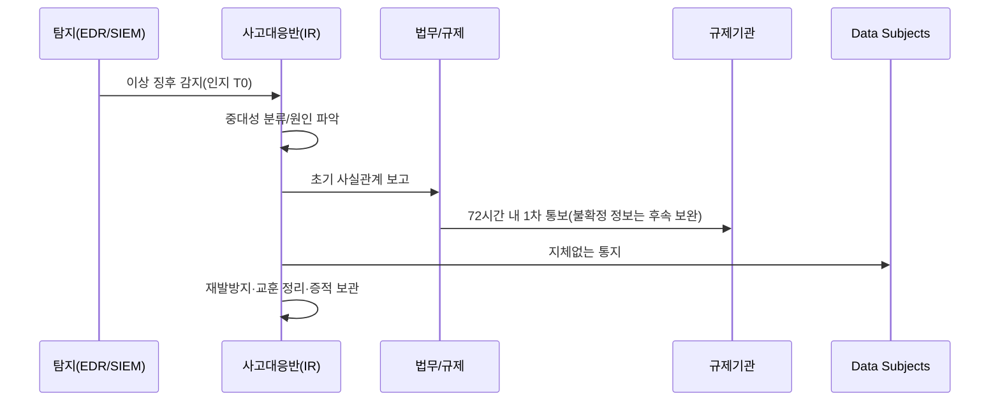
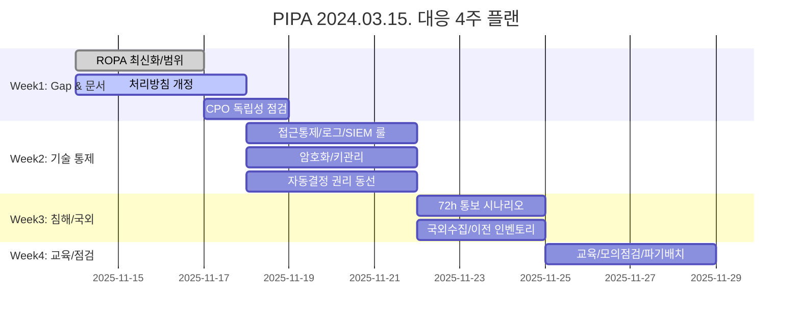
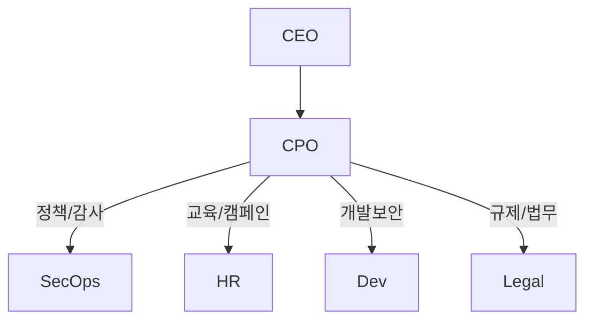

# SECTION 18 정보보안 법규 — 01 법규 개요 & 02 개인정보 보호법

## 01. 법규 개요

### 1) 왜 ‘법규’가 보안 로드맵의 시작인가
- 법·하위규정은 **최소 준수선**(floor)이다. 내부 **정책(Policy)·표준(Standard)·지침(Guideline)·절차(Procedure)**는 이를 **구체화**하고, 기술 통제(암호화·접근통제·로깅)는 **집행 수단**이다.
- 개인정보보호 체계는 대개 **본법 → 시행령/시행규칙 → 고시/가이드 → 질의회신**으로 구현된다. 실무자는 **조문→운영 절차→증적** 3단 매핑을 즉시 보여줄 수 있어야 한다.

### 2) 개인정보 핵심 용어(실무 관점 정렬)
| 구분 | 정의(요지) | 대표 예시 | 실무 영향 |
|---|---|---|---|
| 개인정보 | 특정 개인 식별 가능한 정보(단독/결합) | 이메일, 기기지문 | 분류(Classification)·암호화 범위·보존/파기 |
| 민감정보 | 특별 보호 대상 | 건강, 유전자, 범죄경력 | 수집제한·강화된 보호조치 |
| 가명정보 | 추가정보 없인 특정불가 | 통계·연구 가공값 | 가명처리 통제, 재식별 위험관리 |
| 고유식별정보 | 주민번호/여권번호 등 | 주민등록번호 등 | 저장·전송 암호화, 접근통제 강화 |

> **설계 원칙 요약**  
> - **합법성/공정성/투명성**: 수집 목적·법적 근거·보유기간 표시(처리방침·동의화면).  
> - **목적 제한** & **최소 수집**: 필요 최소 항목만. 목적 달성 시 **지체 없이 파기** 또는 가명/익명화.  
> - **정확성/안전성**: 접근통제, 저장·전송 암호화, 접속기록 보관/점검.

### 3) 내부 문서 아키텍처(감사 대응형)
```mermaid
flowchart TB
A[법/시행령/고시 요건] --> B[내부 정책(Policy)]
B --> C[표준(Standard): 암호·로그·보존]
C --> D[절차(Procedure): 수행 단계/역할/SLA]
D --> E[증적(Evidence): 로그·보고서·교육이수]
E --> F[정기 검토/개정(연1~2회)]
```

---

## 02. 개인정보 보호법(시행: 2024.03.15.) 핵심 정리

### 1) 2024.03.15. 시행 변화 핵심
1. **자동화된 결정에 대한 정보주체 권리(법 §37조의2)**  
   - 정보주체는 **거부권**, **설명 요구권**, **사람에 의한 검토 요구권** 행사 가능.  
   - 처리자는 **기준·절차·처리방식 공개**, **권리행사 창구** 제공, **기록 보관** 필요.  
   - 2024.09.26. 제정된 **조치 기준(고시)**은 절차·기한·설명 수준을 구체화.
2. **CPO(개인정보보호책임자) 제도 개선**  
   - 일정 규모 이상에서 **자격 요건/독립성** 명확화(보고 라인, 겸직 제한 등).
3. **처리방침(Privacy Notice) 기재 확대**  
   - **국외에서의 직접 수집** 및 **국외 이전**의 사실·주요내용을 **처리방침에 공개**.
4. **손해배상 책임 이행수단** 합리화(보험·공제 등).  
5. **침해사고 통보**: **안 날부터 72시간 이내** 규제기관 통보 및 정보주체 통지.

### 2) 자동화된 결정권리 — 설계 체크리스트
- [ ] **권리 범위** 정의: 서비스 내 어디에 자동결정이 있는가(사기탐지·콘텐츠 추천·요금제 분류 등).  
- [ ] **권리 행사 동선**: 앱/웹 **“마이페이지 → 자동화된 결정 권리”** 메뉴.  
- [ ] **거부 시 동작**: **적용 정지 + 사람 검토** SLA(예: 48시간).  
- [ ] **설명 데이터**: 모델·특성치 범주·판단근거 로그(개인정보 최소화).  
- [ ] **분쟁 대비**: 결정ID 단위 **이력/타임스탬프/담당자** 기록.

#### 설명가능 로그 구조(예시)
```json
{
  "decision_id": "2025-11-14-ABCD1234",
  "model": "fraud_v3.5",
  "version": "3.5.2",
  "inputs": {"device_age_days": 2, "ip_risk": "high", "tx_amount": 120000},
  "feature_rank": ["ip_risk", "device_age_days", "tx_amount"],
  "outcome": "deny",
  "user_rights": {"optout": true, "explainable": true, "human_review": "pending"},
  "timestamps": {"decided_at": "2025-11-14T00:10:12Z"}
}
```

> **정량 메모(위험·효익)**  
> 클릭확률 \(p_c\), 오탐률 \(p_f\), 평균 손실 \(L\)일 때,  
> $$ \text{기대손실} = p_c \times p_f \times L $$
> **설명·검토 절차**로 \(p_f\)를 30% 낮추면 기대손실은 **0.7배**로 감소.

### 3) 처리방침(Privacy Notice) — 추가 기재 포인트
- **국외에서의 직접 수집 여부**(예: 해외 CDN/SDK를 통한 로그 수집).  
- **국외 이전**: 국가·수탁자·항목·목적·보유기간·안전조치·문의처.  
- **자동화된 결정 존재**: 권리(거부·설명·검토)와 행사 방법.

#### 처리방침 YAML 템플릿(요지)
```yaml
company: ACME 주식회사
last_updated: 2025-11-14
cpo:
  name: 홍길동
  reporting_line: CEO 직속    # 독립성
contacts: [privacy@acme.co.kr, 02-0000-0000]
automated_decision:
  exists: true
  examples: ["사기거래 탐지", "봇 차단"]
  data_subject_rights: ["거부권", "설명요구권", "사람검토요구권"]
  how_to_exercise: "마이페이지 > 자동화된 결정 권리"
cross_border:
  collection: true
  transfers:
    - vendor: "ACME Cloud Inc."
      country: "US"
      items: ["이메일 해시", "접속기록"]
      purpose: "콘텐츠 전송/보안"
      safeguards: "계약상 안전조치(SCC 등)"
breach_notification:
  regulator_within_hours: 72
  data_subjects: "지체없이 이메일·앱 공지"
```

### 4) 침해사고 통보(72시간) — 운영 절차


#### 72시간 마감 계산기(학습용 Python)
```python
from datetime import datetime, timedelta, timezone

KST = timezone(timedelta(hours=9))

def deadline_72h(aware_iso: str):
    aware = datetime.fromisoformat(aware_iso).astimezone(timezone.utc)
    ddl = aware + timedelta(hours=72)
    return {
        "aware_utc": aware.isoformat(),
        "deadline_utc": ddl.isoformat(),
        "deadline_kst": ddl.astimezone(KST).isoformat()
    }

print(deadline_72h("2025-11-14T00:05:00+09:00"))
```

> **운영 팁**: “불확정 정보는 후속 보완 제출 허용” 절차를 문서화하고, **인지 시각·의사결정·통보 제출**의 타임스탬프를 **변조불가 로그**로 보관.

---

## 03. 실무 구축 플로우 — 4주 압축 플랜(증적 중심)



### 산출물(필수 패키지)
- **문서**: 처리방침, ROPA, DPIA(필요 시), 자동결정 권리 프로세스, 72h 통보 런북.  
- **설정/코드**: 접근통제/로그 포맷, 암호화 정책, SIEM 탐지 룰, 파기 스크립트.  
- **증적**: 교육 이수, 운영 점검 보고서, 모의훈련 결과, 통보 템플릿.

---

## 04. DPIA(필요 시)·ROPA·권리처리 템플릿

### A) ROPA(처리 활동 기록) 표
| 활동 | 법적근거 | 항목 | 처리위탁/제공 | 국외이전 | 보유 | 자동화여부 |
|---|---|---|---|---|---|---|
| 회원관리 | 동의/계약 | 이메일 | 발송사(수탁) | 미국(SaaS) | 탈퇴 시 | N |
| 부정이용 방지 | 정당한 이익 | 접속IP/기기지문 | X | X | 1년 | **Y** |

### B) DPIA(요지) 체크
```yaml
dpia:
  scope: "사기탐지 모델 v3.5"
  lawful_basis: "정당한 이익"
  data_minimization: true
  risks:
    - name: 오탐에 따른 이용제한
      impact: high
      likelihood: medium
      mitigation: "사람 검토 SLA 48h, 설명가능 로그"
  residual_risk: "중간"
  review_cycle: "6개월"
```

### C) 자동화된 결정 권리 처리 절차
1. **요청 접수**(거부/설명/사람 검토)  
2. **거부 즉시 적용정지**(관련 엔드포인트 차단 또는 가중치 0 처리)  
3. **설명 제공**: 모델 종류·결정 요소 **범주**(개인정보 최소화)  
4. **사람 검토**: SLA·책임자 지정, 결과 통지  
5. **증적 보관**: 결정ID 단위 로그·타임스탬프·담당 기록

---

## 05. 기술 통제 구현 예제(정책→설정→로그)

### 1) NGINX — TLS/로깅
```nginx
ssl_protocols TLSv1.2 TLSv1.3;
ssl_ciphers HIGH:!aNULL:!MD5:!3DES;

map $request_uri $pii { default 0; ~^/api/v1/users 1; }
log_format pii '$time_iso8601 $remote_addr $request $status uid=$http_x_user_id pii=$pii';
access_log /var/log/nginx/personal-data.log pii if=$pii;
```

### 2) DB — 열암호화/마스킹(PostgreSQL 예시)
```sql
-- 마스킹 뷰
CREATE VIEW v_user_safe AS
SELECT id,
       left(email,2) || '***' || substring(email from '@.*$') AS email_mask,
       NULL::text AS ssn_mask
FROM users;

-- pgcrypto 기반 컬럼 암호화
SELECT pgp_sym_encrypt('010-1234-5678', current_setting('app.kek'));
```

### 3) 보유기간 만료 파기 배치(Python)
```python
from datetime import datetime, timedelta
import psycopg2, os

RET_DAYS = int(os.getenv("RET_DAYS", "365"))
cutoff = datetime.utcnow() - timedelta(days=RET_DAYS)
SQL = "DELETE FROM login_logs WHERE occurred_at < %s RETURNING id"

with psycopg2.connect(dsn=os.getenv("DSN")) as con, con.cursor() as cur:
    cur.execute(SQL, (cutoff,))
    print(f"deleted={cur.rowcount}")
    con.commit()
```

### 4) SIEM 탐지 — 자동결정 오류 급증(Splunk)
```spl
index=app_logs event=auto_decision result=deny
| bin _time span=5m
| stats count AS denies by _time, model_name
| eventstats avg(denies) AS avg_denies stdev(denies) AS sd by model_name
| where denies > avg_denies + 3*sd
```

---

## 06. 동의·쿠키(최소수집·목적제한 적용)

### 프런트 JS — 목적별 동의 저장
```html
<script>
function setConsent(purposes){
  localStorage.setItem('consent', JSON.stringify({ts:Date.now(), purposes}));
}
function hasConsent(p){
  try{
    const c = JSON.parse(localStorage.getItem('consent')||'{}');
    return (c.purposes||[]).includes(p);
  }catch(e){ return false; }
}
</script>
```

### 서버(Express) — 미동의시 수집 차단
```js
app.post('/ads/pixel', (req,res)=>{
  const consent = req.cookies.consent || "";
  if(!consent.includes('ads')) return res.status(403).send('consent required');
  // strictly necessary only...
});
```

---

## 07. CPO 체계·독립성 운영(예시)

### 조직도/보고라인(샘플)


### CPO 역할·자격 문서(요지)
```yaml
cpo_role:
  independence: "CEO 직속"
  conflicts_of_interest: "영업·마케팅 총괄 겸직 금지"
  authority: ["정책 제정/개정 승인", "사고보고 수령/결정권"]
  qualifications: ["개인정보보호/보안 경력 n년", "관련 교육 이수"]
  review: "연1회 이사회 보고"
```

---

## 08. 국외 수집·이전 공개(처리방침 섹션 샘플)

- **수집 위치**: 해외 SDK/호스팅을 통한 **직접 국외수집** 여부.  
- **이전 국가/수탁자/항목/목적/보유기간/안전조치**.  
- **문의처**(권리 행사·문의).

```yaml
cross_border:
  collection: true
  transfers:
    - vendor: "EdgeCDN LLC"
      country: "US"
      items: ["IP 주소", "User-Agent 해시"]
      purpose: "콘텐츠 전송/보안"
      retention: "30일"
      safeguards: "계약상 안전조치"
```

---

## 09. 내부 점검 스크립트/자동화(샘플)

### A) Windows — 개인정보 파일/권한 스캔(PowerShell)
```powershell
$targets = "C:\Data\pii","D:\Exports"
Get-ChildItem $targets -Recurse -Include *.csv,*.xlsx,*.json |
  Where-Object { $_.Length -gt 0 } |
  ForEach-Object {
    $acl = Get-Acl $_.FullName
    [PSCustomObject]@{
      Path = $_.FullName
      Size = $_.Length
      WorldWritable = ($acl.Access | ? { $_.IdentityReference -match "Everyone" -and $_.FileSystemRights -match "Write" }) -ne $null
    }
  } | Export-Csv .\pii_acl_audit.csv -NoTypeInformation
```

### B) Linux — auditd로 DB 접근기록 확보
```bash
# /etc/audit/rules.d/personal.rules
-w /var/lib/postgresql/14/main/base -p rwxa -k pii-db-access
augenrules --load && systemctl restart auditd
```

### C) 접근권한 정기 리뷰 자동화(Python)
```python
import csv, datetime as dt
MINDAYS = 90
review = []
today = dt.date.today()
with open("access.csv", newline="", encoding="utf-8") as f:
  for user, role, last_used, res in csv.reader(f):
    if user == "user": continue
    last = dt.datetime.fromisoformat(last_used).date()
    if (today - last).days >= MINDAYS:
      review.append((user, role, res, (today-last).days))
print("user,role,resource,days_since_use")
for r in review: print(",".join(map(str,r)))
```

---

## 10. 시험·면접 대비 포맷(필답형 스캐폴드)

**문제 예시**  
> “2024.03.15. 시행된 **자동화된 결정 권리**에 대응하기 위한 조직·기술 조치를 4단계로 서술하라.”

**모범 스캐폴드**  
1) **처리방침**: 자동화 결정 존재·권리·행사 방법 고지.  
2) **프로세스**: 거부 즉시 적용정지, 설명 제공, 사람 검토 **SLA**.  
3) **기술**: 설명가능 로그, 모델 버전관리, 의사결정ID 타임스탬프.  
4) **증적**: 권리처리 기록, 교육 이수, 정기 리뷰 보고서.

---

## 11. 마무리 체크리스트(현황·증적 중심)

- [ ] **처리방침 최신화**: 국외 수집·이전, 자동결정 권리, CPO 정보.  
- [ ] **자동결정 체계**: 거부/설명/검토 절차, 사람 검토 라인, 설명가능 로그.  
- [ ] **침해 통보 72h**: 타이머·서식·포털 계정, 타임스탬프 증적.  
- [ ] **안전성 확보조치**: 저장·전송 암호화, 접속기록 보관/점검, 키/티켓 로테이션.  
- [ ] **교육/모의훈련**: 분기 모의피싱·권리행사 시나리오 연습.  
- [ ] **국외 인벤토리**: SDK/클라우드/분석도구 역외수집 여부와 처리방침 정합.  
- [ ] **CPO 독립성**: 보고라인, 겸직 제한, 연간 보고.

---

## 12. 부록 — 표준 템플릿 모음

### A) 위험평가 시트(간단)
```csv
자산,소유부서,취약점,위협,영향(1-5),발생(1-5),위험도,처리전략,통제
DB서버1,플랫폼,패치지연,RCE,5,3,15,저감,월간패치/재부팅
```
$$ Risk = Impact \times Likelihood $$

### B) 로그 보존·무결성 정책(YAML)
```yaml
log_policy:
  retention:
    access_log: 1y
    admin_actions: 2y
  integrity:
    signing: enabled
    time_sync: ntp.pool.org
  review:
    owner: "SecOps"
    interval: "monthly"
```

### C) 자동결정 권리 문구(알림/FAQ 샘플)
```text
귀하는 당사 자동화된 의사결정(사기탐지 등)에 대해
1) 적용 거부, 2) 설명 요구, 3) 사람에 의한 검토를 요구할 권리가 있습니다.
권리 행사는 ‘마이페이지 > 자동화된 결정 권리’에서 신청 가능합니다.
```

---

## 13. 결론
- **법·제도 변화(2024.03.15.)**는 문구 개정 수준이 아니라 **프로세스·로그·설명가능성**까지 동시 개편을 요구한다.  
- **증적 우선** 방식(로그·타임스탬프·보고서)과 **자동화 스크립트**를 결합하면, 감사·심사·사고 대응 모두에서 **재현성**을 확보할 수 있다.  
- 본문 템플릿을 **조직 표준서·SOP**로 내재화하고, 분기별로 **리허설**하라.