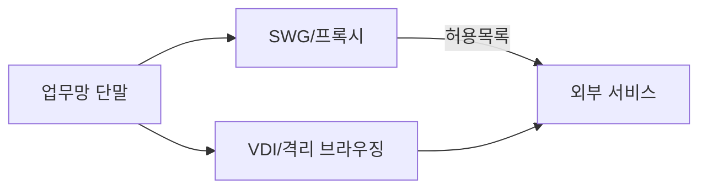

# 개인정보의 안전성 확보조치 기준(시행: 2023.09.22)

## 0) 한눈에 보는 전체 구조

| 영역 | 고시 조항 | 핵심 통제 목표 | 대표 증적(감사 친화) | 미국/유럽 레퍼런스 매핑(요지) |
|---|---|---|---|---|
| 내부관리계획 | 제4조 | 역할·책임·교육·자체점검 | 내부관리계획, 교육계획/이수, 점검보고 | NIST PM/AT, ISO 5·6·7 |
| 접근권한 관리 | 제5조 | 최소권한·계정 생애주기·인증수단 | RBAC 매트릭스, 승인·회수 이력 | NIST AC, ISO 8 |
| 접근통제 | 제6조 | 네트워크/시스템 경계·탐지·차단, 인터넷망 차단 요건 | FW/IPS 정책, 인터넷 분리/대체통제 설계 | NIST SC/CA/IR, ISO 8·12 |
| 개인정보 암호화 | 제7조 | 저장·전송 암호화, 키관리 | 암호화 정책, 키관리대장, 스캔 리포트 | NIST SC-12/SC-13, ISO 10 |
| 접속기록 | 제8조 | **1년(기본)/2년(요건)** 보관, 무결성, 상시점검 | WORM/해시, SIEM 보고, 보존설정 | NIST AU, ISO 8·10 |
| 악성코드 방지 | 제9조 | 백신/EDR/XDR, 취약점/패치 | EDR 준수율, 패치 리포트 | NIST SI/RA, ISO 8 |
| 물리적 조치 | 제10조 | 보관구역·출입통제 | 출입기록, CCTV, 장비대장 | NIST PE, ISO 7 |
| 재해·재난 대비 | 제11조 | 백업·복구·DR·테스트 | 복구훈련 기록, 백업검증 로그 | NIST CP, ISO 5·8 |
| 출력·복사 | 제12조 | 반출 승인·워터마크·DLP | 반출기록, 워터마크 스냅샷 | NIST MP/PS, ISO 8 |
| 파기 | 시행령 제16조, 고시 제13조 | 전자파일 영구삭제/비전자매체 파쇄·소각 | 파기대장·용역 확인서 | NIST MP-6, ISO 8 |

> **감사 팁**: 각 통제별로 “정책/절차(문서) → 시스템 설정(증적) → 운영결과(로그·보고)”의 **3점 세트**를 준비한다.

---

## 1) 내부관리계획 — 문서화/역할/교육/자체점검

### 1.1 필수 요구 요약
- CPO/개인정보보호 조직 구성과 **역할·책임(RACI)** 정의
- 연 1회 이상 **교육**(신규/정기/IT운영자 심화)
- 정기 **자체점검**과 개선 이력 관리

### 1.2 체크리스트
- [ ] 최신 내부관리계획(개정 이력 포함), **처리흐름도/자산대장/ROPA** 동기화  
- [ ] 연간 교육계획·커리큘럼·이수율, 시험/설문 결과  
- [ ] 분기/반기 점검표, **미흡사항 개선 추적표**

### 1.3 내부관리계획 템플릿(요지)
```text
내부관리계획 v2025-01
1. 목적/범위/정의
2. 거버넌스(조직/역할/RACI, 보고체계, 승격·예외관리)
3. 개인정보 현황(처리목록/데이터흐름/자산대장/분류기준)
4. 접근권한 LCM(요청-승인-반영-검토-말소), 계정정책, MFA
5. 암호화/키관리, 로그(보존/무결성/점검), 백업/DR
6. 반출/출력/매체통제, 파기(전자/비전자)
7. 교육/인식제고, 자체점검/내부감사, 사고대응(IR)
8. 기록/증적 관리, 보존기간, 개정절차
```

---

## 2) 접근권한 관리 — 최소권한과 계정 생애주기(LCM)

### 2.1 실무 포인트
- **승인 흐름**: 요청자 → 데이터오너 승인 → 보안승인(필요 시) → 시스템 반영 → **증적 자동보관**
- **정기권한검토**: 분기/반기, **휴면권한** 회수, **퇴사/전보 즉시 말소**
- **공용계정 금지**, 불가피 시 **세션 녹화+개인 식별 토큰** 매핑

### 2.2 예시 — 리눅스 sudo 최소권한
```bash
# /etc/sudoers.d/app-admins
Cmnd_Alias APP_MAINT = /usr/bin/systemctl restart app.service
%app_admins ALL=(root) NOPASSWD: APP_MAINT
```

### 2.3 예시 — AWS/Azure/GCP IAM 최소권한
```json
{
  "Version": "2012-10-17",
  "Statement": [{
    "Sid": "DBReadOnly",
    "Effect": "Allow",
    "Action": ["rds:DescribeDBInstances"],
    "Resource": "*"
  }]
}
```
```yaml
# Azure 역할 바인딩(요지)
roleAssignment:
  principal: user:alice@acme.com
  roleDefinition: Reader
  scope: /subscriptions/..../resourceGroups/prod-rg
```
```yaml
# GCP IAM(요지)
bindings:
- role: roles/storage.objectViewer
  members:
  - user:alice@acme.com
```

### 2.4 권한검토 자동 리포트(리눅스)
```bash
#!/bin/bash
cut -d: -f1,3,7 /etc/passwd | awk -F: '$2>=1000 {print $1","$2","$3}' > /var/audit/users.csv
getent group sudo | tr ' ' '\n' | tail -n +4 > /var/audit/sudoers.txt
```

---

## 3) 접근통제 — 경계/세그먼트/탐지·차단 및 인터넷망 차단 요건

### 3.1 요건 개요
- 네트워크/시스템 **허용목록(allow-list)** 중심 접근통제
- 침입탐지/차단(IDS/IPS/WAF), 관리 포트 격리, 원격접속 제한
- **인터넷망 차단**: 개인정보취급자 단말이 **해설서 기준에 해당**하면 의무 적용(대상 판단서+대체통제 설계 포함)

### 3.2 방화벽 예시(nftables)
```bash
table inet filter {
  chain input {
    type filter hook input priority 0;
    ct state { established, related } accept
    iif "eth0" tcp dport {22,443} accept
    ip saddr {10.0.0.0/8} tcp dport 5432 accept
    drop
  }
}
```

### 3.3 인터넷 분리 대체통제(프록시/VDI) 설계

- **증적**: FW/프록시 정책 스냅샷, VDI 정책, 정책 변경 이력

---

## 4) 개인정보의 암호화 — 저장·전송·키관리

### 4.1 저장(At-Rest)
- **열/필드 암호화**(앱 계층) 또는 **디스크/TDE**(DB/파일시스템)
- **키 분리**: KMS/HSM에 보관, **접근권한 분리** 및 **키회전**

#### 앱 계층 암호화(AES-GCM, Python)
```python
from cryptography.hazmat.primitives.ciphers.aead import AESGCM
import os, base64

key = AESGCM.generate_key(bit_length=256)   # 실운영: KMS/HSM에서 주입
nonce = os.urandom(12)                      # 매 트랜잭션 고유값
pt = b"resident_id=901010-1234567"

ct = AESGCM(key).encrypt(nonce, pt, None)
print(base64.b64encode(nonce+ct).decode())
```

#### 리눅스 LUKS
```bash
cryptsetup luksFormat /dev/nvme1n1
cryptsetup open /dev/nvme1n1 secdata
mkfs.xfs /dev/mapper/secdata
```

### 4.2 전송(In-Transit) — TLS 1.2/1.3
```nginx
ssl_protocols TLSv1.2 TLSv1.3;
ssl_ciphers 'TLS_AES_256_GCM_SHA384:TLS_CHACHA20_POLY1305_SHA256:TLS_AES_128_GCM_SHA256';
ssl_prefer_server_ciphers on;
add_header Strict-Transport-Security "max-age=31536000; includeSubDomains" always;
```

### 4.3 키관리 체크포인트
- [ ] KMS/HSM 사용, **서버/애플리케이션과 키의 논리·물리 분리**
- [ ] **회전주기**와 폐기 절차, **접근 로그 보관**(역할 분리)
- [ ] 백업키/마스터키 별도 금고, **복구 테스트** 로그

---

## 5) 접속기록 — 보관기간(1년/2년), 무결성, 상시점검

### 5.1 보관기간 판정
- **기본 1년**  
- 다음 중 하나라도 해당 시 **2년**:  
  1) 정보주체 **5만 명 이상** 처리  
  2) **고유식별정보** 또는 **민감정보** 처리  
  3) 특정 사업자(통신 등)

### 5.2 무결성·점검 구현

#### auditd 규칙(리눅스)
```bash
# /etc/audit/rules.d/personal-info.rules
-w /var/lib/mysql -p rwa -k db_access
-a always,exit -F arch=b64 -S open,openat -F dir=/srv/app -k app_io
```

#### 윈도우 고급 감사정책
```powershell
auditpol /set /subcategory:"Logon" /success:enable /failure:enable
auditpol /set /subcategory:"Object Access" /success:enable /failure:enable
```

#### 로그 해시 스냅샷
```bash
find /var/log -type f -name "*.json" -exec sha256sum {} \; > /var/log/.hashes-$(date +%F)
```

> **WORM/보존**: 오브젝트 스토리지의 **보존잠금(예: Object Lock/Immutable Blob)**으로 변경불가 기간을 강제한다.

---

## 6) 악성코드 방지·취약점·패치

### 6.1 운영 원칙
- EDR/XDR **실시간 보호**·행위탐지, **서명 업데이트** 자동화
- **취약점 스캐닝** + 패치 **SLA**(중요도별 기한), 미적용 사유서

### 6.2 증적
- EDR 에이전트 적용률 **대시보드 캡처**
- 취약점 리포트(고위험 조치율)·패치 완료 보고

---

## 7) 물리적 안전조치

- 보관구역(서버실/문서보관실) 지정, **출입통제·CCTV**
- **매체보관함** 잠금 및 반출 승인
- **재난 시 비상전원/환경 모니터링** 로그

---

## 8) 재해·재난 대비 — 백업/복구/DR

### 8.1 백업 전략
- **3-2-1 원칙**(3개 사본, 2개 매체, 1개 오프사이트/불변)
- **암호화 백업**, 키 분리, **주기적 복구테스트**

### 8.2 복구 테스트 스크립트(예)
```bash
#!/bin/bash
set -e
BACKUP=/backups/db/latest.sql.gz
zcat "$BACKUP" | mysql --host=dr-host --user=restore --password=*** --database=restore_test
echo "[$(date)] Restore test OK" >> /var/log/backup-verify.log
```

---

## 9) 출력·복사·반출

- 반출 **사전 승인**·최소항목·**워터마크**·만료기한
- 이동매체 **차단/암호화**·DLP 정책
- 로그: 반출 사유/승인자/파일해시/회수·파기 기록

---

## 10) 파기 — 전자/비전자, 증적 관리

### 10.1 전자파일
- **복구불가 영구삭제**(암호학적 삭제/덮어쓰기 또는 **키 폐기 방식**)
- 로그: 대상·방법·담당자·타임스탬프, **검증 결과**

### 10.2 비전자(종이 등)
- **파쇄/소각**, 용역 시 **파기사실 확인서**
- 파기대장: 항목·양·방법·담당·증빙

---

## 11) 공공기관·특례(요지)
- 공공부문: 추가 로그 기준·접근통제 강화 등 **추가 안전조치**
- 기관 매뉴얼에 따른 **보존/점검 주기** 상향

---

## 12) 감사 대비 “필수 증적 패키지”

1) **정책/절차**: 내부관리계획, 접근권한 표준, 암호화·키관리 정책, 로그/백업/DR 절차  
2) **시스템 설정**: FW/IPS/WAF, 인터넷 분리/대체통제, DB/파일 암호화, TLS 설정, EDR 배치, SIEM 수집  
3) **운영 이력**: 권한부여·회수, 월간 로그점검, 분기 패치, 반출 승인, 파기대장, 교육 이수

---

## 13) 항목별 **체크리스트(즉시 적용판)**

### 13.1 내부관리계획
- [ ] 최신본/개정이력, **처리흐름도·ROPA** 일치  
- [ ] 교육 커리큘럼·이수율, 자체점검표/개선이력

### 13.2 접근권한
- [ ] 요청-승인-반영-검토-말소 **LCM** 증적  
- [ ] 퇴사/전보 **즉시 말소**, 공용계정 불가·세션 추적  
- [ ] **MFA** 적용 범위/예외관리

### 13.3 접근통제
- [ ] 세그먼트별 **허용목록**·관리포트 분리  
- [ ] **인터넷망 차단 대상 판단서**·대체통제 설계/증적

### 13.4 암호화
- [ ] 시스템별 저장·전송 암호화 적용표  
- [ ] **키회전/접근 로그**·백업키 보관·복구 테스트

### 13.5 접속기록
- [ ] **1년/2년** 보존 판정근거·보존설정 스냅샷  
- [ ] **무결성(WORM/해시)**·월간 점검 리포트

### 13.6 악성코드/취약점
- [ ] EDR 적용률 ≥ 목표, 미적용 사유  
- [ ] 취약점 조치율/패치 SLA 준수율

### 13.7 물리·재해·반출·파기
- [ ] 출입기록·보안구역 지정, DR 훈련결과  
- [ ] 반출 승인/워터마크 증적, **파기대장/확인서**

---

## 14) 시스템/플랫폼별 구현 예시

### 14.1 데이터베이스(MySQL/MariaDB)
```ini
# /etc/my.cnf
[mysqld]
require_secure_transport=ON
audit_log_format=JSON
audit_log_strategy=ASYNCHRONOUS
```
- 전송 암호화(TLS), **Audit Plugin** 활성, **앱 계층 암호화** 권장

### 14.2 PostgreSQL
```sql
-- pgaudit 활성(요지)
CREATE EXTENSION pgaudit;
ALTER SYSTEM SET pgaudit.log = 'read, write, ddl, role, function, misc';
```

### 14.3 MS SQL Server(요지)
```sql
-- Transparent Data Encryption
CREATE MASTER KEY ENCRYPTION BY PASSWORD = '...';
CREATE CERTIFICATE TDECert WITH SUBJECT = 'TDE';
CREATE DATABASE ENCRYPTION KEY WITH ALGORITHM = AES_256 ENCRYPTION BY SERVER CERTIFICATE TDECert;
ALTER DATABASE MyDB SET ENCRYPTION ON;
```

### 14.4 웹서버(Nginx) — TLS/HSTS/JSON 로그
```nginx
ssl_protocols TLSv1.2 TLSv1.3;
add_header Strict-Transport-Security "max-age=31536000; includeSubDomains" always;
log_format json escape=json '{ "time":"$time_iso8601","ip":"$remote_addr","ua":"$http_user_agent","uri":"$request_uri","status":$status }';
access_log /var/log/nginx/access.json json;
```

### 14.5 윈도우(암호/잠금 정책)
```powershell
secedit /export /cfg c:\sec.cfg
net accounts /minpwlen:12 /maxpwage:60 /lockoutthreshold:5
```

### 14.6 클라우드 로그 보존(개념)
```yaml
# S3 버킷(개념): 버전관리+보존잠금(Object Lock)
bucket_policy:
  versioning: enabled
  object_lock:
    mode: COMPLIANCE
    retain_days: 730
```

---

## 15) 운영 자동화 스니펫 모음

### 15.1 로그 무결성 스냅샷
```bash
find /var/log -type f -name "*.json" -exec sha256sum {} \; > /var/log/.hashes-$(date +%F)
```

### 15.2 접근권한 휴면 검출(Python)
```python
import csv, datetime as dt
MINDAYS = 90
today = dt.date.today()
print("user,role,resource,days_since_use")
with open("access.csv", newline="", encoding="utf-8") as f:
  for user, role, last_used, res in csv.reader(f):
    if user == "user": 
      continue
    last = dt.datetime.fromisoformat(last_used).date()
    delta = (today - last).days
    if delta >= MINDAYS:
      print(f"{user},{role},{res},{delta}")
```

### 15.3 파기 증적 패키지 생성
```bash
#!/bin/bash
OUT=/var/compliance/$(date +%F)
mkdir -p "$OUT"
cp /etc/security/policies/* "$OUT"/
iptables-save > "$OUT"/fw.txt
auditctl -l     > "$OUT"/audit-rules.txt
systemctl list-timers > "$OUT"/timers.txt
tar czf "$OUT".tar.gz "$OUT"
```

---

## 16) 자주 혼동되는 쟁점 정리(FAQ)

- **로그 “1년이면 충분?”** → 조건 충족 시 **2년 보관** 필요(5만 명 이상, 고유식별/민감정보 처리, 특정사업자 등). **판정 근거**를 기록.  
- **인터넷망 차단은 전면 의무?** → **대상 기준에 해당하는 취급자 단말**에 한해 의무. **대체통제**(SWG/VDI/프록시) 허용 범위·증적 필수.  
- **암호화는 무조건 DB-TDE?** → 구조와 성능을 고려해 **앱 계층+TDE** 병행 또는 적정 조합. 핵심은 **키 분리·회전·접근기록**.  
- **전자파일 파기 “휴지통 비우기”로 충분?** → **영구삭제**(키 폐기/덮어쓰기) 및 **검증 로그** 필요. 종이는 **파쇄/소각**.

---

## 17) NIST/ISO/ENISA 매핑(요약 테이블)

| 국내 통제 | NIST SP 800-53 (선정) | ISO/IEC 27001/27002 (선정) | ENISA/기타(선정) |
|---|---|---|---|
| 내부관리계획/교육 | PM-1/PM-3, AT-2 | A.5 조직적 통제, A.6 인적보안, A.7 인식·교육 | ENISA 정책·거버넌스 가이드 |
| 접근권한 | AC-2/AC-3/IA-2 | A.8 접근통제, A.5.15 접근권한 관리 | ENISA IAM 베스트프랙티스 |
| 접근통제(네트워크) | SC-7, CA-3 | A.8.20 네트워크 보안 | ENISA 네트워크·세그먼테이션 |
| 암호화/키관리 | SC-12/SC-13 | A.10 암호화 | ENISA Crypto 가이드 |
| 로그/모니터링 | AU-2..AU-11 | A.8.15 로깅·모니터링 | ENISA 로그 관리 |
| 악성코드/취약점 | SI-3, RA-5 | A.8.8 악성코드, A.8.9 취약점관리 | ENISA 위협관리 |
| 물리/재해/DR | PE, CP-2..CP-4 | A.7 물리보안, A.5.30 BC/DR | ENISA Resilience |
| 반출/파기 | MP-6, MP-7 | A.8.12 정보삭제, A.8.10 전송 | ENISA Data Lifecycle |

---

## 18) 위험 기반 우선순위 산정(간단 수식)

- 자산 \(A\)의 민감도 \(S\), 위협 가능성 \(L\), 영향 \(I\)일 때,  
  $$ \text{Risk}(A) = S \times L \times I $$
- **예시 적용**: 로그 무결성 미구현(무결성=중요, \(S=5\)), 외부 노출 가능성 \(L=3\), 침해 시 규제·신뢰 영향 \(I=4\) → **Risk=60**.  
- **개선안**: WORM+해시·월간 점검 도입으로 \(L\to 2\) → **Risk=40(↓33\%)**.

---

## 19) 결론 — 문서화 × 구현 × 증적

- 고시는 **최소 준수선**이다. **처리 규모/민감도/노출면**에 맞춰 **추가 통제**(데이터 분류/마스킹·DLP·프라이버시 설계)를 더하라.  
- **정책/절차 → 설정/코드 → 로그/보고**의 3단 구조로 **재현성**을 보장하면 감사·심사·사고대응의 **시간·위험**이 급감한다.  
- 본 문서의 템플릿과 스니펫을 조직 표준서·SOP로 내재화하고 **분기별 리허설**을 권장한다.