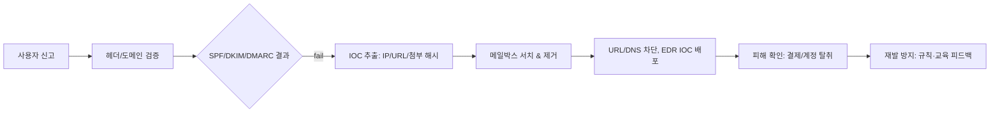

# SECTION 17-08~10 — 공통평가기준(CC), 사회공학 기법, ISMS-P 인증 (최신 정리 + 실무 예제)

## 0. 독자 대상과 목표

- **대상**: 보안 담당자, 제품/플랫폼 벤더, 심사·감사 대응 실무자.  
- **목표**:  
  1) **CC:2022** 체계로 **TOE/PP/ST/SFR/SAR**를 빠르게 설계·증빙하는 방법  
  2) **사회공학 대응**을 정책·교육·기술 통제로 **측정가능**하게 운영하는 방법  
  3) **ISMS-P** 심사 범위 산정부터 증적 수집·유지관리까지 **실행 가능한 템플릿** 제공

---

## 1. 공통평가기준(CC: Common Criteria) — CC:2022 중심

### 1.1 무엇이고 왜 쓰는가
- **CC(ISO/IEC 15408)**는 IT 제품/시스템의 보안 기능(SFR)과 보증(SAR)을 **표준화된 언어**로 정의하고, **제3자 평가/인증**을 가능하게 하는 국제 프레임입니다.  
- **CC:2022**는 문서 체계를 **5개 Part**로 재구성(일반모델, 기능요구, 보증요구, 평가 프레임워크, 패키지)하여 **명확한 합성/패키징**을 지원합니다.  
- **전환 포인트**(요지): v3.1(R5)에서 **CC:2022**로 이행. 일부 PP·ST의 **유예/수용 기간**이 설정되며, **새 프로젝트는 CC:2022 기준 설계**를 권장합니다.

### 1.2 문서 체계와 실전 해석

| Part | 핵심 내용 | 실전 포인트 |
|---|---|---|
| Part 1 | 용어·일반 모델(TOE, SR, 위협/가정) | **ST 목차**와 **용어 일관성** 확보 |
| Part 2 | **SFR 카탈로그**(접근통제, 암호, 감사 등) | 제품 기능을 **정확히 매핑**(오버클레임 금지) |
| Part 3 | **SAR 카탈로그**(개발/형상/시험/취약성) | **증적 품질**과 **추적성(Traceability)** 관리 |
| Part 4 | 평가 활동 프레임워크 | 시험실의 **평가항목**을 미리 체크리스트화 |
| Part 5 | **패키지/EAL** 및 합성 지침 | **EAL만이 답이 아니다**: PP/cPP 적합이 더 실용적 |

> **용어 스냅샷**  
> TOE(평가대상), PP/cPP(보호프로파일/공동PP), ST(보안목표명세), SFR(기능요구), SAR(보증요구), EAL(사전정의 보증 묶음), CCRA(상호인정).

### 1.3 상호인정과 보증수준(현실적 선택)
- **CCRA**에 따라 **다수 국가 간 인증 상호인정**이 이뤄집니다.  
- **EAL 숫자**는 절대 평가가 아닙니다. **목표 시장의 PP/cPP 적합성**이 더 중요한 경우가 많으며, **EAL2~EAL4 범위**가 상용 제품의 현실적인 상한선인 경우가 많습니다.

### 1.4 평가 흐름(현장 중심)

```mermaid
flowchart TB
A[범위/자산/위협 정의] --> B[PP/cPP 선택]
B --> C[ST 작성: 문제정의/목표/SFR/SAR 매핑]
C --> D[SFR/SAR 패키지(Part2/3/5) 최종화]
D --> E[증적 준비: ADV/AGD/ATE/AVA/CM]
E --> F[공인시험실 평가/보완]
F --> G[인증서 발급/유지관리]
```

### 1.5 미니 사례 — “엔터프라이즈 SSH 서버 모듈”

**자산/보호목표(예시)**  
- 관리자 세션 **기밀성/무결성**, 인증·권한관리, **감사기록 보존**, 키·난수 품질

**가능 SFR 매핑(발췌)**  
- **FCS_COP / FCS_CKM**: AES-GCM, ECDH/X25519, Ed25519, 키생성·교체  
- **FIA_UAU / FIA_UID**: 사용자 식별/인증(공개키+MFA)  
- **FAU_GEN / FAU_STG**: 감사이벤트·보관·무결성  
- **FMT_MOF / FMT_MTD**: 보안관리 기능/민감 파라미터 보호  
- **FTP_TRP**: 관리채널 보호(신뢰 경로)

**SAR 포인트(예시)**  
- ADV: 설계/인터페이스/의존성 문서  
- ATE: 테스트 계획/결과/커버리지  
- AVA: 취약성 분석 및 시험(공개/내부 소스)  
- ACO/CM: 형상관리(소스↔바이너리 해시 매칭)  
- AGD: 설치·운영·하드닝 가이드

**ST 골격(의사표기)**

```text
TOE: Enterprise SSH Service (daemon + admin CLI)
Assumptions: Trusted admin workstation; secure facility for server keys
Threats: T_Intercept, T_Replay, T_Bruteforce
Security Objectives for TOE: O_Conf_Channel, O_Admin_Auth, O_Audit
SFR: FCS_COP.1(AES-GCM), FCS_CKM.1/2, FIA_UAU.2, FIA_UID.2,
     FAU_GEN.1, FAU_STG.1, FMT_MOF.1, FMT_MTD.1, FTP_TRP.1
SAR: EAL2 augmented with ALC_FLR.1 (예시)
Rationale: objectives↔SFR coverage, deps satisfied, strength claims…
```

### 1.6 증적(도큐먼트) 템플릿(핵심만)

**(1) 추적성 매트릭스(요약)**

| 요구 | 설계 항목 | 구현 모듈 | 시험 케이스 | 로그/증적 |
|---|---|---|---|---|
| FCS_COP.1(AES-GCM) | Crypto Abstraction Layer | `crypto_gcm.c` | TC-CR-001..010 | 빌드 해시, 테스트 로그 |
| FIA_UAU.2 | AuthN Flow | `auth_mfa.c` | TC-AU-001..030 | 시나리오/결과 캡처 |
| FAU_GEN.1 | Audit Events | `audit_log.c` | TC-AU-LOG-001.. | 서명/압축 증적 |

**(2) 하드닝 가이드 스니펫**

```yaml
ssh:
  kex: [curve25519-sha256, ecdh-sha2-nistp256]
  hostkey: [ssh-ed25519, ecdsa-sha2-nistp256]
  ciphers: [chacha20-poly1305@openssh.com, aes256-gcm@openssh.com, aes128-gcm@openssh.com]
  macs: [umac-128-etm@openssh.com, hmac-sha2-256-etm@openssh.com]
  login_grace_time: 20s
  max_auth_tries: 3
  pubkey_auth: required
  password_auth: disabled
  audit:
    enable: true
    integrity_signing: true
```

**(3) 시험 결과 샘플(요지)**

```csv
Case,Pre-Condition,Action,Expected,Result,Artifact
TC-CR-003,"Fresh key","Run ECDH over curve25519","Shared secret established","PASS","/artifacts/CR-003.log"
TC-AU-012,"MFA disabled","Login attempt","Denied","PASS","/artifacts/AU-012.png"
```

---

## 2. 사회공학(Social Engineering) — 최신 위협·교육·탐지

### 2.1 트렌드 요점(2025 관점)
- **BEC(임원 사칭)**, **스피어피싱(맞춤형)**, **위싱/스미싱**, **QRishing**, **MFA 피로유발**이 주력 전술.  
- **딥페이크 보이스/영상**이 현업 의사결정(결제·인사)에 침투.  
- 대응은 **정책+교육+기술**을 통합하고, 지표를 **가시화**해야 합니다.

### 2.2 공격 수법 분류 & 시나리오

| 유형 | 전술/기법 | 정황 신호 | 1차 대응 |
|---|---|---|---|
| BEC | 도메인 유사·긴급 결제 지시 | 새 계좌 요청·비정규 시간 | **콜백 검증**, 결재보류 |
| 스피어피싱 | 맞춤형 이력/직함 | 첨부 압축파일·매크로 | 샌드박스, 첨부 격리 |
| 위싱 | 콜센터/기관 사칭 | OTP/앱 설치 유도 | **내선 재확인** |
| 스미싱 | 택배/세금 납부 | 단축URL·앱 설치 | MDM 차단, URL 미리보기 |
| QRishing | QR코드 링크 | URL 미표시 | 카메라 프리뷰/차단 |
| MFA 피로 | 푸시 폭탄 | 반복 승인알림 | **Number Matching**·지리 불일치 차단 |

### 2.3 보안 인식·훈련 체계(현실적 설계)
- **연간 역할기반 과정 + 분기 마이크로러닝**, **월/분기 모의피싱**, **지표**: 클릭율, 신고율, 재교육 이수율, 반복위반율.  
- 교육은 **정책(수신자 검증·결재 중지·이상 징후 신고)** 와 연결되어야 합니다.

### 2.4 기술적 방어 — 메일 인증·탐지·차단

**(1) 도메인 DNS 레코드 예시(운영 템플릿)**

```dns
; SPF
example.com. 3600 IN TXT "v=spf1 ip4:203.0.113.10 include:_spf.mailprovider.com -all"

; DKIM (selector s1)
s1._domainkey.example.com. 3600 IN TXT (
  "v=DKIM1; k=rsa; p=MIIBIjANBgkqhkiG9w0BAQEFAAOCAQ8A..."
)

; DMARC (도입 단계: none→quarantine→reject)
_dmarc.example.com. 3600 IN TXT (
  "v=DMARC1; p=reject; rua=mailto:dmarc-agg@example.com; ruf=mailto:dmarc-forensic@example.com; fo=1; pct=100; adkim=s; aspf=s"
)
```

**(2) SIEM 탐지 룰(예: Splunk SPL)**

```spl
index=mail sourcetype=o365:messageTrace
| stats count by sender_domain, client_ip, authentication_results, subject
| where like(authentication_results,"%spf=fail%") OR like(authentication_results,"%dmarc=fail%")
| sort -count
```

**(3) 의심 메일 전처리(단축 URL 탐지)**

```python
import re, sys
text = sys.stdin.read()
shorteners = r"(bit\.ly|t\.co|tinyurl\.com|goo\.gl|ow\.ly|is\.gd|lnkd\.in)"
if re.search(shorteners, text, re.I):
    print("[경고] 단축 URL 의심. 정책상 차단 또는 프리뷰 필수.")
```

**(4) 멀티팩터 피로 방지(정책 예시)**

```yaml
mfa:
  push:
    number_matching: enabled
    geo_distance_limit_km: 200  # 최근 로그인 위치와의 허용 거리
    rate_limit:
      window: 10m
      max_denied: 5
    auto_lock_after_violation: true
```

### 2.5 대응 런북(요약 플로우)



**헤더 튜토리얼(발췌)**

```text
Authentication-Results: spf=fail (sender IP 198.51.100.18) smtp.mailfrom=examp1e.com;
 dkim=fail header.d=examp1e.com; dmarc=fail action=quarantine
Return-Path: ceo@examp1e.com
Reply-To: finance@examp1e.co
```

### 2.6 정량 위험 모델(간단)

- 클릭 확률 \(p_c\), 계정탈취 확률 \(p_a\), 평균 손실 \(L\) 이라면  
  $$ \text{기대손실} = p_c \times p_a \times L $$
- **교육/차단**으로 \(p_c\)와 \(p_a\)를 각각 30% 줄였다면, 기대손실은  
  $$ \text{EL}_{\text{after}} = 0.7\,p_c \times 0.7\,p_a \times L = 0.49 \times (p_c p_a L) $$
  → 약 **51% 절감**.

---

## 3. ISMS-P 인증 — 구조/절차/최신 포인트

> ISMS-P는 국내 통합 인증 체계이지만, **개인정보보호/보안관리의 보편 원리**로 접근하면 국제 규격과도 정합이 좋습니다(예: ISO/IEC 27001, 개인정보 최소수집, 목적 제한, 보존기간 관리 등).

### 3.1 ISMS vs ISMS-P 구조 한눈에

| 구분 | 골자 | 항목(요지) | 실무 초점 |
|---|---|---|---|
| ISMS | 관리과정 + 보호대책 | 약 **80개** 항목 | 정보보호 관리체계 전반 |
| ISMS-P | ISMS + **개인정보 요구 추가** | **102개** 내외(80+22) | 수집·이용·제공·파기·국외이전·위탁 |

### 3.2 유효기간·사후관리(운영)
- **유효기간 3년**, 매년 **사후심사/감사**로 유지관리.  
- 심사 결과의 **부적합/관찰사항**은 **시정/개선 계획**으로 닫아야 합니다.

### 3.3 대상·준비(요지)
- 매출/이용자/처리규모 등 **의무대상**에 해당할 수 있음.  
- **트리거 충족 연도 다음 해 8/31까지** 획득 요구가 **사례적으로** 통용됩니다(최신 공고·해석 재확인 필요).  
- **범위 정의**가 최우선: 서비스/조직/물리/IT 인프라/인터페이스·위탁범위.

### 3.4 심사 준비 체크리스트(압축)

**관리과정**  
- [ ] 범위/자산 식별(대장), **위험평가**(기법·결과·처리안)  
- [ ] **정책/지침/절차** 문서화(개정이력·교육)  
- [ ] **변경/장애/사고 대응**, 공급망/위탁관리, 인적보안

**보호대책**  
- [ ] **접근통제**(계정 수명주기, 권한 승인/재검토, 원격접속 통제)  
- [ ] **암호/키관리**, 망분리·네트워크 보안, 서버/DB 하드닝  
- [ ] **로그/모니터링**·취약점/패치 관리

**개인정보**  
- [ ] **수집·이용·제공**의 법적 근거/동의(목적·보존기간)  
- [ ] **최소수집/가명·익명처리/접근권한 최소화**  
- [ ] **파기 절차**, 국외이전 보호, 위탁처리·점검

### 3.5 산출물 템플릿(실무 예제)

**(1) 위험평가 시트**

```csv
자산,소유부서,취약점,위협,영향(1-5),발생(1-5),위험도,처리전략,통제
DB서버1,플랫폼,패치지연,RCE,5,3,15,저감,월간패치/재부팅
```

**위험도 산식**  
$$ Risk = Impact \times Likelihood $$

**(2) 개인정보 처리 흐름(요지)**

```mermaid
flowchart LR
A[수집] --> B[저장/암호화]
B --> C[이용/제공(마스킹)]
C --> D[보존기간 관리]
D --> E[파기(물리/논리)]
```

**(3) 로그/모니터링 기준(발췌)**

```yaml
log:
  retention:
    security_events: 1y
    admin_actions: 2y
  integrity:
    signing: enabled
    time_sync: ntp.pool.org
alerts:
  - name: multiple_failed_logins_mfa_push
    rule: >
      auth.method="push" AND status="deny" GROUP BY user,1h HAVING count>5
    response: lock_account + SOC_tier1_triage
```

**(4) 데이터 보존·파기(예: DB 파티셔닝 + 자동 파기)**

```sql
-- 예시: PII 테이블을 월별 파티션으로 관리하고 보존기간 만료분 자동 파기
CREATE TABLE pii_events (
  id BIGINT PRIMARY KEY,
  user_id BIGINT NOT NULL,
  pii JSONB NOT NULL,
  occurred_at TIMESTAMP NOT NULL
) PARTITION BY RANGE (occurred_at);

-- 매월 파티션 생성 스케줄러(예: 12개월 앞까지)
-- 만료 기준: occurred_at < NOW() - INTERVAL '13 months'
-- 파기 작업
DO $$
BEGIN
  EXECUTE (
    SELECT string_agg(
      format('DROP TABLE IF EXISTS %I', relname), '; ')
    FROM pg_catalog.pg_class
    WHERE relname LIKE 'pii_events_%'
      AND relname < to_char((NOW() - interval '13 months'),'pii_events_YYYYMM')
  );
END$$;
```

**(5) 접근권한 리뷰 자동화(의사 코드)**

```python
import csv, datetime as dt
from collections import defaultdict

# 입력: access.csv (user, role, last_used_at, resource)
# 출력: 90일 미사용 권한 자동 리뷰 목록
MINDAYS = 90
today = dt.date.today()
review = []

with open("access.csv", newline="", encoding="utf-8") as f:
    for user, role, last_used, res in csv.reader(f):
        if user == "user":  # header
            continue
        last = dt.datetime.fromisoformat(last_used).date()
        if (today - last).days >= MINDAYS:
            review.append((user, role, res, (today - last).days))

print("user,role,resource,days_since_use")
for r in review:
    print(",".join(map(str,r)))
```

**(6) 위탁처리 관리(검증 체크리스트)**

```yaml
vendor_review:
  pre_contract:
    - dpia_if_required: true
    - security_requirements_signed: true
    - breach_notification_sla_hours: 24
  onboarding:
    - data_flow_documented: true
    - access_control_reviewed: true
    - encryption_at_rest_in_transit: required
  monitoring:
    - annual_audit_reports: ["SOC2","ISO27001"]  # 참고문서 수령·검토
    - subprocessor_change_notice_days: 30
  offboarding:
    - data_return_or_destruction_cert: required
```

---

## 4. 공통 운영 체크리스트(크로스컷)

**정책/문서**  
- [ ] 정책/표준/절차 최신화, 개정이력 관리  
- [ ] 교육 커리큘럼 연계(역할기반) + 성숙도 지표 운영

**정체성·접근제어**  
- [ ] SSO/MFA(푸시 **번호일치**) 필수화  
- [ ] **권한 최소화**, **JIT 권한 상승**, **정기 리뷰**

**암호/키/데이터**  
- [ ] 저장·전송 암호화, **키 수명주기/로테이션**  
- [ ] 개인정보 **최소수집**, **보존기간 자동 파기**

**로깅/탐지/대응**  
- [ ] 중앙수집·서명·보존, **가시성** 확보  
- [ ] IOC 유통, **사고대응 런북**·리허설

**공급망/위탁**  
- [ ] 사전 보안요구 반영, 정기 증적 수령/검토  
- [ ] 오프보딩 시 **데이터 파기 확인서**

---

## 5. 실전 예제 묶음(운영에 바로 쓰는 스니펫)

### 5.1 DMARC RUA(집계) XML 파서(학습용)

```python
# DMARC RUA 보고서를 읽어 합산 통계를 출력합니다.
# 실제 운영에서는 인증/권한, 큐잉, 시각화(ELK/Timescale) 결합을 권장합니다.
import xml.etree.ElementTree as ET
from collections import Counter, defaultdict
import glob

stats = defaultdict(Counter)
for path in glob.glob("./rua/*.xml"):
    root = ET.parse(path).getroot()
    for rec in root.findall(".//record"):
      ip = rec.findtext("row/source_ip")
      disp = rec.findtext("row/policy_evaluated/disposition") or "none"
      spf = rec.findtext("row/policy_evaluated/spf") or "na"
      dkim = rec.findtext("row/policy_evaluated/dkim") or "na"
      stats[ip].update([f"dmarc={disp}", f"spf={spf}", f"dkim={dkim}"])

print("source_ip, dmarc_pass, dmarc_fail, spf_fail, dkim_fail")
for ip, c in stats.items():
    print(f"{ip},{c.get('dmarc=pass',0)},{c.get('dmarc=fail',0)},"
          f"{c.get('spf=fail',0)},{c.get('dkim=fail',0)}")
```

### 5.2 의심 메일 단축URL 탐지(간단)

```python
import re, sys
shorteners = r"(bit\.ly|t\.co|tinyurl\.com|goo\.gl|ow\.ly|is\.gd|lnkd\.in)"
text = sys.stdin.read()
if re.search(shorteners, text, re.I):
    print("[경고] 단축 URL 의심. 보안 프리뷰/차단 정책 확인 요망.")
```

### 5.3 CC 시험 커버리지 자동 점검(기본 뼈대)

```python
# 목적: SFR 목록과 테스트 케이스 목록을 읽어 커버리지 공백을 찾아냅니다.
sfr = {line.strip() for line in open("sfr.txt", encoding="utf-8") if line.strip()}
tc = {}
for line in open("testcases.csv", encoding="utf-8"):
    if line.startswith("SFR,"):  # header
        continue
    parts = [p.strip() for p in line.split(",")]
    if len(parts) >= 2:
        tc.setdefault(parts[0], []).append(parts[1])

missing = [req for req in sfr if req not in tc]
print("# 미커버 SFR")
print("\n".join(sorted(missing)))
```

`sfr.txt` 예시:
```
FCS_COP.1
FCS_CKM.1
FIA_UID.2
FIA_UAU.2
FAU_GEN.1
FAU_STG.1
FMT_MOF.1
FMT_MTD.1
FTP_TRP.1
```

`testcases.csv` 예시:
```csv
SFR,TestCaseId
FCS_COP.1,TC-CR-001
FCS_CKM.1,TC-CR-020
FIA_UID.2,TC-AU-001
FAU_GEN.1,TC-LOG-001
```

---

## 6. FAQ — 흔한 오해 바로잡기

**Q1. EAL이 높을수록 무조건 좋은가요?**  
A. **아닙니다.** 목표 시장·조달 요구에 맞는 **PP/cPP 적합성**과 **증적 품질**이 더 중요합니다. 불필요하게 높은 EAL은 비용 대비 효익이 낮을 수 있습니다.

**Q2. 사회공학은 교육만 잘하면 되나요?**  
A. **아니오.** 교육은 필수지만, **정책(결재 중지·콜백 검증)**, **기술 통제(SPF/DKIM/DMARC, MDM, EDR)**, **지표 운영**이 결합되어야 합니다.

**Q3. ISMS-P는 한국 제도라서 해외 프레임과 따로 놀죠?**  
A. **핵심 원리**(위험기반, 최소권한·최소수집, 보존기간, 공급망 관리 등)는 **국제 규격과 공통**입니다. 운영 아키텍처를 잘 잡으면 **겸용 증적**으로도 충분히 대응 가능합니다.

---

## 7. 결론

- **CC:2022**는 **표준화된 언어와 증적 품질**로 글로벌 신뢰를 얻는 통로입니다.  
- **사회공학 대응**은 교육만이 아니라 **정책·기술·지표**의 체계로 완결해야 합니다.  
- **ISMS-P**는 개인정보 중심 통제를 **운영 절차와 자동화**로 녹여내면 지속가능합니다.  
- 본문 템플릿/코드/체크리스트를 **조직 표준서·SOP**로 맞춤화해 즉시 적용하세요.